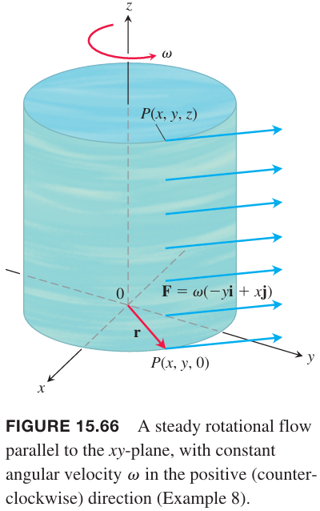

格林定理是说二维矢量场 $\boldsymbol{F}=M\boldsymbol{i}+N\boldsymbol{j}$ 绕着平面内的闭合曲线逆时针的环量等于标量函数 $(\partial N/\partial x-\partial M/\partial y)$ 在闭合曲线围成的区域内的二重积分。这个标量函数是旋度矢量场的 $\boldsymbol{k}$ 分量，描述的是 $\boldsymbol{F}$ 在每点处绕着平行于 $\boldsymbol{k}$ 的轴旋转的速率。对于三维空间的矢量场，每点处的旋转是绕着平行于该点旋转矢量的轴。当一个闭合曲线 $C$ 是有向曲面的边界，那么 $\boldsymbol{F}$ 绕着 $C$ 的环量等于旋度矢量场的曲面积分。这就将格林定理从平面上的区域扩展至有光滑曲线边界的一般曲面。

### 旋度矢量场
假定 $\boldsymbol{F}$ 是表示液体流动的速度矢量场。在 $(x,y,z)$ 附近的粒子绕着通过 $(x,y,z)$ 且平行于某个特定矢量的轴旋转。这个矢量指向的方向满足右手螺旋法则。矢量的大小表示旋转的速率。

这个矢量是旋度矢量（`curl vector`），对于矢量场 $\boldsymbol{F}=M\boldsymbol{i}+N\boldsymbol{j}+P\boldsymbol{k}$ 的定义是
$$\text{curl }\boldsymbol{F}=\bigg(\frac{\partial P}{\partial y}-\frac{\partial N}{\partial z}\bigg)\boldsymbol{i}+\bigg(\frac{\partial M}{\partial z}-\frac{\partial P}{\partial x}\bigg)\boldsymbol{j}+\bigg(\frac{\partial N}{\partial x}-\frac{\partial M}{\partial y}\bigg)\boldsymbol{k}\tag{1}$$
这是斯托克斯定理的推论，该定理是格林定理的三维版本。

当 $\boldsymbol{F}=M\boldsymbol{i}+N\boldsymbol{j}$ 时，$\text{curl }\boldsymbol{F}\cdot\boldsymbol{k}=\bigg(\frac{\partial N}{\partial x}-\frac{\partial M}{\partial y}\bigg)$ 与 15.4 小节定义一致。公式 $(1)$ 经常使用符号
$$\nabla=\boldsymbol{i}\frac{\partial}{\partial x}+\boldsymbol{j}\frac{\partial}{\partial y}+\boldsymbol{k}\frac{\partial}{\partial z}\tag{2}$$
表示。那么 $\boldsymbol{F}$ 的旋度可以表示为
$$\nabla\times\boldsymbol{F}=\begin{vmatrix}
\boldsymbol{i}&&\boldsymbol{j}&&\boldsymbol{k}\\
\frac{\partial}{\partial x}&&\frac{\partial}{\partial y}&&\frac{\partial}{\partial z}\\
M&&N&&P
\end{vmatrix}$$
即
$$\text{curl }\boldsymbol{F}=\nabla\times\boldsymbol{F}\tag{3}$$

例1 求 $\boldsymbol{F}=(x^2-z)\boldsymbol{i}+xe^z\boldsymbol{j}+xy\boldsymbol{k}$ 的旋度。

解：使用公式 $(3)$ 有
$$\begin{aligned}
\text{curl }\boldsymbol{F}&=\nabla\times\boldsymbol{F}\\
&=\begin{vmatrix}
\boldsymbol{i}&&\boldsymbol{j}&&\boldsymbol{k}\\
\frac{\partial}{\partial x}&&\frac{\partial}{\partial y}&&\frac{\partial}{\partial z}\\
(x^2-z)&&(xe^z)&&xy
\end{vmatrix}\\
&=(x-xe^z)\boldsymbol{i}-(y+1)\boldsymbol{j}+(e^z-0)\boldsymbol{k}\\
&=x(1-e^z)\boldsymbol{i}-(y+1)\boldsymbol{j}+e^z\boldsymbol{k}\\
\end{aligned}$$
当 $\nabla$ 用于标量函数 $f(x,y,z)$ 时，结果是 $f$ 的梯度
$$\nabla f=\frac{\partial f}{\partial x}\boldsymbol{i}+\frac{\partial f}{\partial y}\boldsymbol{j}+\frac{\partial f}{\partial z}\boldsymbol{j}$$

### 斯托克斯定理
斯托克斯定理将格林定理泛化到了三维。格林定理将矢量场沿着 $xy$ 平面上的简单闭合曲线 $C$ 逆时针环量与在由 $C$ 封闭形成的区域 $R$ 上的二重积分联系了起来。斯托克斯定理将矢量场沿着有向曲面 $S$ 的边界 $C$ 逆时针环量与 $S$ 上的曲面积分联系了起来。这里要求曲面是分段光滑的，这意味着它是由有限个光滑曲面通过光滑曲线连接起来的。

**定理 6 斯托克斯定理**
> 令 $S$ 是分段光滑有向曲面，边界是分段光滑曲线 $C$。令 $\boldsymbol{F}=M\boldsymbol{i}+N\boldsymbol{j}$ 是矢量场，其各个分量在包含 $S$ 的开放区间上有连续的偏微分。那么 $\boldsymbol{F}$ 沿着 $C$ 的以曲面法向单位矢量 $\boldsymbol{n}$ 为逆时针环量等于旋度矢量 $\nabla\times\boldsymbol{F}$ 在 $S$ 上的积分
> $$\oint_C\boldsymbol{F}\cdot d\boldsymbol{r}=\iint_S(\nabla\times\boldsymbol{F})\cdot\boldsymbol{n}d\sigma\tag{4}$$

如果两个不同的有向曲面 $S_1,S_2$ 有相同的边界 $C$，那么
$$\iint_{S_1}(\nabla\times\boldsymbol{F})\cdot\boldsymbol{n}_1d\sigma=\iint_{S_2}(\nabla\times\boldsymbol{F})\cdot\boldsymbol{n}_2d\sigma$$
因此旋度积分与曲面无关，只依赖于沿着边界 $C$ 的环量。曲面无关与保守场上的路径无关类似，路径无关的积分只依赖与路径起始位置和终止位置。旋度场 $\nabla\times\boldsymbol{F}$ 类似于标量函数的梯度场 $\nabla f$。

如果 $C$ 在 $xy$ 平面，有向逆时针，$R$ 是 $C$ 围成的区域，那么 $d\sigma=dxdy$
$$(\nabla\times\boldsymbol{F})\cdot\boldsymbol{n}d\sigma=(\nabla\times\boldsymbol{F})\cdot\boldsymbol{k}d\sigma=\bigg(\frac{\partial N}{\partial x}-\frac{\partial M}{\partial y}\bigg)$$
斯托克斯定理就退化成了格林定理
$$\oint_C\boldsymbol{F}\cdot d\boldsymbol{r}=\iint_R\bigg(\frac{\partial N}{\partial x}-\frac{\partial M}{\partial y}\bigg)dxdy$$
相反，将上述步骤反向可以得到
$$\oint_C\boldsymbol{F}\cdot d\boldsymbol{r}=\iint_R(\nabla\times\boldsymbol{F})\cdot\boldsymbol{k}dA\tag{4}$$

例1 曲面是半球 $S:x^2+y^2+z^2=9,z\geq 0$，边界是圆 $C:x^2+y^2=9,z=0$，矢量 $\boldsymbol{F}=y\boldsymbol{i}-x\boldsymbol{j}$，验证公式 $(4)$。

解：曲线 $C$ 的参数方程是
$$\boldsymbol{r}(\theta)=(3\cos\theta)\boldsymbol{i}+(3\sin\theta)\boldsymbol{j},0\leq\theta\leq 2\pi$$
那么
$$\begin{aligned}
d\boldsymbol{r}&=(-3\sin\theta d\theta)\boldsymbol{i}+(3\cos\theta d\theta)\boldsymbol{j}\\
\boldsymbol{F}&=(3\sin\theta)\boldsymbol{i}-(3\cos\theta)\boldsymbol{j}\\
\boldsymbol{F}\cdot d\boldsymbol{r}&=-9\sin^2\theta d\theta-9\cos^2\theta d\theta=-9 d\theta\\
\oint_C\boldsymbol{F}\cdot d\boldsymbol{r}&=\int_0^{2\pi}-9d\theta=-18\pi
\end{aligned}$$
$\boldsymbol{F}$ 的旋度是
$$\nabla\times\boldsymbol{F}=\bigg(\frac{\partial P}{\partial y}-\frac{\partial N}{\partial z}\bigg)\boldsymbol{i}+\bigg(\frac{\partial M}{\partial z}-\frac{\partial P}{\partial x}\bigg)\boldsymbol{j}+\bigg(\frac{\partial N}{\partial x}-\frac{\partial M}{\partial y}\bigg)\boldsymbol{k}=-2\boldsymbol{k}$$
单位法向矢量 $\boldsymbol{n}$ 是
$$\boldsymbol{n}=\frac{x\boldsymbol{i}+y\boldsymbol{j}+z\boldsymbol{k}}{\sqrt{x^2+y^2+z^2}}=\frac{x\boldsymbol{i}+y\boldsymbol{j}+z\boldsymbol{k}}{3}$$
由 15.6 的例 7 可以得到
$$d\sigma=\frac{3}{z}dA$$
因此
$$(\nabla\times\boldsymbol{F})\cdot\boldsymbol{n}d\sigma=-\frac{2z}{3}\frac{3}{z}dA=-2dA$$
那么
$$\iint_S(\nabla\times\boldsymbol{F})\cdot\boldsymbol{n}d\sigma=\iint_{x^2+y^2\leq 9}-2dA=-18\pi$$

例3 计算例 2 绕着 $C$ 的环量，$S$ 使用 $xy$ 平面上圆心位于原点半径为 3 的圆而不是半球。

解：根据例 2 得到 $\nabla\times\boldsymbol{F}=-2\boldsymbol{k}$。$xy$ 平面的圆的法向矢量是 $\boldsymbol{n}=\boldsymbol{k}$，因此
$$(\nabla\times\boldsymbol{F})\cdot\boldsymbol{n}d\sigma=-2dA$$
那么
$$\iint_S(\nabla\times\boldsymbol{F})\cdot\boldsymbol{n}d\sigma=\iint_{x^2+y^2\leq 9}-2dA=-18\pi$$

例4 求场 $\boldsymbol{F}=(x^2-y)\boldsymbol{i}+4z\boldsymbol{j}+x^2\boldsymbol{k}$ 绕着 $C$ 的环量，其中 $C$ 是 $z=2$ 与 $z=\sqrt{x^2+y^2}$ 的交线，从上看逆时针运动。

解：曲面的参数化方程是
$$\boldsymbol{r}(r,\theta)=(r\cos\theta)\boldsymbol{i}+(r\sin\theta)\boldsymbol{j}+r\boldsymbol{k},0\leq r\leq 2,0\leq\theta\leq 2\pi$$
根据 15.5 的例 4 有
$$\begin{aligned}
\boldsymbol{n}&=\frac{\boldsymbol{r}_r\times\boldsymbol{r}_{\theta}}{|\boldsymbol{r}_r\times\boldsymbol{r}_{\theta}|}\\
&=\frac{-(r\cos\theta)\boldsymbol{i}-(r\sin\theta)\boldsymbol{j}+r\boldsymbol{k}}{r\sqrt{2}}\\
&=\frac{1}{\sqrt{2}}(-\cos\theta\boldsymbol{i}-\sin\theta\boldsymbol{j}+\boldsymbol{k})\\
d\sigma&=r\sqrt{2}drd\theta
\end{aligned}$$
旋度是
$$\begin{aligned}
\nabla\times\boldsymbol{F}&=-4\boldsymbol{i}-2x\boldsymbol{j}+\boldsymbol{k}\\
&=-4\boldsymbol{i}-2r\cos\theta\boldsymbol{j}+\boldsymbol{k}
\end{aligned}$$
那么
$$\begin{aligned}
(\nabla\times\boldsymbol{F})\cdot\boldsymbol{n}&=\frac{1}{\sqrt{2}}(4\cos\theta+2r\sin\theta\cos\theta+1)\\
&=\frac{1}{\sqrt{2}}(4\cos\theta+2r\sin 2\theta+1)
\end{aligned}$$
环量是
$$\begin{aligned}
\oint_C\boldsymbol{F}\cdot d\boldsymbol{r}&=\iint_S(\nabla\times\boldsymbol{F})\cdot\boldsymbol{n}d\sigma\\
&=\int_0^{2\pi}\int_0^2\frac{1}{\sqrt{2}}(4\cos\theta+2r\sin 2\theta+1)(r\sqrt{2}drd\theta)\\
&=4\pi
\end{aligned}$$

例5 明显例 4 中 $S$ 的选择不是最佳的。如果我们选择 $z=2$ 上圆心在 $z$ 轴上半径为 2 的圆，那么这个 $S$ 的 $\boldsymbol{n}=\boldsymbol{k}$。从例 4 可以得知 $\nabla\times\boldsymbol{F}=-4\boldsymbol{i}-2x\boldsymbol{j}+\boldsymbol{k}$，那么很容易得到 $(\nabla\times\boldsymbol{F})\cdot\boldsymbol{n}=1$，那么
$$\iint_S(\nabla\times\boldsymbol{F})\cdot\boldsymbol{n}d\sigma=\iint_{x^2+y^2\leq 4}dA=4\pi$$

例6 求曲面 $S$ 的参数方程，这里 $S$ 是双曲抛物面 $z=y^2-x^2$ 在半径为 1 轴为 $z$ 轴的圆柱内部分，$S$ 的边界是 $C$。假定 $S$ 的方向是 $\boldsymbol{k}$，使用矢量场 $\boldsymbol{F}=y\boldsymbol{i}-x\boldsymbol{j}+x^2\boldsymbol{k}$ 来验证斯托克斯定理。

解：曲线 $C$ 是 $z=y^2-x^2$，逆时针。使用柱坐标系可以得到参数方程
$$\boldsymbol{r}(t)=(\cos t)\boldsymbol{i}+(\sin t)\boldsymbol{j}+(\sin^2 t-\cos^2 t)\boldsymbol{k},0\leq t\leq 2\pi$$
求导
$$\frac{d\boldsymbol{r}}{dt}=(-\sin t)\boldsymbol{i}+(\cos t)\boldsymbol{j}+(4\sin t\cos t)\boldsymbol{k},0\leq t\leq 2\pi$$
使用曲线 $\boldsymbol{r}(t)$ 表示矢量场 $\boldsymbol{F}$
$$\boldsymbol{F}=(\sin t)\boldsymbol{i}-(\cos t)\boldsymbol{j}+(\cos^2 t)\boldsymbol{k}$$
那么沿着 $C$ 的逆时针积分是
$$\begin{aligned}
\int_0^{2\pi}\boldsymbol{F}\cdot\frac{d\boldsymbol{r}}{dt}dt&=\int_0^{2\pi}(-\sin^2 t-\cos^2 t+4\sin t\cos^3 t)dt\\
&=\int_0^{2\pi}(4\sin t\cos^3 t-1)dt\\
&=-\cos^4 t-t\bigg|_0^{2\pi}\\
&=-2\pi
\end{aligned}$$

利用参数 $(r,\theta)$ 来表示曲面 $S$
$$\boldsymbol{r}(r,\theta)=(r\cos\theta)\boldsymbol{i}+(r\sin\theta)\boldsymbol{j}+r^2(\sin^2\theta-\cos^2\theta)\boldsymbol{k},0\leq r\leq 1,0\leq\theta\leq 2\pi$$
旋度
$$\nabla\times\boldsymbol{F}=\begin{vmatrix}
\boldsymbol{i}&&\boldsymbol{j}&&\boldsymbol{k}\\
\frac{\partial}{\partial x}&&\frac{\partial}{\partial y}&&\frac{\partial}{\partial z}\\
y&&-x&&x^2
\end{vmatrix}=-2x\boldsymbol{j}-2\boldsymbol{k}=-2(2r\cos\theta)\boldsymbol{j}-2\boldsymbol{k}$$
求 $\boldsymbol{r}$ 求导
$$\begin{aligned}
\boldsymbol{r}_r&=(\cos\theta)\boldsymbol{i}+(\sin\theta)\boldsymbol{j}+2r(\sin^2\theta-\cos^2\theta)\boldsymbol{k}\\
\boldsymbol{r}_\theta&=(-r\sin\theta)\boldsymbol{i}+(r\cos\theta)\boldsymbol{j}+4r^2(\sin\theta\cos\theta)\boldsymbol{k}
\end{aligned}$$
因此
$$\begin{aligned}
\boldsymbol{r}_r\times\boldsymbol{r}_\theta&=\begin{vmatrix}
\boldsymbol{i}&&\boldsymbol{j}&&\boldsymbol{k}\\
\cos\theta&&\sin\theta&&2r(\sin^2\theta-\cos^2\theta)\\
-r\sin\theta&&r\cos\theta&&4r^2(\sin\theta\cos\theta)
\end{vmatrix}\\
&=2r^2(2\sin^2\theta\cos\theta-\sin^2\theta\cos\theta+\cos^3\theta)\boldsymbol{i}\\
&-2r^2(2\sin\theta\cos^2\theta+\sin^3\theta+\sin\theta\cos^2\theta)\boldsymbol{j}+r\boldsymbol{k}
\end{aligned}$$
那么
$$\begin{aligned}
\iint_S(\nabla\times\boldsymbol{F})\cdot\boldsymbol{n}d\sigma&=\int_0^{2\pi}\int_0^1(\nabla\times\boldsymbol{F})\cdot(\boldsymbol{r}_r\times\boldsymbol{r}_\theta)drd\theta\\
&=\int_0^{2\pi}\int_0^1[4r^3(3\sin\theta\cos^3\theta+\sin^3\theta\cos\theta)-2r]drd\theta\\
&=\int_0^{2\pi}[r^4(3\sin\theta\cos^3\theta+\sin^3\theta\cos\theta)-r^2]_0^1d\theta\\
&=\int_0^{2\pi}(3\sin\theta\cos^3\theta+\sin^3\theta\cos\theta-1)d\theta\\
&=-\frac{3}{4}\cos^4\theta+\frac{1}{4}\sin^4\theta-\theta\bigg|_0^{2\pi}\\
&=-2\pi
\end{aligned}$$
这就验证了斯托克斯定理公式的左右两边相等。

例7 求矢量场
$$\boldsymbol{F}=(x^2+z)\boldsymbol{i}+(y^2+2x)\boldsymbol{j}+(z^2-y)\boldsymbol{k}$$
沿着曲线 $C$ 逆时针（从 $z$ 轴正向看）的环量，其中 $C$ 是球面 $x^2+y^2+z^2+1$ 与圆锥 $z=\sqrt{x^2+y^2}$ 的交线。

解：交线方程是
$$1=x^2+y^2+z^2=z^2+z^2=2z^2$$
即
$$z=\frac{1}{\sqrt{2}}$$
那么 $S$ 是 $z=\frac{1}{\sqrt{2}},x^2+y^2\leq 1/2$。因此 $\boldsymbol{n}=\boldsymbol{k}$。旋度是
$$\nabla\times\boldsymbol{F}=\begin{vmatrix}
\boldsymbol{i}&&\boldsymbol{j}&&\boldsymbol{k}\\
\frac{\partial}{\partial x}&&\frac{\partial}{\partial y}&&\frac{\partial}{\partial z}\\
x^2+z&&y^2+2x&&z^2-y
\end{vmatrix}=-\boldsymbol{i}+\boldsymbol{j}+2\boldsymbol{k}$$
因此
$$(\nabla\times\boldsymbol{F})\cdot\boldsymbol{n}=2$$
那么环量是
$$\begin{aligned}
\oint_C\boldsymbol{F}\cdot d\boldsymbol{r}&=\iint_S(\nabla\times\boldsymbol{F})\cdot\boldsymbol{k}d\sigma\\
&=\iint_S2d\sigma\\
&=2\pi(\frac{1}{\sqrt{2}})^2\\
&=\pi
\end{aligned}$$

### $\nabla\times\boldsymbol{F}$ 的直观解释
假定 $\boldsymbol{F}$ 是空间区域 $R$ 上液体流动的速度场，$R$ 包含封闭曲线 $C$。那么
$$\oint_C\boldsymbol{F}\cdot d\boldsymbol{r}$$
绕 $C$ 的环量。根据斯托克斯定理
$$\oint_C\boldsymbol{F}\cdot d\boldsymbol{r}=\iint_S(\nabla\times\boldsymbol{F})\cdot\boldsymbol{n}d\sigma$$
假定固定 $R$ 内一点 $Q$ 和该点处的方向 $\boldsymbol{u}$。令 $C$ 是圆心位于 $Q$ 半径为 $\rho$ 的圆，与 $\boldsymbol{u}$ 正交。如果 $\nabla\times\boldsymbol{F}$ 在 $Q$ 处连续，当 $\rho\to 0$ 时，$\nabla\times\boldsymbol{F}$ 在由 $C$ 围成的区域 $S$ 上 $\boldsymbol{u}$ 方向分量的平均值趋于 $\nabla\times\boldsymbol{F}$ 在 $Q$ 点处 $\boldsymbol{u}$ 方向分量的值。
$$((\nabla\times\boldsymbol{F})\cdot\boldsymbol{u})(Q)=\lim_{\rho\to 0}\frac{1}{\pi\rho^2}(\nabla\times\boldsymbol{F})\cdot\boldsymbol{u}d\sigma$$
使用斯托克斯定理替换右边为 $C$ 上的线积分可以得到
$$((\nabla\times\boldsymbol{F})\cdot\boldsymbol{u})(Q)=\lim_{\rho\to 0}\frac{1}{\pi\rho^2}\oint_C\boldsymbol{F}\cdot d\boldsymbol{r}\tag{6}$$
左边的最大值就是 $\boldsymbol{u}$ 就是 $\nabla\times\boldsymbol{F}$ 的方向。当 $\rho$ 很小的时候，右边近似为
$$\frac{1}{\pi\rho^2}\oint_C\boldsymbol{F}\cdot d\boldsymbol{r}$$
这是环量密度。假定一个桨放到 $Q$ 点，环量会影响桨转动的速率。轴与 $\boldsymbol{u}$ 同向时最快，即桨的轴与 $\nabla\times\boldsymbol{F}$ 方向一致。

例8 流体绕着 $z$ 轴流动的速度场是 $\boldsymbol{F}=\omega(-y\boldsymbol{i}+x\boldsymbol{j})$，其中 $\omega$ 是旋转的角速度。求 $\nabla\times\boldsymbol{F}$，并于环量密度联系起来。

解：旋度
$$\nabla\times\boldsymbol{F}=\bigg(\frac{\partial P}{\partial y}-\frac{\partial N}{\partial z}\bigg)\boldsymbol{i}+\bigg(\frac{\partial M}{\partial z}-\frac{\partial P}{\partial x}\bigg)\boldsymbol{j}+\bigg(\frac{\partial N}{\partial x}-\frac{\partial M}{\partial y}\bigg)\boldsymbol{k}=2\omega\boldsymbol{k}$$
因此
$$(\nabla\times\boldsymbol{F})\cdot\boldsymbol{k}=2\omega$$
根据斯托克斯定理，$\boldsymbol{F}$ 绕着半径为 $\rho$ 的圆 $C$ 的环量是
$$\oint_C\boldsymbol{F}\cdot d\boldsymbol{r}=\iint_S(\nabla\times\boldsymbol{F})\cdot\boldsymbol{n}d\sigma=\iint_S(2\omega\boldsymbol{k})\cdot\boldsymbol{k}dxdy=2\omega\pi\rho^2$$
其中 $C$ 围成了与 $\nabla\times\boldsymbol{F}$ 正交的曲面 $S$。
两边同除 $2\omega$ 得到
$$(\nabla\times\boldsymbol{F})\cdot\boldsymbol{k}=2\omega=\frac{1}{\pi\rho^2}\oint_C\boldsymbol{F}\cdot d\boldsymbol{r}$$
当 $\boldsymbol{u}=\boldsymbol{k}$ 时，与公式 $(6)$ 一致。

例9 使用斯托克斯定理计算 $\oint_C\boldsymbol{F}\cdot d\boldsymbol{r}$，其中 $\boldsymbol{F}=xz\boldsymbol{i}+xy\boldsymbol{j}+3xz\boldsymbol{k}$，$C$ 是平面 $2x+y+z=2$ 在第一象限的边界，从上看方向为逆时针。

解：平面是函数 $f(x,y,z)=2x+y+z$ 的等高面 $f(x,y,z)=2$。那么单位法向矢量是
$$\boldsymbol{n}=\frac{\nabla f}{|\nabla f|}=\frac{2\boldsymbol{i}+\boldsymbol{j}+\boldsymbol{k}}{|2\boldsymbol{i}+\boldsymbol{j}+\boldsymbol{k}|}=\frac{1}{\sqrt{6}}(2\boldsymbol{i}+\boldsymbol{j}+\boldsymbol{k})$$
这个方向与沿着 $C$ 逆时针运动一致。为了应用斯托克斯定理，旋度是
$$\nabla\times\boldsymbol{F}=\begin{vmatrix}
\boldsymbol{i}&&\boldsymbol{j}&&\boldsymbol{k}\\
\frac{\partial}{\partial x}&&\frac{\partial}{\partial y}&&\frac{\partial}{\partial z}\\
xz&&xy&&3xz
\end{vmatrix}=(x-3z)\boldsymbol{i}+y\boldsymbol{k}$$
将 $z=2-2x-2y$ 代入得到
$$\nabla\times\boldsymbol{F}=(7x+3y-6)\boldsymbol{j}+y\boldsymbol{k}$$
那么
$$(\nabla\times\boldsymbol{F})\cdot\boldsymbol{n}=\frac{1}{\sqrt{6}}(7x+4y-6)$$
曲面微分是
$$d\sigma=\frac{|\nabla f|}{|\nabla f\cdot\boldsymbol{k}|}dA=\sqrt{6}dxdy$$
因此环量是
$$\begin{aligned}
\oint_C\boldsymbol{F}\cdot d\boldsymbol{r}&=\iint_S(\nabla\times\boldsymbol{F})\cdot\boldsymbol{n}d\sigma\\
&=\int_0^1\int_0^{2-2x}\frac{1}{\sqrt{6}}(7x+4y-6)\sqrt{6}dydx\\
&=\int_0^1\int_0^{2-2x}(7x+4y-6)dydx\\
&=-1
\end{aligned}$$

例10 令曲面 $S$ 是椭圆抛物面 $z=x^2+4y^2$ 位于 $z=1$ 以下的部分。$S$ 的方向向内，$\boldsymbol{n}$ 如下图所示。矢量场 $\boldsymbol{F}=y\boldsymbol{i}-xz\boldsymbol{j}+xz^2\boldsymbol{k}$，求 $\nabla\times\boldsymbol{F}$ 穿过 $S$ 的通量。

解：根据斯托克斯定理，通量等于 $\boldsymbol{F}$ 逆时针绕着曲线 $C$ 的线积分。$C$ 的曲线是 $z=1,x^2+4y^2=1$，椭圆的参数方程是 $x=\cos t,y=\frac{1}{2}\sin t,z=1,0\leq t\leq 2\pi$，那么
$$\boldsymbol{r}(t)=(\cos t)\boldsymbol{i}+(\frac{1}{2}\sin t)\boldsymbol{j}+\boldsymbol{k},0\leq t\leq 2\pi$$
因此
$$\boldsymbol{F}(\boldsymbol{r}(t))=\frac{1}{2}(\sin t)\boldsymbol{i}-(\cos t)\boldsymbol{j}+(\cos t)\boldsymbol{k}$$
$$\frac{d\boldsymbol{r}}{dt}=-(\sin t)\boldsymbol{i}+\frac{1}{2}(\cos t)\boldsymbol{j}$$
环量是
$$\begin{aligned}
\oint_C\boldsymbol{F}\cdot d\boldsymbol{r}&=\int_0^{2\pi}\boldsymbol{F}\cdot\frac{d\boldsymbol{r}}{dt}dt\\
&=\int_0^{2\pi}-\frac{1}{2}\sin^2t-\frac{1}{2}\cos^2tdt\\
&=-\frac{1}{2}\int_0^{2\pi}dt\\
&=-\pi
\end{aligned}$$
这也是题目要求的通量。

### 对多面体的曲面斯托克斯定理证明概述
令 $S$ 是包含有限数量的区域或者面。

对各个分离的部分使用格林定理。有两类面：

1. 所有的边都是其他面的边
2. 至少有一条边不是其他面的边

$S$ 的边由第二类面的不与其他面相交的边组成。尽管格林公式声明时指定了 $xy$ 平面上的面，一个更泛化的版本可以用于空间平面，即 $\boldsymbol{n}$ 是平面的法向矢量而不一定非要是 $\boldsymbol{k}$。对上图 $(a)$，可以得到
$$\bigg(\oint_{EAB}+\oint_{BCE}+\oint_{CDE}\bigg)\boldsymbol{F}\cdot d\boldsymbol{r}=\bigg(\iint_{EAB}+\iint_{BCE}+\iint_{CDE}\bigg)(\nabla\times\boldsymbol{F})\cdot\boldsymbol{n}d\sigma\tag{7}$$
左边是三个线积分，公共边对两个面而言方向相反，相互抵消。右边是区域相加。因此得到
$$\oint_{ABCDE}\boldsymbol{F}\cdot d\boldsymbol{r}=\iint_{ABCDE}(\nabla\times\boldsymbol{F})\cdot\boldsymbol{n}d\sigma$$
如果上述分析应用于 $S$ 所有的面，求和得到
$$\oint_{\text{boundary(S)}}\boldsymbol{F}\cdot d\boldsymbol{r}=\iint_{S}(\nabla\times\boldsymbol{F})\cdot\boldsymbol{n}d\sigma$$
更一般的多面体曲面如上图 $(b)$ 所示。光滑曲面的推广要利用极限求和的思想。

### 有洞的曲面的斯托克斯定理
斯托克斯定理对有一个或多个洞的有向曲面仍旧成立。

$\nabla\times\boldsymbol{F}$ 的法向分量在 $S$ 上的曲面积分等于 $\boldsymbol{F}$ 切向分量绕着所有边界的线积分之和，曲线的方向由 $S$ 的方向确定。定理仍旧成立，只是 $C$ 是简单封闭曲线的并集。

### 重要恒等式
下面恒等式经常出现在数学和物理学中。
$$\nabla\times\nabla f=\boldsymbol{0}\tag{8}$$
在电磁学和重力应用中 $f$ 是势函数。$(8)$ 是说这些力的旋度为零。$(8)$ 对任意二阶偏微分连续的函数 $f(x,y,z)$ 都成立。
$$\nabla\times\nabla f=\begin{vmatrix}
\boldsymbol{i}&&\boldsymbol{j}&&\boldsymbol{k}\\
\frac{\partial}{\partial x}&&\frac{\partial}{\partial y}&&\frac{\partial}{\partial z}\\
\frac{\partial f}{\partial x}&&\frac{\partial f}{\partial y}&&\frac{\partial f}{\partial z}
\end{vmatrix}=(f_{zy}-f{yz})\boldsymbol{i}-(f_{zx}-f_{xz})\boldsymbol{j}+(f_{yx}-f_{xy})\boldsymbol{k}$$
根据 13.3 小节定理 2，如果二阶导连续，那么混合二阶导相等，因此是零矢量。

### 保守场和斯托克斯定理
在 15.3 小节，空间开放区域 $D$ 上的矢量场 $\boldsymbol{F}$ 是保守场等价于 $D$ 上任意闭合曲线上 $\boldsymbol{F}$ 的线积分等于零。那么这也等价于简单连通的开放区域上有 $\nabla\times\boldsymbol{F}=\boldsymbol{0}$，可以用于测试 $\boldsymbol{F}$ 是否是保守场。

**定理 7 $\nabla\times\boldsymbol{F}$ 与闭合曲线的关系**
> 如果在简单连通开放区域 $D$ 上的每一点处都有 $\nabla\times\boldsymbol{F}=\boldsymbol{0}$，那么 $D$ 内任意分段光滑闭合路径 $C$ 都满足
> $$\oint_C\boldsymbol{F}\cdot d\boldsymbol{r}=0$$

证明大纲：可以分成两个步骤证明定理 7。第一步是对与简单闭合但自身不相交曲线，如下图 $(a)$ 所示。

拓扑学中一个重要定理是说在简单连通开放区域 $D$ 内的每一个光滑简单闭合曲线 $C$ 都是一个光滑有两个面的曲线 $S$ 的边界，$S$ 也在 $D$ 内。因此根据斯托克斯定理有
$$\oint_C\boldsymbol{F}\cdot d\boldsymbol{r}=\iint_S(\nabla\times\boldsymbol{F})\cdot\boldsymbol{n}d\sigma=0$$
第二部对于自身相交的曲线，如上图 $(b)$ 所示。将曲线分成两个部分，分别应用斯托克斯定理并相加。

下图总结了定义在连通、简单连通开放区域上的保守场相关的等价关系。

