### 三维散度
矢量场 $\boldsymbol{F}=M(x,y,z)\boldsymbol{i}+N(x,y,z)\boldsymbol{j}+P(x,y,z)\boldsymbol{j}$ 的散度（`divergence`）是标量函数
$$\text{div }\boldsymbol{F}=\nabla\cdot\boldsymbol{F}=\frac{\partial M}{\partial x}+\frac{\partial N}{\partial y}+\frac{\partial P}{\partial z}\tag{1}$$
如果 $\boldsymbol{F}$ 是流动气体的矢量场，在点 $(x,y,z)$ 处 $\boldsymbol{F}$ 散度值是气体在该点处膨胀或者压缩的速率。散度是通量密度。

例1 求下面矢量场的散度并给出物理解释。

（a）膨胀 $\boldsymbol{F}(x,y,z)=x\boldsymbol{i}+y\boldsymbol{j}+z\boldsymbol{k}$。

（b）压缩 $\boldsymbol{F}(x,y,z)=-x\boldsymbol{i}-y\boldsymbol{j}-z\boldsymbol{k}$。

（c）绕 $z$ 轴旋转 $\boldsymbol{F}(x,y,z)=-y\boldsymbol{i}+x\boldsymbol{j}$。

（d）沿着水平面的应力（剪切面） $\boldsymbol{F}(x,y,z)=z\boldsymbol{j}$。

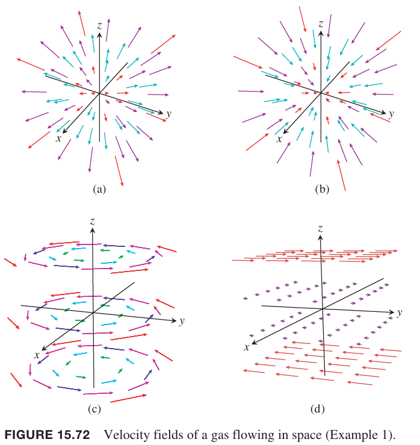

解：（a）
$$\nabla\cdot\boldsymbol{F}=\frac{\partial}{\partial x}x+\frac{\partial}{\partial y}y+\frac{\partial}{\partial z}z=3$$
气体在各点处均匀膨胀。

（b）
$$\nabla\cdot\boldsymbol{F}=\frac{\partial}{\partial x}(-x)+\frac{\partial}{\partial y}(-y)+\frac{\partial}{\partial z}(-z)=-3$$
气体在各点处均匀收缩。

（c）
$$\nabla\cdot\boldsymbol{F}=\frac{\partial}{\partial x}(-y)+\frac{\partial}{\partial y}(x)=0$$
在各点处既不膨胀也不收缩。

（d）
$$\nabla\cdot\boldsymbol{F}=\frac{\partial}{\partial y}z=0$$
在各点处既不膨胀也不收缩。

### 散度定理
**定理 8 散度定理**
> 令 $\boldsymbol{F}$ 是矢量场，各个分量的一阶偏微分连续。令 $S$ 是分段光滑有向封闭曲面。$\boldsymbol{F}$ 穿过 $S$ 的通量，方向由单位矢量 $\boldsymbol{n}$ 确定，等于散度 $\nabla\cdot\boldsymbol{F}$ 在由曲面围成的区域 $D$ 上的三重积分。
> $$\iint_S\boldsymbol{F}\cdot\boldsymbol{n}d\sigma=\iiint_D\nabla\cdot\boldsymbol{F}dV\tag{2}$$

例2 求公式 $(2)$ 左右两边的值，其中矢量场 $\boldsymbol{F}=x\boldsymbol{i}+y\boldsymbol{j}+z\boldsymbol{k}$，曲面是 $x^2+y^2+z^2=a^2$，方向向外。

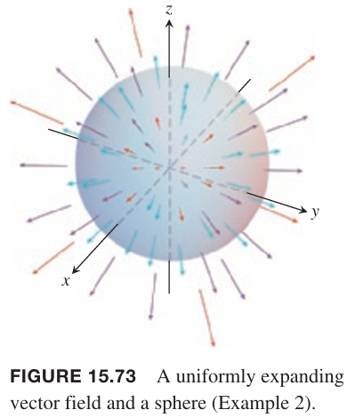

解：计算函数 $f(x,y,z)=x^2+y^2+z^2$ 的梯度可以得到 $S$ 向外的单位矢量
$$\boldsymbol{n}=\frac{2(x\boldsymbol{i}+y\boldsymbol{j}+z\boldsymbol{k})}{\sqrt{4(x^2+y^2+z^2)}}=\frac{x\boldsymbol{i}+y\boldsymbol{j}+z\boldsymbol{k}}{a}$$
那么
$$\boldsymbol{F}\cdot\boldsymbol{n}d\sigma=\frac{x^2+y^2+z^2}{a}d\sigma=ad\sigma$$
因此向外的通量是
$$\iint_S\boldsymbol{F}\cdot\boldsymbol{n}d\sigma=\iint_Sad\sigma=a\iint_Sd\sigma=4\pi a^3$$
为了计算 $(2)$ 的右侧，首先计算 $\boldsymbol{F}$ 的散度，例 1 中给出了答案
$$\nabla\cdot\boldsymbol{F}=3$$
那么散度的积分是
$$\iiint_D\nabla\cdot\boldsymbol{F}dV=\iiint_D3dV=4\pi a^3$$

很多应用场景中各点处的散度都为零。常见例子有不可压缩的流体的矢量场，常量矢量场，或者例 1 中（d）矢量场。散度为零，也就是 $(2)$ 的右侧是零。所以如果 $S$ 是封闭曲面且满足散度定理，那么穿过 $S$ 向外的通量是零。

**推论**
> 曲面 $S$ 是分段光滑有向封闭曲面，在其围成的区域内，矢量场 $\boldsymbol{F}$ 在各点处散度为零，那么穿过 $S$ 向外的通量为零。

例3 求 $\boldsymbol{F}=xy\boldsymbol{i}+yz\boldsymbol{j}+xz\boldsymbol{k}$ 向外通过 $x=1,y=1,z=1$ 和坐标平面组成的立方体的通量。

解：立方体有六个面，与其六个面一个一个计算通量，可以计算三重积分来计算通量。
$$\nabla\cdot\boldsymbol{F}=\frac{\partial}{\partial x}(xy)+\frac{\partial}{\partial y}(yz)+\frac{\partial}{\partial z}(xz)=y+z+x$$
因此通量是
$$\begin{aligned}
\iint_S\boldsymbol{F}\cdot\boldsymbol{n}d\sigma&=\iiint_D\nabla\cdot\boldsymbol{F}dV\\
&=\int_0^1\int_0^1\int_0^1(y+z+x)dxdydx\\
&=\frac{3}{2}
\end{aligned}$$

例4 使用两种方式计算 $\boldsymbol{F}=x^2\boldsymbol{i}+y^2\boldsymbol{j}+z^2\boldsymbol{k}$ 向外穿过立方体 $D:0\leq x\leq 3,0\leq y\leq 2,0\leq z\leq 1$ 的通量，以此验证 $(2)$。

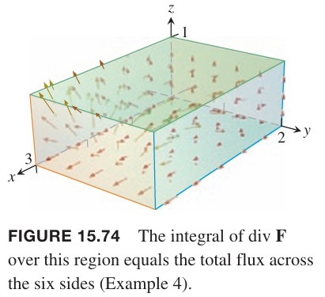

解：首先计算面 $z=1$，此时 $\boldsymbol{n}=\boldsymbol{k}$。穿过这个面的通量由 $\boldsymbol{F}\cdot\boldsymbol{n}=ze^x$ 确定，因此
$$\int_0^2\int_0^3e^xdxdy=2e^3-2$$
其他面类似，下面是各个面的通量

| 面 | $\boldsymbol{n}$ | $\boldsymbol{F}\cdot\boldsymbol{n}$ | 通量 |
|--|--|--|--|
| $x=0$ | $-\boldsymbol{i}$ | $-x^2=0$ | $0$ |
| $x=3$ | $\boldsymbol{i}$ | $x^2=0$ | $18$ |
| $y=0$ | $-\boldsymbol{j}$ | $-4xyz=0$ | $0$ |
| $y=2$ | $\boldsymbol{j}$ | $4xyz=8xz$ | $18$ |
| $z=0$ | $-\boldsymbol{k}$ | $-ze^x=0$ | $0$ |
| $z=1$ | $\boldsymbol{k}$ | $ze^x=e^x$ | $2e^3-2$ |

因此总的通量是
$$18+18+2e^3-2=34+2e^3$$

下面计算 $(2)$ 的右边。首先散度是
$$\nabla\cdot\boldsymbol{F}=2x+4xz+e^x$$
$\boldsymbol{F}$ 的散度在 $D$ 上的三重积分是
$$\begin{aligned}
\iiint_D\nabla\cdot\boldsymbol{F}dV&=\int_0^1\int_0^2\int_0^3(2x+4xz+e^x)dxdydz\\
&=\int_0^1\int_0^2(8+18z+e^3)dydz\\
&=\int_0^1(16+36z+2e^3)dz\\
&=34+2e^3
\end{aligned}$$

### 散度和旋度
如果 $\boldsymbol{F}$ 三维空间矢量场，那么旋度 $\nabla\times\boldsymbol{F}$ 也是三维矢量场。下面是 $\nabla\times\boldsymbol{F}$ 的散度，始终为零。

**定理 9**
> 如果 $\boldsymbol{F}=M\boldsymbol{i}+N\boldsymbol{j}+p\boldsymbol{k}$ 是矢量场且有连续的二阶偏微分，那么
> $$\nabla\cdot(\nabla\times\boldsymbol{F})=0$$

证明：从定义出发，有
$$\begin{aligned}
\nabla\cdot(\nabla\times\boldsymbol{F})&=\frac{\partial}{\partial x}\bigg(\frac{\partial P}{\partial y}-\frac{\partial N}{\partial z}\bigg)+\frac{\partial}{\partial y}\bigg(\frac{\partial M}{\partial z}-\frac{\partial P}{\partial x}\bigg)+\frac{\partial}{\partial z}\bigg(\frac{\partial N}{\partial x}-\frac{\partial M}{\partial y}\bigg)\\
&=\frac{\partial^2 P}{\partial x\partial y}-\frac{\partial^2 N}{\partial x\partial z}+\frac{\partial^2 M}{\partial y\partial z}-\frac{\partial^2 P}{\partial y\partial x}+\frac{\partial^2 N}{\partial z\partial x}-\frac{\partial^2 M}{\partial z\partial y}\\
&=0
\end{aligned}$$
这里使用了 13.3 小节的混合微分定理。

定理 9 有很多有意思的应用。如果 $\boldsymbol{G}=\text{curl } \boldsymbol{F}$，那么 $\boldsymbol{G}$ 的散度为零。如果 $\text{div }\boldsymbol{G}\neq 0$，那么 $G$ 不可能是任意矢量场 $\boldsymbol{F}$ 的旋度，其中 $\boldsymbol{F}$ 有连续的二阶偏微分。如果 $\boldsymbol{G}=\text{curl }\boldsymbol{F}$，那么根据散度定理，$\boldsymbol{G}$ 穿过封闭曲面 $S$ 向外的通量是零，前提是满足定理的条件。如果通量不是零，那么 $G$ 不可能是任意矢量场 $\boldsymbol{F}$ 的旋度。

### 特殊区域下散度定理的证明
为了证明散度定理，$\boldsymbol{F}$ 的各个分量要有连续一阶偏微分。假定 $D$ 是凸多面体，没有洞，也没有气泡，比如实心球、立方体等，$S$ 是分段光滑曲面。$D$ 在 $xy$ 平面的投影是 $R_{xy}$，穿过 $R_{xy}$ 内部的点且垂直于 $xy$ 直线与 $S$ 的交点是两个，那么 $S$ 可以分成两个部分：
$$S_1:z=f_1(x,y),(x,y)\in R_{xy}$$
$$S_2:z=f_2(x,y),(x,y)\in R_{xy}$$
其中 $f_1\leq f_2$。$D$ 投影到其他坐标面也是类似的。

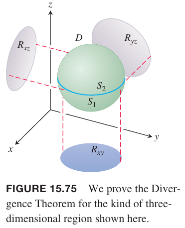

单位法向矢量 $\boldsymbol{n}=n_1\boldsymbol{i}+n_2\boldsymbol{j}+n_3\boldsymbol{k}$ 与三个坐标轴的夹角分别是 $\alpha,\beta,\gamma$。

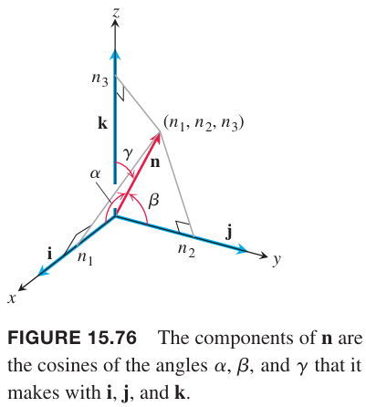

根据上图有
$$n_1=\boldsymbol{n}\cdot\boldsymbol{i}=|\boldsymbol{n}||\boldsymbol{i}|\cos\alpha$$
$$n_2=\boldsymbol{n}\cdot\boldsymbol{j}=|\boldsymbol{n}||\boldsymbol{j}|\cos\beta$$
$$n_3=\boldsymbol{n}\cdot\boldsymbol{k}=|\boldsymbol{n}||\boldsymbol{k}|\cos\gamma$$
那么
$$\boldsymbol{n}=\cos\alpha\boldsymbol{i}+\cos\beta\boldsymbol{j}+\cos\gamma\boldsymbol{k}$$
因此
$$\boldsymbol{F}\cdot\boldsymbol{n}=M\cos\alpha+N\cos\beta+P\cos\gamma$$
使用分量表示散度定理
$$\iint_S(M\cos\alpha+N\cos\beta+P\cos\gamma)d\sigma=\iiint_D\frac{\partial M}{\partial x}+\frac{\partial N}{\partial y}+\frac{\partial P}{\partial z}dxdydz$$
接下来证明下面三个等式进而证明散度定理。
$$\iint_SM\cos\alpha d\sigma=\iiint_D\frac{\partial M}{\partial x}dxdydz\tag{3}$$
$$\iint_SN\cos\beta d\sigma=\iiint_D\frac{\partial N}{\partial y}dxdydz\tag{4}$$
$$\iint_SP\cos\gamma d\sigma=\iiint_D\frac{\partial P}{\partial z}dxdydz\tag{5}$$

下面证明 $(5)$。

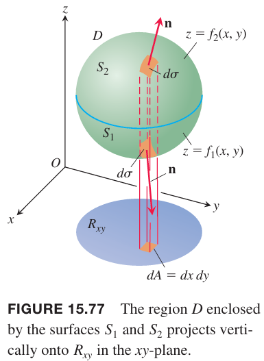

曲面 $S$ 分成上下两个部分。上半部分 $S_2$ 的方程是 $z=f_2(x,y)$，下半部分 $S_1$ 的方程是 $z=f_1(x,y)$。对于 $S_2$，$\boldsymbol{n}$ 的 $\boldsymbol{k}$ 分量是正的。因为
$$d\sigma=\frac{dA}{|\cos\gamma|}=\frac{dxdy}{\cos\gamma}$$
所以
$$\cos\gamma d\sigma=dxdy$$
对于 $S_1$，$\boldsymbol{n}$ 的 $\boldsymbol{k}$ 分量是负的，所以
$$\cos\gamma d\sigma=-dxdy$$

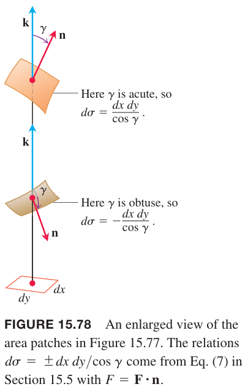

因此
$$\begin{aligned}
\iint_SP\cos\gamma d\sigma&=\iint_{S_2}P\cos\gamma d\sigma+\iint_{S_1}P\cos\gamma d\sigma\\
&=\iint_{R_{xy}}P(x,y,f_2(x,y))dxdy-\iint_{R_{xy}}P(x,y,f_1(x,y))dxdy\\
&=\iint_{R_{xy}}[P(x,y,f_2(x,y))-P(x,y,f_1(x,y))]dxdy\\
&=\iint_{R_{xy}}\bigg[\int_{f_1(x,y)}^{f_2(x,y)}\frac{\partial P}{\partial z}dz\bigg]dxdy\\
&=\iiint_D\frac{\partial P}{\partial z}dzdxdy
\end{aligned}$$
类似的可以 $(3),(4)$。这就完成了对特殊区域下散度定理的证明。

### 其他区域的散度定理
散度定理可以扩展到可以分成有限个数的上述简单类型区域的区域，以及可以以某种方式定义为更简单区域的极限的区域。比如有两个同心球夹着的区域 $D$，在 $D$ 及其曲面上 $\boldsymbol{F}$ 有连续可微分量。赤道面将 $D$ 分成两个部分，并分别应用散度定理。下半部分 $D_1$，曲面 $S_1$ 由外面的球面、环形、内部的球面三个部分组成。

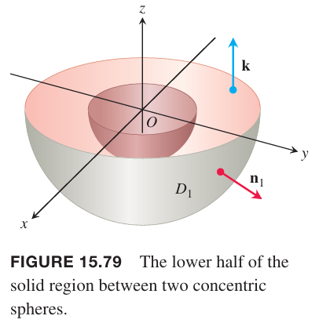

根据散度定理有
$$\iint_{S_1}\boldsymbol{F}\cdot\boldsymbol{n}d\sigma_1=\iiint_{D_1}\nabla\cdot\boldsymbol{F}dV_1\tag{6}$$
外部球面的 $\boldsymbol{n}_1$ 向外，内部球面的 $\boldsymbol{n}_1$ 朝向球心，唤醒面的 $\boldsymbol{n}_1$ 是 $\boldsymbol{k}$。类似的，分割的上半部分区域 $D_2$，曲面是 $S_2$。

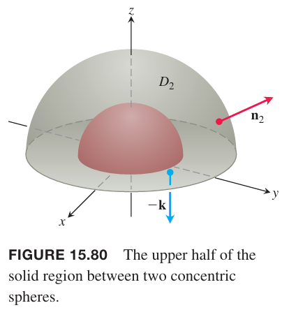
散度定理
$$\iint_{S_2}\boldsymbol{F}\cdot\boldsymbol{n}d\sigma_2=\iiint_{D_2}\nabla\cdot\boldsymbol{F}dV_2\tag{7}$$
类似的，外部球面的 $\boldsymbol{n}_2$ 向外，内部球面的 $\boldsymbol{n}_2$ 朝向球心，唤醒面的 $\boldsymbol{n}_2$ 是 $-\boldsymbol{k}$。两式相加，两个环形面的方向 $\boldsymbol{n}_1,\boldsymbol{n}_2$ 恰好相反，相互抵消，那么
$$\iint_{S}\boldsymbol{F}\cdot\boldsymbol{n}d\sigma=\iiint_{D}\nabla\cdot\boldsymbol{F}dV$$
其中 $D$ 是两个球面间的区域，$S$ 是 $D$ 的边界，两个曲面，$S$ 的方向 $\boldsymbol{n}$ 是从 $D$ 向外。

例5 求场
$$\boldsymbol{F}=\frac{x\boldsymbol{i}+y\boldsymbol{j}+z\boldsymbol{k}}{\rho^3},\rho=\sqrt{x^2+y^2+z^2}\tag{8}$$
穿过区域 $D:0< b^2\leq x^2+y^2+z^2\leq a^2$ 的边界向外的净通量。

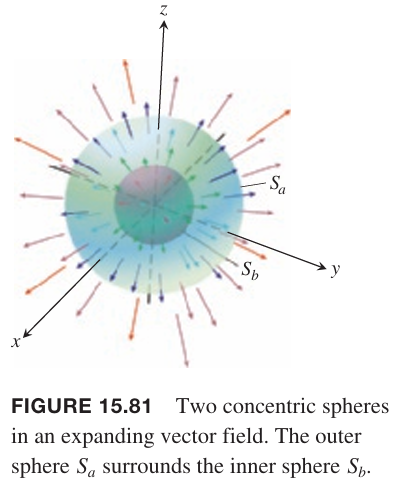

解：通过计算 $\nabla\cdot\boldsymbol{F}$ 在 $D$ 上的积分来计算通量。注意这里 $\rho\neq 0$。
$$\frac{\partial\rho}{\partial x}=\frac{1}{2}(x^2+y^2+z^2)^{-1/2}(2x)=\frac{x}{\rho}$$
那么
$$\frac{\partial M}{\partial x}=\frac{\partial}{\partial x}(x\rho^{-3})=\rho^{-3}-3x\rho^{-4}\frac{\partial\rho}{\partial x}=\frac{1}{\rho^3}-\frac{3x^2}{\rho^5}$$
类似的
$$\frac{\partial N}{\partial y}=\frac{1}{\rho^3}-\frac{3y^2}{\rho^5},\frac{\partial P}{\partial z}=\frac{1}{\rho^3}-\frac{3z^2}{\rho^5}$$
因此
$$\nabla\cdot\boldsymbol{F}=\frac{\partial M}{\partial x}+\frac{\partial N}{\partial y}+\frac{\partial P}{\partial z}=\frac{3}{\rho^3}-\frac{3}{\rho^5}(x^2+y^2+z^2)=\frac{3}{\rho^3}-\frac{3\rho^3}{\rho^5}=0$$
所以 $\boldsymbol{F}$ 穿过 $D$ 的边界向外的净通量是零。因此穿过 $S_b$ 向内的通量是穿过 $S_a$ 向外的通量的负值。因此如果方向一致都是向外的话，穿过 $S_b$ 和 $S_a$ 的通量一样。因此 $\boldsymbol{F}$ 穿过球心在原点的球面的通量与球体半径无关。

下面计算通过任意球面 $S_a$ 的通量。半径为 $a$ 的球面向外的单位法向矢量是
$$\boldsymbol{n}=\frac{x\boldsymbol{i}+y\boldsymbol{j}+z\boldsymbol{k}}{\sqrt{x^2+y^2+z^2}}=\frac{x\boldsymbol{i}+y\boldsymbol{j}+z\boldsymbol{k}}{a}$$
那么
$$\boldsymbol{F}\cdot\boldsymbol{n}=\frac{x\boldsymbol{i}+y\boldsymbol{j}+z\boldsymbol{k}}{a^3}\cdot\frac{x\boldsymbol{i}+y\boldsymbol{j}+z\boldsymbol{k}}{a}=\frac{x^2+y^2+z^2}{a^4}=\frac{a^2}{a^4}=\frac{1}{a^2}$$
因此通量是
$$\iint_{S_a}\boldsymbol{F}\cdot\boldsymbol{n}d\sigma=\frac{1}{a^2}\iint_{S_a}d\sigma=\frac{1}{a^2}(4\pi a^2)=4\pi$$
$\boldsymbol{F}$ 穿过球心在原点任意半径的球面的通量是 $4\pi$，与半径无关。

### 高斯定律：电磁理论最重要的四大定律之一
电磁理论中，原点处电荷 $q$ 产生的电场是
$$\boldsymbol{E}(x,y,z)=\frac{1}{4\pi\varepsilon_0}\frac{q}{|\boldsymbol{r}|^2}\frac{\boldsymbol{r}}{|\boldsymbol{r}|}=\frac{q}{4\pi\varepsilon_0}\frac{\boldsymbol{r}}{|\boldsymbol{r}|^3}=\frac{q}{4\pi\varepsilon_0}\frac{x\boldsymbol{i}+y\boldsymbol{j}+z\boldsymbol{k}}{\rho^3}$$
其中 $\varepsilon_0$ 是物理常量，$\boldsymbol{r}$ 是点 $(x,y,z)$ 的位置矢量，$\rho=|\boldsymbol{r}|=\sqrt{x^2+y^2+z^2}$。从 $(8)$ 可以得到
$$\boldsymbol{E}=\frac{q}{4\pi\varepsilon_0}\boldsymbol{F}$$
例 5 告诉我们 $\boldsymbol{E}$ 穿过球心为原点的球面的通量是 $q/\varepsilon_0$，这个结果不限定于球面，对任意包含原点的封闭曲面均成立。假定一个较大的半径为 $a$ 的球面，其圆心在原点，和一个包含原点的曲面 $S$，如下图所示。

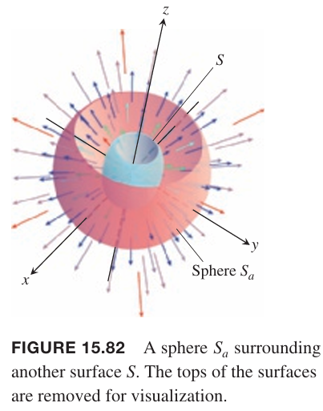

因为
$$\nabla\cdot\boldsymbol{E}=\nabla\cdot\frac{q}{4\pi\varepsilon_0}\boldsymbol{F}=\frac{q}{4\pi\varepsilon_0}\nabla\cdot\boldsymbol{F}=0$$
那么 $\nabla\cdot\boldsymbol{E}$ 在 $D$ 上的三重积分是零，其中 $\rho>0$，$D$ 是 $S$ 和 $S_a$ 之间的区域。根据散度定理
$$\iint_{\text{Boundary of }D}\boldsymbol{E}\cdot\boldsymbol{n}d\sigma=0$$
因此 $\boldsymbol{E}$ 穿过 $S$ 向外的通量和穿过 $S_a$ 向外的通量相同，都是 $q/\varepsilon_0$。这就是高斯定律，对更一般的电荷分布也成立。对于任意包含原点的封闭曲面，都有
$$\iint_S\boldsymbol{E}\cdot\boldsymbol{n}d\sigma=\frac{q}{\varepsilon_0}$$

### 流体动力学的连续性方程
令 $D$ 是空间中封闭曲线 $S$ 围成的区域。如果 $\boldsymbol{v}(x,y,z)$ 是 $D$ 内光滑流动的液体的速度场，$\delta=\delta(t,x,y,z)$ 是 $t$ 时刻 $(x,y,z)$ 处液体的密度，令 $\boldsymbol{F}=\delta\boldsymbol{v}$，流体动力学的连续性方程是
$$\nabla\cdot\boldsymbol{F}+\frac{\partial\delta}{\partial t}=0$$
如果函数连续的一阶偏微分，可以使用散度定理证明。

首先积分
$$\iint_S\boldsymbol{F}\cdot\boldsymbol{n}d\sigma$$
是穿过 $S$ 离开 $D$ 的质量的速率。配合下图解释这一点。

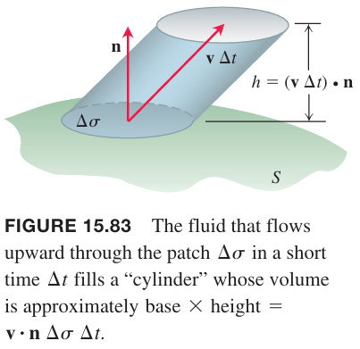

在很短的时间 $\Delta t$ 内，在很小的区域上流体的体积是 $\Delta V$，等于圆柱底面积 $\Delta\sigma$ 乘以高度 $(\boldsymbol{v}\Delta t)\cdot\boldsymbol{n}$，那么
$$\Delta V\approx\boldsymbol{v}\cdot\boldsymbol{n}\Delta\sigma\Delta t$$
对应的质量是
$$\Delta m\approx\delta\boldsymbol{v}\cdot\boldsymbol{n}\Delta\sigma\Delta t$$
那么流出 $D$ 的质量的速率是
$$\frac{\Delta m}{\Delta t}\approx\delta\boldsymbol{v}\cdot\boldsymbol{n}\Delta\sigma$$
那么
$$\frac{\sum\Delta m}{\Delta t}\approx\sum\delta\boldsymbol{v}\cdot\boldsymbol{n}\Delta\sigma$$
这是穿过 $S$ 流出的质量的平均速率。令 $\Delta\sigma\to 0,\Delta t\to 0$，平均速度就是瞬时速率
$$\frac{dm}{dt}=\iint_S\delta\boldsymbol{v}\cdot\boldsymbol{n}d\sigma$$
那么
$$\frac{dm}{dt}=\iint_S\boldsymbol{F}\cdot\boldsymbol{n}d\sigma$$
令 $B$ 是圆心在 $Q$ 的实心球。$\nabla\cdot\boldsymbol{F}$ 在 $B$ 上的均值是
$$\frac{1}{V_B}\iiint_B\nabla\cdot\boldsymbol{F}dV$$
散度是连续的，因此这个值等于 $\nabla\cdot\boldsymbol{F}$ 在 $B$ 内某点 $P$ 处的值。那么
$$(\nabla\cdot\boldsymbol{F})(P)=\frac{1}{V_B}\iiint_B\nabla\cdot\boldsymbol{F}dV=\frac{1}{V_B}\iint_S\boldsymbol{F}\cdot\boldsymbol{n}d\sigma\tag{9}$$
上式最右边就是单位体积流出质量的速率。

令 $B$ 的半径趋于零，那么 $(9)$ 的坐标收敛于 $(\nabla\cdot\boldsymbol{F})_Q$，由于 $\delta=m/V$，因此右边趋于 $(-\partial\delta/\partial t)_Q$。这两个极限相等，就得到连续性方程
$$\nabla\cdot\boldsymbol{F}=-\frac{\partial\delta}{\partial t}$$
上式的解释是 $\boldsymbol{F}$ 在某点处的散度是流体密度在该点处减少的速率。那么散度定理
$$\iint_S\boldsymbol{F}\cdot\boldsymbol{n}d\sigma=\iiint_D\nabla\cdot\boldsymbol{F}dV$$
是说 $D$ 内流体密度的净减少由穿过 $S$ 的质量决定。

### 统一积分理论
如果二维矢量场 $\boldsymbol{F}=M(x,y)\boldsymbol{i}+N(x,y)\boldsymbol{j}$，那么 $\nabla\cdot\boldsymbol{F}=(\partial M/\partial x)+(\partial N/\partial y)$，因此格林定理的法向形式可以写作
$$\oint_C\boldsymbol{F}\cdot\boldsymbol{n}ds=\iint_R\bigg(\frac{\partial M}{\partial x}+\frac{\partial N}{\partial y}\bigg)dxdy=\iint_R\nabla\cdot\boldsymbol{F}dA$$
类似的，$\nabla\times\boldsymbol{F}\cdot\boldsymbol{k}=(\partial N/\partial x)-(\partial M/\partial y)$，那么格林定理的切向形式可以写作
$$\oint_C\boldsymbol{F}\cdot\boldsymbol{T}ds=\iint_R\bigg(\frac{\partial N}{\partial x}-\frac{\partial M}{\partial y}\bigg)dxdy=\iint_R(\nabla\times\boldsymbol{F})\cdot\boldsymbol{k}dA$$
格林公式使用 $\nabla$ 符号改写，可以看出其与斯托克斯定理和散度定理的关系。

**格林定理和泛化三维版本**
> 格林定理切向形式
> $$\oint_C\boldsymbol{F}\cdot\boldsymbol{T}ds=\iint_R(\nabla\times\boldsymbol{F})\cdot\boldsymbol{k}dA$$
> 斯托克斯定理
> $$\oint_C\boldsymbol{F}\cdot\boldsymbol{T}ds=\iint_S(\nabla\times\boldsymbol{F})\cdot\boldsymbol{n}d\sigma$$
> 格林定理法向形式
> $$\oint_C\boldsymbol{F}\cdot\boldsymbol{n}ds=\iint_R\nabla\cdot\boldsymbol{F}dA$$
> 散度定理
> $$\oint_C\boldsymbol{F}\cdot\boldsymbol{n}ds=\iiint_D\nabla\cdot\boldsymbol{F}dV$$

斯托克斯定理是格林定理切向形式从二维平面到三维曲面的泛化。$\boldsymbol{F}$ 旋度的曲面积分等于 $\boldsymbol{F}$ 在边界上的环量。

散度定理是格林定理法向形式从二维平面到三维立体区域的泛化。$\nabla\cdot\boldsymbol{F}$ 在区域上的积分等于 $\boldsymbol{F}$ 矢量场穿过闭合区域边界的通量。

这些可以看作是一个基本定理的形式。微积分基本定理是说 $f(x)$ 在 $[a,b]$ 上连续，在 $(a,b)$ 上可导，那么
$$\int_a^b\frac{df}{dx}dx=f(b)-f(a)$$
如果令 $\boldsymbol{F}=f(x)\boldsymbol{i},x\in[a,b]$，那么 $df/dx=\nabla\cdot\boldsymbol{F}$。定义单位矢量 $\boldsymbol{n}$ 是线段 $ab$ 边界向外，如下图所示。

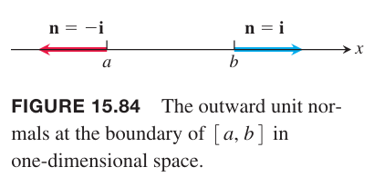

那么
$$\begin{aligned}
f(b)-f(a)&=f(b)\boldsymbol{i}\cdot\boldsymbol{i}-f(a)\boldsymbol{i}\cdot(-\boldsymbol{i})\\
&=\boldsymbol{F}(b)\cdot\boldsymbol{n}+\boldsymbol{F}(a)\cdot\boldsymbol{n}
\end{aligned}$$
上式最后一项可以看作是 $\boldsymbol{F}$ 穿过 $[a,b]$ 边界的通量。

现在基本定理可以解释为
$$\boldsymbol{F}(b)\cdot\boldsymbol{n}+\boldsymbol{F}(a)\cdot\boldsymbol{n}=\int_{[a,b]}\nabla\cdot\boldsymbol{F}dx$$
微积分定理、格林定理法向形式、散度定理说的是一个事情：微分算子 $\nabla\cdot$ 在某个区域上作用于场 $\boldsymbol{F}$ 的积分等于在闭合区域边界上场的法向分量的和。微积分基本定理和和，格林定理和散度定理是积分，和的另一种形式。

斯托克斯定理和格林定理切向形式是说微分算子 $\nabla\times$ 作用于场 $\boldsymbol{F}$ 的曲面积分等于场的切向分量沿着闭合曲面的边界的和。

**矢量积分的同意基本定理**
> 微分算子作用于某一区域上的场的积分等于在该区域边界上相应的场分量的和。
