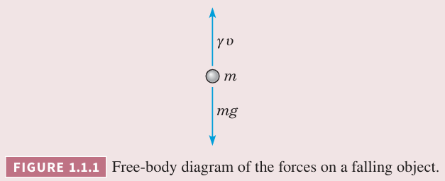
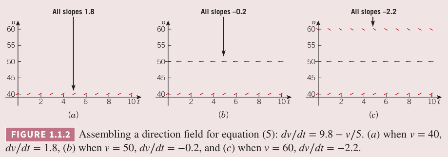
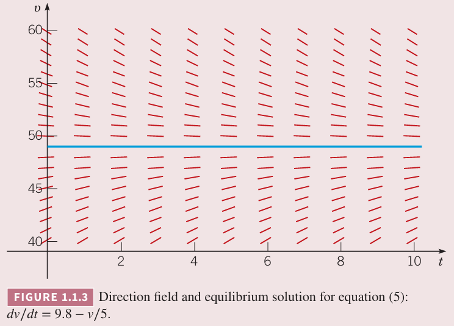

自然界中很多法则、定律表示的关系与事情变化的速率相关。用数学术语表达，关系就是方程，变化率就是求导。包含导数的方程就是微分方程（`differential equations`）。

一个描述物理过程的微分方程是该过程的数学模型（`mathematical model`）。本书会介绍很多模型。下面从两个简单的模型入手。

例 1 自由落体

假定在海平面附近的大气中有一个物体自由下落，使用微分方程可以描述这个过程。

解：使用 $t$ 表示时间，$v$ 表示速度，$v(t)$ 是时刻 $t$ 时物体的速度。这里旋转向下为正向。

牛顿第二定律（`Newton's second law`）描述了物体的运动。
$$F=ma\tag{1}$$
其中 $m$ 是物体的质量，$a$ 是加速度，$F$ 物体所受的力。$a$ 和 $v$ 相关，即 $a=dv/dt$，那么上式可以写作
$$F=m\frac{dv}{dt}\tag{2}$$
物体受到重力影响，大小是 $mg$，向下，正向。物体还受到空气阻力，正比于速度，$\gamma v$，这里 $\gamma$ 是阻力系数。因此作用于物体的力可以写作
$$F=mg-\gamma v\tag{3}$$

那么公式 $(2)$ 可以写作
$$m\frac{dv}{dt}=mg-\gamma v\tag{4}$$
这个模型里面 $m,g,\gamma$ 可以视为常量。其中 $g$ 是物理常量，重力加速度。$m,\gamma$ 与物体本身相关。

为了求解 $(4)$，需要找到一个函数 $v=v(t)$ 满足这个方程，下一节会分析。这里先分析一个更简单的问题，$m,\gamma$ 都给出的情况。假定 $m=10,\gamma=2$，那么 $(4)$ 可以写作
$$\frac{dv}{dt}=9.8-\frac{v}{5}\tag{5}$$

例 2 自由落体

不求解微分方程，分析 $(5)$ 的解的行为。

解：现在考虑仅从微分方程中能够得到什么信息。假定速度 $v$ 是确定值，那么根据 $(5)$ 右边可以计算得到 $dv/dt$ 的值。比如 $v=40$，那么 $dv/dt=1.8$，这意味着解 $v=v(t)$ 在 $v=40$ 的点处斜率是 $1.8$。我们可以在 $tv$ 平面上在 $v=40$ 的直线上画一些斜率是 1.8 的短线，如下图（a）所示。类似的，当 $v=50$ 时 $dv/dt=-0.2$，当 $v=60$ 时 $dv/dt=-2.2$，同样可以画出表示斜率的短线，如下图（b）（c）所示。

同样处理其他 $v$ 值可以得到方向场（`direction field`）或斜率场（`slope field`）。微分方程 $(5)$ 的方向场如下图所示。

方程 $(5)$ 的解是函数 $v=v(t)$，在 $tv$ 平面上是一条曲线。上图中的线段都是曲线的切线。尽管没有给出解，仍旧可以得到一些定性分析结果。如果 $v$ 小于某个值，对应的线段的斜率为正，说明随着物体下降速度在增加。如果 $v$ 大于某个值，对应的线段的斜率为负，随着物体下降速度在减小。这个临界值是多少呢？回到 $(5)$，这个问题等价于让 $dv/dt$ 为零的 $v$ 值，即 $v=49$。

