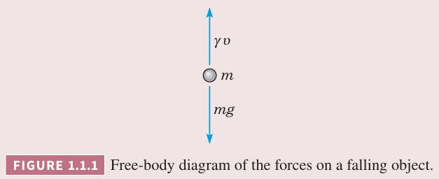

自然界中很多法则、定律表示的关系与事情变化的速率相关。用数学术语表达，关系就是方程，变化率就是求导。包含导数的方程就是微分方程（`differential equations`）。

一个描述物理过程的微分方程是该过程的数学模型（`mathematical model`）。本书会介绍很多模型。下面从两个简单的模型入手。

例 1 自由落体

假定在海平面附近的大气中有一个物体自由下落，使用微分方程可以描述这个过程。

解：使用 $t$ 表示时间，$v$ 表示速度，$v(t)$ 是时刻 $t$ 时物体的速度。这里旋转向下为正向。

牛顿第二定律（`Newton's second law`）描述了物体的运动。
$$F=ma\tag{1}$$
其中 $m$ 是物体的质量，$a$ 是加速度，$F$ 物体所受的力。$a$ 和 $v$ 相关，即 $a=dv/dt$，那么上式可以写作
$$F=m\frac{dv}{dt}\tag{2}$$
物体受到重力影响，大小是 $mg$，向下，正向。物体还受到空气阻力，正比于速度，$\gamma v$，这里 $\gamma$ 是阻力系数。因此作用于物体的力可以写作
$$F=mg-\gamma v\tag{3}$$

那么公式 $(2)$ 可以写作
$$m\frac{dv}{dt}=mg-\gamma v\tag{4}$$
这个模型里面 $m,g,\gamma$ 可以视为常量。其中 $g$ 是物理常量，重力加速度。$m,\gamma$ 与物体本身相关。

为了求解 $(4)$，需要找到一个函数 $v=v(t)$ 满足这个方程，下一节会分析。这里先分析一个更简单的问题，$m,\gamma$ 都给出的情况。假定 $m=10,\gamma=2$，那么 $(4)$ 可以写作
$$\frac{dv}{dt}=9.8-\frac{v}{5}\tag{5}$$

例 2 自由落体

不求解微分方程，分析 $(5)$ 的解的行为。

解：现在考虑仅从微分方程中能够得到什么信息。假定速度 $v$ 是确定值，那么根据 $(5)$ 右边可以计算得到 $dv/dt$ 的值。比如 $v=40$，那么 $dv/dt=1.8$，这意味着解 $v=v(t)$ 在 $v=40$ 的点处斜率是 $1.8$。我们可以在 $tv$ 平面上在 $v=40$ 的直线上画一些斜率是 1.8 的短线，如下图（a）所示。类似的，当 $v=50$ 时 $dv/dt=-0.2$，当 $v=60$ 时 $dv/dt=-2.2$，同样可以画出表示斜率的短线，如下图（b）（c）所示。

同样处理其他 $v$ 值可以得到方向场（`direction field`）或斜率场（`slope field`）。微分方程 $(5)$ 的方向场如下图所示。

方程 $(5)$ 的解是函数 $v=v(t)$，在 $tv$ 平面上是一条曲线。上图中的线段都是曲线的切线。尽管没有给出解，仍旧可以得到一些定性分析结果。如果 $v$ 小于某个值，对应的线段的斜率为正，说明随着物体下降速度在增加。如果 $v$ 大于某个值，对应的线段的斜率为负，随着物体下降速度在减小。这个临界值是多少呢？回到 $(5)$，这个问题等价于让 $dv/dt$ 为零的 $v$ 值，即 $v=49$。

事实上，$v=49$ 是方程 $(5)$ 的一个解。由于速度不随时间变化因此这个解称为平衡解（`equilibrium solution`）。这个解在重力和阻力之间取得了平衡。根据上图，我们还可以得出一个结论，随着 $t$ 的增加，非平衡解的速度会收敛到平衡解。在这个上下文中，平衡解还称为收尾（终止）速度（`terminal  velocity`）。

例 2 的方法也可以用于更一般的微分方程上，比如 $(4)$，其中 $m, \gamma$ 是未指定的正数。结论和例 2 类似。微分方程 $(4)$ 的平衡解是 $v(t)=mg/\gamma$。平衡解下方的解随着时间增加速度在增加，反之上方的解随着时间增加速度在减少，最后随着 $t$ 变大，所有解都趋于平衡解。

### 方向场
方向场是研究如下微分方程解的有用工具
$$\frac{dy}{dt}=f(t,y)\tag{6}$$
其中 $f$ 是 $t,y$ 的函数，有时也称为速率函数（`rate function`）。在正方形网格的每一点处求 $f$ 的值，就能得到公式 $(6)$ 的方向场。在每一点处画一个短的线段，斜率是 $f$ 在该点处的值，那么每一个线段是解在该点处的切线。充分细的网格能够很好的描述微分方程解的大致情况。通常包含数百个点就足够了。构造方向场经常是研究微分方程的第一步。

这里需要提两点。第一点是构造方向场无需求解方程 $(6)$，只需要反复计算 $f(t,y)$ 的值即可，即使是非常难解的微分方程，也可以快速得到方向场。第二点是构造方向场这个工作很适合由计算机完成。

### 田鼠和猫头鹰
下面分析一个不同的例子。郊区有一定数量的田鼠。假定没有天敌的情况下，田鼠数量的增长速率正比于当前数量，这个假定并不基于物理原理，而是研究人口增长时最普遍的一个模型，2.5 小节会讨论更好的模型。$t$ 表示时间，$p(t)$ 表示 $t$ 时刻的田鼠数量，那么这个假设的数学表示是
$$\frac{dp}{dt}=rp\tag{7}$$
其中 $r$ 是速率常数（`rate constant`）或增长率（`growth rate`）。和之前的例子类似，这里令 $r=0.5$。

现在引入天敌猫头鹰，每天吃 15 只田鼠，那么微分方程 $(7)$ 变成
$$\frac{dp}{dt}=\frac{p}{2}-450$$

例 3 用方向场方法研究微分方程 $(8)$。

解：方向场如下图所示。

当 $p$ 充分大时，$dp/dt$ 是正数，解是递增的。当 $p$ 很小时，$dp/dt$ 是负数，解是递减的。这个临界值使得 $dp/dt=0$，即 $p(t)=900$，平衡解。

对比例 2 和 例 3，平衡解将递增的解和递减的解分开。不同点是，例 2 中非平衡解都趋于平衡解，而例 3 中非平衡解都远离平衡解。不管怎样，平衡解对理解微分方程的行为都很有用。

微分方程公式 $(8)$ 的更一般形式是
$$\frac{dp}{dt}=rp-k\tag{9}$$
和 $(8)$ 的解类似，$(9)$ 的平衡解是 $p(t)=k/r$。

上面的模型都有其局限性。比如自由落体的例子中，如果速度足够快，摩擦阻力不是对速度的线性近似而是二次方近似。再比如田鼠和猫头鹰的例子，如果 $p$ 充分大，数量会无限增长，明显不合理。

### 构造数学模型
在将微分方程应用于适合的领域时，第一步是用构造一个合适的微分方程来描述问题，即建模。先前已经看到了两个建模的例子。当建模时，需要认识到问题是五花八门的，并没有一套既定且放之四海而皆准的规则。事实上，构造好的模型是最难的部分。不过，下面的步骤对建模是有帮助的。

1. 确定自变量和因变量。
2. 选择合适的单位。
3. 清晰的描述问题背后的基本原理。可能是物理规律，也可能是领域经验或观察。这一步并不是纯数学的，但是需要对问题领域很熟悉。
4. 用第一步的变量来描述第三步的基本原理。这一步或许会引入常量或中间变量。
5. 如果单位统一，那么维度上是一致的，当然可能有其他问题。
6. 对于这里考虑的问题，第四步的结果是一个微分方程，描述了数学模型。不过对于复杂问题，模型也更复杂，结果可能是一组微分方程。
