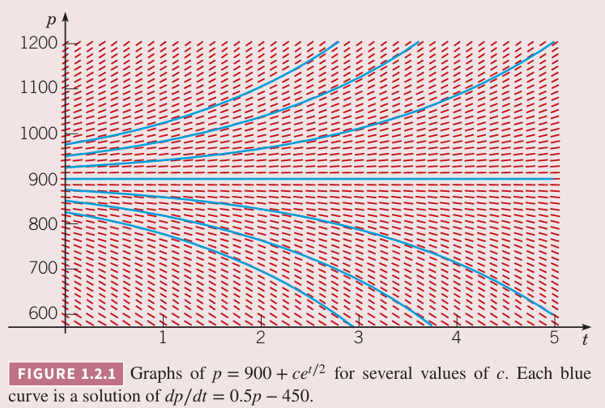
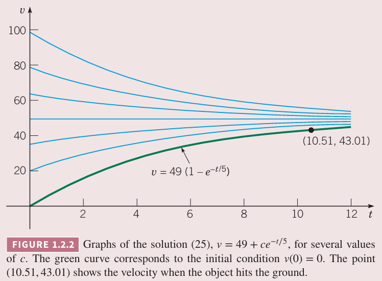

上一节推导出两个微分方程
$$m\frac{dv}{dt}=mg-\gamma v\tag{1}$$
$$\frac{dp}{dt}=rp-k\tag{2}$$
这两个方程的一般形式是
$$\frac{dy}{dt}=ay-b\tag{3}$$
其中 $a,b$ 是常量。使用方向场可以得到 $(1),(2)$ 一些重要定性结论。不过要回答定量的问题，还是要求解微分方程。

例 1 田鼠和猫头鹰

求解微分方程
$$\frac{dp}{dt}=0.5p-450\tag{4}$$
解：首先重写 $(4)$ 为如下形式
$$\frac{dp}{dt}=\frac{p-900}{2}\tag{5}$$
如果 $p\neq 900$，那么
$$\frac{dp/dt}{p-900}=\frac{1}{2}\tag{6}$$
$(6)$ 的左边是 $\ln |p-900|$ 相对于 $t$ 的微分，那么
$$\frac{d}{dt}\ln|p-900|=\frac{1}{2}\tag{7}$$
对 $(7)$ 两边积分得到
$$\ln|p-900|=\frac{t}{2}+C\tag{8}$$
其中 $C$ 是积分的任意常量。$(8)$ 两边求 $e$ 指数
$$|p-900|=e^{t/2+C}=e^Ce^{t/2}\tag{9}$$
那么
$$p-900=\pm e^Ce^{t/2}\tag{10}$$
因此
$$p=900+ce^{t/2}\tag{11}$$
其中 $c=\pm e^C$ 是任意非零常量。注意常量 $p=900$ 也是 $(5)$ 的解。如果允许 $c$ 为零，那么这个解也包含在 $(11)$ 中。下图是对 $c$ 取了几个值时 $(11)$ 的图像。

注意它们的特征和上一节图 1.1.4 的方向场一致。

在例 1 中，微分方程 $(4)$ 有无穷多个解，对应着 $(11)$ 中 $c$ 有无穷个值。这是求解微分方程的典型情况。求解过程涉及积分，会引入任意常量，它的可能值生产无穷的解。

很多时候我们对这个常量取某个值的情况更值得研究，不过是通过指定解要通过某一个点来间接这件事。比如，为了确定 $(11)$ 中的 $c$，我们给定特殊时间一个值，比如 $t=0$ 时田鼠数量是 850，即解通过点 $(0,850)$。这个条件表达为
$$p(0)=850\tag{12}$$
将 $t=0,p=850$ 代入 $(11)$，得到
$$850=900+c$$
因此 $c=-50$，那么期待的解是
$$p=900-50e^{t/2}\tag{13}$$
用于决定 $c$ 的附件条件 $(12)$ 称为初始条件（`initial condition`）。微分方程 $(4)$ 和初始条件 $(12)$ 合起来称为初值问题（`initial value problem`）。

下面求解更一般的形式 $(3)$
$$\frac{dy}{dt}=ay-b$$
初始条件是
$$y(0)=y_0\tag{14}$$
其中 $y_0$ 是任意初始值。解法与例 1 类似。如果 $a\neq 0,y\neq b/a$,那么 $(3)$ 可以写作
$$\frac{dy/dt}{y-\frac{b}{a}}=a\tag{15}$$
两边积分
$$\ln\bigg|y(t)-\frac{b}{a}\bigg|=at+C\tag{16}$$
其中 $C$ 是任意常量。对 $(16)$ 两边求 $e$ 指数
$$y(t)=\frac{b}{a}+ce^{at}\tag{17}$$
其中 $c=\pm e^C$，也是任意常量。当 $c=0$ 相对应是平衡解 $y(t)=b/a$。最终，初始条件要求 $c=y_0-(b/a)$，所以初值问题 $(3),(14)$ 的解是
$$y(t)=\frac{b}{a}+\bigg(y_0-\frac{b}{a}\bigg)e^{at}\tag{18}$$
当 $a\neq 0$ 时，$(17)$ 包含所有微分方程 $(3)$ 所有可能的解，称为通解（`general solution`）。通解 $(17)$ 的几何解释是一组无限曲线，曲线称为积分曲线（`integral curve`）。每一个积分曲线有一个对应的 $c$ 值，其图像是 $c$ 对应的解。满足初始条件的积分曲线通过给定的初始点。

如果 $a=0$，那么 $(3)$ 写作 $dy/dt=-b$，那么通解是 $y=-by+C$。

为了使用 $(18)$ 求解 $(2)$，只需用 $r$ 替代 $a$ 用 $k$ 替代 $b$，假定 $r>0,k>0$，因此解 $(18)$ 变成
$$p(t)=\frac{k}{r}+\bigg(p_0-\frac{k}{r}\bigg)e^{rt}\tag{19}$$
其中 $p_0$ 是田鼠的初始数量。解 $(19)$ 与例 1 结论一致。如果 $p_0=k/r$，那么对所有 $t$ 都有 $p(t)=k/r$，这是常量解，也是平衡解。如果 $p_0\neq k/r$，那么解的行为依赖于指数项的系数 $p_0-k/r$ 的符号。如果 $p_0>kr/$，那么 $p$ 随着时间指数增长，如果 $p_0<k/r$，那么 $p$ 减少并且在有限时间内会变成零，即田鼠灭绝了。对于 $(19)$ 而言，$p$ 可以为负值，但是对于问题本身没有意义。

为了让公式 $(1)$ 是形式 $(3)$，需要令 $a=-\gamma/m,b=-g$。通过观察有 $\gamma>0,m>0$，那么 $a<0,b<0$。将这些代入 $(18)$ 得到
$$v(t)=\frac{mg}{\gamma}+\bigg(v_0-\frac{mg}{\gamma}\bigg)e^{-\gamma t/m}\tag{20}$$
其中 $v_0$ 是初始速度。这个结论与 1.1 小节从方向场得到的结论一致。平衡解是 $v(t)=mg/\gamma$，所有其他解趋于平衡解。收敛的速度取决于 $-\gamma/m$。因此，给定质量 $m$，阻力系数 $\gamma$ 越大速度趋于平衡值的速度越快。

例 2 自由落体

和 1.1 小节例 2 一样，令质量 $m=10$，阻力系数是 $\gamma=2$。那么 $(1)$ 变成了
$$\frac{dv}{dt}=9.8-\frac{v}{5}\tag{21}$$
假定这个物体从 300 米的高度下落。求任意时间 $t$ 的速度。求多长时间能够落地，那时速度有多快。

解：第一步找到 $(21)$ 的合适的初始值。根据题意，初始速度为零，因此
$$v(0)=0\tag{22}$$
可以通过 $(20)$ 得到 $(21)$ 的解。不过这里我们也可以直接求解。首先，方程可以重写作
$$\frac{dv/dt}{v-49}=-\frac{1}{5}\tag{23}$$
两边积分得到
$$\ln|v-49|=-\frac{t}{5}+C\tag{24}$$
通解是
$$v(t)=49+ce^{-t/5}\tag{25}$$
其中 $c$ 是任意常数。为了计算对应初始条件 $(22)$ 的常量 $c$，将 $t=0$ 时 $v=0$ 代入 $(25)$ 得到 $c=-49$，因此初值问题 $(21),(22)$ 的解是
$$v(t)=49(1-e^{-t/4})\tag{26}$$
公式 $(26)$ 给定了落地前任意时刻自由落体的速度。

下图是若干个常量 $c$ 对应的 $(25)$ 的解，其中解 $(26)$ 用绿色表示。显而易见，尽管初始速度不同，但是都趋于平衡解 $v(t)=49$。这和 1.1 小节图 1.1.2 和 1.1.3 结论一致。

为了求落地时的速度，我们用微分方程 $v=dx/dt$ 表示物体下落的距离 $x$ 和速度 $v$ 的关系，那么
$$\frac{dx}{dt}=49(1-e^{-t/5})\tag{27}$$
两边同时对 $t$ 积分，得到
$$x=49t+245e^{-t/5}+k\tag{28}$$
其中 $k$ 是任意常数。物体下落从 $t=0$，那时下落距离 $x=0$。从 $(28)$ 可以得到 $k=-245$，那么时刻 $t$ 物体下落具体是
$$x=49t+245e^{-t/5}-245\tag{29}$$
令 $T$ 时刻物体落地。将 $x=300,t=T$ 代入 $(29)$
$$49T+245e^{-T/5}-245=300\tag{30}$$
$(30)$ 中 $T$ 可以通过计算机软件进行数值计算得到 $T\approx 10.51$，相应的速度是 $v_T\approx 43.01$。这个点也标在了上图中。

### 再谈数学建模
我们已经讨论了两个数学模型。这些模型的微分方程或许是可行的，或许令人信服，但是任何数学模型的最终测试时它的预测与观察或实验结果一致。

如果实际观察和数学模型的预测偏离多大，要考虑改进模型，或者更仔细的观察。通常在准确性和简单性之间有一个妥协。两者都是要追求的，不过往往提升一个会降低另一个指标。不过一个数学模型不完整，或者不精确，尽管如此对定性的解释也是很有用的。在某些条件它能给出满意的结果，其他条件下则不然。在构建模型和预测时，要有足够好的判断。
