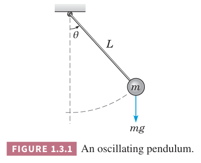

本书的目的是讨论微分方程解的属性和如何高效的求解，为了提供这么一个框架，这里描述几种微分方程的分类方法。

### 常微分方程和偏微分方程
一个重要分类基于未知函数依赖一个变量还是若干个变量。第一种情况，微分方程中只有普通微分，这种称谓常微分方程（`ordinary differential equation`）。第二种情况微分是偏微分，因此方程称为偏微分方程（`partial differential equation`）。

之前两个小节讨论的微分方程都是常微分方程。下面也是一个常微分方程的例子。
$$L\frac{d^2Q(t)}{dt^2}+R\frac{dQ(t)}{dt}+\frac{1}{C}Q(t)=E(t)\tag{1}$$
其中 $Q(t)$ 是环路中的电荷量，$C$ 是电容，$R$ 是电阻，$L$ 是感应系数，3.7 小节会推导这个方程。偏微分方程的典型例子是热传导方程
$$\alpha^2\frac{\partial^2 u(x,t)}{\partial x^2}=\frac{\partial u(x,t)}{\partial t}\tag{2}$$
和波动方程
$$a^2\frac{\partial^2 u(x,t)}{\partial x^2}=\frac{\partial u(x,t)}{\partial t^2}\tag{3}$$
其中 $\alpha,a$ 是物理常量。方程 $(2),(3)$ 中的因变量 $u$ 依赖于两个自变量 $x,t$。热传导方程描述的是热在实心物体内的传导，波动方程描述了波沿固体或液体传播。

### 微分方程系统
另一个微分方程分类方法是根据未知函数的个数。如果只有一个函数需要求解，那么一个微分方程就足够了。不过，如果有两个或多个未知函数，那么需要一个微分方程系统。比如洛特卡——沃尔泰拉方程，描述了种间竞争模型。方程形式是
$$\begin{aligned}
\frac{dx}{dt}=ax-\alpha xy\\
\frac{dy}{dt}=-cy+\gamma xy\tag{4}
\end{aligned}$$
其中 $x(t),y(t)$ 表示猎物和捕食者的数量。正数常量 $a,c,\alpha,\gamma$ 基于观察和研究问题的物种。微分方程系统会在第 7 章和第 9 章讨论，洛特卡——沃尔泰拉方程在 9.5 小节讨论。很多应用领域会遇到成百上千个微分方程。

### 阶
微分方程的阶（`order`）是出现在方程中最高次微分的阶。之前两个小节遇到的微分方程都是一阶微分方程，本节的 $(1)$ 是二阶方程，$(2),(3)$ 是二阶偏微分方程。一般地，方程
$$F(t,u(t),u'(t),\cdots,u^{(n)}(t))=0\tag{5}$$
是 $n$ 阶常微分方程。方程 $(5)$ 描述了自变量 $t$ 和因变量 $u$ 及其前 $n$ 阶导 $u',u'',\cdots,u^{(n)}$ 的关系。也可以用 $y$ 替代 $u(t)$，$y',y'',\cdots,y^{(n)}$ 替代 $u'(t),u''(t),\cdots,u^{(n)}(t)$，那么 $(5)$ 写作
$$F(t,y,y',y'',\cdots,y^{(n)})=0\tag{6}$$
比如
$$y'''+2e^ty''+yy'=t^4\tag{7}$$
是三阶微分方程。有时也使用其他字母替代这里的 $y,t$，主要目的是要让上下文更清晰。

假定我们总是可以求得微分方程最高阶微分
$$y^{(n)}=f(t,y,y',y'',\cdots,y^{(n-1)})\tag{8}$$
这么做的目的主要是避免可能出现歧义，因为形如 $(6)$ 的一个方程可能对应多个形如 $(8)$ 的方程。比如
$$(y')^2+ty'+4y=0\tag{9}$$
对应两个方程
$$y'=\frac{-t+\sqrt{t^2-16}}{2},y'=\frac{-t-\sqrt{t^2-16}}{2}\tag{10}$$

### 线性和非线性方程
微分方程的一个关键分类是线性的还是非线性的。常微分方程
$$F(t,y,y',y'',\cdots,y^{(n)})=0$$
是线性的（`linear`）如果 $F$ 是变量 $y,y',\cdots,y^{(n)}$ 线性函数。偏微分方程的线性定义类似。因此一般线性 $n$ 阶常微分方程是
$$a_0(t)y^{(n)}+a_1(t)y^{(n-1)}+\cdots+a_n(t)y=g(t)\tag{11}$$
之前两个小节分析的微分方程都是线性的，本书大部分所见的方程也都是线性的。本节 $(1)$ 是线性常微分方程，$(2),(3)$ 是线性偏微分方程。不满足形式 $(11)$ 的是非线性（`nonlinear`）方程。$(7)$ 由于包含 $yy'$ 因此是非线性的，$(4)$ 也是非线性的，因为包含未知函数的积 $xy$。

一个非线性微分方程的例子是摆锤。令 $\theta=\theta(t)$ 是长度为 $L$ 的摆锤与垂直方向的夹角，如下图所示。

它满足微分方程
$$\frac{d^2\theta}{dt^2}+\frac{g}{L}\sin\theta=0\tag{12}$$
由于涉及 $\sin\theta$，所以是非线性的。

求解线性方程的理论和方法发展的相当成熟了。相反，对于非线性方程，理论更复杂，求解方法不那么令人满意。从这个角度看，如果很多重要问题引出线性方程或者用线性方程近似，那就相当幸运了。比如上面的例子，当 $\theta$ 很小的时候，$\sin\theta\approx\theta$，那么 $(12)$ 就可以近似为线性方程
$$\frac{d^2\theta}{dt^2}+\frac{g}{L}\theta=0\tag{13}$$
这个过程可以称为线性化（`linearization`）。这个处理非线性方程相当有用的方法。不过很多物理现象不能简单的用线性方程描述，为了研究这些现象，那么不得不处理非线性方程。

这是一个入门级教科书，因此大部分时候讨论的都是线性方程。第八章和第九章，包括第二章的部分，会讨论非线性方程。书中还会指出为什么非线性方程通常更苦难，并且处理线性方程的方法无法应用于非线性方程。

### 解
$n$ 阶常微分方程 $(8)$ 在区间 $\alpha<t<\beta$ 的解（`solution`）是 $\phi',\phi'',\cdots,\phi^{(n)}$ 存在且满足下面方程的函数 $\phi$。
$$\phi^{(n)}(t)=f(t,\phi(t),\phi'(t),\cdot,\phi^{(n-1)})\tag{14}$$
其中 $t$ 满足 $\alpha<t<\beta$。除非另外说明，$(8)$ 中的 $f$ 是实函数，解 $y=\phi(t)$ 也是实函数。

1.2 小节我们得到如下微分函数
$$\frac{dp}{dt}=\frac{p}{2}-450\tag{15}$$
和它的解
$$p(t)=900+ce^{t/2}\tag{16}$$
其中 $c$ 是任意常量。

很多时候并不是那么容易找到一个微分方程的解，不过如果找到了一个解，确定是不是一个解相对比较容易，代入公式计算即可。

比如很容易知道函数 $y_1(t)=\cos t$ 是不是微分方程
$$y''+y=0\tag{17}$$
的解。首先计算一阶导 $y_1'(t)=-\sin t$，二阶导 $y_1''(t)=-\cos t$，那么有 $y_1''(t)+y_1(t)=0$。同样的方式，也可以证明 $y_2(t)=\sin t$ 也是方程 $(17)$ 的解。

由于函数非常多，随机挑选一个恰好是解的概率很低，因此这不是求解微分方程的好方法。不过，这可以验证解是否正确。

### 一些重要问题
对于 $(15),(17)$，我们能够验证某些简单函数是解，但是通常不容易求得这样的解。那么有一个基本问题：$(8)$ 一定有解吗？答案是否定的。那么我们如何判断某个微分方程是有解的呢？这是一个存在性问题，一些定理能够在 $f$ 受某些约束条件下判定 $(8)$ 有解。这并不是一个纯理论问题，原因有二。如果一个方程没有解，那么没有必要投入时间和精力研究。第二点是如果一个合理的物理问题的建模结果是微分方程，那么应该有解，否则公式可能有问题。科学家或工程师可以依赖这一点进行交叉。

如果一个微分方程有解，那么需要考虑有多少个解，且附加哪些条件使得只有一个解。这是唯一性问题。通常微分方程的解包含一个任意常数，因此有无数的解。正如之前看到的，如果指定一个初始值，那么就只有一个解，因为有一个唯一的常数与之对应。与存在性类似，唯一性既有理论意义，也有实际意义。如果我们很幸运找到一个解，并且知道就只有一个解，那么任务就完成了。如果还有其他解，那么就必须继续求解。

第三个问题是对于形式如 $(8)$ 的微分方程，我们是否真的可以找到解，如果能，怎么做？如果我们找到了解，也就回答了第一个存在性问题。如果没有存在性理论知识，我们可以使用计算机找到一个近似的数值解。另一个方面，即使知道存在解，可能无法使用初等函数——多项式、三角函数、指数函数、对数函数、双曲函数——来表示。大部分微分方程都是这种情况。因此，我们讨论一些基本方法精确求解相对简单的微分方程，也讨论复杂问题的近似求解方法。

### 用于微分方程的技术
计算机软件能够辅助我们得到数值解，特别是图像，对于理解微分方程解的性质很有用。要善于利用这些资源帮助学习。
