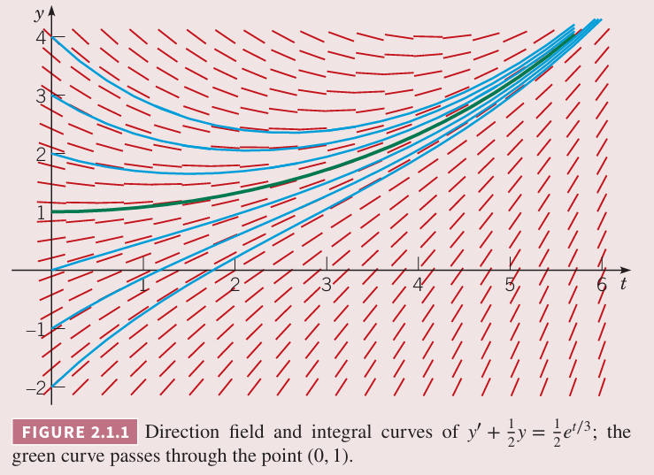
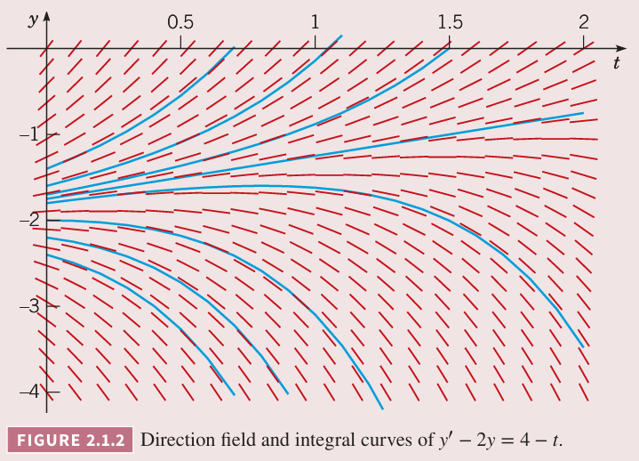
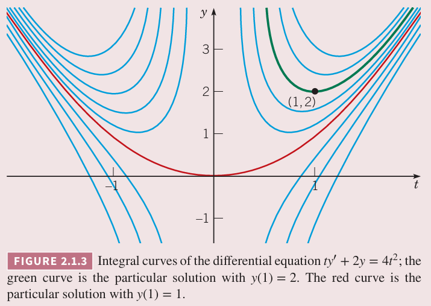
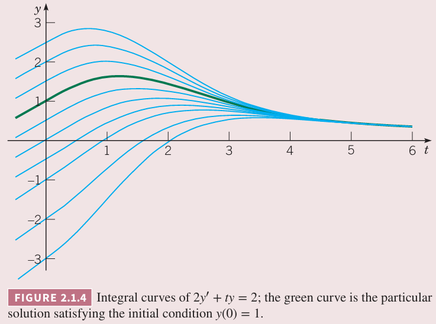

如果[方程](./README.md) $(1)$ 中的 $f$ 仅线性依赖于因变量 $y$，那么 $(1)$ 是一阶线性微分方程。在 1.1 和 1.2 讨论了如下形式的带有限制的一阶线性微分方程。
$$\frac{dy}{dt}=-ay+b\tag{2}$$
其中 $a,b$ 是给定常量。

现在考虑更一般的一阶线性微分方程，将 $(2)$ 中的 $a,b$ 替换为任意 $t$ 的函数。通常一阶线性微分方程标准（`first-order linear differential equation`）形式是
$$\frac{dy}{dt}+p(t)y=q(t)\tag{3}$$
其中 $p,q$ 是给定的 $t$ 的函数。有时也写作下面这种形式
$$P(t)\frac{dy}{dt}+Q(t)y=G(t)\tag{4}$$
其中 $P,Q,G$ 是给定函数。如果 $P(t)\neq 0$，两边同除 $P(t)$ 就可以将 $(4)$ 转化成 $(3)$。

有时，两边同时积分就可以得到一阶线性微分方程的解，比如下面这个例子。

例 1 求解微分方程
$$(4+t^2)\frac{dy}{dt}+2ty=4t\tag{5}$$
解：方程 $(5)$ 的左边是 $dy/dt$ 和 $y$ 的线性组合，这个组合满足微分乘积关系。事实上
$$(4+t^2)\frac{dy}{dt}+2ty=\frac{d}{dt}((4+t^2)y)$$
那么 $(5)$ 就可以写作
$$\frac{d}{dt}((4+t^2)y)=4t\tag{6}$$
因此，两边对 $t$ 积分可以得到
$$(4+t^2)y=2t^2+c\tag{7}$$
其中 $c$ 是任意积分常量。那么解是
$$y=\frac{2t^2}{4+t^2}+\frac{c}{4+t^2}\tag{8}$$

不过大部分的一阶线性微分方程并不能像上个例子这样求解，因为左侧不是 $y$ 与某个函数的乘积的微分。不过，莱布尼茨发现如果微分方程两边同时乘以一个函数 $\mu(t)$，就能变成上面例子的形式。函数 $\mu(t)$ 称为积分因子（`integrating factor`）。本节的主要任务就是对给定方程如何求解积分因子。首先来看一个例子。

例 2 求微分方程
$$\frac{dy}{dt}+\frac{1}{2}y=\frac{1}{2}e^{t/3}\tag{9}$$
的通解。画出一些任意常数 $c$ 对应的解。求解并画出通过点 $(0,1)$ 的解。

解：首先对 $(9)$ 两边同时乘以 $\mu(t)$
$$\mu(t)\frac{dy}{dt}+\frac{1}{2}\mu(t)y=\frac{1}{2}\mu(t)e^{t/3}\tag{10}$$
我们要求的积分因子 $\mu(t)$ 能使得 $(10)$ 的左侧是 $\mu(t)y$ 的微分，即
$$\frac{d}{dt}(\mu(t)y)=\mu(t)\frac{dy}{dt}+\frac{d\mu(t)}{dt}y\tag{11}$$
方程 $(10)$ 的左侧与 $(11)$ 右侧相等，那么 $\mu(t)$ 要满足
$$\frac{d\mu(t)}{dt}=\frac{1}{2}\mu(t)\tag{12}$$
$(12)$ 可以重写作
$$\frac{1}{\mu(t)}\frac{d\mu(t)}{dt}=\frac{1}{2}$$
等价于
$$\frac{d}{dt}\ln|\mu(t)|=\frac{1}{2}\tag{13}$$
那么
$$\ln|\mu(t)|=\frac{1}{2}+C$$
即
$$\mu(t)=ce^{t/2}\tag{14}$$
上面是 $\mu(t)$ 的通解，也是 $(9)$ 的积分因子。由于无需积分因子的一般形式，可以选择 $c=1$，那么 $\mu(t)=e^{t/2}$。

将 $e^{t/2}$ 代入 $(10)$
$$e^{t/2}\frac{dy}{dt}+\frac{1}{2}e^{t/2}y=\frac{1}{2}e^{5t/6}\tag{15}$$
选择的积分因子使得 $(15)$ 的左侧是函数 $e^{t/2}y$ 的微分，那么
$$\frac{d}{dt}(e^{t/2}y)=\frac{1}{2}e^{5t/6}\tag{16}$$
两边同时积分得到
$$e^{t/2}y=\frac{3}{5}e^{5t/6}+c\tag{17}$$
其中 $c$ 是任意常量。最后，将 $(17)$ 表达为 $y$ 的函数，那么 $(9)$ 的通解就是
$$y=\frac{3}{5}e^{t/3}+ce^{-t/2}\tag{18}$$
为了求通过 $(0,1)$ 的解，令 $t=0,y=1$，得到 $1=3/5+c$，因此 $c=2/5$，那么通过该点的解是
$$y=\frac{3}{5}e^{t/3}+\frac{2}{5}e^{-t/2}\tag{19}$$
下图是方程 $(18)$ 的一些 $c$ 对应的解，背景是方向场。满足 $y(0)=1$ 的解是绿色曲线。

现在扩展积分因子法到形式如下的方程
$$\frac{dy}{dt}+ay=g(t)\tag{20}$$
其中 $a$ 是常量，$g(t)$ 是给定函数。根据例 2 积分因子 $\mu(t)$ 要满足
$$\frac{d\mu}{dt}=a\mu\tag{21}$$
那么积分因子是 $\mu(t)=e^{at}$，$(20)$ 两边同乘 $\mu(t)$ 得到
$$e^{at}\frac{dy}{dt}+ae^{at}y=e^{at}g(t)$$
因此
$$\frac{d}{dt}(e^{at}y)=e^{at}g(t)\tag{22}$$
两边同时积分得到
$$e^{at}y=\int e^{at}g(t)dt+c\tag{23}$$
其中 $c$ 是任意常量。对于简单的函数 $g(t)$，可以求解出积分，使用初等函数表示 $y$。不过对于很多复杂的函数 $g(t)$，可能必须要用积分形式表达。这样
$$y=e^{-at}\int_{t_0}^t e^{as}g(s)ds+ce^{-at}\tag{24}$$
积分下限选择 $t_0$ 会改变常量 $c$ 的值，但不会改变解。将 $t=t_0$ 代入 $(24)$ 得到 $c=y(t_0)e^{at_0}$。

例 3 求微分方程
$$\frac{dy}{dt}-2y=4-t\tag{25}$$
的通解，并画出若干个解，分析讨论 $t\to\infty$ 时的行为。

解：令 $a=-2$ 那么 $(25)$ 就是 $(20)$，因此积分因子是 $\mu(t)=e^{-2t}$，$(25)$ 两边同时乘以积分因子得到
$$e^{-2t}\frac{dy}{dt}-2e^{-2t}y=4e^{-2t}-te^{-2t}$$
那么
$$\frac{d}{dt}(e^{-2t}y)=4e^{-2t}-te^{-2t}\tag{26}$$
两边同时积分得到
$$e^{-2t}y=-2e^{-2t}+\frac{1}{2}te^{-2t}+\frac{1}{4}e^{-2t}+c$$
对 $(26)$ 的最后一项使用了分部积分法。因此 $(25)$ 的通解是
$$y=-\frac{7}{4}+\frac{1}{2}t+ce^{2t}\tag{27}$$
下图是 $(27)$ 中若干个 $c$ 对应的解。当 $t$ 很大时，解的决定项是 $ce^{2t}$。如果 $c\neq 0$，解的绝对值指数级增加，符号与 $c$ 相同。也就是说随着 $t$ 的增加解是分散的。增长到正无穷和负无穷的分界线是 $c=0$。将 $c=0$ 代入 $(27)$，解是 $y=-\frac{7}{4}+\frac{1}{2}t$，线性增长。

现在回到更一般的一阶线性微分方程 $(3)$
$$\frac{dy}{dt}+p(t)y=g(t)$$
其中 $p,g$ 是给定函数。为了确定积分因子，两边同乘 $\mu(t)$ 得到
$$\mu(t)\frac{dy}{dt}+p(t)\mu(t)y=\mu(t)g(t)\tag{28}$$
方程 $(28)$ 的左边是 $\mu(t)y$ 的微分，那么 $\mu(t)$ 必须满足
$$\frac{d\mu(t)}{dt}=p(t)\mu(t)\tag{29}$$
如果临时假定 $\mu(t)$ 是正的，那么
$$\frac{1}{\mu(t)}\frac{d\mu(t)}{dt}=p(t)$$
因此
$$\ln|\mu(t)|=\int p(t)dt+k$$
这里选择任意常量 $k$ 为零，这样使得 $\mu(t)$ 尽可能简单
$$\mu(t)=\exp\int p(t)dt\tag{30}$$
注意，这里 $\mu(t)$ 是正的，和之前的假设一致。回到方程 $(28)$，有
$$\frac{d}{dt}(\mu(t)y)=\mu(t)g(t)\tag{31}$$
因此
$$\mu(t)y=\int \mu(t)g(t)dt+c\tag{32}$$
其中 $c$ 是任意常量。有时 $(32)$ 的积分可以用初等函数表示。不过更一般的情况是不得不使用积分形式
$$y=\frac{1}{\mu(t)}\bigg(\int_{t_0}^t \mu(s)g(s)ds+c\bigg)\tag{33}$$
这里 $t_0$ 是某个使得积分简便的下限值。上面的方程涉及两个积分，一个是 $(30)$ 计算 $\mu(t)$，第二个就是 $(33)$ 中确定 $y$ 的积分。

例 4 求初值问题
$$ty'+2y=4t^2\tag{34}$$
$$y(1)=2$$
解：为了确定 $p(t),g(t)$，首先将 $(34)$ 写作 $(3)$ 的形式。
$$y'+\frac{2}{t}y=4t\tag{36}$$
所以 $p(t)=2/t,g(t)=4t$。为了求解 $(36)$，首先计算积分因子 $\mu(t)$
$$\mu(t)=\exp\bigg(\int\frac{2}{t}dt\bigg)=e^{2\ln|t|}=t^2$$
$(36)$ 两边同乘 $\mu(t)$ 得到
$$t^2y'+2ty=(t^2y)'=4t^3$$
因此
$$t^2y=\int 4t^3dt=t^4+c$$
其中 $c$ 是任意常量。对于 $t>0$ 有
$$y=t^2+\frac{c}{t^2}\tag{37}$$
这就是方程 $(34)$ 的通解。

为了满足初值条件 $(36)$，将 $t=1,y=2$ 代入 $(37)$ 得到 $2=1+c$，那么 $c=1$，因此
$$y=t^2+\frac{1}{t^2},t>0\tag{38}$$
是初值问题 $(34),(35)$ 的解。这个解如下图绿色曲线所示。

当 $t\to 0$ 时，$y$ 的正半轴是边界和渐近线。这是因为 $p(t)$ 在原点处无穷间断。

这里还需要注意到 $y=t^2+1/t^2,t<0$ 是方程 $(34)$ 的通解，但不是初值问题的解。

对于 $c<0$，当 $t\to 0$ 时，曲线的渐近线是 $y$ 的负半轴。

泛化初始条件 $(35)$ 为
$$y(1)=y_0\tag{39}$$
那么 $c=y_0-1$，因此解 $(38)$ 变为
$$y=t^2+\frac{y_0-1}{t^2},t>0\tag{40}$$
当 $y_0=0$ 时，$c=0$，那么 $y=t^2$，这个解也是分界线，且在 $t=0$ 处也可导。

例 5 求初值问题
$$2y'+ty=2\tag{41}$$
$$y(0)=1\tag{42}$$
解：对 $(41)$ 两边同除 2 变成 $(3)$ 的形式
$$y'+\frac{t}{2}y=1\tag{43}$$
那么 $p(t)=t/2$，因此积分因子 $\mu(t)=\exp(t^2/4)$，那么 $(43)$ 两边同乘 $\mu(t)$ 得到
$$e^{t^2/4}y'+\frac{t}{2}e^{t^2/4}y=e^{t^2/4}\tag{44}$$
左边是 $e^{t^2/4}y$ 的导数，两边同时积分得到
$$e^{t^2/4}y=\int e^{t^2/4}dt+c\tag{45}$$
$(45)$ 的右边无法无法使用初等函数表示，因此保留积分形式。积分下限选择零，那么
$$e^{t^2/4}y=\int_0^t e^{s^2/4}ds+c\tag{46}$$
其中 $c$ 是任意常量。那么方程 $(41)$ 的通解是
$$y=e^{-t^2/4}\int_0^t e^{s^2/4}ds+ce^{-t^2/4}\tag{47}$$
为了满足初始条件 $(42)$，令 $t=0,y=1$ 得到
$$1=e^0\int_0^0 e^{-s^2/4}ds+ce^0=0+c$$
因此 $c=1$。

这个例子中不得不使用积分形式来表示解。不过可以使用软件来数值求解积分。或者使用第八章的数值法直接求解微分方程。

下图是若干个 $c$ 对应的解 $(47)$ 的图像。其中满足 $y(0)=1$ 解使用粗体表示。当 $t\to\infty$，从图中可以得到一个猜想，所有解都趋于某一个极限。

