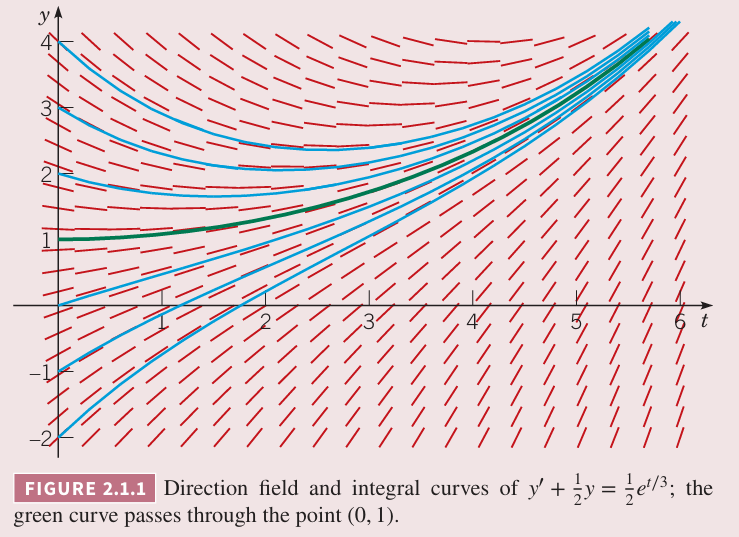

如果[方程](./README.md) $(1)$ 中的 $f$ 仅线性依赖于因变量 $y$，那么 $(1)$ 是一阶线性微分方程。在 1.1 和 1.2 讨论了如下形式的带有限制的一阶线性微分方程。
$$\frac{dy}{dt}=-ay+b\tag{2}$$
其中 $a,b$ 是给定常量。

现在考虑更一般的一阶线性微分方程，将 $(2)$ 中的 $a,b$ 替换为任意 $t$ 的函数。通常一阶线性微分方程标准（`first-order linear differential equation`）形式是
$$\frac{dy}{dt}+p(t)y=q(t)\tag{3}$$
其中 $p,q$ 是给定的 $t$ 的函数。有时也写作下面这种形式
$$P(t)\frac{dy}{dt}+Q(t)y=G(t)\tag{4}$$
其中 $P,Q,G$ 是给定函数。如果 $P(t)\neq 0$，两边同除 $P(t)$ 就可以将 $(4)$ 转化成 $(3)$。

有时，两边同时积分就可以得到一阶线性微分方程的解，比如下面这个例子。

例 1 求解微分方程
$$(4+t^2)\frac{dy}{dt}+2ty=4t\tag{5}$$
解：方程 $(5)$ 的左边是 $dy/dt$ 和 $y$ 的线性组合，这个组合满足微分乘积关系。事实上
$$(4+t^2)\frac{dy}{dt}+2ty=\frac{d}{dt}((4+t^2)y)$$
那么 $(5)$ 就可以写作
$$\frac{d}{dt}((4+t^2)y)=4t\tag{6}$$
因此，两边对 $t$ 积分可以得到
$$(4+t^2)y=2t^2+c\tag{7}$$
其中 $c$ 是任意积分常量。那么解是
$$y=\frac{2t^2}{4+t^2}+\frac{c}{4+t^2}\tag{8}$$

不过大部分的一阶线性微分方程并不能像上个例子这样求解，因为左侧不是 $y$ 与某个函数的乘积的微分。不过，莱布尼茨发现如果微分方程两边同时乘以一个函数 $\mu(t)$，就能变成上面例子的形式。函数 $\mu(t)$ 称为积分因子（`integrating factor`）。本节的主要任务就是对给定方程如何求解积分因子。首先来看一个例子。

例 2 求微分方程
$$\frac{dy}{dt}+\frac{1}{2}y=\frac{1}{2}e^{t/3}\tag{9}$$
的通解。画出一些任意常数 $c$ 对应的解。求解并画出通过点 $(0,1)$ 的解。

解：首先对 $(9)$ 两边同时乘以 $\mu(t)$
$$\mu(t)\frac{dy}{dt}+\frac{1}{2}\mu(t)y=\frac{1}{2}\mu(t)e^{t/3}\tag{10}$$
我们要求的积分因子 $\mu(t)$ 能使得 $(10)$ 的左侧是 $\mu(t)y$ 的微分，即
$$\frac{d}{dt}(\mu(t)y)=\mu(t)\frac{dy}{dt}+\frac{d\mu(t)}{dt}y\tag{11}$$
方程 $(10)$ 的左侧与 $(11)$ 右侧相等，那么 $\mu(t)$ 要满足
$$\frac{d\mu(t)}{dt}=\frac{1}{2}\mu(t)\tag{12}$$
$(12)$ 可以重写作
$$\frac{1}{\mu(t)}\frac{d\mu(t)}{dt}=\frac{1}{2}$$
等价于
$$\frac{d}{dt}\ln|\mu(t)|=\frac{1}{2}\tag{13}$$
那么
$$\ln|\mu(t)|=\frac{1}{2}+C$$
即
$$\mu(t)=ce^{t/2}\tag{14}$$
上面是 $\mu(t)$ 的通解，也是 $(9)$ 的积分因子。由于无需积分因子的一般形式，可以选择 $c=1$，那么 $\mu(t)=e^{t/2}$。

将 $e^{t/2}$ 代入 $(10)$
$$e^{t/2}\frac{dy}{dt}+\frac{1}{2}e^{t/2}y=\frac{1}{2}e^{5t/6}\tag{15}$$
选择的积分因子使得 $(15)$ 的左侧是函数 $e^{t/2}y$ 的微分，那么
$$\frac{d}{dt}(e^{t/2}y)=\frac{1}{2}e^{5t/6}\tag{16}$$
两边同时积分得到
$$e^{t/2}y=\frac{3}{5}e^{5t/6}+c\tag{17}$$
其中 $c$ 是任意常量。最后，将 $(17)$ 表达为 $y$ 的函数，那么 $(9)$ 的通解就是
$$y=\frac{3}{5}e^{t/3}+ce^{-t/2}\tag{18}$$
为了求通过 $(0,1)$ 的解，令 $t=0,y=1$，得到 $1=3/5+c$，因此 $c=2/5$，那么通过该点的解是
$$y=\frac{3}{5}e^{t/3}+\frac{2}{5}e^{-t/2}\tag{19}$$
下图是方程 $(18)$ 的一些 $c$ 对应的解，背景是方向场。满足 $y(0)=1$ 的解是绿色曲线。

