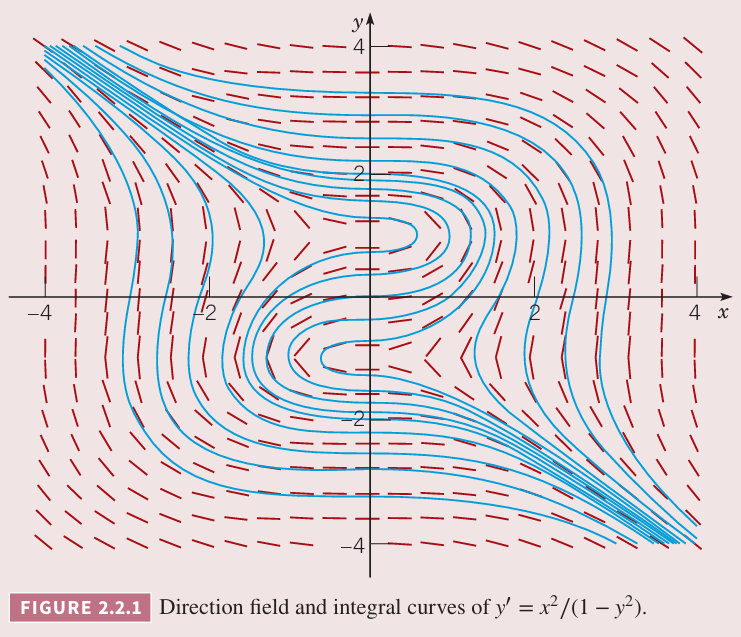
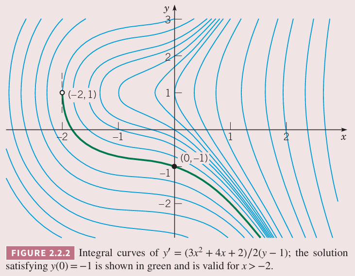
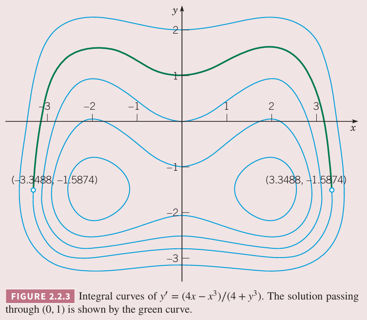

在 1.2 小节，我们分析了一阶线性微分方程
$$\frac{dy}{dt}=ay+b\tag{1}$$
其中 $a,b$ 是常量。这个方法适合解决更大的一类非线性微分方程。

一般地一阶微分方程是
$$\frac{dy}{dx}=f(x,y)\tag{2}$$
如果 $(2)$ 是非线性方程的话，一般而言没有通用的方式解决，不过下面考虑可以直接积分计算的一个子类。

为了识别这类方程，首先将 $(2)$ 改写为下面的形式。
$$M(x,y)+N(x,y)\frac{dy}{dx}=0\tag{3}$$
如果 $M$ 仅仅是 $x$ 的函数，$N$ 仅仅是 $y$ 的函数，那么 $(3)$ 变成
$$M(x)+N(y)\frac{dy}{dx}=0\tag{4}$$
这样的方程称为可分离的（`separable`），因为如果写成微分形式是
$$M(x)dx+N(y)dy=0\tag{5}$$
方程 $(5)$ 是对称的，甚至无法区分哪一个是自变量哪一个是因变量。

可分离变量的方程可以通过分别对 $M,N$ 积分求解。首先看一个具体的例子。

例 1 证明
$$\frac{dy}{dx}=\frac{x^2}{1-y^2}\tag{6}$$
是可分离的，并求解。

解：将方程 $(6)$ 写作
$$-x^2+(1-y^2)\frac{dy}{dx}=0\tag{7}$$
就是方程 $(4)$ 的形式。如果 $y$ 是 $x$ 的函数，根据链式法则
$$\frac{d}{dx}f(y)=\frac{d}{dy}f(y)\frac{dy}{dx}=f'(y)\frac{dy}{dx}$$
比如如果 $f(y)=y-\frac{y^3}{3}$，那么
$$\frac{d}{dx}\bigg(y-\frac{y^3}{3}\bigg)=(1-y^2)\frac{dy}{dx}$$
因此 $(7)$ 中的第二项就是 $y-y^3/3$ 相对于 $x$ 的导数，第一项是 $-x^3/3$ 的导数，那么
$$\frac{d}{dx}\bigg(-\frac{x^3}{3}\bigg)+\frac{d}{dx}\bigg(y-\frac{y^3}{3}\bigg)=0$$
进而
$$\frac{d}{dx}\bigg(-\frac{x^3}{3}+y-\frac{y^3}{3}\bigg)=0$$
两边积分并同时乘以 3 得到
$$-x^3+3y-y^3=c\tag{8}$$
其中 $c$ 是任意常量。

方程 $(8)$ 是方程 $(6)$ 的积分曲线。方向场和若干积分曲线如下图所示。

本质上讲，同样的方法适用于任意可分离变量方程。回到方程 $(4)$，令 $H_1,H_2$ 是 $M,N$ 的反导数，因此
$$H_1'(x)=M(x),H_2'(y)=N(y)\tag{9}$$
方程 $(4)$ 变成了
$$H_1'(x)+H_2'(y)\frac{dy}{dx}=0\tag{10}$$
如果将 $y$ 是 $x$ 的函数，根据链式法则
$$H_2'(y)\frac{dy}{dx}=\frac{d}{dy}H_2(y)\frac{dy}{dx}=\frac{d}{dx}H_2(y)\tag{11}$$
因此方程 $(10)$ 可以写作
$$\frac{d}{dx}(H_1(x)+H_2(y))=0\tag{12}$$
两边同时对 $x$ 积分得到
$$H_1(x)+H_2(y)=c\tag{13}$$
其中 $c$ 是任意常量。通常 $(13)$ 是由 $(5)$ 直接得到的。

微分方程 $(4)$ 与初始条件
$$y(x_0)=y_0\tag{14}$$
得到初值问题。为了计算这个初值问题，将 $x=x_0,y=y_0$ 代入 $(13)$ 得到 $c$ 值
$$c=H_1(x_0)+H_2(y_0)\tag{15}$$
由于
$$H_1(x)-H_1(x_0)=\int_{x_0}^xM(s)ds,H_2(y)-H_2(y_0)=\int_{y_0}^yN(s)ds$$
结合 $c$ 值代入 $(13)$ 得到
$$\int_{x_0}^xM(s)ds+\int_{y_0}^yN(s)ds=0\tag{16}$$
方程 $(16)$ 是微分方程 $(4)$ 的解的隐式方程，同时满足初始条件 $(14)$。为了得到显式公式，需要求解 $(16)$。不过很多时候没有解析解，此时需要使用数值方法。

例 2 求初值问题
$$\frac{dy}{dx}=\frac{3x^2+4x+2}{2(y-1)},y(0)=-1,\tag{17}$$
并确定解存在的区间。

解：微分方程可以写作
$$2(y-1)dy=(3x^2+4x+2)dx$$
两边同时积分得到
$$y^2-2y=x^3+2x^2+2x+c\tag{18}$$
其中 $c$ 是常量。将 $x=0,y=-1$ 代入得到 $c=3$，那么初值问题的解的隐式方程是
$$y^2-2y=x^3+2x^2+2x+3\tag{19}$$
将 $x$ 看作常量，这是 $y$ 的二元一次方程，那么可以得到
$$y=1\pm\sqrt{x^3+2x^2+2x+3}\tag{20}$$
这是两个解，其中
$$y=1-\sqrt{x^3+2x^2+2x+3}\tag{21}$$
满足题意，是初值问题 $(15)$ 的解。如果选择了错误的解，那么 $y(0)=3$。为了让 $(21)$ 有意义，需要确定 $x$ 的范围，使得平方根为零的 $x$ 是 $-2$，因此定义域是 $x>-2$。下图展示了一些解。绿色的解通过点 $(0,-1)$ 是 $(17)$ 的解。$(21)$ 的有效范围的边界是过点 $(-2,1)$ 的垂直于 $x$ 的垂线。

例 3 求可分离变量微分方程
$$\frac{dy}{dx}=\frac{4x-x^3}{4+y^3}\tag{22}$$
的解，并求解通过点 $(0,1)$ 的解及其有效定义域。

解：$(22)$ 可以改写成
$$(4+y^3)dy=(4x-x^3)dx$$
两边同时积分，再乘以 4 得到
$$16y+y^3+x^4-8x^2=c\tag{23}$$
其中 $c$ 是任意常量。下图是一些解。

将 $x=0,y=1$ 代入 $(23)$ 得到 $c=17$，因此
$$16y+y^3+x^4-8x^2=17\tag{24}$$
上图中绿色曲线所示。从 $(22)$ 分母为零可以得到 $y$ 的边界点是 $y=(-4)^{1/3}$，将这个值代入 $(24)$ 可以得到 $x$ 的边界约等于 $\pm 3.3488$，边界点在上图中有标出。

有时形式为 $(2)$ 的微分方程
$$\frac{dy}{dx}=f(x,y)$$
有常量解 $y=y_0$。这样的解相对容易求解，只需要解处对所有 $x$ 都满足 $f(x,y_0)=0$ 的 $y_0$ 即可。比如微分方程
$$\frac{dy}{dx}=\frac{(y-3)\cos x}{1+2y^2}\tag{25}$$
的常量解是 $y=3$，其他解可以通过分离变量法求解。

有时一阶非线性微分方程中 $x,y$ 可以视为 $t$ 的函数，那么
$$\frac{dy}{dx}=\frac{dy/dt}{dx/dt}\tag{26}$$
如果微分方程是
$$\frac{dy}{dx}=\frac{F(x,y)}{G(x,y)}\tag{27}$$
比较上面两个方程可得
$$\frac{dx}{dt}=G(x,y),\frac{dy}{dt}=F(x,y)\tag{28}$$
一个方程变成了两个方程，乍一看问题没有简化，实则不然，有时 $(28)$ 比 $(27)$ 更容易求解。第九章会讨论非线性系统。

例 2 可以得到显式解，这很不常见，例 1 和例 3 这样最好写成隐式解才是大部分情况。
