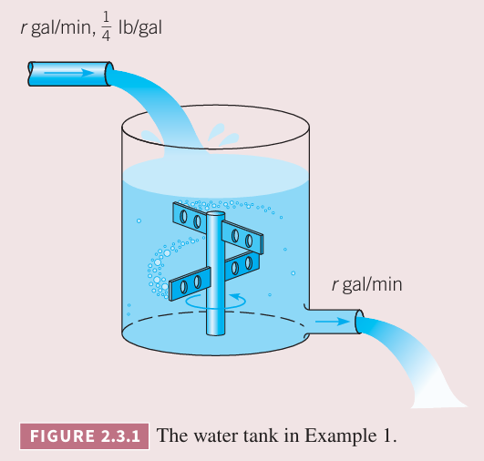
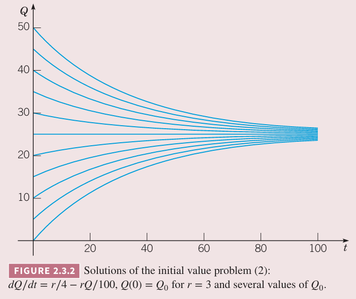
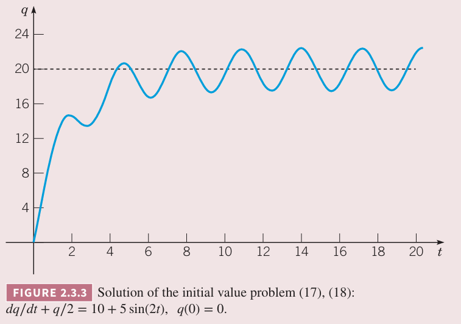
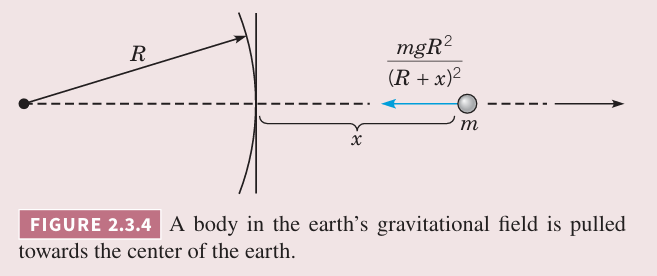

例 1 混合

在 $t=0$ 时刻，罐子中 100 加仑水中含有 $Q_0$ 磅盐。如下图所示。假定加水的速度是 $r$ 加仑每分钟，每加仑中含有 $\frac{1}{4}$ 磅的盐。罐子中有搅拌器将盐搅拌均匀，然后水流出的速度和加水速度一致。建立一个初值问题来描述这个过程。求任意时刻盐的重量的函数 $Q(t)$，并求时间相当长时极限值 $Q_L$。如果 $r=3,Q_0=2Q_L$，求多久盐含量与 $Q_L$ 差在 2% 以内。如果要使得 $T$ 不超过 45 分钟，那么 $r$ 应该是多少？

解：$dQ/dt$ 表示盐量的变化率，等于每分钟流入的盐量减去每分钟流出的盐量。
$$\frac{dQ}{dt}=\text{rate in}-\text{rate out}$$
每分钟流入 $r$ 加仑，每加仑含盐量是 1/4 磅，那么流入速率是每分钟 $\frac{r}{4}$ 磅。水流出速度是每分钟 $r$ 加仑，水量是 100 加仑，含盐量是 $Q$ 磅，因此流出速率是每分钟 $rQ/100$。因此
$$\frac{dQ}{dt}=\frac{r}{4}-\frac{rQ}{100}\tag{2}$$
初值条件是
$$Q(0)=Q_0\tag{3}$$
从物理角度考虑这个问题，随着时间的流逝，每加仑盐含量最终应该趋于加入水的盐含量，即每加仑 1/4 磅，因此总盐量是 25 磅。因此，当 $dQ/dt$ 为零的时候，$(2)$ 给出的 $Q_L$ 应该是 25 磅。

为了解决初值问题 $(2),(3)$，先计算通解。注意到 $(2)$ 是线性方程，因此将其写作标准形式
$$\frac{dQ}{dt}+\frac{rQ}{100}=\frac{r}{4}\tag{4}$$
积分因子是 $e^{rt/100}$，通解是
$$Q(t)=25+ce^{-rt/100}\tag{5}$$
其中 $c$ 是任意常量。为了满足初值条件 $(3)$，可以解得 $c=Q_0-25$，因此
$$Q(t)=25+(Q_0-25)e^{-rt/100}\tag{6}$$
或
$$Q(t)=25(1-e^{-rt/100})+Q_0e^{-rt/100}\tag{7}$$
不管是哪种形式，当时 $t\to\infty$ 时，都有 $Q\to 25$，因此 $Q_L=25$，与之前的分析一致。

方程 $(7)$ 的第一项是随着加入的水进入的盐量，第二项是罐子中原来的盐随着时间的流逝剩下的盐量。下图是 $r=3$ 时不同 $Q_0$ 对应的解。

例 2 复利

假定初始时钱数是 $S_0$，假定年利率是 $r$，$S(t)$ 是任意时刻的余额，这里依赖于 $r$ 的计算周期，即付息周期。这里假定复利计算是连续的。设定一个初值问题来描述投资增长。

资产总数的变化率是 $dS/dt$，这个值等于那个时刻的利息，即利率 $r$ 乘以当时的资产总数 $S(t)$，那么
$$\frac{dS}{dt}=rS\tag{11}$$
初值是
$$S(0)=S_0\tag{12}$$
微分方程 $(11)$ 是线性且是可分离的，很容易解，结合 $(12)$，解是
$$S(t)=S_0e^{rt}\tag{13}$$
即资产在指数增长。

假定每个周期存款或取款常量 $k$，那么方程 $(11)$ 变成了
$$\frac{dS}{dt}=rS+k$$
或者标准形式
$$\frac{dS}{dt}-rS=k\tag{14}$$
其中 $k$ 是正数表示存钱，负数表示取钱。

$(14)$ 是线性方程，积分因子是 $e^{-rt}$，通解是
$$S(t)=ce^{rt}-\frac{k}{r}$$
其中 $c$ 是常量。为了满足初值条件 $(12)$，$c=S_0+\frac{k}{r}$。所以初值问题 $(14),(12)$ 的解是
$$S(t)=S_0e^{rt}+\frac{k}{r}(e^{rt}-1)\tag{15}$$
上式第一项是初始资金 $S_0$ 的回报，第二项是存款或取款的回报。

这里并没有限制 $S_0,r,k$，使之通用，那么结果可以应用于各种场景。不过这里假定复利计算是连续的，实际上并不是的。这里还假定 $r$ 是固定的，实际可能随时间变化而变化，那么结果就更复杂。

现在我们将上述分析与按年付息的情况做对比。假定年化率是 $r$，那么 $t$ 年之后总额是
$$S=S_0(1+r)^t$$
如果半年付息，那么 $t$ 年后总额是
$$S=S_0(1+\frac{r}{2})^{2t}$$
如果每年付息 $m$ 次，那么
$$S=S_0(1+\frac{r}{m})^{mt}\tag{17}$$
当 $m$ 趋于无穷时，结合 $(13),(17)$ 可以得到微积分中一个经典公式
$$\lim_{m\to\infty}S_0(1+\frac{r}{m})^{mt}=S_0e^{rt}$$
下表是 $r=0.08$ 时，不同付息周期的总额，季度付息与连续付息差距很小。

| years | $m=4, (17)$ | $m=365, (17)$ | $(13)$ |
|--|--|--|--|
| 1 | 1.0824 | 1.0833 | 1.0833 |
| 2 | 1.1717 | 1.1735 | 1.1735 |
| 5 | 1.4859 | 1.4918 | 1.4918 |
| 10 | 2.2080 | 2.2253 | 2.2255 |
| 20 | 4.8754 | 4.9522 | 4.9530 |
| 30 | 10.7652 | 11.0203 | 11.0232 |
| 40 | 23.7699 | 24.5239 | 24.5325 |

例 3 假定一个池塘有一千万加仑水。每年有五百万加仑包含化学物质的水流入，充分搅拌均匀后流出相同水量。流入的带有化学物质的每加仑水含有化学物质有 $\gamma(t)=2+\sin 2t$ 克。对这个问题建模表示出任意时刻化学物质的量。画出解，并描述流入含有化学物质的水对浓度的影响。

解：用 $Q(t)$ 表示化学物质的量，单位是克。任意时刻流入的量是
$$(5\times 10^6)(2+\sin 2t)\tag{18}$$
任意时刻流出的量是
$$(5\times 10^6)\frac{Q(t)}{10^7}=\frac{Q(t)}{2}\tag{19}$$
那么
$$\frac{dQ}{dt}=(5\times 10^6)(2+\sin 2t)-\frac{Q(t)}{2}\tag{20}$$
为了简化表示，令 $q(t)=Q(t)/10^6$，也就是用百万克作为单位。那么方程简化为
$$\frac{dq}{dt}+\frac{q}{2}=10+5\sin 2t\tag{21}$$
初始时池塘没有化学物质，即
$$q(0)=0\tag{22}$$
$(21)$ 是线性的，尽管右侧有非线性函数，但是 $q$ 的系数是常量。积分因子是 $e^{t/2}$，两边同乘然后积分，得到通解
$$q(t)=20-\frac{40}{17}\cos 2t+\frac{10}{17}\sin 2t+ce^{-t/2}\tag{23}$$
为了满足初始条件 $(22)$ 要求 $c=-300/17$，那么 $(17),(18)$ 这个初值问题的解是
$$q(t)=20-\frac{40}{17}\cos 2t+\frac{10}{17}\sin 2t-\frac{300}{17}e^{-t/2}\tag{24}$$
解如下所示。当 $t$ 很小时指数项很重要，但是当 $t$ 很大时，指数项快速衰减。之后，由于 $\sin 2t,\cos 2t$ 的存在，解在以 $q=20$ 震荡。如果 $(21)$ 没有 $\sin 2t$ 项，那么 $q=20$ 是平衡解。

例 4 重 $m$ 的物体垂直向太空发射，初始速度为 $v_0$。假定忽略空气阻力，但是要考虑重力加速度随着距离地心的变化而变化，求发射后运动的速度。并且求出初始速度下距离地面的最大高度 $A_{\max}$，以及初始速度多大时物体永远不会回到地球，这个初始速度称为逃逸速度（`escape velocity`）。

解：如上图所示，运动沿着 $x$ 轴。重力公式是 $w(x)=-k/(x+R)^2$，结合在海平面 $w(0)=-mg$，得到 $k=mgR^2$，那么
$$w(x)=-\frac{mgR^2}{(R+x)^2}\tag{25}$$
物体仅受重力，那么
$$m\frac{dv}{dt}=-\frac{mgR^2}{(R+x)^2}\tag{26}$$
初始条件是
$$v(0)=v_0\tag{27}$$
$(26)$ 的变量有 $t,x,v$，我们将 $x$ 而不是 $t$ 看做自变量来消除 $t$。根据链式法则有
$$\frac{dv}{dt}=\frac{dv}{dx}\frac{dx}{dt}=v\frac{dv}{dx}$$
代入 $(26)$ 得到
$$v\frac{dv}{dx}=-\frac{gR^2}{(R+x)^2}\tag{28}$$
上式不是线性微分方程，但是是可分离变量的微分方程。分离变量后两边积分得到
$$\frac{v^2}{2}=\frac{gR^2}{R+x}+c\tag{29}$$
当 $t=0$ 时 $x=0$，初始条件变成了 $x=0$ 时 $v=v_0$，为了满足初始条件 $(27)$ 有 $c=(v_0^2/2)-gR$，那么
$$v=\pm\sqrt{v_0^2-2gR+\frac{2gR^2}{R+x}}\tag{30}$$
上面建立了速度与高度的关系。负号表示运动的方向，正号表示物体上升，负号表示物体下降。

为了确定最大高度 $A_{\max}$，将 $v=0,x=A_{\max}$ 代入 $(30)$ 得到
$$A_{\max}=\frac{v_0^2R}{2gR-v_0^2}\tag{31}$$
从上式可以表示需要达到最大告诉需要的初速度，即
$$v_0=\sqrt{2gR\frac{A_{\max}}{R+A_{\max}}}\tag{32}$$
令 $A_{\max}\to\infty$ 得到逃逸速度
$$v_e=\sqrt{2gR}$$
逃逸速度约为 11.1 千米每秒。
