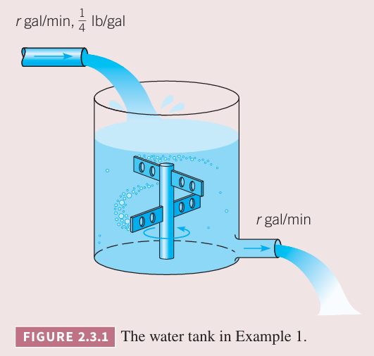
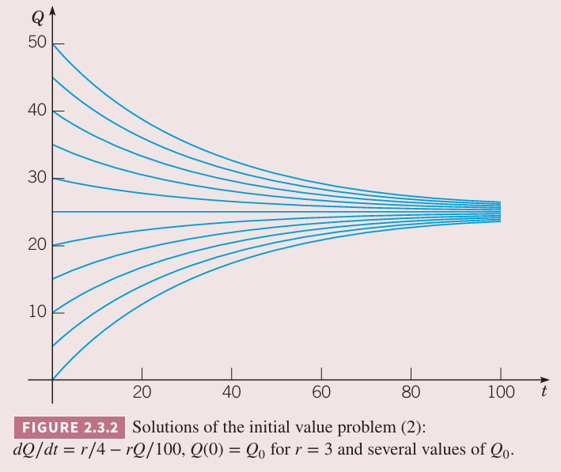

例 1 混合

在 $t=0$ 时刻，罐子中 100 加仑水中含有 $Q_0$ 磅盐。如下图所示。假定加水的速度是 $r$ 加仑每分钟，每加仑中含有 $\frac{1}{4}$ 磅的盐。罐子中有搅拌器将盐搅拌均匀，然后水流出的速度和加水速度一致。建立一个初值问题来描述这个过程。求任意时刻盐的重量的函数 $Q(t)$，并求时间相当长时极限值 $Q_L$。如果 $r=3,Q_0=2Q_L$，求多久盐含量与 $Q_L$ 差在 2% 以内。如果要使得 $T$ 不超过 45 分钟，那么 $r$ 应该是多少？

解：$dQ/dt$ 表示盐量的变化率，等于每分钟流入的盐量减去每分钟流出的盐量。
$$\frac{dQ}{dt}=\text{rate in}-\text{rate out}$$
每分钟流入 $r$ 加仑，每加仑含盐量是 1/4 磅，那么流入速率是每分钟 $\frac{r}{4}$ 磅。水流出速度是每分钟 $r$ 加仑，水量是 100 加仑，含盐量是 $Q$ 磅，因此流出速率是每分钟 $rQ/100$。因此
$$\frac{dQ}{dt}=\frac{r}{4}-\frac{rQ}{100}\tag{2}$$
初值条件是
$$Q(0)=Q_0\tag{3}$$
从物理角度考虑这个问题，随着时间的流逝，每加仑盐含量最终应该趋于加入水的盐含量，即每加仑 1/4 磅，因此总盐量是 25 磅。因此，当 $dQ/dt$ 为零的时候，$(2)$ 给出的 $Q_L$ 应该是 25 磅。

为了解决初值问题 $(2),(3)$，先计算通解。注意到 $(2)$ 是线性方程，因此将其写作标准形式
$$\frac{dQ}{dt}+\frac{rQ}{100}=\frac{r}{4}\tag{4}$$
积分因子是 $e^{rt/100}$，通解是
$$Q(t)=25+ce^{-rt/100}\tag{5}$$
其中 $c$ 是任意常量。为了满足初值条件 $(3)$，可以解得 $c=Q_0-25$，因此
$$Q(t)=25+(Q_0-25)e^{-rt/100}\tag{6}$$
或
$$Q(t)=25(1-e^{-rt/100})+Q_0e^{-rt/100}\tag{7}$$
不管是哪种形式，当时 $t\to\infty$ 时，都有 $Q\to 25$，因此 $Q_L=25$，与之前的分析一致。

方程 $(7)$ 的第一项是随着加入的水进入的盐量，第二项是罐子中原来的盐随着时间的流逝剩下的盐量。下图是 $r=3$ 时不同 $Q_0$ 对应的解。

