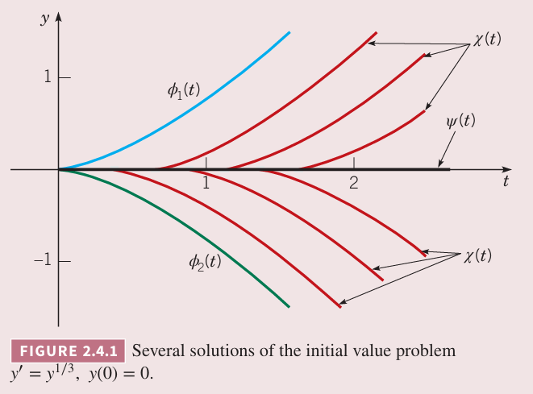

### 解的存在性和唯一性
目前讨论的初值问题都只有一个解，这个结论是否能拓展到所有的一阶微分方程呢？这个问题很重要。比如遇到一个物理问题，在求解前知道是否有解能够节省大量时间和精力，如果求得了一个解，又知道只有一个解，那么无需再花时间和精力继续求解。

**定理 2.4.1 一阶线性方程解的存在性和唯一性定理**
> 如果函数 $p,g$ 在包含点 $t=t_0$ 的开区间 $I:\alpha<t<\beta$ 上连续，那么存在唯一的函数 $y=\phi(t)$ 满足微分方程
> $$y'+p(t)y=g(t)\tag{1}$$
> 和初始条件
> $$y(t_0)=y_0\tag{2}$$
> 其中 $y_0$ 是任意预先指定的初始值。

上面的定理阐述了存在性和唯一性两个问题。在任意包含初值 $t_0$ 且 $p,g$ 连续的区间 $I$ 内都存在解。如果 $p,g$ 不连续，那么解可能不连续或者不存在。这样点的通常比较容易识别。

这个定理的证明部分包含在 2.1 解推导出公式
$$\mu(t)y=\int\mu(t)g(t)dt+c\tag{3}$$
的过程中，其中
$$\mu(t)=\exp\int p(t)dt\tag{4}$$
2.1 的推导过程说明如果 $(1)$ 有解，那么必须是 $(3)$ 的形式。由于 $p$ 在 $\alpha<t<\beta$ 上连续，那么 $\mu(t)$ 存在且是一个可微函数。公式 $(1)$ 两边同乘 $\mu(t)$ 得到
$$(\mu(t)y)'=\mu(t)g(t)\tag{5}$$
由于 $\mu,g$ 是连续的，那么 $\mu g$ 可积，那么 $(5)$ 就变成了 $(3)$ 的形式。由于 $\mu g$ 的积分是可微的，那么 $(3)$ 中的 $y$ 存在且在 $\alpha<t<\beta$ 上可微。可以将从 $(3)$ 得到的 $y$ 代入 $(1)$ 或者 $(5)$ 进行验证。初始条件 $(2)$ 使得 $c$ 是唯一的，所以初值问题只有一个解。

公式 $(4)$ 说明积分因子 $\mu(t)$ 仅仅依赖于积分的下限。如果我们选择 $t_0$ 作为下限，那么
$$\mu(t)=\exp\int_{t_0}^t p(s)ds\tag{6}$$
那么 $\mu(t_0)=1$。使用 $(6)$ 的积分因子，代入 $(3)$ 同时选择相同的积分下限 $t_0$，那么得到 $(1)$ 的通解
$$y=\frac{1}{\mu(t)}\bigg(\int_{t_0}^t\mu(s)g(s)ds+c\bigg)\tag{7}$$
为了满足初始条件 $(2)$，必须选择 $c=y_0$，因此初值问题的解是
$$y=\frac{1}{\mu(t)}\bigg(\int_{t_0}^t\mu(s)g(s)ds+y_0\bigg)\tag{8}$$

**定理 2.4.2 一阶非线性方程解的存在性和唯一性**
> 令 $f,\partial f/\partial y$ 在包含点 $(t_0,y_0)$ 的矩形 $\alpha<t<\beta,\gamma<y<\delta$ 上连续，那么在 $\alpha<t<\beta$ 所包含的一些区间 $t_0-h<t<t_0+h$ 上有唯一解 $y=\phi(t)$ 满足初值问题
> $$y'=f(t,y),y(t_0)=y_0\tag{9}$$

如果是线性方程，那么 2.4.2 的假设就是 2.4.1 的条件。这种情况下
$$f(t,y)=-p(t)y+g(t),\frac{\partial f(t,y)}{\partial y}=-p(t)$$
那么 $f,\partial f/\partial y$ 的连续性就等价于 $p,g$ 的连续性。

方程 $(3)$ 是任意线性方程的解，因此证明相对比较容易。但是微分方程 $(9)$ 并没有这样的表达式，所以证明 2.4.2 会更难一些。在 2.8 小节会某种程度上讨论这个定理，更深入的证明在更高级的相关课程中。

定理 2.4.2 保证了初值问题 $(9)$ 在区间 $(t_0-h,t_0+h)$ 上唯一解的存在性，但是这不是必要条件。稍弱的条件也成立，也就是说，解的存在性仅仅依赖于 $f$ 的连续性。

2.4.1 和 2.4.2 的重要几何推论是两个解不会交叉，否则满足初始条件为交叉点的初值问题有两个解。

例 1 应用 2.4.1 求初值问题
$$ty'+2y=4t^2\tag{10}$$
$$y(1)=2\tag{11}$$
在哪个区间上有唯一解。

解：将 $(11)$ 写成 $(1)$ 的标准形式
$$y'+(2/t)y=4t$$
所以 $p(t)=2/t,g(t)=4t$，$g$ 在所有 $t$ 上都连续，$p$ 在 $t<0,t>0$ 上连续。区间 $t>0$ 包含初始点，因此定理 2.4.1 保证初值问题 $(10),(11)$ 在 $0<t<\infty$ 上有唯一解。2.1 小节的例 4 求解了这个微分方程，解是
$$y=t^2+\frac{1}{t^2}\tag{12}$$
如果将 $(11)$ 这个初始条件变成 $y(-1)=2$，那么定理 2.4.1 是说在区间 $t<0$ 上有唯一解，解还是 $(12)$，不过定义域发生了变化，是 $t<0$。

例 2 对微分方程
$$\frac{dy}{dx}=\frac{3x^2+4x+2}{2(y-1)},y(0)=-1\tag{13}$$
应用定理 2.4.2。将初始条件改为 $y(0)=1$ 重复分析。

解：为了应用定理 2.4.2，写为标准形式和对应偏微分
$$f(x,y)=\frac{3x^2+4x+2}{2(y-1)},\frac{\partial f}{\partial y}(x,y)=-\frac{3x^2+4x+2}{2(y-1)^2}$$
除了在直线 $y=1$ 之外的地方都连续，那么可以在 $(0,-1)$ 附近画一个矩形，两个函数都是连续的，那么在包含 $x=0$ 的某个区间上有唯一解。尽管可以向正向和负向无限延伸，但是这并不意味对所有 $x$ 都有解。事实上，$(13)$ 的解可以参考 2.2 的例 2，解仅对 $x>-2$ 存在。

初始条件变为 $y(0)=1$，初始点位于直线 $y=1$ 上，任意矩形都不能使得 $f,\partial f/\partial y$ 连续，无法使用定理 2.4.2。如果类似 2.2 节的分离变量法，可以得到
$$y^2-2y=x^3+2x^2+2x+c$$
为了满足初始条件 $x=0,y=1$，$c=-1$。那么得到
$$y=1\pm\sqrt{x^3+2x^2+2x}\tag{14}$$
对于 $x>0$ 有两个解，且都满足初值问题。这也从侧面反映无法使用定理 2.4.2。

例 3 对初值问题
$$y'=y^{1/3},y(0)=0\tag{15}$$
应用定理 2.4.2，然后求解这个问题。

解：函数 $f(t,y)=y^{1/3}$ 始终连续，但是 $\frac{\partial f}{\partial y}=\frac{1}{3}y^{-2/3}$ 在 $y=0$ 时不存在，不连续，无法使用定理 2.4.2。不过 2.4.2 也告诉我们，$f$ 连续就说明解存在。

下面使用分离变量法求解这个问题。首先分离变量
$$y^{-1/3}dy=dt$$
$$\frac{3}{2}y^{2/3}=t+c$$
$$y=\bigg(\frac{2}{3}(t+c)\bigg)^{3/2}$$
如果 $c=0$ 则满足初始条件，因此
$$y=\phi_1(t)=\bigg(\frac{2}{3}t\bigg)^{3/2},t\geq 0\tag{16}$$
是 $(15)$ 的解。同时函数
$$y=\phi_2(t)=-\bigg(\frac{2}{3}t\bigg)^{3/2},t\geq 0\tag{17}$$
也是 $(15)$ 的解。再者，函数
$$y=\Psi(t)=0,t\geq 0\tag{18}$$
还是 $(15)$ 的解。事实上，对于任意正数 $t_0$，函数
$$y=\chi(t)=\begin{cases}
0,&&0\leq t<t_0\\
\pm\bigg(\frac{2}{3}(t-t_0)\bigg)^{3/2},&&t\geq t_0
\end{cases}\tag{19}$$
也是连续的，可导的（即使在 $t=t_0$ 处），也是初值问题 $(15)$ 解。因此问题有无数个解，下图是其中的一些。

$(15)$ 解不是唯一的并不与定理 2.4.2 的存在性和唯一性矛盾，因为初值点位于 $t$ 轴，不满足定理的假设。如果 $(t_0,y_0)$ 不在 $t$ 轴上，那么定理就能保证通过点 $(t_0,y_0)$ 的微分方程 $y'=y^{1/3}$ 有唯一解。

### 解的区间
根据定理 2.4.1，线性方程 $(1)$
$$y'+p(t)y=g(t),y(t_0)=y_0$$
的解在任意包含 $t_0$ 且 $p,g$ 是连续的区间上是存在的。解的垂直渐近线或其他间断点只会发生在 $p,g$ 不连续的地方。比如例 1 的渐近线是 $y$ 轴，对应的是 $p(t)=2/t$ 的间断点，但是所有解都没有其他不可微的点。即使系数存在不连续的点，解也是连续的。

对于满足定理 2.4.2 条件的非线性微分方程，存在解的区间就更难确定。在满足条件的包含点 $(t,\phi(t))$ 的区域上解 $y=\phi(t)$ 是存在的，但这取决于定理中 $h$ 的值。不过由于 $\phi(t)$ 未知，可能无法确定 $(t,\phi(t))$ 相对于这个区域的位置。解存在的区间或许与微分方程 $y'=f'(t,y)$ 中的 $f$ 不存在简单的关系。比如下面这个例子。

例 4 求初值问题
$$y'=y^2,y(0)=1\tag{20}$$
的解，并确定解存在的区间。

解：根据定理 2.4.2，由于 $f=y^2,\frac{\partial f}{\partial y}=2y$ 在定义域上连续，因此有唯一解。分离变量法
$$y^{-2}dy=dt\tag{21}$$
$$-y^{-1}=t+c\tag{22}$$
那么
$$y=-\frac{1}{t+c}\tag{23}$$
为了满足初始条件，$c=-1$，因此
$$y=\frac{1}{1-t}\tag{23}$$
是初值问题的解。当 $t\to 1$ 时解趋于无穷，因此解仅在 $-\infty<t<1$ 上存在。但是微分方程并没有显示出 $t=1$ 有任何与众不同。一般的
$$y(0)=y_0\tag{24}$$
那么常量 $c=-1/y_0$，因此解是
$$y=\frac{y_0}{1-y_0t}\tag{25}$$
此时 $t\to 1/y_0$ 时解趋于无穷。如果 $y_0<0$，存在解的区间是 $1/y_0<t<\infty$，如果 $y_0>0$，那么存在解的区间是 $-\infty<t<1/y_0$。这个例子还说明非线性方程的一个特点：解的奇点很大程序上取决于初始条件和微分方程。

### 通解
线性方程与非线性方程另一个不同是通解。对于一阶线性微分方程，可能得到一个带有任意常量的解，通过指定不同的常量可以得到所有可能的解。对于非线性方程而言并不是这样的，即使得到一个包含常量的解，还可能有其他解无法通过指定常量为某个值得到。比如例 4 中的微分方程 $y'=y^2$，$y=0$ 也是一个解，但是无法通过 $(22)$ 得到。这是因为例 4 解的第一步就要求 $y\neq 0$。因此，这里通解这个术语仅用于讨论线性方程。

### 隐式解
$(8)$ 是一个一阶线性方程的显式解。只要能够找到反导数，那么解就可以用于计算给定的任意时间 $t$ 的值。但是对于非线性方程不是这样的。通常，我们希望能够找到一个方程
$$F(t,y)=0\tag{26}$$
满足微分方程。对可分离变量的微分方程我们可能可以找到这样的一个解。假定可以找到这样的方程，给定一个 $t$，仍旧需要解方程才能知道对应的 $y$ 值。如果 $(26)$ 充分简单，我们可以用 $t$ 表示 $y$，但是尝尝是做不到的，此时需要使用数值法来计算 $t$ 对应的 $y$。一旦知道一系列 $(t,y)$ 对，就可以做出对应的图像。

例 2 3 4 容易得到显式形式的解，但是 2.2 小节的例 1 3 最好还是写成隐式的解，然后用数值方法去求解。后者是典型场景，除非隐式关系是二次关系或者是特殊形式，否则一般不求解其显式形式。

### 积分曲线的图像或数值构造
由于很难求解出非线性方程的解析解，那么得到近似解或者解的定性信息就更重要了。1.1 节中方向场就是有用的工具。2.5 小节会讨论图像法，2.7 小节会简单讨论数值方法，第八章会系统阐述。
