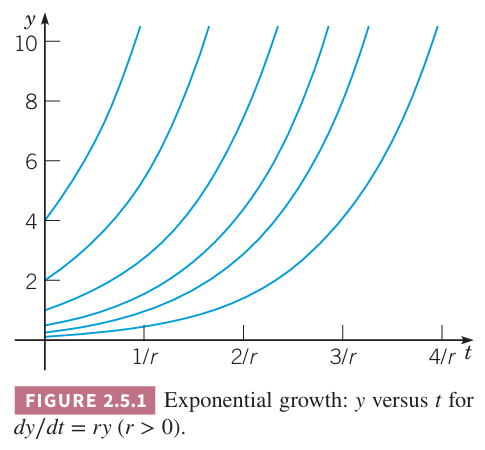
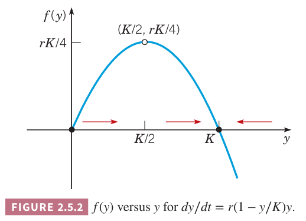
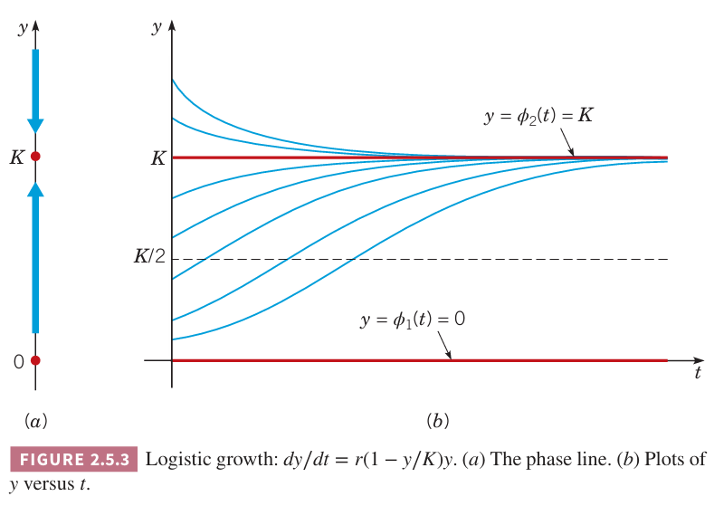

有一类很重要的一阶微分方程，就是自变量没有显式出现在方程中。这样的方程称为自治（`autonomous`）微分方程，形式如下
$$dy/dt=f(y)\tag{1}$$
这个模型适用面非常广，比如种群的增长、经济发展、生态等等。我们在 1.1 和 1.2 两个小节讨论过 $f(y)=ay+b$ 这种特殊情况。

方程 $(1)$ 是可分离的，可以用 2.2 小节的方法求解，不过这里更要强调的是如何应用几何方法来获得定性性质。这其中最重要的是稳定解和非稳定解的概念。第一章简单介绍过这种思想但是没有使用这些术语。第九章会进一步讨论这个问题。

### 指数增长
令 $y=\phi(t)$ 是给定时间 $t$ 时种群的数量。最简单的假设是 $y$ 的变化率正比于 $y$，那么
$$\frac{dy}{dt}=ry\tag{2}$$
常量比率 $r$ 称为增长率（`rate of growth`）或下降率（`rate of decline`），这取决于 $r$ 的符号。我们假定数量是增长的，即 $r>0$。

假定初始条件是
$$y(0)=y_0\tag{3}$$
那么
$$y=y_0e^{rt}\tag{4}$$
是 $(2),(3)$ 这个初值问题的解。$r>0$ 意味着数量会无限增长下去。

在理想状态下，在有限时间内，这个模型比较精确，但是由于空间、食物、其他资源是受限的，数量不会无条件增长。

### 逻辑斯谛（`logistic`）增长
要考虑增长率是依赖于数量的，因此将 $(2)$ 中的 $r$ 替换成函数 $h(y)$ 得到
$$\frac{dy}{dt}=h(y)y\tag{5}$$
当 $y$ 很小的时候，$h(y)$ 应该近似等于 $r$，随着 $y$ 的增长 $h(y)$ 要减小，当 $y$ 充分大的时候，$h(y)<0$。最简单满足这些性质的函数是 $h(y)=r-ay$，其中 $a$ 也是正的常数。那么上面的方程变为
$$\frac{dy}{dt}=(r-ay)y\tag{6}$$
这就是 Verhulst 方程或逻辑斯谛方程。往往写作下面的形式更方便
$$\frac{dy}{dt}=r(1-\frac{y}{K})y\tag{7}$$
其中 $K=r/a$。这种形式下，常数 $r$ 称为内在增长率（`intrinsic growth rate`），即不考虑任何限制因素时的增长率。

在讨论 $K$ 和求解之前，先定性的画出解。首先 $(7)$ 的解的最简单形式是常数函数，即 $dy/dt=0$，那么
$$r(1-\frac{y}{K})y=0$$
常量解有两个 $y_1=0,y_2=K$。这些解是平衡解（`equilibrium solution`），随着时间的变化，$y$ 值不变。对于方程 $(1)$ 而言，更一般的情况就是 $f(y)=0$，这些使得 $f(y)$ 为零的点称为临界点（`critical point`）。

为了画出 $(7)$ 的其他解，先从给出 $y,f(y)$ 的图像开始。$f(y)=r(1-\frac{y}{K})y$ 是二次函数，因此图像是一个抛物线。$(7)$ 的临界点对应的点是 $(0,0),(K,0)$，抛物线的顶点是 $(K/2,rK/4)$。当 $0<y<K$ 时，$dy/dt>0$，$y$ 随着 $t$ 的增长而增长，如 $y$ 轴上方的箭头所示。类似的，$y>K$ 时，$dy/dt<0$，$y$ 随着 $t$ 的增长而减少。

在这个上下文语境中，$y$ 轴是相位线（`phase line`），更好的是在垂直方向做示意图，如下图（a）所示。临界点是 $y=0,y=K$，对应着平衡解。箭头表示 $y$ 变化的方向，是增长还是减少。

如果 $y$ 在 $0$ 或者 $K$ 附近，斜率 $f(y)$ 接近零，解的曲线很平缓，当 $y$ 远离 $0$ 或者 $K$ 时，曲线变得陡峭。

为了在 $ty$ 平面上给出解，首先画出平衡解 $y_1=0,y_2=K$。然后根据上述分析，当 $0<y<K$ 时曲线增长，$y>K$ 时曲线减少。在接近 $0,K$ 时，曲线变得平缓。

这些解会在 $y=K$ 上相交吗？定理 2.4.2 的唯一性告诉我们不会，过给定点，只有一个解。当 $t\to\infty$ 时，所有解会趋于平衡解。

为了确定凸凹性和拐点，需要计算二阶导 $d^2y/dt^2$，从微分方程 $(1)$ 得到
$$\frac{d^2y}{dt^2}=\frac{d}{dt}\frac{dy}{dt}=\frac{d}{dt}f(y)=f'(y)\frac{dy}{dt}=f'(y)f(y)\tag{8}$$
$f'(y),f(y)$ 符号相同，那么 $y''>0$，上凹（开口向上）。反之，$f'(y),f(y)$ 符号不同，那么 $y''<0$，下凹。拐点可能出现在 $f'(y)=0$ 处。

在 $(7)$ 中，当 $0<y<K/2$ 时，$f$ 是正的，且增长，因此 $f,f'$ 都是正的，上凹。当 $y>K$ 时也是上凹的，因为 $f,f'$ 都是负的。在 $K/2<y<K$ 上，下凹，因为 $f$ 是正的，但是在减少，$f'$ 是负的。拐点是 $y=K/2$ 处。上图（b）画出了这些性质。

当初始值位于 $K$ 的下方时，$K$ 是上界，趋于这个值但是不会超过。$K$ 称为饱和度（`saturation level`）或自然承载量（`environmental carrying capacity`）。
