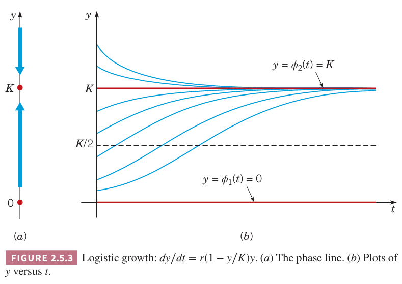

有一类很重要的一阶微分方程，就是自变量没有显式出现在方程中。这样的方程称为自治（`autonomous`）微分方程，形式如下
$$dy/dt=f(y)\tag{1}$$
这个模型适用面非常广，比如种群的增长、经济发展、生态等等。我们在 1.1 和 1.2 两个小节讨论过 $f(y)=ay+b$ 这种特殊情况。

方程 $(1)$ 是可分离的，可以用 2.2 小节的方法求解，不过这里更要强调的是如何应用几何方法来获得定性性质。这其中最重要的是稳定解和非稳定解的概念。第一章简单介绍过这种思想但是没有使用这些术语。第九章会进一步讨论这个问题。

### 指数增长
令 $y=\phi(t)$ 是给定时间 $t$ 时种群的数量。最简单的假设是 $y$ 的变化率正比于 $y$，那么
$$\frac{dy}{dt}=ry\tag{2}$$
常量比率 $r$ 称为增长率（`rate of growth`）或下降率（`rate of decline`），这取决于 $r$ 的符号。我们假定数量是增长的，即 $r>0$。

假定初始条件是
$$y(0)=y_0\tag{3}$$
那么
$$y=y_0e^{rt}\tag{4}$$
是 $(2),(3)$ 这个初值问题的解。$r>0$ 意味着数量会无限增长下去。

在理想状态下，在有限时间内，这个模型比较精确，但是由于空间、食物、其他资源是受限的，数量不会无条件增长。

### 逻辑斯谛（`logistic`）增长
要考虑增长率是依赖于数量的，因此将 $(2)$ 中的 $r$ 替换成函数 $h(y)$ 得到
$$\frac{dy}{dt}=h(y)y\tag{5}$$
当 $y$ 很小的时候，$h(y)$ 应该近似等于 $r$，随着 $y$ 的增长 $h(y)$ 要减小，当 $y$ 充分大的时候，$h(y)<0$。最简单满足这些性质的函数是 $h(y)=r-ay$，其中 $a$ 也是正的常数。那么上面的方程变为
$$\frac{dy}{dt}=(r-ay)y\tag{6}$$
这就是 Verhulst 方程或逻辑斯谛方程。往往写作下面的形式更方便
$$\frac{dy}{dt}=r(1-\frac{y}{K})y\tag{7}$$
其中 $K=r/a$。这种形式下，常数 $r$ 称为内在增长率（`intrinsic growth rate`），即不考虑任何限制因素时的增长率。

在讨论 $K$ 和求解之前，先定性的画出解。首先 $(7)$ 的解的最简单形式是常数函数，即 $dy/dt=0$，那么
$$r(1-\frac{y}{K})y=0$$
常量解有两个 $y_1=0,y_2=K$。这些解是平衡解（`equilibrium solution`），随着时间的变化，$y$ 值不变。对于方程 $(1)$ 而言，更一般的情况就是 $f(y)=0$，这些使得 $f(y)$ 为零的点称为临界点（`critical point`）。

为了画出 $(7)$ 的其他解，先从给出 $y,f(y)$ 的图像开始。$f(y)=r(1-\frac{y}{K})y$ 是二次函数，因此图像是一个抛物线。$(7)$ 的临界点对应的点是 $(0,0),(K,0)$，抛物线的顶点是 $(K/2,rK/4)$。当 $0<y<K$ 时，$dy/dt>0$，$y$ 随着 $t$ 的增长而增长，如 $y$ 轴上方的箭头所示。类似的，$y>K$ 时，$dy/dt<0$，$y$ 随着 $t$ 的增长而减少。

在这个上下文语境中，$y$ 轴是相位线（`phase line`），更好的是在垂直方向做示意图，如下图（a）所示。临界点是 $y=0,y=K$，对应着平衡解。箭头表示 $y$ 变化的方向，是增长还是减少。

如果 $y$ 在 $0$ 或者 $K$ 附近，斜率 $f(y)$ 接近零，解的曲线很平缓，当 $y$ 远离 $0$ 或者 $K$ 时，曲线变得陡峭。

为了在 $ty$ 平面上给出解，首先画出平衡解 $y_1=0,y_2=K$。然后根据上述分析，当 $0<y<K$ 时曲线增长，$y>K$ 时曲线减少。在接近 $0,K$ 时，曲线变得平缓。

这些解会在 $y=K$ 上相交吗？定理 2.4.2 的唯一性告诉我们不会，过给定点，只有一个解。当 $t\to\infty$ 时，所有解会趋于平衡解。

为了确定凸凹性和拐点，需要计算二阶导 $d^2y/dt^2$，从微分方程 $(1)$ 得到
$$\frac{d^2y}{dt^2}=\frac{d}{dt}\frac{dy}{dt}=\frac{d}{dt}f(y)=f'(y)\frac{dy}{dt}=f'(y)f(y)\tag{8}$$
$f'(y),f(y)$ 符号相同，那么 $y''>0$，上凹（开口向上）。反之，$f'(y),f(y)$ 符号不同，那么 $y''<0$，下凹。拐点可能出现在 $f'(y)=0$ 处。

在 $(7)$ 中，当 $0<y<K/2$ 时，$f$ 是正的，且增长，因此 $f,f'$ 都是正的，上凹。当 $y>K$ 时也是上凹的，因为 $f,f'$ 都是负的。在 $K/2<y<K$ 上，下凹，因为 $f$ 是正的，但是在减少，$f'$ 是负的。拐点是 $y=K/2$ 处。上图（b）画出了这些性质。

当初始值位于 $K$ 的下方时，$K$ 是上界，趋于这个值但是不会超过。$K$ 称为饱和度（`saturation level`）或自然承载量（`environmental carrying capacity`）。

从上面的例子可以看出，非线性微分方程和线性方程差距很大，至少 $t\to\infty$ 时是这样的。不管 $(7)$ 中非线性项多小，当 $t$ 充分大的时候，解都趋于某个有限值，而 $(1)$ 的解会无限增长。

上图（b）的定性分析对许多问题而言已经足够了，这些信息从 $f(y),y$ 的关系可以得到而无需求解方程。不过如果想知道更细节的信息，就不得不求解 $(7)$ 了。如果 $y\neq 0,y\neq K$，那么 $(7)$ 可以写作
$$\frac{dy}{(1-y/K)y}=rdt$$
部分分式法可以将左边改写成两个分数之和
$$\bigg(\frac{1}{y}+\frac{1/K}{1-y/K}\bigg)dy=rdt$$
两边积分得到
$$\ln|y|-\ln\bigg|1-\frac{y}{K}\bigg|=rt+c\tag{9}$$
其中 $c$ 是任意常量且由 $y(0)=y_0$ 决定。之前的分析结论有如果 $0<y_0<K$，那么 $y$ 始终在这个区间。因此我们可以将绝对值号去掉，两边取自然指数得到
$$\frac{y}{1-(y/K)}=Ce^{rt}\tag{10}$$
其中 $C=e^{c}$。为了满足初始条件 $y(0)=y_0$，那么 $C=y_0/(1-(y_0/K))$，因此
$$y=\frac{y_0K}{y_0+(K-y_0)e^{-rt}}\tag{11}$$
如果 $y_0>K$，从 $(9)$ 开始推导会有些许不同，但是 $(11)$ 仍旧是解。如果 $y_0=0,y_0=K$ 代入 $(11)$ 可以得到两个平衡解 $y=0,y=K$。

定性分析的性质都可以由解析式得到。如果 $y_0>0$，那么当 $t\to\infty$ 时，根据 $(11)$ 有
$$\lim_{t\to\infty}y(t)=\frac{y_0K}{y_0}=K$$
趋于平衡解 $y=K$。因此我们称 $y=K$ 是 $(7)$ 的渐进稳定解（`asymptotically stable solution`）。如果 $r$ 增加，那么趋于 $K$ 的速度会变快。

对于平衡解 $y=0$ 而言，即使初始值非常接近零，也会随着 $t$ 的增加趋于 $K$ 而离开 $y=0$。因此 $y=0$ 是非稳定平衡解（`unstable equilibrium solution`），这意味着如果保证解在 0 附近，那么必须保证初始值就是零。

例 1 令 $y$ 是随 $t$ 变化的函数，表示生物的总质量，符合逻辑斯谛增长。常量 $r=0.71,K=80.5\times 10^6$。如果 $y_0=0.25K$，求两年后的 $y$ 值。求满足 $y(\tau)=0.75K$ 的 $\tau$。

解：将 $(11)$ 表示成 $y/K$ 的形式
$$\frac{y}{K}=\frac{y_0/K}{(y_0/K+(1-y_0/K)e^{-rt})}\tag{12}$$
将题目中的值代入得到
$$\frac{y(2)}{K}=\frac{0.25}{0.25+0.75e^{-1.42}}\approx 0.5797$$
因此 $y(2)\approx 46.7\times 10^6$。

将 $(12)$ 写为求 $t$ 的方程
$$e^{-rt}=\frac{(y_0/K)(1-y/K)}{(y/K)(1-y_0/K)}$$
因此
$$t=-\frac{1}{r}\ln\bigg(\frac{(y_0/K)(1-y/K)}{(y/K)(1-y_0/K)}\bigg)\tag{13}$$
代入数值得到
$$\tau=-\frac{1}{0.71}\ln\frac{(0.25)(0.25)}{(0.75)(0.75)}=\frac{1}{0.71}\ln 9\approx 3.095$$
下图是不同初始条件下 $y/K$ 随 $t$ 变化的解。初始条件 $y_0=0.25K$ 如绿色曲线所示。

### 临界阈值
下面分析方程
$$\frac{dy}{dt}=-r\bigg(1-\frac{y}{T}\bigg)y\tag{14}$$
其中 $r,T$ 是常量。和 $(7)$ 相比，除了 $T$ 替换了 $K$ 之外，右边 $r$ 前多了一个负号。不过，$(14)$ 的解的性质与 $(7)$ 差距相当大。

对于 $(14)$，$f(y),y$ 的关系如下图所示。与 $y$ 轴的交点是 $y=0,y=T$，对应着两个平衡解。如果 $0<y<T$，$dy/dt<0$，$y$ 是正数且随着 $t$ 的增加而减少，那么 $y=0$ 是渐进稳定平衡解。如果 $y>T$，$dy/dt>0$，因此 $y$ 是正数且随着 $t$ 的增加而增加，那么 $y=T$ 是非稳定平衡解。

下面分析解的凸凹性。如 $(8)$，这依赖于 $y''=f'(y)f(y)$ 的符号。在 $0<y<T/2$ 这个区间上，$f(y)$ 是负数，$f'(y)$ 是负数，因此上凹，在 $T/2<y<T$ 这个区间上，$f(y)$ 是负数，$f'(y)$ 是整数，因此下凹。对于 $y>T$，两者都是正数，因此也上凹。

下图的（a）展示了临界点以及解是递增还是递减的。

上图（b）是 $(14)$ 的解的草图。首先给出红色的 $y=0,y=T$ 两个平衡解。递增和递减、包括凸凹性都在上图有所反映。不管 $r,T$ 是多少，$y$ 要么无限增长，要么趋于零，这仅仅依赖于初始值是大于 $T$ 还是小于 $T$。因此 $T$ 是阈值水平（`threshold level`）。

下面分析解析解。将 $T$ 替换 $K$，$-r$ 替换 $r$，那么 $(7)$ 的解 $(11)$ 就是 $(14)$ 的解
$$y=\frac{y_0T}{y_0+(T-y_0)e^{rt}}\tag{15}$$
如果 $0<y_0<T$，当 $t\to\infty$ 时，$y\to 0$。如果 $y_0>T$，$t$ 为某些值的时候，$(15)$ 右边的分母为零，我们用 $t^*$ 表示，那么
$$y_0-(y_0-T)e^{rt^*}=0$$
易得
$$t^*=\frac{1}{r}\ln\frac{y_0}{y_0-T}\tag{16}$$
也就是说，如果 $y_0>T$，$y$ 的图像渐进与直线 $t=t^*$，这一点是上面定性分析没有得到的结论，显式的解会给出额外的定性信息，以及定量信息。

### 带阈值的逻辑斯谛增长
将逻辑斯谛方程与阈值相结合，得到新的模型
$$\frac{dy}{dt}=-r\bigg(1-\frac{y}{T}\bigg)\bigg(1-\frac{y}{K}\bigg)y\tag{17}$$
其中 $r>0,0<T<K$。

下面是 $f(y),y$ 的关系如下图所示。三个临界点 $y=0,y=T,y=K$，是三个平衡解。$T<y<K$ 时，$dy/dt>0$，$y$ 递增，$y<T$ 和 $y>K$ 时，$y$ 递减。因此 $y=0,y=K$ 是渐进稳定平衡解，$y=T$ 是非稳定平衡解。

凸凹性的分析类似，略过。拐点是上图中局部最大点和局部最小点 $y_1,y_2$，将 $(17)$ 的右边求导后令其等于零可以得到
$$y_{1,2}=(K+T\pm\sqrt{K^2-KT+T^2})/3\tag{18}$$

下图是 $(17)$ 的解的草图。

