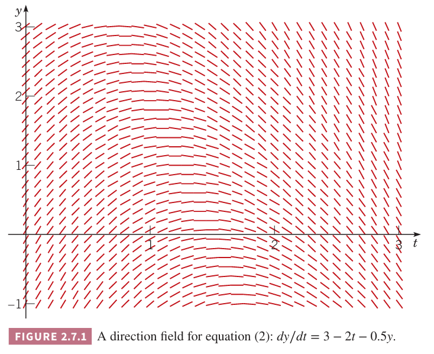
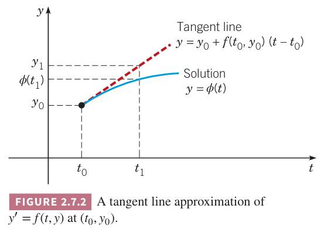
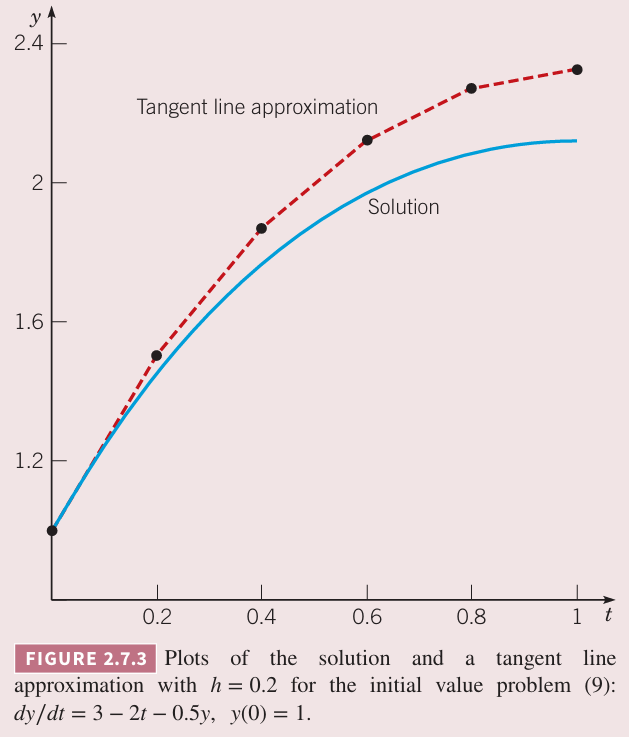
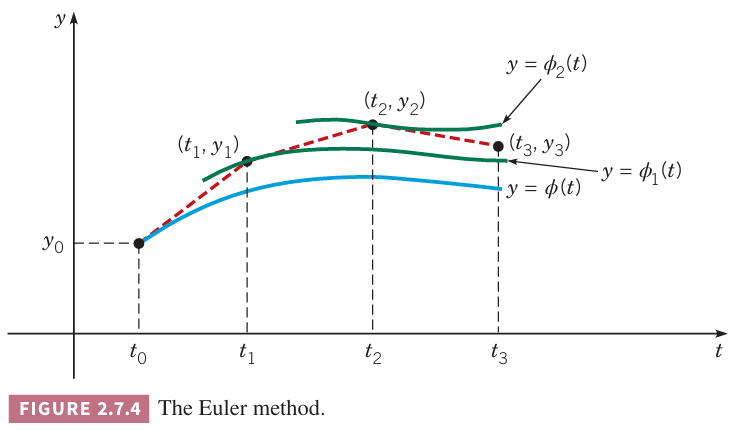

回忆一阶线性初值问题
$$\frac{dy}{dt}=f(t,y),y(t_0)=y_0\tag{1}$$
的两个重要事实。首先如果 $f,\partial f/\partial y$ 连续，那么初值问题在包含 $t=t_0$ 的某些区间上有唯一解 $y=\phi(t)$。第二点是很难找到解析解，之前分析了线性、可分离、恰当微分方程三种类型以及可以转成这三种类型之一的微分方程。然而，还有大量的微分方程很难给出解析解。

因此有其他方法分析问题就很重要了。之前讨论过，方向场可以可视化解的行为。这种方法非常简单，即使对复杂的微分方程也是如此。缺点也很明显，不适合定量计算或者比较。

比如下图是微分方程
$$\frac{dy}{dt}=3-2t-0.5y\tag{2}$$
的方向场。

从上图可以看到解的变化趋势。从 $y$ 轴某一点开始，先递增，达到某个极值之后开始下降。

从上图或许可以注意到，有的线段和后续线段连起来了。如果从 $y$ 的某点开始，一系列小的线段连接起来，可能可以得到一个近似解。为了把这种想法变成一个通用的方法，需要回答下面三个问题。

1. 我们能否使用一种系统且直观的方法将切线连接起来？
2. 如果可以，得到的分段线性函数是否是微分方程解的近似？
3. 如果是，能够评估近似的精确度？也就是说，近似与实际偏差有多大？

这些问题的答案都是确定的。该方法于 1768 年由欧拉提出，称为切线法（`tangent line method`）或欧拉法（`Euler method`）。本小节讨论前两个问题，第三个问题的系统讨论推迟到第八章。

下面看看欧拉法是如何工作的。考虑如何用切线近似初值问题 $(1)$ 在 $t=t_0$ 附近的解。我们已知解经过点 $(t_0,y_0)$，也知道该点处的斜率是 $f(t_0,y_0)$，那么解的曲线在点 $(t_0,y_0)$ 的切线是
$$y=y_0+f(t_0,y_0)(t-t_0)\tag{3}$$
在 $t_0$ 附近充分小的范围内，与真实值没有明显差异，切线是真实解很好的近似，如下图所示。如果 $t_1$ 足够接近 $t_0$，那么我们可以使用
$$y_1=y_0+f(t_0,y_0)(t_1-t_0)\tag{4}$$
来近似 $\phi(t_1)$。

重复这个过程。不过我们不知道 $t_1$ 时刻的值 $\phi(t_1)$，只能用近似值 $y_1$ 来替代。那么就可以得到通过点 $(t_1,y_1)$ 斜率为 $f(t_1,y_1)$ 的直线
$$y=y_1+f(t_1,y_1)(t-t_1)\tag{5}$$
那么可以用
$$y_2=y_1+f(t_1,y_1)(t_2-t_1)\tag{6}$$
来近似 $\phi(t)$ 在 $t_2$ 附近的值。

继续这个过程。以点 $(t_n,y_n)$ 为起点的切线是
$$y=y_n+f(t_n,y_n)(t-t_n)\tag{7}$$
因此 $t_{n+1}$ 处的近似值是
$$y_{n+1}=y_n+f(t_n,y_n)(t_{n+1}-t_n)\tag{8}$$
如果引入记号 $f_n=f(t_n,y_n)$ 那么 $(8)$ 可以写作
$$y_{n+1}=y_n+f_n(t_{n+1}-t_n),n=0,1,2,\cdots\tag{9}$$
如果假定点 $t_0,t_1,t_2,\cdots$ 之间的间隔相等是 $h$，那么 $t_{n+1}=t_n+h$，可以得到欧拉公式
$$y_{n+1}=y_n+f_nh,n=0,1,2,\cdots\tag{10}$$
根据步长是否相等，欧拉法就是反复求 $(9)$ 或者 $(10)$ 的值，使用每一步的结果计算下一步。这样得到一系列值 $y_1,y_2,y_3,\cdots$，它们是 $\phi(t)$ 在时刻 $t_1,t_2,t_3,\cdots$ 的近似。如果要近似解 $\phi(t)$，那么就要构造分段线性函数表示上述的分段切线。在 $[t_0,t_1]$ 区间，函数 $y$ 就是 $n=0$ 的方程 $(7)$，在 $[t_1,t_2]$ 区间，函数 $y$ 就是 $n=1$ 的方程 $(7)$，以此类推。

例 1 初值问题
$$\frac{dy}{dt}=3-2t-0.5y,y(0)=1\tag{11}$$
使用 $h=0.2$ 作为参数，使用欧拉法求上面的初值问题，并求出与真实解的差。

解：这是一个线性微分方程，积分因子是 $e^{t/2}$，解是
$$y=14-4t-13e^{-t/2}\tag{12}$$
欧拉法中的函数 $f(t,y)=3-2t-0.5y$，使用初始值 $t_0=0,y_0=1$ 得到
$$f_0=f(t_0,y_0)=f(0,1)=3-0-0.5=2.5$$
利用公式 $(3)$ 得到 $t=0$ 附近的近似
$$y=1+2.5(t-0)=1+2.5t\tag{13}$$
令 $t=0.2$，解得
$$y_1=1+(2.5)(0.2)=1.5$$
重复这个步骤
$$f_1=f(t_1,y_1)=f(0.2,1.5)=3-2(0.2)-(0.5)(1.5)=1.85$$
那么在 $t=0.2$ 附近的近似是
$$y=1.5+1.85t(t-0.2)=1.13+1.85t\tag{14}$$
代入 $t=0.4$ 得到
$$y_2=1.13+(1.85)(0.4)=1.87$$
重复这个步骤可以得到下表。

| $n$ | $t_n$ | $y_n$ | $f_n=f(t_n,y_n)$ | 切线 | 确定值 $y(f_n)$ |
|--|--|--|--|--|--|
| 0 | 0.0 | 1.00000 | 2.5 | $y = 1 + 2.5(t - 0)$ | 1.00000 |
| 1 | 0.2 | 1.50000 | 1.85 | $y = 1.5 + 1.85(t - 0.2)$ | 1.43711 |
| 2 | 0.4 | 1.87000 | 1.265 | $y = 1.87 + 1.265(t - 0.4)$ | 1.75650 |
| 3 | 0.6 | 2.12300 | 0.7385 | $y = 2.123 + 0.7385(t - 0.6)$ | 1.96936 |
| 4 | 0.8 | 2.27070 | 0.26465 | $y = 2.2707 + 0.26465(t - 0.8)$ | 2.08584 |
| 5 | 1.0 | 2.32363 | | 2.11510 |

第二列是 $t$ 的值，间隔是 $h=0.2$。第三列是应用欧拉法 $(10)$ 计算得到的 $y$ 值。第四列是通过点 $(t_n,y_n)$ 的切线斜率 $f_n$。第五列是切线。第六列是 $(12)$ 得到的精确值。$(12)$ 的解与切线近似如下图所示。

从上表和图中可以看出，欧拉法近似的结果比真实值稍大。这是因为解的图像是下凹的，因此切线在图像的上方。

这个近似的精确度不足以用于科学或工程计算。比如 $t=1$ 时，近似误差是 2.11510-2.32363=0.20853，大约是是 9.86% 的误差。提高精度的方式之一是使用更小的步长，相应增加了计算的次数。

例 1 中的计算通常使用计算机完成。

例 2 使用不同的步长来近似求解 $(11)$，其中要求 $0\leq t\leq 5$。并于精确解 $(12)$
$$y=14-4t-13e^{-t/2}$$
进行比较。

解：下表是 $h=0.1,0.05,0.025,0.01$ 几种情况下 $t=0$ 到 $t=5$ 的近似值。

| $t$| $h=0.1$ | $h=0.05$ | $h=0.025$ | $h=0.01$ | 精确值 |
|--|--|--|--|--|--|
| 0.0 | 1.0000 | 1.0000 | 1.0000 | 1.0000 | 1.0000 |
| 1.0 | 2.2164 | 2.1651 | 2.1399 | 2.1250 | 2.1151 |
| 2.0 | 1.3397 | 1.2780 | 1.2476 | 1.2295 | 1.2176 |
| 3.0 | -0.7903 | -0.8459 | -0.8734 | -0.8898 | -0.9007 |
| 4.0 | -3.6707 | -3.7152 | -3.7373 | -3.7506 | -3.7594 |
| 5.0 | -7.0003 | -7.0337 | -7.0504 | -7.0604 | -7.0671 |

从上表可以得出一些重要结论。当 $t$ 固定时，$h$ 减小，精度增加。比如 $t=2$，$h=0.1$ 时误差约 10%，然后 $h=0.01$ 仅有 1%。从这里可以看出，步长减少 10 倍，误差也减少了 10 倍。这里可以得到结论：步长减少的倍数大致和误差减少的倍数一致。这里仅仅是一个例子，这是一个一般性的结论吗？第八章会进一步分析。

第二个观察是对于固定的 $h$，对于 $t>2$ 而言，随着 $t$ 的增加，近似更精确。比如 $t=0.1$ 时，$t=5$ 的误差是 0.0668，而 $t=2$ 时误差是 0.1221，差不多少了一半。

最后，欧拉法对于这个问题而言估算的相当好。即使对于较大的步长 $h=0.1$，结果也很好，减小 $h$ 可以进一步提高精度。

例 3 考虑初值问题
$$\frac{dy}{dt}=4-t+2y,y(0)=1\tag{15}$$
方程的通解在 2.1 解例 3 中给出，结合初始条件 $y(0)=1$ 得到
$$y=-\frac{7}{4}+\frac{1}{2}t+\frac{11}{4}e^{2t}\tag{16}$$
使用不同的不长，使用欧拉法，计算区间 $0\leq t\leq 5$ 的近似，并于 $(16)$ 的结果进行比较。

解：使用例 2 的步长，得到

| $t$| $h=0.1$ | $h=0.05$ | $h=0.025$ | $h=0.01$ | 精确值 |
|--|--|--|--|--|--|
| 0.0 | 1.000000 | 1.000000 | 1.000000 | 1.000000 | 1.000000 |
| 1.0 | 15.77728 | 17.25062 | 18.10997 | 18.67278 | 19.06990 |
| 2.0 | 104.6784 | 123.7130 | 135.5440 | 143.5835 | 149.3949 |
| 3.0 | 652.5349 | 837.0745 | 959.2580 | 1045.395 | 1109.179 |
| 4.0 | 4042.122 | 5633.351 | 6755.175 | 7575.577 | 8197.884 |
| 5.0 | 25026.95 | 37897.43 | 47555.35 | 54881.32 | 60573.53 |

和之前类似，给定 $t$，随着 $h$ 的减少精度在增加。比如 $t=1$ 时，$h=0.1$ 的误差是 17.3%，而 $h=0.01$ 时误差仅有 2.1%。不过给定 $h$，随着 $t$ 的增加，误差在增加。对 $h=0.01$ 而言，$t=5$ 时的误差达到了 9.4%，$h$ 大的时候误差更大。这个误差对于科学或工程计算而言太大了。为了提高精度，可以使用更小的步长或者限制距离初值位置的距离。然而，欧拉法在这个例子中并不如例 2 中那么有效。

为了更好的理解这些例子，我们重新审视欧拉法近似求解初值问题 $(1)$
$$\frac{dy}{dt}=f(t,y),y(t_0)=y_0$$
其精确解用 $\phi(t)$ 表示。一阶微分方程有无限的解，初值条件挑选了其中一个解，确定了任意常量 $c$。在无限的解中，$\phi(t)$ 是满足初值条件 $\phi(t_0)=y_0$。

在欧拉法的第一步中，使用切线近似通过 $(t_0,y_0)$ 的解 $y=\phi(t)$，然后估计 $t_1$ 时刻 $y_1$ 的值。通常 $y_1\neq\phi(t_1)$，那么第二步并不是近似解 $y=\phi(t)$ 而是近似通过点 $(t_1,y_1)$ 的解 $y=\phi_1(t)$。也就是说，欧拉法的每一步使用一系列切线近似微分方程一系列的解 $\phi(t),\phi_1(t),\phi_2(t),\cdots$。很多步之后，近似的质量强依赖于通过一系列点 $(t_n,y_n),n=1,2,3,\cdots$ 的解的集合的行为。

例 2 中微分方程的通解是
$$y=14-4t+ce^{-t/2}\tag{17}$$
初始条件要求 $c=-13$。当 $t\to\infty$ 时，$(17)$ 中依赖常量 $c$ 的项趋于零，因此解集是收敛的。在欧拉方法中，用切线近似哪些解并不重要，因为随着 $t$ 的增加，所有的解都会越来越接近。

不过在例 3 中微分方程的通解是
$$y=-\frac{7}{4}+\frac{1}{2}t+ce^{2t}\tag{18}$$
由于当 $t\to\infty$ 时，涉及常量 $c$ 的项会无穷大，那么这个一个发散的解集。即使在 $c$ 附近的解和 $c$ 对应的解差距约会越来越大。例 3 中我们要近似的是 $c=11/4$ 的解，但是欧拉法的每一步都是近似另一个解，并且随着 $t$ 的增加，分离的越来越远。这也是为什么例 3 的误差比例 2 的误差大很多的原因。

使用欧拉法必须要保证结果是充分精确的。之前的例子，我们与精确解对比无法。当使用数值方法的时候，往往没有解析解，所以我们需要不依赖精确解的方法估计误差范围。数值解最好也就是反应真实解的行为。相比收敛的解集，发散的解集更难被近似。
