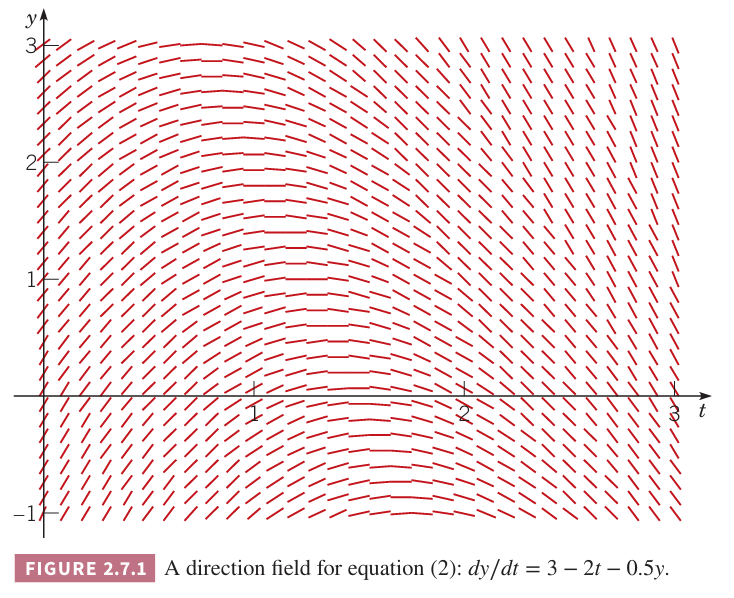
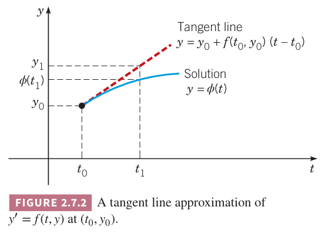

回忆一阶线性初值问题
$$\frac{dy}{dt}=f(t,y),y(t_0)=y_0\tag{1}$$
的两个重要事实。首先如果 $f,\partial f/\partial y$ 连续，那么初值问题在包含 $t=t_0$ 的某些区间上有唯一解 $y=\phi(t)$。第二点是很难找到解析解，之前分析了线性、可分离、恰当微分方程三种类型以及可以转成这三种类型之一的微分方程。然而，还有大量的微分方程很难给出解析解。

因此有其他方法分析问题就很重要了。之前讨论过，方向场可以可视化解的行为。这种方法非常简单，即使对复杂的微分方程也是如此。缺点也很明显，不适合定量计算或者比较。

比如下图是微分方程
$$\frac{dy}{dt}=3-2t-0.5y\tag{2}$$
的方向场。

从上图可以看到解的变化趋势。从 $y$ 轴某一点开始，先递增，达到某个极值之后开始下降。

从上图或许可以注意到，有的线段和后续线段连起来了。如果从 $y$ 的某点开始，一系列小的线段连接起来，可能可以得到一个近似解。为了把这种想法变成一个通用的方法，需要回答下面三个问题。

1. 我们能否使用一种系统且直观的方法将切线连接起来？
2. 如果可以，得到的分段线性函数是否是微分方程解的近似？
3. 如果是，能够评估近似的精确度？也就是说，近似与实际偏差有多大？

这些问题的答案都是确定的。该方法于 1768 年由欧拉提出，称为切线法（`tangent line method`）或欧拉法（`Euler method`）。本小节讨论前两个问题，第三个问题的系统讨论推迟到第八章。

下面看看欧拉法是如何工作的。考虑如何用切线近似初值问题 $(1)$ 在 $t=t_0$ 附近的解。我们已知解经过点 $(t_0,y_0)$，也知道该点处的斜率是 $f(t_0,y_0)$，那么解的曲线在点 $(t_0,y_0)$ 的切线是
$$y=y_0+f(t_0,y_0)(t-t_0)\tag{3}$$
在 $t_0$ 附近充分小的范围内，与真实值没有明显差异，切线是真实解很好的近似，如下图所示。如果 $t_1$ 足够接近 $t_0$，那么我们可以使用
$$y_1=y_0+f(t_0,y_0)(t_1-t_0)\tag{4}$$
来近似 $\phi(t_1)$。

重复这个过程。不过我们不知道 $t_1$ 时刻的值 $\phi(t_1)$，只能用近似值 $y_1$ 来替代。那么就可以得到通过点 $(t_1,y_1)$ 斜率为 $f(t_1,y_1)$ 的直线
$$y=y_1+f(t_1,y_1)(t-t_1)\tag{5}$$
那么可以用
$$y_2=y_1+f(t_1,y_1)(t_2-t_1)\tag{6}$$
来近似 $\phi(t)$ 在 $t_2$ 附近的值。

继续这个过程。以点 $(t_n,y_n)$ 为起点的切线是
$$y=y_n+f(t_n,y_n)(t-t_n)\tag{7}$$
因此 $t_{n+1}$ 处的近似值是
$$y_{n+1}=y_n+f(t_n,y_n)(t_{n+1}-t_n)\tag{8}$$
如果引入记号 $f_n=f(t_n,y_n)$ 那么 $(8)$ 可以写作
$$y_{n+1}=y_n+f_n(t_{n+1}-t_n),n=0,1,2,\cdots\tag{9}$$
如果假定点 $t_0,t_1,t_2,\cdots$ 之间的间隔相等是 $h$，那么 $t_{n+1}=t_n+h$，可以得到欧拉公式
$$y_{n+1}=y_n+f_nh,n=0,1,2,\cdots\tag{10}$$
根据步长是否相等，欧拉法就是反复求 $(9)$ 或者 $(10)$ 的值，使用每一步的结果计算下一步。这样得到一系列值 $y_1,y_2,y_3,\cdots$，它们是 $\phi(t)$ 在时刻 $t_1,t_2,t_3,\cdots$ 的近似。如果要近似解 $\phi(t)$，那么就要构造分段线性函数表示上述的分段切线。在 $[t_0,t_1]$ 区间，函数 $y$ 就是 $n=0$ 的方程 $(7)$，在 $[t_1,t_2]$ 区间，函数 $y$ 就是 $n=1$ 的方程 $(7)$，以此类推。
