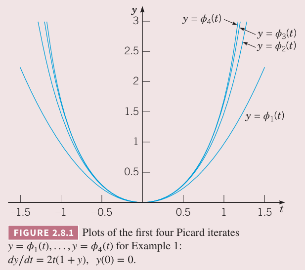
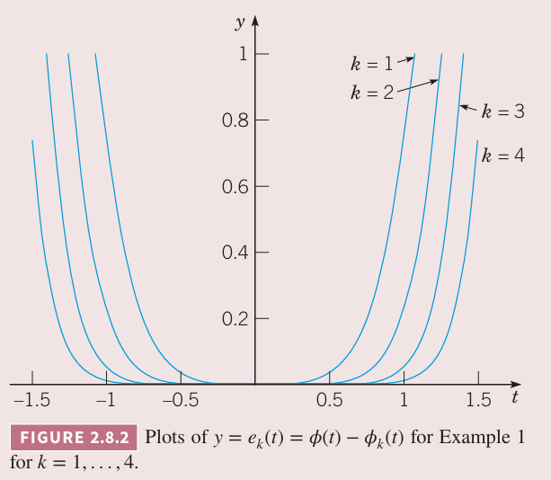
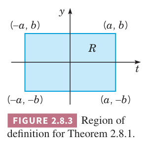
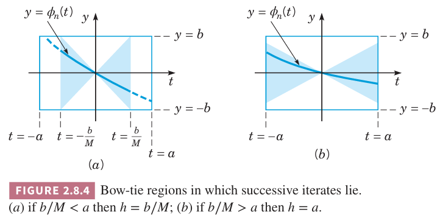

本节讨论定理 2.4.2 存在性和唯一性定理的证明。定理是说满足特定条件的一阶初值问题
$$y'=f(t,y),y(t_0)=y_0\tag{1}$$
在一些包含 $t_0$ 的区间上有唯一解。

某些情况下，比如线性微分方程，初值问题的解的存在性可以通过求解微分方程得到。但是一般情况下无法这么做。所以对于一般情况，有必要采用间接的方法证明存在性，这种方法无法用于求解微分方程。该方法是构造一系列的函数，这些函数满足初值问题，同时收敛于极限函数。通常，无法显式计算得到这个序列的大部分元素，因此很少情况能确定极限函数。不过根据定理 2.4.2，可以证明这个序列收敛于满足期待属性的极限函数。整个论证非常复杂，并且依赖于一些高级微积分的知识，因此这里不会给出所有的细节，而是给出主要特点并指出必须要客服的难题。

首先，注意到我们可以仅考虑初始点 $(t_0,y_0)$ 位于原点的情况，即
$$y'=f(t,y),y(0)=0\tag{2}$$
如果初始点是其他点，那么通过一些变量变换可以使得初始点 $(t_0,y_0)$ 变成原点。因此存在性和唯一性定理如下。

**定理 2.8.1 $y'=f(t,y),y(0)=0$ 解的存在性和唯一性**
> 如果 $f,\partial f/\partial y$ 在矩阵 $R:|t|\leq a,|y|\leq b$，那么在一些区间 $|t|\leq h\leq a$ 上初值问题 $(2)$ 存在唯一解 $y=\phi(t)$。

为了方便证明，需要将初值问题 $(2)$ 转换成更方便的形式。假定可微函数 $y=\phi(t)$ 满足初值问题，那么 $f(t,\phi(t))$ 是 $t$ 的连续函数。因此从初始点 $t=0$ 开始对 $y'=f(t,y)$ 积分得到
$$\phi(t)=\int_0^tf(s,\phi(s))ds\tag{3}$$
其中初始条件是 $\phi(0)=0$。

因为 $(3)$ 包含未知函数 $(3)$ 的积分，因此称为积分方程（`integral equation`）。这个积分方程并不是初值问题的解。但是它提供了满足方程 $(2)$ 的解的另一种关系。假定连续函数 $y=\phi(t)$ 满足 $(3)$，那么这个函数也满足 $(2)$。为了证明这一点，首先令 $t$ 等于零，那么 $(3)$ 的结果满足 $(2)$。由于积分方程 $(3)$ 是连续的，那么根据微积分基本定理得到 $\phi$ 是可微的且 $\phi'(t)=f(t,\phi(t))$。因此初值问题和积分方程是等价的，一个方程的解也是另一个方程的解。而证明 $(3)$ 有唯一解更方便，也就是证明了 $(2)$ 有唯一解。

这里证明的方法称为逐次近似法（`method of successive approximation`）或 Picard 的迭代法（`iteration method`）。首先从初始函数 $\phi_0$ 开始，它是任意函数或者初值问题的近似解，最简单的选择是
$$\phi_0(t)=0\tag{4}$$
$\phi_0$ 至少要满足 $(2)$ 的初值条件。下一步通过 $\phi_0(s)$ 代入 $(3)$ 得到 $\phi_1$
$$\phi_1(t)=\int_0^tf(s,\phi_0(s))ds\tag{5}$$
类似的得到 $\phi_2$
$$\phi_2(t)=\int_0^tf(s,\phi_1(s))ds\tag{6}$$
一般地
$$\phi_{n+1}(t)=\int_0^tf(s,\phi_n(s))ds\tag{7}$$
那么我们就得到了函数序列 $\{\phi_n\}=\{\phi_0,\phi_1,\phi_2,\cdots,\phi_n,\cdots\}$。

这些函数都满足初始条件但一般情况下都不满足微分方程。然而，如果有一步，比如 $n=k$ 时，我们发现 $\phi_{k+1}(t)=\phi_k(t)$，那么 $\phi_k(t)$ 是 $(3)$ 的解，也是初值问题 $(2)$ 的解，序列在该点结束了。一般情况，这并不会发生，不要考虑整个无限序列。

为了证实定理 2.8.1，必须回答下面几个问题

* $\{\phi_n\}$ 的每一项都存在吗？会不会在某一步断开？
* 序列收敛吗？
* 极限函数是什么？是否满足 $(3)$，也就满足了 $(2)$？
* 是唯一解吗？还有其他解吗？

下面我们通过一个相对简单且具体的例子来回答这些问题，稍后讨论一般情况。

例 1 通过逐次近似法求解初值问题
$$y'=2t(1+y),y(0)=0\tag{8}$$
解：如果 $y=\phi(t)$，那么相应的积分方程是
$$\phi(t)=\int_0^t2s(1+\phi(s))ds\tag{9}$$
如果初始近似是 $\phi_0(t)=0$ 那么
$$\phi_1(t)=\int_0^t2s(1+\phi_0(s))ds=\int_0^t2sds=t^2\tag{10}$$
类似的
$$\phi_2(t)=\int_0^t2s(1+\phi_1(s))ds=\int_0^t2s(1+s^2)ds=t^2+\frac{t^4}{2}\tag{11}$$
接着
$$\phi_3(t)=\int_0^t2s(1+\phi_2(s))ds=\int_0^t2s(1+s^2+\frac{t^4}{4})ds=t^2+\frac{t^4}{4}+\frac{t^6}{6}\tag{12}$$
归纳可得
$$\phi_n(t)=t^2+\frac{t^4}{2!}+\frac{t^6}{3!}+\cdots+\frac{t^{2n}}{n!}\tag{13}$$
$(13)$ 对于 $n=1$ 也是成立的，即 $(10)$。下面假定 $n=k$ 是成立的，推导 $n=k+1$ 也是成立的。
$$\begin{aligned}
\phi_{k+1}(t)&=\int_0^t2s(1+\phi_k(s))ds\\
&=\int_0^t2s(1+s^2+\frac{s^4}{2!}+\cdots+\frac{t^{2k}}{k!})ds\\
&=\int_0^t2s+2s^3+\frac{2s^5}{2!}+\cdots+\frac{2s^{2k+1}}{k!}ds\\
&=t^2+\frac{t^4}{2!}+\frac{t^6}{3!}+\cdots+\frac{t^{2k+2}}{(k+1)!}
\end{aligned}\tag{14}$$
下图是 $\phi_1(t),\phi_2(t),\phi_3(t),\phi_4(t)$ 的图像。随着 $k$ 的增加，这些函数在逐渐靠近，那么可能会收敛于极限函数。

方程 $(13)$ 是无限级数
$$\sum_{k=1}^\infty\frac{t^{2k}}{k!}\tag{15}$$
的前 $n$ 项和。
那么 $\lim_{n\to\infty}\phi_n(t)$ 的存在等价于 $(15)$ 收敛。使用比值测试，对于每个 $t$ 而言
$$\bigg|\frac{t^{2k+2}}{(k+1)!}\frac{k!}{t^{2k}}\bigg|=\frac{t^2}{k+1}\to 0,k\to\infty$$
因此级数 $(15)$ 收敛区间是整个 $t$ 轴。对每一个 $t$ 而言，$\phi(t)$ 是序列 $\{\phi_n(t)\}$ 的极限。由于 $(15)$ 是泰勒级数，因此对 $t$ 可以逐项微分或积分。不难验证 $\phi(t)=\sum_{k=1}^{\infty}t^{2k}/k!$ 是积分方程 $(9)$ 的解。或者也可以将 $\phi(t)$ 代入 $(8)$，直接验证其满足初值问题。从级数 $(15)$ 也不难得出这个例子的解是 $e^{t^2}-1$。不过，这对证明存在性不是必须的。

通过给出不同 $k$ 值时差值 $e_k(t)=\phi(t)-\phi_k(t)$，可以看到迭代序列的收敛。下图展示出迭代提供了足够好的近似的区间逐渐增加。

下面证明唯一性。反证法，假定有两个解 $\phi,\Psi$，至少有一个时刻 $t$ 两个函数不同，即 $\phi(t)-\Psi(t)\neq 0$。由于两者都是 $(9)$ 的解，代入并应用积分的差法则得到
$$\phi(t)-\Psi(t)=\int_0^t2s(\phi(s)-\Psi(s))ds$$
如果 $t>0$，两边取绝对值
$$|\phi(t)-\Psi(t)|=\bigg|\int_0^t2s(\phi(s)-\Psi(s))ds\bigg|\leq\int_0^t2s|\phi(s)-\Psi(s)|ds$$
我们将 $t$ 限制在区间 $0\leq t\leq A/2$，其中 $A$ 是任意常量，那么 $2t\leq A$，那么
$$|\phi(t)-\Psi(t)|\leq A\int_0^t|\phi(s)-\Psi(s)|ds,0\leq t\leq A/2\tag{17}$$
引入辅助函数
$$U(t)=\int_0^t|\phi(s)-\Psi(s)|ds$$
那么
$$U(0)=0\tag{19}$$
$$U(t)\geq 0,t\geq 0\tag{20}$$
因为 $U$ 是可微函数，那么 $U'(t)=|\phi(t)-\Psi(t)|$。因此根据 $(17)$ 有
$$U'(t)-AU(t)\leq 0,0\leq t\leq A/2\tag{21}$$
两边乘以正的积分因子 $e^{-At}$ 得到
$$(e^{-At}U(t))'\leq 0,0\leq t\leq A/2\tag{22}$$
对上式从 0 到 $t$ 进行积分并结合 $(19)$ 可以得到
$$e^{-At}U(t)\leq 0,0\leq t\leq A/2$$
那么在 $0\leq t\leq A/2$ 上，$U(t)\leq 0$。结合 $(20)$，那么对于 $t\geq 0$，$U(t)$ 必须等于零。那么 $U'(t)=0$，因此 $\phi(t)=\Psi(t),t\geq 0$。这与假设相反。因此初值问题在 $t\geq 0$ 上只有一个解。

现在回到解决积分方程 $(3)$ 这个一般问题上来。

第一个问题：序列 $\{\phi_n\}$ 的所有元素都存在吗？

在上面的例子中，$f,\partial f/\partial y$ 在 $ty$ 平面上都连续，那么每次计算的元素都存在。但是一般情况下 $f,\partial f/\partial y$ 只在矩形 $R:|t|\leq a,|y|\leq b$ 上连续。如下图所示。

这样可能会出现一种情况，到了某一步，比如 $n=k$ 时，$y=\phi_k(t)$ 可能包含位于 $R$ 之外的点。更准确地说，当计算 $\phi_{k+1}(t)$ 时，计算 $f(t,y)$ 的某点处不连续甚至定义不存在。这就导致无法或许计算 $\phi_{k+1}(t)$。

为了防止出现这种情况，需要进一步限制 $t$ 的区间。为了找到这个区间，需要用到连续函数在封闭区域内是有界的这一性质。$f$ 的界是 $R$，因此存在一个正数 $M$，使得
$$|f(t,y)|\leq M,(t,y)\in R\tag{23}$$
之前已经提到
$$\phi_n(0)=0$$
因为 $f(t,\phi_k(t))$ 等于 $\phi'_{k+1}(t)$，那么方程 $y=\phi_{k+1}(t)$ 的图像的斜率的最大值是 $M$。由于图像必须包含 $(0,0)$ 点，那么点必须位于领结形之内。如下图所示。

$(t,\phi_{k+1}(t))$ 位于 $R$ 就要求点在 $R$ 上的领结形之内，其中 $|t|\leq b/M$。因此要考虑一个更小的矩形 $R:|t|\leq h,|y|\leq b$，其中 $h$ 是 $a$ 和 $b/M$ 中较小的值。有了这个限制，$\{\phi_n(t)\}$ 序列所有元素就都存在了。

第二个问题：$\{\phi_n(t)\}$ 收敛吗？

$\{\phi_n(t)\}$ 是下面级数的前 $n$ 项和
$$\phi_1(t)+\sum_{k=1}^\infty(\phi_{k+1}(t)-\phi_k(t))\tag{24}$$
$\{\phi_n(t)\}$ 收敛是建立在级数 $(24)$ 收敛的基础之上。这就要求必须计算 $|\phi_{k+1}(t)-\phi_k(t)|$ 的大小。这里忽略证明。假定序列收敛，极限函数是
$$\phi(t)=\lim_{n\to\infty}\phi_n(t)\tag{25}$$

第三个问题：极限函数 $\phi$ 的属性？

首先，我们想知道 $\phi$ 是不是连续的。即使序列的每一项都是连续的，连续性也不是序列 $\{\phi_n(t)\}$ 的收敛的必然结果。有时一系列的连续函数会收敛到非连续的函数。比如
$$\phi_n(x)=x^n,0\leq x\leq 1$$
的极限函数
$$\lim_{n\to\infty}\phi_n(x)=\begin{cases}
0,&&&0\leq x\leq 1\\
1,&&&x=1
\end{cases}$$
是不连续的。

$phi$ 是连续的不仅说明 $\{\phi_n\}$ 收敛，还说明其以某种方式收敛，这中方式称为一致收敛（`uniform convergence`）。这里不讨论一致收敛，不过问题二中的约束满足 一致收敛，因此极限函数 $\phi$ 在区间 $|t|\leq h$ 上是连续的。

回到方程 $(7)$
$$\phi_{n+1}(t)=\int_0^tf(s,\phi_n(s))ds$$
两边同时令 $n$ 趋于 $\infty$ 得到
$$\phi(t)=\lim_{n\to\infty}\int_0^tf(s,\phi_n(s))ds\tag{26}$$
上式右边交换积分和极限运算符得到
$$\phi(t)=\int_0^t\lim_{n\to\infty}f(s,\phi_n(s))ds\tag{27}$$
一般情况下，这种交换是错误的。不过由于级数 $\{\phi_n(t)\}$ 是一致收敛，使得可以这么做。接下来将极限放到函数 $f$ 内
$$\phi(t)=\int_0^t f(s,\lim_{n\to\infty}\phi_n(s))ds\tag{28}$$
因此
$$\phi(t)=\int_0^tf(s,\phi(s))ds\tag{29}$$
这就是说
$$\lim_{n\to\infty}f(s,\phi_n(s))=f(s,\lim_{n\to\infty}\phi_n(s))$$
等价于 $f$ 在其第二个变量上是连续的，这就是前提假设。因此 $(29)$ 是成立的，那么 $phi$ 满足积分方程 $(3)$，那么 $y=\phi(t)$ 是初值问题 $(2)$ 的解。

第四个问题：除了 $y=\phi(t)$ 之外，存在其他解吗？

和例题类似，使用反证法。假定存在另一个解 $\Psi(t)$，那么类似的方法可以证明
$$|phi(t)-\Psi(t)|\leq A\int_0^t|phi(s)-\Psi(s)|ds\tag{30}$$
其中 $0\leq t\leq h$，$A$ 是一个合适的正数。接下来和例子就一模一样了，推出矛盾，那么初值问题只有一个解。
