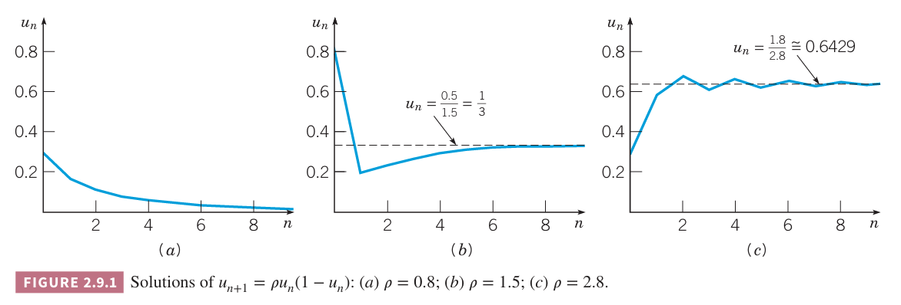
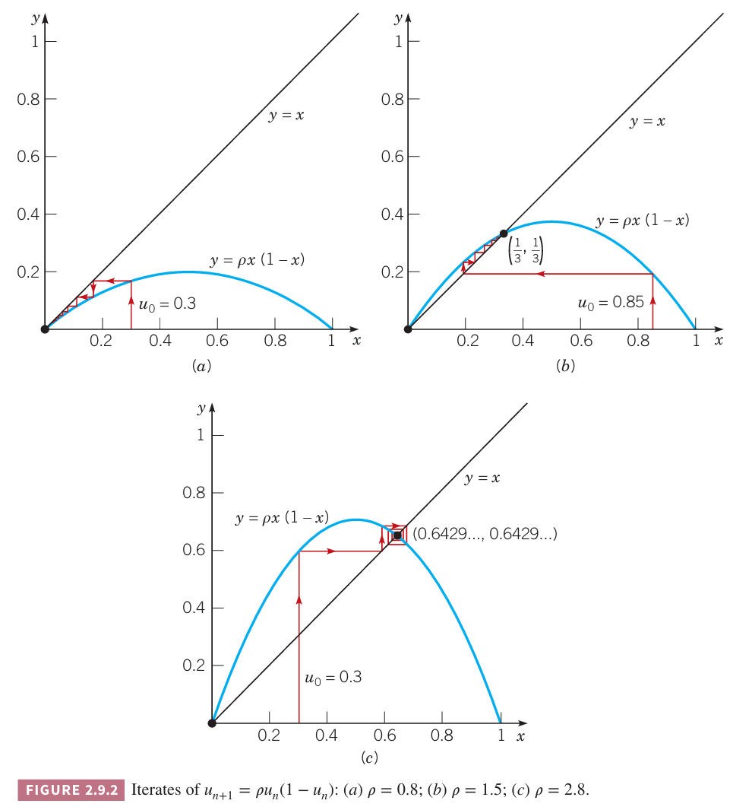
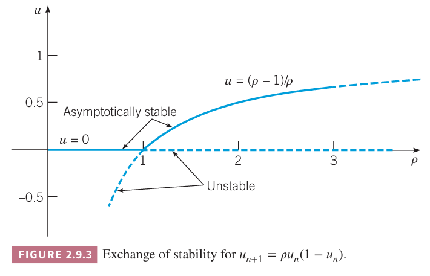
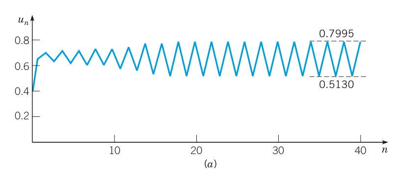
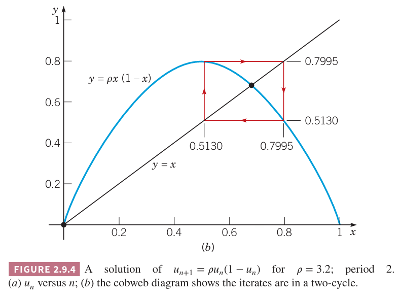
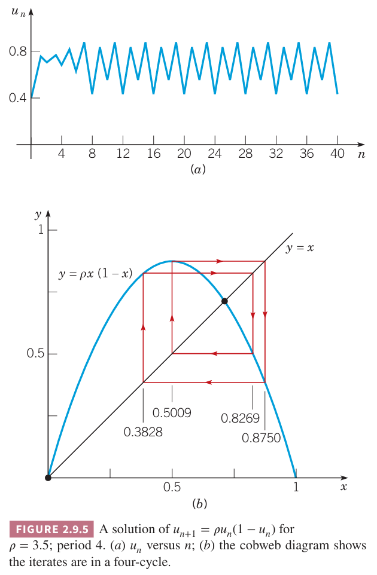
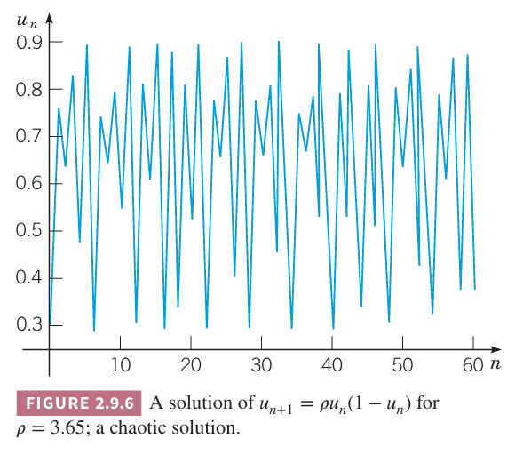
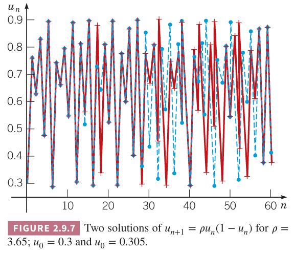

尽管引出微分方程的连续模型对很多问题而言都适用，但是适用离散模型更自然一些。比如 2.3 小节分析的复利问题，使用连续模型来近似离散模型。类似的，种群问题也更适合使用离散模型。对于世代不能重叠且固定间隔繁衍的物种而言，使用离散模型更好。第 $n+1$ 年种群的数量 $y_{n+1}$ 是前一年 $n$ 和 $y_n$ 的函数，即
$$y_{n+1}=f(n,y_n),n=0,1,2,\cdots\tag{1}$$
方程 $(1)$ 称为一阶差分方程（`first-order difference equation`）。一阶是说 $y_{n+1}$ 仅依赖于 $y_n$ 而不依赖于 $y_{n-1},y_{n-2},\cdots$。如果 $f$ 是 $y_n$ 的线性方程，那么 $(1)$ 是线性的（`linear`），否则是非线性的（`nonlinear`）。$(1)$ 的解是对应 $n$ 的一系列函数 $y_0,y_1,y_2,\cdots$。除了差分方程之外，还可以有初始条件（`initial condition`）
$$y_0=\alpha\tag{2}$$
表示解的第一项。

现在假定 $f$ 仅依赖于 $y_n$ 而不依赖于 $n$，那么
$$y_{n+1}=f(y_n),n=0,1,2,\cdots\tag{3}$$
如果 $y_0$ 给定了，那么通过 $(3)$ 可以找到解。因此
$$y_1=f(y_0)$$
且
$$y_2=f(y_1)=f(f(y_0))$$
$f(f(y_0))$ 称为差分方程的第二次迭代，有时写作 $f^2(y_0)$。类似的可以得到第三次迭代
$$f_3=f(y_2)=f(f(f(y_0)))=f^3(y_0)$$
一般地，第 $n$ 次迭代 $y_n$ 是
$$y_n=f(y_{n-1})=f^n(y_0)$$
这个过程称为迭代差分方程。我们对 $n\to\infty$ 时 $y_n$ 的行为更感兴趣。$y_n$ 是否有极限？如果存在，是多少？

对所有 $n$ 而言 $y_n$ 都一样称为平衡解（`equilibrium solution`）。和微分方程中的平衡解一样重要 。如果存在平衡解，那么 $y_{n+1}$ 等于 $y_n$，那么 $(3)$ 变成了
$$y_n=f(y_n)\tag{4}$$

### 线性方程
假定第 $n+1$ 年的种群数量 $y_{n+1}$ 是第 $n$ 年的数量 $y_n$ 乘以正数 $\rho_n$，即
$$y_{n+1}=\rho_ny_n,n=0,1,2,\cdots\tag{5}$$
这里繁殖率 $\rho_n$ 每年不同。差分方程 $(5)$ 是线性的，可以通过迭代求解。
$$y_1=\rho_0y_0$$
$$y_2=\rho_1y_1=\rho_1\rho_0y_0$$
一般地
$$y_n=\rho_{n-1}\rho_{n-2}\cdots\rho_0y_0,n=1,2,3,\cdots\tag{6}$$
如果初始数量 $y_0$ 给定了，那么通过 $(6)$ 可以计算得到后续的值。尽管这里 $\rho_n$ 直观上是正数，不过 $(6)$ 对负数也成立。不过如果对于某些 $n$ 而言有 $\rho_n$ 是零，那么后续的 $y$ 值都是零。也就是说种群消失了。

如果繁殖率 $\rho_n$ 对于每个 $n$ 都相同，都是 $\rho$，那么差分方程 $(5)$ 变成了
$$y_{n+1}=\rho y_n\tag{7}$$
解是
$$y_n=\rho^ny_0\tag{8}$$
方程 $(7)$ 有平衡解，即对所有 $n$ 有 $y_n=0$，初值也是 $y_0=0$。从 $(8)$ 很容易得到 $n$ 趋于无穷时 $y_n$ 的极限
$$\lim_{n\to\infty}=\begin{cases}
0,&&&|\rho|<1\\
y_0,&&&\rho=1\\
\text{does not exist}&&&\text{otherwise}
\end{cases}\tag{9}$$
换句话说，当 $|\rho|<1$ 时平衡解 $y_n=0$ 是渐进稳定的，当 $|\rho|>1$ 时是不稳定的。

下面修改 $(5)$ 表示的种群模型，引入 $b_n$ 表示第 $n$ 年种群净流入数量。那么 $y_{n+1}$ 由两个部分组成
$$y_{n+1}=\rho y_n+b_n,n=0,1,2,\cdots\tag{10}$$
其中繁殖率是常量 $\rho$。通过迭代法我们可以解决方程 $(10)$
$$\begin{aligned}
y_1&=\rho y_0+b_0\\
y_2=\rho(\rho y_0+b_0)+b_1&=\rho^2 y_0+\rho b_0+b_1\\
y_3=\rho(\rho^2 y_0+\rho b_0+b_1)+b_2&=\rho^3 y_0+\rho^2 b_0+\rho b_1+b_2
\end{aligned}$$
一般地
$$y_n=\rho^n y_0+\rho^{n-1}b_0+\rho^{n-2}b_1+\cdots+\rho b_{n-2}+b_{n-1}=\rho^n y_0+\sum_{j=0}^{n-1}\rho^{n-1-j}b_j\tag{11}$$
$(11)$ 的第一项表示原始种群的后代的数量，第二项表示流入种群及其后代的数量。

特殊情况对所有 $n$ 都有 $b_n=b\neq 0$，差分方程是
$$y_{n+1}=\rho y_n+b\tag{12}$$
从 $(11)$ 可以得到解是
$$y_n=\rho^n y_0+(1+\rho+\rho^2+\cdots+\rho^{n-1})b\tag{13}$$
如果 $\rho\neq 1$，解可以写作
$$y_n=\rho^n y_0+\frac{1-\rho^n}{1-\rho}b\tag{14}$$
和之前一样，第一项表示原始种群的后代的数量，第二项表示流入种群及其后代的数量。

将 $(14)$ 重写为
$$y_n=\rho^n\bigg(y_0-\frac{b}{1-\rho}\bigg)+\frac{b}{1-\rho}\tag{15}$$
更容易看出来 $n$ 很大时 $y_n$ 的行为。从上式可以看出，如果 $|\rho|<1$，那么 $y_n\to b/(1-\rho)$，如果 $|\rho|>1,\rho=-1$，$y_n$ 会无限增长，除非 $y_0=\frac{b}{1-\rho}$。当 $\rho\neq 1$ 时 $b/(1-\rho)$ 是 $(12)$ 的平衡解，这一点可以从方程推导出来（令 $y_{n+1}=y_n$）。对于 $(14)$ 而言，$\rho =1$ 是无效的。因此，必须从 $(13)$ 开始推导 $\rho =1$ 的情况，得到
$$y_n=y_0+nb\tag{16}$$
从这里很容易看出，当 $n\to\infty$ 时 $y_n$ 增长到无穷。

这个模型可以处理金融场景。$y_n$ 是第 $n$ 个周期时账户的余额，其中 $\rho_n=1+r_n$，$r_n$ 是第 $n$ 个周期的利率，$b_n$ 是对应周期存款或者取款。

例 1 贷款 10,000 美元买一辆车，如果贷款利率是 12%，如果要 4 年还清，每个月要偿还多少？

解：这个问题使用 $(12)$，$\rho=1+r$，偿还周期是月，因此 $\rho=1.01$。每月还款减少贷款额度，因此 $b$ 是负值，实际偿还 $|b|$。

$(12)$ 的解是 $(15)$，将 $\rho=1.01,y_0=10,000$ 代入得到
$$y_n=(1.01)^n(10,000+100b)-100b\tag{17}$$
四年还清，因此 $y_{48}=0$，那么可以得到
$$b=-100\frac{(1.01)^{48}}{(1.01)^{48}-1}=-263.34\tag{18}$$
总的还款额是 12,640.32，其中 10,000 是本金，2640,32 是利息。

### 非线性方程
非线性差分方程要比线性差分方程复杂的多，变种也多的多。因此这里仅讨论一个逻辑斯谛差分方程
$$y_{n+1}=\rho y_n\bigg(1-\frac{y_n}{k}\bigg)\tag{19}$$
这与 2.5 小节讨论的微分方程
$$\frac{dy}{dt}=ry\bigg(1-\frac{y}{K}\bigg)\tag{20}$$
类似。如果将 $(20)$ 中的微分 $dy/dt$ 替换为差值的商 $(y_{n+1}-y_n)/h$，那么 $(20)$ 就能转化成 $(19)$，其中 $\rho=1+hr,k=(1+hr)K/hr$。为了进一步简化 $(19)$ 这里令 $u_n=y_n/k$，那么
$$u_{n+1}=\rho u_n(1-u_n)\tag{21}$$
其中 $\rho$ 是正的参数。

首先分析平衡解。令 $(21)$ 中的 $u_{n+1}=u_n$ 可以得到，这就类似于 $(20)$ 中 $dy/dt=0$。结果是
$$u_n=\rho u_n-\rho u_n^2\tag{22}$$
可以得到平衡解
$$u_n=0,u_n=\frac{\rho-1}{\rho}\tag{23}$$
下一个问题是这些平衡解是渐进稳定解还是非稳定解。也就是说，初始值是平衡解附近的一个值，解是远离还是接近平衡解。

一种方式是在平衡解的附近使用线性方程来近似 $(21)$。比如在 $u_n=0$ 附近，在 $u_n^2$ 相比 $u_n$ 小很多，可以忽略这一项。那么得到线性差分方程
$$u_{n+1}=\rho u_n\tag{24}$$
在 $u_n$ 非常接近零的地方，这是足够好的 $(21)$ 的近似。$(24)$ 与方程 $(7)$ 一致，结论是方程 $(9)$，那么 $n\to\infty$ 时 $u_n\to 0$ 等价于 $|\rho|<1$。因此当 $|\rho|<1$ 时线性近似 $(24)$ 的平衡解 $u_n=0$ 是渐进稳定解，因此在相同 $|\rho|<1$ 的情况下，这个平衡解也是非线性方程 $(21)$ 的渐进稳定解。

上述结论是正确的，但是推理有欠缺。缺少一个理论说明 $(21)$ 的解的行为与 $(24)$ 的解的行为在 $u_n=0$ 附近一致。9.3 小节针对微分方程讨论同样的问题。

下面考虑平衡解 $u_n=(\rho-1)/\rho$。为了研究附近的点，我们将 $u_n$ 记作
$$u_n=\frac{\rho-1}{\rho}+v_n\tag{25}$$
其中 $v_n$ 相当小。将 $(25)$ 代入 $(21)$ 并简化得到
$$v_{n+1}=(2-\rho)v_n-\rho v_n^2\tag{26}$$
由于 $v_n$ 相当小，忽略平方项，得到线性近似
$$v_{n+1}=(2-\rho)v_n\tag{27}$$
应用 $(9)$，$|2-\rho|<1$ 的情况下，当 $n\to\infty$ 时 $v_n\to 0$。在 $1<\rho<3$ 这个范围内，平衡解 $u_n=(\rho-1)/\rho$ 是渐进平衡解。

下图是 $\rho=0.8,\rho=1.5,\rho=2.8$ 时 $(21)$ 的解的图像。对于 $\rho=0.8$ 解收敛于零，$\rho=1.5,\rho=2.8$ 收敛于非零平衡解。对于 $\rho=0.8,\rho=1.5$ 收敛（最终）是单调的，$\rho=2.8$ 时收敛是振荡的。图展示的是特定初值条件，对于其他初值而言，图像是类似的。

另一个展示微分方程的解的方式如下图所示。每一个图中，给出了抛物线 $y=\rho x(1-x)$ 和直线 $y=x$。平衡解是两条线的交点。分段的红色台阶样式的曲线表示一系列的解。从 $x$ 轴上的 $u_0$ 开始，垂直向上与抛物线相交，这就计算等到了 $\rho u_0(1-u_0)=u_1$，然后水平与 $y=x$ 相交，然后再垂直于抛物线相交得到下一个 $u$ 的值，反复迭代。

差分方程 $(21)$ 有两个平衡解 $u_n=0,u_n=(\rho-1)/\rho$，前者是 $0\leq \rho <1$ 时的渐进稳定解，后者是 $1<\rho<3$ 时的渐进稳定解。当 $\rho=1$ 时，两个平衡解都是 $u_n=0$，这个解也是渐进稳定的。如下图所示，$\rho$ 是横坐标轴 $u$ 是纵坐标抽。平衡解的区间也如图所示。在 $\rho=1$ 这个地方是两个稳定渐进解交换的地方。

对于 $\rho>3$，平衡解就不再稳定。随着 $\rho$ 的增加，方程 $(21)$ 的解也会更复杂。对于大于 3 的某个 $\rho$ 值，$u_n$ 的行为是周期为 2 稳定振荡，也就是说 $u_n$ 在两个值之间返回跳跃。比如下图是 $\rho=3.2$ 的情况，当 $n$ 足够大之后，就稳定是两个值。之类初始值是 0.4，其他在 0 到 1 范围内的初始值最后也会稳定到同样的结果上。

下图表示稳定之后解在抛物线和直线 $y=x$ 之间变换。

在 $\rho=3.449$ 附近，周期为 2 的振荡的每个状态分成两个不同的新状态，也就是说，周期变成了 4。下图是 $\rho=3.5$ 的情况。

随着 $\rho$ 的增加，周期继续倍增。周期变化的点称为分叉点（`bifurcation`），对应的参数值成为分叉值（`bifurcation value`）。

周期倍增大概到 $\rho$ 在 3.57 左右。对于 $\rho>3.57$，解有一定的规律性但是并没有固定模式。下图是 $\rho=3.65$ 的情况。在 0.3 到 0.9 之间振荡，但是不可预测。这种情形称为混沌（`chaotic`）。

混沌的一个特定是对初始值非常敏感。下图是 $\rho=3.65$ 的两个解。初始值是上图中的 0.3 和相近的 0.305，在前 15 次迭代，两个解很近很难区分，但是很快，两个图像变得相当的不同。无法用一个解的值去估算另一个解的值。

直到最近，差分方程和微分方程混沌解才广为人知。$(20)$ Robert May 在 1974 年发现和研究的数学混沌最早的实例之一。他将这个方程作为昆虫物种种群的模型进行分析，结果表明如果繁殖率 $\rho$ 太大，无法对种群做出长期有效的预测。看似简单的问题，但是解是混沌的，由此引发大量的研究，但许多问题仍然没有解决。不过，越来越清楚的是混沌比一开始的认为的更为普遍，并可能是对更广泛现象的研究的一部分。
