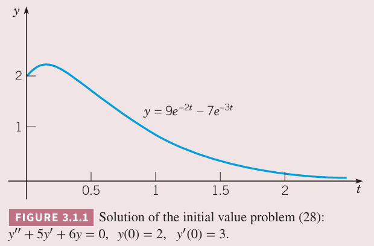
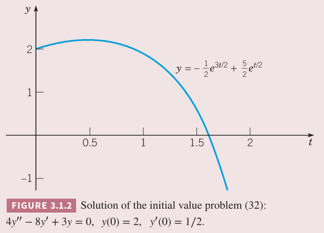

许多二阶常微分方程可以写作
$$\frac{d^2y}{dt^2}=f\bigg(t,y,\frac{dy}{dt}\bigg)\tag{1}$$
其中 $f$ 是给定的函数。这里使用 $t$ 表示自变量，因为很多物理问题和 $t$ 相关，有时也是用 $x$ 表示。$y$，偶尔也使用其他字母，表示因变量。如果 $f$ 形式是
$$f\bigg(t,y,\frac{dy}{dt}\bigg)=g(t)-p(t)\frac{dy}{dt}-q(t)y\tag{2}$$
那么方程 $(1)$ 是线性的。$(2)$ 中 $g,p,q$ 是 $t$ 的函数，不依赖于 $y$。这种情况下 $(1)$ 通常写作
$$y''+p(t)y'+q(t)=g(t)\tag{3}$$
有时我们也使用方程
$$P(t)y''+Q(t)y'+R(t)y=G(t)\tag{4}$$
表示。其中 $P(t)\neq 0$，两边同时除以 $P(t)$，结合 $(3)$ 得到
$$p(t)=\frac{Q(t)}{P(t)},q(t)=\frac{R(t)}{P(t)},g(t)=\frac{G(t)}{P(t)}\tag{5}$$
为了讨论方程 $(3)$ 并尝试解决它，这里限制 $p,q,g$ 是连续函数。

如果 $(1)$ 不是 $(3)$ 或 $(4)$ 的形式，那么是非线性的。非线性的分析法相对困难，所以这本书很少会涉及。数值法和几何法更合适，这些会在第八章和第九章讨论。

$(1),(3),(4)$ 和两个初始条件
$$y(t_0)=y_0,y'(t_0)=y_0'\tag{6}$$
组成了初值问题，其中 $y_0,y_0'$ 是给定值，表示初始 $t_0$ 时对应的 $y,y'$ 的值。二阶微分方程的初始值不仅确定解通过 $(t_0,y_0)$ 这一点，还确定了在该点的斜率是 $y_0'$。简单地讲，二阶微分方程的求解需要积分两次，会有连个任意常量，而两个初始条件用于确定这两个常量。这里假定这两个初始条件足够确定两个常量。

如果 $(3)$ 中的项 $g(t)$ 或 $(4)$ 中的项 $G(t)$ 对所有 $t$ 都是 0，那么二阶线性微分方程是齐次的（`homogeneous`），否则是非齐次的（`nonhomogeneous`）。$g(t),G(t)$ 在很多应用中表示外部施加的作用力。这里先讨论齐次方程
$$P(t)y''+Q(t)y'+R(t)y=0\tag{7}$$
3.5 和 3.6 小节会看到，一旦我们解决了齐次微分方程，那么很可能可以给出非齐次微分方程的解，至少可以表达成积分形式。因此解决齐次微分方程这个问题更基础。

这一章我们先讨论 $P,Q,R$ 是常量的情况。这种情况下，方程 $(7)$ 可以写作
$$ay''+by'+cy=0\tag{8}$$
其中 $a,b,c$ 是给定常量。可以证明 $(8)$ 总是可以容易的解出来。另外，如果不是常系数，方程 $(7)$ 更难解，第五章讨论这种情况。在解决 $(8)$ 之前，我们先看一个典型的例子。

例 1 求解微分方程
$$y''-y=0\tag{9}$$
并给出满足初始条件
$$y(0)=2,y'(0)=-1\tag{10}$$
的解。

解：观察 $(9)$，是 $(8)$ $a=1,b=0,c=-1$。方程 $(9)$ 是说一个函数的二阶导等于函数自身。直观地想，$y_1(t)=e^t$ 是满足条件的。稍微深入思考一下，$y_2(t)=e^{-t}$ 也是满足条件的。一些实验表明其常数倍也满足 $(9)$，比如 $2e^t,5e^{-t}$。那么对任意常数 $c_1,c_2$，$c_1y_1=c_2e^t,c_2y_2=c_2e^{-t}$ 也是满足 $(9)$ 的。

注意到，两个解的和也是 $(9)$ 的解，因此函数
$$y=c_1y_1(t)+c_2y_2(t)=c_1e^t+c_2e^{-t}\tag{11}$$
是 $(9)$ 的解，这很容易进行验证。也就是说两个基础解 $e^t,e^{-t}$ 的线性组合也是解。

下面使用初始条件确定这两个常量。将 $t=0,y=2$ 代入 $(11)$ 得到
$$c_1+c_2=2\tag{12}$$
对 $(11)$ 求导得到
$$y'=c_1e^t-c_2e^{-t}\tag{13}$$
将 $t=0,y'=-1$ 代入上式得到
$$c_1-c_2=-1\tag{14}$$
联立 $(12),(14)$ 得到
$$c_1=\frac{1}{2},c_2=\frac{3}{2}\tag{15}$$
因此满足初始条件的解是
$$y=\frac{1}{2}e^t+\frac{3}{2}e^{-t}\tag{16}$$
从上面的例子中，能够得到哪些有用信息来求解更一般的方程 $(8)$
$$ay''+by'+cy=0$$
其中 $a,b,c$ 是常量？首先解是指数函数。更进一步，如果得到两个解，那么它们的线性组合也是解。最后通过初始条件来确定常量。

可以证明通过这种方法我们可以求解任意的方程 $(8)$，且能给出满足初始条件的 $y,y'$ 的解。

我们从指数函数 $y=e^{rt}$ 开始，其中 $r$ 是待确定的参数。那么 $y'=re^{rt},y''=r^2e^{rt}$，代入 $(8)$ 得到
$$(ar^2+br+c)e^{rt}=0$$
由于 $e^{rt}\neq 0$，两边同时除以 $e^{rt}$ 得到
$$ar^2+br+c=0\tag{17}$$
方程 $(17)$ 称为方程 $(8)$ 的特征方程（`characteristic equation`）。如果 $r$ 是特征方程 $(17)$ 的根，那么 $y=e^{rt}$ 是微分方程的解。由于 $(17)$ 是二次实系数方程，有两个根，可能是两个不同的根，或者是共轭虚根，或者两个相同的实根。这里讨论两个不同的根的情况，其余情况分别在 3.3 和 3.4 小节讨论。

假定 $(17)$ 有两个不同的实根，用 $r_1,r_2,r_1\neq r_2$ 表示。那么 $y_1(t)=e^{r_1t},y_2(t)=e^{r_2t}$ 是 $(8)$ 的解。那么
$$y=c_1y_1(t)+c_2y_2(t)=c_1e^{r_1t}+c_2e^{r_2t}\tag{18}$$
也是 $(8)$ 的解。

对 $y$ 求一阶导和二阶导，代入 $(8)$，结合 $r_1,r_2$ 是 $(17)$ 的根，很容易证明 $(18)$ 是 $(8)$ 的解。

下面求解 $(18)$ 中的参数，使其满足初始条件 $(6)$
$$y(t_0)=y_0,y'(t_0)=y_0'$$
将 $t=t_0,y=y_0$ 代入 $(18)$ 得到
$$y_0=c_1e^{r_1t_0}+c_2e^{r_2t_0}\tag{22}$$
求一阶导得到
$$y'=c_1r_1e^{r_1t}+c_2r_2e^{r_2t}\tag{19}$$
将 $t=t_0,y'=y_0'$ 代入 $(19)$ 得到
$$y_0'=c_1r_1e^{r_1t_0}+c_2r_2e^{r_2t_0}\tag{23}$$
联立 $(22),(23)$ 得到
$$c_1=\frac{y_0'-y_0r_2}{r_1-r_2}e^{-r_1t_0},c_1=\frac{y_0r_1-y_0'}{r_1-r_2}e^{-r_2t_0}\tag{24}$$
由于之前假设特征方程 $(17)$ 有两个不同的解，即 $r_1-r_2\neq 0$，因此上式有意义。不管初始条件是什么，也就是不管 $(6)$ 里面的 $t_0,y_0,y_0'$ 是何值，都可以确定参数 $c_1,c_2$ 使之满足初始条件。同时也只有一组 $c_1,c_2$ 能够满足条件。$(18),(24)$ 是
$$ay''+by'+cy=0,y(t_0)=y_0,y'(t_0)=y_0'\tag{25}$$
的解。

下一节会证明 $(18)$ 包含所有 $(8)$ 的解，前提是 $(17)$ 有两个不同的实根。也就是说 $(18)$ 是 $(8)$ 的通解（`general solution`）。

例 2 求微分方程
$$y''+5y'+ty=0\tag{26}$$
的通解。

解：假定 $y=e^{rt}$，那么 $r$ 是特征方程
$$r^2+5r+6=(r+2)(r+3)=0$$
的根。因为 $r_1=-2,r_2=-3$，那么通解是
$$y=c_1e^{-2t}+c_2+e^{-3t}\tag{27}$$

例 3 求初值问题
$$y''+5y'+ty=0,y(0)=2,y'(0)=3\tag{28}$$
的解。

解：上个例子中给出了通解是
$$y=c_1e^{-2t}+c_2+e^{-3t}$$
将 $t=0,y=2$ 代入得到
$$c_1+c_2=2\tag{29}$$
通解求一阶导是
$$y'=-2c_1e^{-2t}-3c_2e^{-3t}$$
代入 $t=0,y'=3$ 得到
$$-2c_1-3c_2=3\tag{30}$$
联立 $(29),(30)$ 得到
$$c_1=9,c_2=-7$$
因此解是
$$y=9e^{-2t}-7e^{-3t}\tag{31}$$
解的图像如下图所示

例 4 求初值问题
$$4y''-8y'+3y=0,y(0)=2,y'(0)=\frac{1}{2}\tag{32}$$
的解。

解：假定 $y=e^{rt}$，那么 $r$ 是特征方程
$$4r^2-8r+3=0$$
根是
$$r_1=\frac{3}{2},r_2=\frac{1}{2}$$
那么微分方程的通解是
$$y=c_1e^{3t/2}+c_2e^{t/2}\tag{33}$$
应用初始条件得到
$$c_1+c_2=2,\frac{3}{2}c_1+\frac{1}{2}c_2=\frac{1}{2}$$
那么
$$c_1=-\frac{1}{2},c_2=\frac{5}{2}$$
因此解是
$$y=-\frac{1}{2}e^{3t/2}+\frac{5}{2}e^{t/2}\tag{34}$$
下图是解的曲线。

例 5 初值问题 $(28)$ 的初始斜率是正的，那么解 $(31)$ 在初始时是递增的，但是由于两个指数项的指数都是负数，最终趋于零。因此解存在最大值，求最大值对应的点。

解：最大值出现在导数为零的地方，$(31)$ 的一阶导是
$$y'=-18e^{-2t}+21e^{-3t}\tag{35}$$
令 $y'=0$ 并两边同时乘以 $e^{3t}$，那么
$$e^t=7/6$$
因此最大值对应的 $t$ 是
$$t_m=\ln(7/6)\approx 0.15415\tag{36}$$
那么最大值是
$$y_m=9e^{-2t_m}-7e^{-3t_m}=\frac{108}{49}\approx 2.20408\tag{37}$$

回到任意常系数微分方程 $ay''+by'+cy=0$，其特征方程有两个不同的实根，$r_1\neq r_2$，通解 $(18)$ 是两个指数函数的和。因此解的几何行为相对比较简单：如果两个指数都是负数，那么随着 $t$ 的增加趋于零。如果至少有一个指数是正数，那么无限增长。例 3 和例 4 说明了这一点。指数较大的指数函数前的系数的正负，决定了 $t\to\infty$ 时值是向正无穷还是负无穷。还有一种不常见的情况：一个根是零一个根是负数，此时趋于某个常量。
