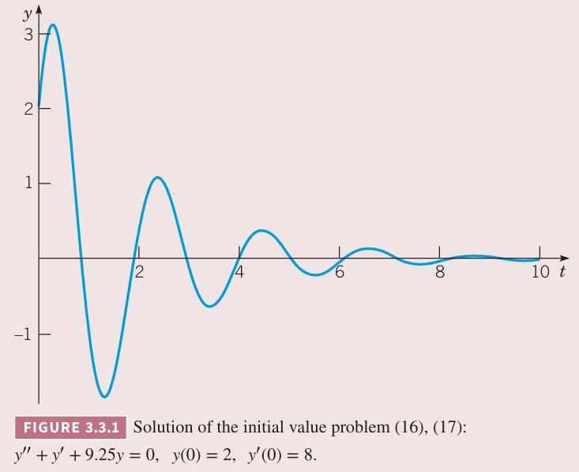
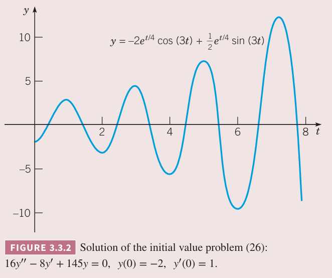
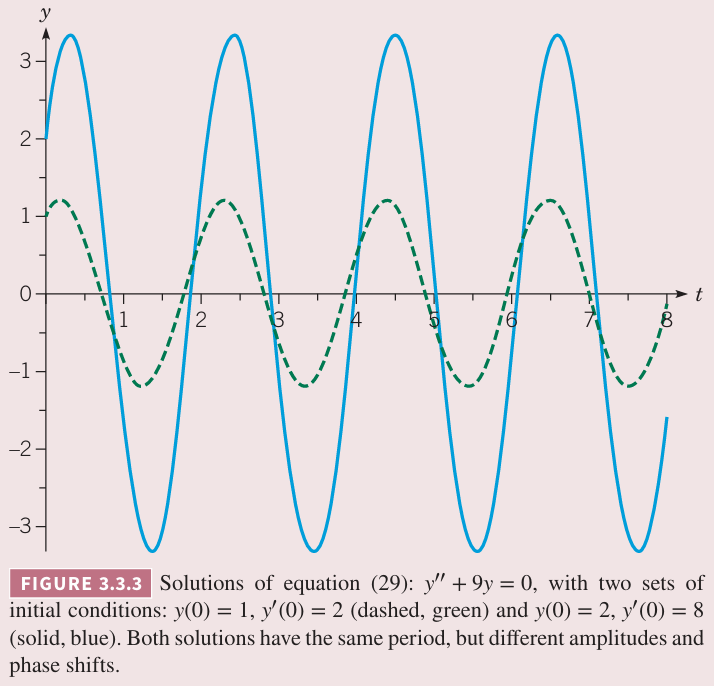

在 3.1 小节我们分析了二阶线性微分方程
$$ay''+by'+cy=0\tag{1}$$
其中 $a,b,c$ 是任意常数。如果 $y=e^{rt}$ 是解，那么 $r$ 是特征方程
$$ar^2+br+c=0\tag{2}$$
的根。在 3.1 中我们讨论了有两个实根 $r_1,r_2$ 的情况，此时判别式 $b^2-4ac$ 是正数。方程 $(1)$ 的通解是
$$y=c_1e^{r_1t}+c_2e^{r_2t}\tag{3}$$
现在假定 $b^2-4ac$ 是负数，那么 $(2)$ 有两个共轭复根，分别是
$$r_1=\lambda+i\mu,r_2=\lambda-i\mu\tag{4}$$
其中 $\lambda,\mu$ 是实数。相应的 $y$ 的表达式是
$$y_1(t)=\exp((\lambda+i\mu)t),y_2(t)=\exp((\lambda-i\mu)t)\tag{5}$$
首先需要讨论这两个式子的含义，这涉及到复指数的指数函数。比如 $\lambda=-1,\mu=2,t=3$ 那么 $(5)$ 就是
$$y_1(3)=e^{-3+6i}\tag{6}$$
$e$ 的复数次幂是什么含义呢？这就需要用到欧拉公式。

### 欧拉公式
为了表示 $(5)$ 的含义，需要给出复指数函数的意义。下面利用无穷级数的来分析。

在 $t=0$ 附近 $e^t$ 的泰勒展开是
$$e^t=1+t+\frac{t^2}{2}+\cdots+\frac{t^n}{n!}+\cdots=\sum_{n=0}^\infty\frac{t^n}{n!},-\infty<t<\infty\tag{7}$$
将 $(it)$ 代入上式得到
$$e^{it}=\sum_{n=0}^\infty\frac{(it)^n}{n!}\tag{8}$$
下面简化上式，对 $n$ 的奇偶分别讨论。当 $n$ 是偶数时，那么 $n=2k$，$i^n=i^{2k}=(-1)^k$；当 $n$ 是奇数时，那么 $n=2k+1$，$i^n=i^{2k+1}=i(-1)^k$，这就可以将 $(8)$ 分成实部和虚部。因此
$$e^{it}=\sum_{k=0}^\infty\frac{(-1)^kt^{2k}}{(2k)!}+i\sum_{k=0}^\infty\frac{(-1)^kt^{2k+1}}{(2k+1)!}\tag{9}$$
上式第一个级数是 $t=0$ 附近 $\cos t$ 的泰勒展开，第二个级数是 $t=0$ 附近 $\sin t$ 的泰勒展开，因此
$$e^{it}=\cos t+i\sin t\tag{10}$$
这就是欧拉公式（`Euler's formula`），极为重要的数学关系。

这里推导出 $(10)$ 有一个前提假设是 $(7)$ 对复数也适用。现在将 $e^{it}$ 定义为式子 $(10)$。

如果用 $t=-t$ 代入 $(10)$，结合 $\cos(-t)=\cos t,\sin(-t)=-\sin t$ 得到
$$e^{-it}=\cos t-i\sin t\tag{11}$$
使用 $\mu t$ 代入 $(10)$ 得到
$$e^{i\mu t}=\cos(\mu t)+i\sin(\mu t)\tag{12}$$
接下来扩展到用 $\lambda+\mu i$ 做指数。首先指数方程有性质
$$e^{(\lambda+\mu i)t}=e^{\lambda t}e^{i\mu t}\tag{13}$$
那么
$$\begin{aligned}
e^{(\lambda+i\mu)t}&=e^{\lambda t}(\cos(\mu t)+i\sin(\mu t))\\
&=e^{\lambda t}\cos(\mu t)+ie^{\lambda t}\sin(\mu t)
\end{aligned}\tag{14}$$
指数是复数的指数函数还是一个复数，实部和虚部由 $(14)$ 的右边给出。这是实部和虚部都是初等实函数。比如前面 $(6)$ 就可以写作
$$e^{-3+6i}=e^{-3}\cos 6+ie^{-3}\sin 6\approx 0.0478041-0.0139113i$$
根据定义 $(10),(14)$ 很容易证明指数求导也适用于复指数函数。使用 $(14)$ 很容易验证
$$\frac{d}{dt}(e^{rt})=re^{rt}\tag{15}$$
对复数 $r$ 成立。

例 1 求微分方程
$$y''+y'+9.25y=0\tag{16}$$
的通解。然后求满足初始条件
$$y(0)=2,y'(0)=9\tag{17}$$
的解，并话费 $0<t<10$ 的图像。

解：方程 $(16)$ 的特征方程是
$$r^2+r+9.25=0$$
因此根是
$$r_1=-\frac{1}{2}+3i,r_2=-\frac{1}{2}-3i$$
那么 $(16)$ 的两个根是
$$y_1(t)=\exp((-\frac{1}{2}+3i)t)=e^{-t/2}(\cos 3t+i\sin 3t)\tag{18}$$
$$y_2(t)=\exp((-\frac{1}{2}-3i)t)=e^{-t/2}(\cos 3t-i\sin 3t)\tag{19}$$
容易验证朗斯基 $W[y_1,y_2](t)=-6ie^{-t}$，不会是零，因此方程 $(16)$ 的通解是 $y_1(t),y_2(t)$ 的线性组合。

不过 $(16),(17)$ 都是实系数，那么期望使用实函数来表达解。根据定理 3.2.6，复数解的实部和虚部也是解，那么可以得到
$$u(t)=e^{-t/2}\cos 3t,v(t)=e^{-t/2}\sin 3t\tag{20}$$
是方程 $(16)$ 的实数解。朗斯基 $W[u,v](t)=3e^{-t}$，也不为零，那么 $u,v$ 是基础解系，那么方程 $(16)$ 的通解是
$$y=c_1u(t)+c_2v(t)=e^{-t/2}(c_1\cos 3t+c_2\sin 3t)\tag{21}$$
其中 $c_1,c_2$ 是任意常数。

为了满足初始条件 $(17)$，首先将 $t=0,y=2$ 代入解 $(21)$ 得到 $c_1=2$。对 $(21)$ 求导并代入 $t=0,y'=8$ 得到
$$-\frac{1}{2}c_1+3c_2=8$$
那么 $c_2=3$。因此初值问题 $(16),(17)$ 的解是
$$y=e^{-t/2}(2\cos 3t+3\sin 3t)\tag{22}$$
图像如下图所示

从这个图可以看出，解是振荡的，周期为 $2\pi/3$，振幅是衰减的。正弦和余弦控制解的振荡，负指数项影响了振幅最终会趋于零。

### 复根
当特征方程 $(2)$ 的根是复数 $\lambda\pm i\mu$ 时，方程 $(5)$ 给出的函数 $y_1(t),y_2(t)$ 是方程 $(1)$ 的解。不过解 $y_1,y_2$ 是复数函数，由于微分方程本身是实系数的，因此我们期望得到实函数解。根据定理 3.2.6，选择 $y_1,y_2$ 的实部和虚部，也都是解。因此解是
$$u(t)=e^{\lambda t}\cos \mu t,v(t)=e^{\lambda t}\sin \mu t\tag{23}$$
容易计算得到 $u,v$ 的朗斯基是
$$W[u,v](t)=\mu e^{2\lambda t}\tag{24}$$
只要 $\mu\neq 0$，那么朗斯基 $W$ 就不会为零，因此 $u,v$ 是基础解系。如果 $\mu =0$ 那么有两个相同的实根，这种情况会在下一节讨论。那么得到结论，如果特征方程的根是复数 $\lambda\pm i\mu$，那么方程 $(1)$ 的通解是
$$y=c_1e^{\lambda t}\cos \mu t+c_2e^{\lambda t}\sin \mu t\tag{25}$$
其中 $c_1,c_2$ 是任意常数。一旦知道了 $\lambda,\mu$，就能写出来解 $(25)$ 了。

例 2 求初值问题
$$16y''-8y'+145y=0,y(0)=-2,y'(0)=1\tag{26}$$
的解。

解：特征方程 $16r^2-8r+145=0$ 的根是 $r=\frac{1}{4}\pm 3i$，那么通解是
$$y(t)=c_1e^{t/4}\cos 3t+c_2e^{t/4}\sin 3t\tag{27}$$
首先应用第一个初始条件，令 $(27)$ 中 $t=0$ 得到
$$y(0)=c_1=-2$$
然后应用第二个初始条件，对 $(27)$ 求导并代入 $t=0$ 那么
$$y'(0)=\frac{1}{4}c_1+3c_2=1$$
因此 $c_2=\frac{1}{2}$，那么解是
$$y(t)=-2e^{t/4}\cos 3t+\frac{1}{2}e^{t/4}\sin 3t\tag{28}$$
图像如下图所示。

解是在振荡中增长的。$(28)$ 中三角函数决定了解中振荡的部分，周期是 $2\pi/3$，指数部分使得振荡的幅度随着时间增长而增长。

例 3 求
$$y''+9y=0\tag{29}$$
的通解。

解：特征方程 $r^2+9=0$ 的根是 $r=\pm 3i$，因此 $\lambda=0,\mu=3$。通解是
$$y=c_2\cos 3t+c_2\sin 3t\tag{30}$$

这里根的实部是零，因此没有指数项。下图展示了通解 $(28)$ 的两个初始条件不同的解。振荡的周期都是 $2\pi/3$，不过振幅和相位偏移由初始条件确定。由于解 $(30)$ 没有指数项，振荡的幅度不变。

