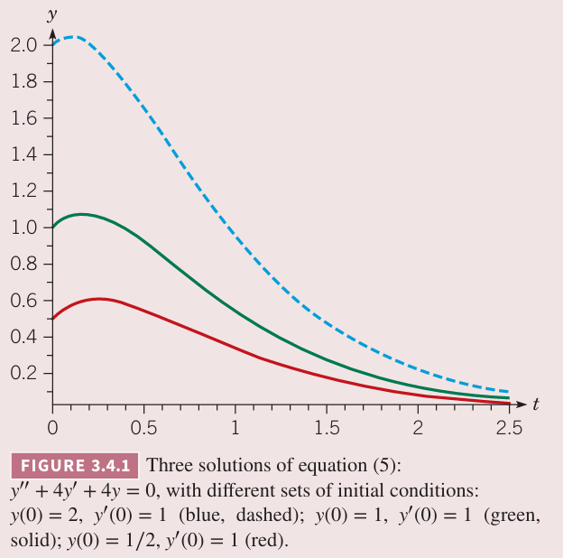
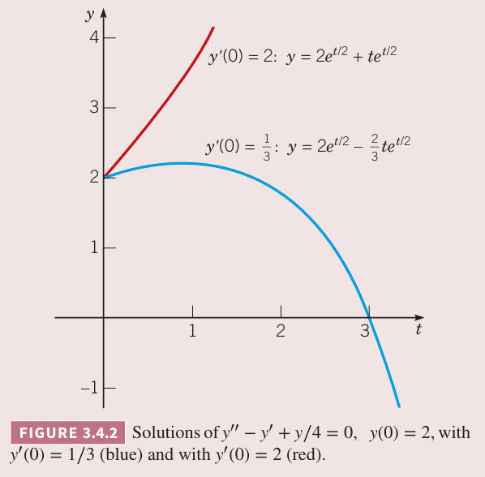

3.1 和 3.3 小节讨论了如何求解微分方程
$$ay''+by'+cy=0\tag{1}$$
其特征方程是
$$ar^2+br+c=0\tag{2}$$
特征方程有两个不同的实数解或者复数解。现在考虑第三种情况，两个根 $r_1,r_2$ 是相等的。此时，判别式 $b^2-4ac=0$。那么
$$r_1=r_2=-\frac{b}{2a}\tag{3}$$
困难立即就出现了，此时只有一个解
$$y_1(t)=e^{-bt/(2a)}\tag{4}$$
如何寻找第二个解呢？

例 1 求解微分方程
$$y''+4y'+4y=0\tag{5}$$
解：特征方程是
$$r^2+4r+4=(r+2)^2=0$$
得到 $r_1=r_2=-2$。因此方程 $(5)$ 的一个解是 $y_1(t)=e^{-2t}$。为了求通解，还需要找到一个不是 $y_1$ 常数倍的解。下面使用十八世纪 d'Alembert 给出的方法来找到第二个解。$y_1$ 是解，那么 $cy_1$ 也就是解。泛化这个思想，是否存在一个函数 $v(t)$ 使得 $v(t)y_1(t)$ 也是方程 $(1)$ 的解。

对于当前的问题，我们尝试将 $v(t)y_1(t)$ 代入 $(5)$。首先有
$$y=v(t)y_1(t)=v(t)e^{-2t}\tag{6}$$
求一阶导
$$y'=v'(t)e^{-2t}-2v(t)e^{-2t}\tag{7}$$
求二阶导
$$y''=v''(t)e^{-2t}-4v'(t)e^{-2t}+4v(t)e^{-2t}\tag{8}$$
将 $(6),(7),(8)$ 代入 $(5)$ 得到
$$(v''(t)-4v'(t)+4v(t)+4v'(t)-8v(t)+4v(t))e^{-2t}=0$$
化简得到
$$v''(t)=0\tag{9}$$
因此
$$v'(t)=c_1$$
那么
$$v'(t)=c_2t+c_2\tag{10}$$
其中 $c_1,c_2$ 是任意常量。将结果代入 $(6)$ 得到
$$y=c_1te^{-2t}+c_2e^{-2t}\tag{11}$$
上式右边第二项对应最开始的解 $y_1=e^{-2t}$，第一项对应第二个解 $y_2(t)=te^{-2t}$。这两个解的朗斯基是
$$\begin{aligned}
W[y_1,y_2](t)&=\begin{vmatrix}
e^{-2t}&te^{-2t}\\
-2e^{-2t}&(1-2t)e^{-2t}
\end{vmatrix}\\
&=e^{-4t}-2te^{-4t}+2te^{-4t}\\
&=e^{-4t}\neq 0
\end{aligned}$$
因此
$$y_1(t)=e^{-2t},y_2(t)=te^{-2t}\tag{12}$$
是微分方程 $(5)$ 的基础解系，通解是 $(11)$。当 $t\to\infty$ 时，$y_1(t),y_2(t)$ 都趋于零，因此 $(5)$ 的所有解都趋于零。下图给出了若干个解的图像。

现在使用例 1 的方法来解决一般性问题。假定方程 $(1)$ 系数满足 $b^2-4ac=0$，那么
$$y_1(t)=e^{-bt/(2a)}$$
为了找到第二个解，假设
$$y=v(t)y_1(t)=v(t)e^{-bt/(2a)}\tag{13}$$
代入 $(1)$ 来确定 $v(t)$。一阶导
$$y'=v'(t)e^{-bt/(2a)}-\frac{b}{2a}v(t)e^{-bt/(2a)}\tag{14}$$
二阶导
$$y''=v''e^{-bt/(2a)}-\frac{b}{a}v'(t)e^{-bt/(2a)}+\frac{b^2}{4a^2}v(t)e^{-bt/(2a)}\tag{15}$$
那么
$$\bigg(a\bigg(v''(t)-\frac{b}{a}v'(t)+\frac{b^2}{4a^2}v(t)\bigg)+b\bigg(v'(t)-\frac{b}{2a}v(t)\bigg)+cv(t)\bigg)e^{-bt/(2a)}=0\tag{16}$$
$e^{-bt/(2a)}$ 不为零，两边同除这个式子，合并同类项得到
$$av''(t)+(-b+b)v'(t)+\bigg(\frac{b^2}{4a}-\frac{b^2}{2a}+c\bigg)=0\tag{17}$$
第二项系数为零。第三项系数是 $(4ac-b^2)/(4a)$，分子恰好为零。因此 $(17)$ 就是
$$v''(t)=0$$
那么
$$v(t)=c_1+c_2t$$
代入 $(13)$ 得到
$$y=c_1e^{-bt/(2a)}+c_2te^{-bt/(2a)}\tag{18}$$
$y$ 是函数
$$y_1(t)=e^{-bt/(2a)},y_2=te^{-bt/(2a)}\tag{19}$$
的线性组合。这两个函数的朗斯基是
$$W[y_1,y_2](t)=\begin{vmatrix}
e^{-bt/(2a)}&te^{-bt/(2a)}\\
-\frac{b}{2a}e^{-bt/(2a)}&\bigg(1-\frac{bt}{2a}\bigg)e^{-bt/(2a)}
\end{vmatrix}=e^{-bt/a}\tag{20}$$
由于 $W[y_1,y_2](t)$ 永远不会是零，因此 $y_1,y_2$ 是基础解系。方程 $(18)$ 是方程 $(1)$ 的通解，$(1)$ 的特征方程有两个相等的实根。

例 2 求解初值问题
$$y''-y'+\frac{y}{4}=0,y(0)=2,y'(0)=\frac{1}{3}\tag{21}$$
解：特征方程是
$$r^2-r+\frac{1}{4}=0$$
那么 $r_1=r_2=\frac{1}{2}$。这个微分方程的通解是
$$y=c_1e^{t/2}+c_2te^{t/2}\tag{22}$$
第一个初始条件要求
$$y(0)=c_1=2$$
为了满足第二个初始条件，对 $(22)$ 求导并代入 $t=0$ 得到
$$y'(0)=\frac{1}{2}c_1+c_2=\frac{1}{3}$$
因此 $c_2=-2/3$。那么初值问题的解是
$$y=2e^{t/2}-\frac{2}{3}te^{t/2}\tag{23}$$
解的图像如下图蓝线所示。

修改初始斜率，令第二个初始条件是 $y'(0)=2$，那么解是
$$y=2e^{t/2}+te^{t/2}$$
如上图红色曲线。上图说明初始斜率在 1/3 和 2 之间，存在一个临界斜率，将解分成两种：当 $t\to\infty$ 时，是无限制增长还是无限下降。事实上，令这个临界斜率为 $y'(0)=b$，那么
$$y'(0)=\frac{1}{2}c_1+c_2=1+c_2=b$$
那么 $c_2=b-1$，通解是
$$y=2e^{t/2}+(b-1)te^{t/2}$$
这个临界斜率是 1。

解的渐进行为与根为两个不同实数和复数类似。如果指数是正的或者是负的，那么解的大小增长或者减少，线性因子 $t$ 影响相当小。如果两个相等的根都是零，那么微分方程是 $y''=0$，那么通解是 $t$ 的线性函数。

### 总结
常系数二阶线性微分方程
$$ay''+by'+cy=0\tag{24}$$
的特征方程
$$ar^2+br+c=0\tag{25}$$
的两个根是 $r_1,r_2$。

如果 $r_1,r_2$ 是不相等的实根，那么 $(24)$ 的通解是
$$y=c_1e^{r_1t}+c_2e^{r_2t}\tag{26}$$
如果 $r_1,r_2$ 是共轭复数 $\lambda\pm i\mu$，那么通解是
$$y=c_1e^{\lambda t}\cos\mu t+c_2e^{\lambda t}\sin\mu t\tag{27}$$
如果 $r_1=r_2$，通解是
$$y=c_1e^{r_1 t}+c_2te^{r_1t}\tag{28}$$

### 降阶法
值得注意的是，本届介绍的方法可以用于更一般的情况。假定我们已经知道了不处处为零的函数 $y_1(t)$ 是微分方程
$$y''+p(t)y'+q(t)y=0\tag{29}$$
的一个解。为了找到另一个解，令
$$y=v(t)y_1(t)\tag{30}$$
那么一阶导是
$$y'=v'(t)y_1(t)+v(t)y_1'(t)$$
二阶导是
$$y''=v''(t)y_1(t)+2v'(t)y_1'(t)+v(t)y_1''(t)$$
将这些代入 $(29)$ 得到
$$y_1v''+(2y_1'+py_1)v'+(y_1''+py_1'+qy_1)v=0\tag{31}$$
由于 $y_1$ 是方程 $(29)$ 的解，那么 $v$ 的系数等于零，那么 $(31)$ 简化成
$$y_1v''+(2y_1'+py_1)v'=0\tag{32}$$
$(32)$ 是 $v'$ 的一阶微分方程。一旦 $v'$ 计算得到了，再次积分得到 $v$，然后代入 $(30)$ 得到通解 $y$。这个过程称为降阶（`reduction of order`），最关键的步骤是将求原始的 $y$ 的二阶微分方程变为求解 $v'$ 的一阶微分方程。

例 3 微分方程
$$2t^2y''+3ty'-y=0,t>0\tag{33}$$
的一个解是
$$y_1(t)=t^{-1}$$
求微分方程的基础解系。

解：令 $y=v(t)y_1$，那么
$$y'=v't^{-1}-vt^{-2}$$
$$y''=v''t^{-1}-2v't^{-2}+2vt^{-3}$$
代入 $(33)$ 得到
$$\begin{aligned}
2t^2(v''t^{-1}&-2v't^{-2}+2vt^{-3})+3t(v't^{-1}-vt^{-2})-vt^{-1}\\
&=2tv''+(-4+3)v'+(4vt^{-1}-3vt^{-1}-vt^{-1})v\\
&=2tv''-v'\\
&=0
\end{aligned}\tag{34}$$
令 $w=v'$，那么上面的二阶微分方程降阶为可分离的一阶微分方程
$$2tw'-w=0$$
分离变量法解的
$$w(t)=v'(t)=ct^{1/2}$$
积分得到
$$v(t)=\frac{2}{3}ct^{3/2}+k$$
那么
$$y=v(t)t^{-1}=\frac{2}{3}ct^{1/2}+kt^{-1}\tag{35}$$
其中 $c,k$ 都是常量。$(35)$ 右边第二个项是题目给出的解 $y_1(t)$，第一项给出了第二个解 $y_2(t)=t^{1/2}$。$y_1,y_2$ 的朗斯基是
$$W[y_1,y_2](t)=\frac{3}{2}t^{-3/2}\neq -,t>0\tag{36}$$
因此 $y_1,y_2$ 是方程 $(33)$ 的基础解系。
