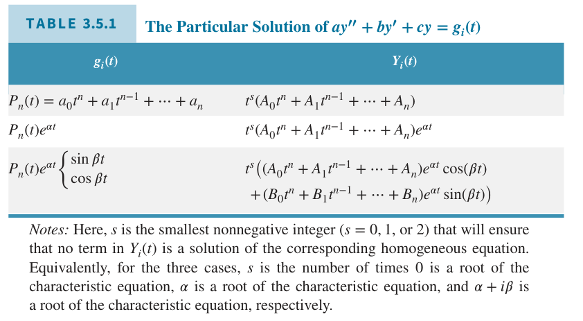

现在聚焦与非齐次二阶线性微分方程
$$L[y]=y''+p(t)y'+q(t)y=g(t)\tag{1}$$
其中 $p,q,g$ 在开区间 $I$ 上连续。相应的齐次方程是
$$L[y]=y''+p(t)y'+q(t)y=0\tag{2}$$
下面的定理描述了非齐次方程 $(1)$ 的解的结构，提供了构造通解的方法。

**定理 3.5.1**
> 如果 $Y_1,Y_2$ 是非齐次线性微分方程 $(1)$ 的解，那么差值 $Y_1-Y_2$ 是相应的齐次微分方程 $(2)$ 的解。如果 $(2)$ 的基础解系是 $y_1,y_2$，那么
> $$Y_1-Y_2=c_1y_1(t)+c_2y_2(t)\tag{3}$$
> 其中 $c_1,c_2$ 是确定常量。

$Y_1,Y_2$ 满足方程
$$L[Y_1](t)=g(t),L[Y_2](t)=g(t)\tag{4}$$
两式相减得到
$$L[Y_1](t)-L[Y_2](t)=0\tag{5}$$
因为
$$L[Y_1-Y_2]=L[Y_1]-L[Y_2]$$
所以 $(5)$ 是
$$L[Y_1-Y_2](t)=0\tag{6}$$
上式表明 $Y_1-Y_2$ 是方程 $(2)$ 的解。最后，根据定理 3.2.4 $(2)$ 的所有解都是基础解系的线性组合，那么解 $Y_1-Y_2$ 可以写成 $(3)$ 右边的形式。

**定理 3.5.2**
> 非齐次方程 $(1)$ 的通解可以写作
> $$y=\phi(t)=c_1y_1(t)+c_2y_2(t)+Y(t)\tag{7}$$
> 这种形式，其中 $y_1,y_2$ 是对应齐次微分方程 $(2)$ 的基础解系，$c_1,c_2$ 是任意常数，$Y$ 是非齐次方程 $(1)$ 的任意解。

根据定理 3.5.1，如果 $Y_1$ 是 $(1)$ 的任意解，$Y_2$ 是指定的某个解 $Y$，那么
$$\phi(t)-Y(t)=c_1y_1(t)+c_2y_2(t)\tag{8}$$
这等价于 $(7)$。由于 $\phi$ 是 $(1)$ 的任意解，那么 $(7)$ 的右边包含了 $(1)$ 的所有解，因此称为 $(1)$ 的通解。

定理 3.5.2 还指出了一种求解非齐次方程 $(1)$ 的方法。

1. 求相应的齐次方程的通解 $c_1y_1(t)+c_2y_2(t)$，这个解也称为互补解（`complementary solution`），用 $y_c(t)$ 表示。
2. 求出非齐次方程的任意解 $Y(t)$。通常这个解称为特解（`particular solution`）。
3. 对 1 和 2 两个步骤的解求和。

之前的小节已经讨论了如何求解 $y_c(t)$。因此这一节后续和下一节 3.6 讨论如何求解非齐次线性微分方程 $(1)$ 的特解 $Y(t)$。这里主要讨论两种方法：这一节分析待定系数法，下一节分析参数变分法。两种方法各有优缺点。

### 待定系数法
待定系数法是假设特解 $Y(t)$ 的形式，但是其系数待定。然后将这个假设解代入到非齐次方程 $(1)$ 中确定系数。如果成功了，那么找到了微分方程 $(1)$ 的一个解，使用这个解作为特解 $Y(t)$。如果不能确定系数，那么说明假设的形式没有解。这种情况下需要修改假设的解的形式。

待定系数法的优势是一旦假设了的 $Y(t)$ 形式就非常直接了。主要限制是对容易写下特解形式的方程很有用，那么就要求对应的齐次方程的系数是常数并且非齐次项只能是很少的一类函数。这里仅考虑非齐次项是多项式、指数函数、正弦和余弦函数。尽管有这样的限制，待定系数法对解决很多应用问题都很有用。不过，代数细节很无趣。

例 1 求
$$y''-3y'-4y=3e^{2t}\tag{9}$$
的特解。

解：由于指数函数的导数和自身相关，那么一个合理的假设是 $Y(t)$ 是 $e^{2t}$ 的若干倍。
$$Y(t)=Ae^{2t}$$
这里系数 $A$ 待定。计算二阶导
$$Y'(t)=2Ae^{2t},Y''(t)=4Ae^{2t}$$
代入非齐次微分方程 $(9)$ 得到
$$Y''-3Y'-4Y=(4A-6A-4A)e^{2t}=3e^{2t}$$
因此 $-6A=3$，那么 $A=-\frac{1}{2}$。因此特解是
$$Y(t)=-\frac{1}{2}e^{2t}\tag{10}$$

例 2 求
$$y''-3y'-4y=2\sin t\tag{11}$$
的特解。

解：和例 1 类似，假定 $Y(t)=A\sin t$，$A$ 是待定系数。求导并代入 $(11)$ 得到
$$Y''-3Y'-4Y=-A\sin t-3A\cos t-4A\sin t=2\sin t$$
整理得到
$$(2+5A)\sin t+3A\cos t=0\tag{12}$$
对于任意 $t$ 方程 $(12)$ 都要成立。那么在特殊点 $t=0,t=\frac{\pi}{2}$ 处也要成立。在这些点上我们得到 $3A=0,2+5A=0$。得出了矛盾，因此不管如何选择 $A$ 都无法使得 $(12)$ 在点 $t=0,t=\frac{\pi}{2}$ 处同时成立。因此之前的猜测不对。

方程 $(12)$ 中出现了余弦项，因此对原始的猜测 $Y(t)$ 添加上余弦项，那么
$$Y(t)=A\sin t+B\cos t$$
其中 $A,B$ 是待定系数。求导
$$Y'(t)=A\cos t-B\sin t,Y''(t)=-A\sin t-B\cos t$$
代入方程 $(11)$ 并合并同类项得到
$$Y''-3Y'-4Y=(-A+3B-4A)\sin t+(-B-3A-4B)\cos t\tag{13}$$
同样的，令 $t=0,t=\frac{\pi}{2}$ 得到
$$-4A+3B=2,-3A-5B=0$$
解得
$$A=-\frac{5}{17},B=\frac{3}{17}$$
因此方程 $(11)$ 的特解是
$$Y(t)=-\frac{5}{17}\sin t+\frac{3}{17}\cos t$$

这种方法还可以用于右边是多项式的情况，比如为了求
$$y''-3y'-4y=4t^2-1\tag{14}$$
的特解，我们假定特解也是多项式且最高次幂相等，即 $Y(t)=At^2+Bt+C$。

如果非齐次项 $g(t)$ 是指数函数 $e^{\alpha}t$，那么假定 $Y(t)$ 正比于同样的指数函数。如果 $g(t)$ 是 $\sin\beta t$ 或 $\cos\beta t$，那么假定 $Y(t)$ 是 $\sin\beta t,\cos\beta t$ 的线性组合，如果 $g(t)$ 是 $n$ 次幂的多项式，那么假定 $Y(t)$ 也是 $n$ 次幂的多项式。同样的原则可以拓展到 $g(t)$ 是这三种函数任意两种之积或者是三者之积。

例 3 求
$$y''-3y'-4y=-8e^t\cos 2t\tag{15}$$
的特解。

解：这种情况下假定 $Y$ 是 $e^t$ 与 $\cos 2t,\sin 2t$ 的线性组合的乘积。
$$Y=Ae^t\cos 2t+Be^t\sin 2t$$
一阶导
$$Y'=(A+2B)e^t\cos 2t+(-2A+B)e^t\sin 2t$$
二阶导
$$Y''=(-3A+4B)e^t\cos 2t+(-4A-3B)e^t\sin 2t$$
代入 $(15)$ 得到
$$10A+2B=8,2A-10B=0$$
那么
$$A=\frac{10}{13},B=\frac{2}{13}$$
因此特解
$$Y=\frac{10}{13}e^t\cos 2t+\frac{2}{13}e^t\sin 2t$$

现在假定 $g(t)$ 是两个子项之和，$g(t)=g_1(t)+g_2(t)$，且 $Y_1,Y_2$ 分别是微分方程
$$ay''+by'+cy=g_1(t)\tag{16}$$
$$ay''+by'+cy=g_2(t)\tag{17}$$
的解。那么 $Y_1+Y_2$ 是方程
$$ay''+by'+cy=g(t)\tag{18}$$
的解。将 $Y_1+Y_2$ 代入 $(18)$ 然后利用 $(16),(17)$ 就可以证明。$g(t)$ 可以拓展为任意有限个项之和。这样，结合之前的结论，可以解决一大类微分方程。

例 4 求微分方程
$$y''-3y'-4y=3e^{2t}+2\sin t-8e^t\cos 2t\tag{19}$$
的特解。

解：将 $(19)$ 右边分成三项之和，我们可以得到如下三个微分方程。
$$y''-3y'-4y=3e^{2t}$$
$$y''-3y'-4y=2\sin t$$
$$y''-3y'-4y=8e^t\cos 2t$$
这三个方程是例 1 2 3，因此特解是之前特解之和。
$$Y(t)=-\frac{1}{2}e^{2t}-\frac{5}{17}\sin t+\frac{3}{17}\cos t+\frac{10}{13}e^t\cos 2t+\frac{2}{13}e^t\sin 2t$$

上述方法有时也会遇到问题，比如下面的例子。

例 5 求
$$y''-3y'-4y=2e^{-t}\tag{20}$$
的特解。

解：和例 1 相似，假定 $Y(t)=Ae^{-t}$。代入 $(20)$ 得到
$$Y''-3Y'-4Y=(A+3A-4A)e^{-t}=2e^{-t}\tag{21}$$
上式的左边是零，不管 $A$ 如何选择，都无法满足 $0=2e^{-t}$。因此 $(20)$ 的特解不是我们假设的形式。如果我们求解对应的齐次微分方程
$$y''-3y'-4y=0\tag{22}$$
可以得到基础解系是 $y_1(t)=e^{-t},y_2(t)=e^{4t}$。因此我们假设的特解是齐次微分方程的解，那么无法是非齐次微分方程的特解。现在需要重新考虑特解的形式。

这里有几个方法可选。第一个是试图猜测一个其他形式的特解。第二个是使用其他方法求得解。这里简单阐述两种方法求解。

第一种是 3.4 小节分析的降阶法。令解 $Y(t)=v(t)e^{-t}$，那么 $Y'=(v'-v)e^{-t},Y''=(v''-2v'+v)e^{-t}$，代入方程 $(20)$ 得到 $v''-5v'=2$。接着令 $w=v'$，那么得到线性方程 $w'-5w=2$，得到 $w$ 之后积分得到 $v$，进而得到解 $Y$。

第二种方法是说微分方程可以写作 $y''+by'+cy=(D^2+bD+c)y=g(t)$，如果特征方程的两个根是 $r_1,r_2$，那么
$$(D-r_1)(D-r_2)y=g(t)$$
其中 $r_1+r_2=-b,r_1c_2=c$。令 $u(t)=(D-r_2)y$，那么二阶微分方程就可以写作两个一阶线性微分方程。
$$(D-r_1)u=g(t)$$
$$(D-r_2)y=u(t)$$
求解两个线性微分方程就可以得到解。

还有就是寻找一个更简单的也会遇到这个问题的方程，看看它的解的形式对处理方程 $(20)$ 有没有帮助。比如线性方程
$$y'+y=2e^{-t}\tag{23}$$
这里猜测其特解形式是 $e^{-t}$，仍旧会失败，因为 $e^{-t}$ 是对应齐次方程 $y'+y=0$ 的解。不过，从 2.1 小节我们以及知道如何求解线性微分方程。两边同乘积分因子 $\mu(t)=e^t$ 然后两边积分得到
$$y=2te^{-t}+ce^{-t}\tag{24}$$
第二项是齐次方程 $y'+y=0$ 的解，第一项是 $(23)$ 的解。观察这个解，指数项 $e^{-t}$ 前面有个因子 $t$。这是一个有用的线索。

现在假定 $(20)$ 的特解形式是 $Y(t)=Ate^{-t}$，那么
$$Y'(t)=Ae^{-t}-Ate^{-t},Y''(t)=-2Ae^{-t}+Ate^{-t}\tag{25}$$
代入方程 $(20)$ 得到
$$Y''-3Y-4Y=(-2A-3A)e^{-t}+(A+3A-4A)te^{-t}=2e^{-t}$$
$te^{-t}$ 的系数为零，$-5A=2$，那么 $A=-\frac{2}{5}$。因此特解是
$$Y(t)=-\frac{2}{5}te^{-t}\tag{26}$$

根据上面的例子我们可以得到如下结论：如果假设的特解形式是对应齐次方程的解，那么对之前的假设乘上 $t$。偶尔这仍旧是齐次方程的解，此时需要再乘以 $t$。对于二阶方程，这个过程不需要再继续了。

### 总结
求解非齐次线性微分方程
$$ay''+by'+cy=g(t)\tag{27}$$
其中 $a,b,c$ 是常量，的过程如下。

1. 求解对应的齐次方程的通解。
2. 确定 $(27)$ 中的 $g(t)$ 是之前讨论的形式，仅涉及指数函数、正弦、余弦和多项式函数，可以是这些函数的乘积或和。如果不是的话，考虑使用 3.6 小节讨论的参数变分法。
3. 如果 $g(t)=g_1(t)+g_2(t)+\cdots+g_n(t)$，这是 $n$ 个子问题，第 $i$ 个子问题是
$$ay''+by'+cy=g_i(t)$$
其中 $i$ 从 1 到 $n$。

4. 对于 $i$ 个子问题，假定特解 $Y_i(t)$ 是恰当的包含指数函数、正弦、余弦、多项式函数或其组合的形式。如果 $Y(t)$ 是齐次方程的解，那么 $Y_i(t)$ 乘以 $t$ 或 $t^2$，使之不是通解的一部分。

5. 对每一个子问题求得特解 $Y_i(t)$，那么 $Y_1(t)+Y_2(t)+\cdots+Y_n(t)$ 是 $(27)$ 的特解。
6. 特解加上通解就是非齐次方程的通解。
7. 如果给定了初始条件，利用这些条件确定通解问题中的任意常数。

待定系数法自我修正，如果假定的 $Y(t)$ 过去简单，得出一个矛盾的结论，那么需要修改假设。如果假设了太多的项，那么会进行一些不必要的工作得到其中一些系数是零，最后都可以得到正确的解。

### 待定系数法的证明
为了证明待定系数法如期工作，这里考虑 $g(t)$ 的一般形式。

第一种情况，$g(t)=P_n(t)=a_0t^n+a_1t^{n-1}+\cdots+a_n$，那么方程 $(27)$ 是
$$ay''+by'+cy=a_0t^n+a_1t^{n-1}+\cdots+a_n\tag{28}$$
假定特解是
$$Y(t)=A_0t^n+A_1t^{n-1}+\cdots+A_{n-1}t+A_n\tag{29}$$
代入 $(28)$ 得到
$$\begin{aligned}
a(n(n-1)&A_0t^{n-2}+\cdots+2A_{n-2})\\
b(n&A_0t^{n-1}+\cdots+A_n-1)\\
c(&A_0t^n+\cdots+A_n)\\
=&a_0t^n+a_1t^{n-1}+\cdots+a_n
\end{aligned}\tag{30}$$
从 $t^n$ 项开始，对应次幂的系数相等，那么
$$\begin{aligned}
cA_0&=a_0\\
cA_1+nbA_0&=a_1\\
\vdots\\
cA_n+bA_{n-1}+\cdots+2AA_{n-2}&=a_n
\end{aligned}$$
假定 $c\neq 0$，那么解得 $A_0=a_0/c$，然后依次求解 $A_1,A_2,\cdots,A_n$。

如果 $c=0,b\neq 0$，那么 $(30)$ 的左边最高幂次是 $n-1$，此时无法使 $(30)$ 成立。为了确保左边多项式最高幂次是 $n$，特解 $Y(t)$ 的最高幂次是 $n+1$，因此假定
$$Y(t)= t(A_0t^n+A_1t^{n-1}+\cdots+A_{n-1}t+A_n)$$
代入 $(28)$ 得到
$$\begin{aligned}
aY''+bY'&=bA_0(n+1)t^n+(aA_0n(n+1)+bA_1n)t^{n-1}+\cdots\\
&=a_0t^n+a_1t^{n-1}+\cdots+a_n
\end{aligned}$$
此时 $Y(t)$ 没有常数项，由于齐次方程中 $c=0$，常数项是齐次方程的解。由于 $b\neq 0$，那么 $A_0=a_0/(b(n+1))$，依次求解系数 $A_1,A_2,\cdots,A_n$。

如果 $c,b$ 都是零，那么特征方程是 $ar^2=0$，$r=0$ 是重复根，因此对应齐次方程的基础解系是 $y_1=e^{0t}=1,y_2=te^{0t}=t$。这样我们的假设需要再次乘以 $t$
$$Y(t)= t^2(A_0t^n+A_1t^{n-1}+\cdots+A_{n-1}t+A_n)$$
那么 $aY''$ 最高次幂是 $n$，和之前类似处理即可。此时 $Y(t)$ 没有常数项和线性项，因为它们是齐次方程的解。

第二种情况，$g(t)=e^{\alpha t}P_n(t)$。问题就是求
$$ay''+by'+cy=e^{\alpha t}P_n(t)\tag{31}$$
的特解。多项式部分前面处理过了，这里不再赘述。令特解是
$$Y(t)=e^{\alpha t}u(t)$$
那么
$$Y'(t)=e^{\alpha t}(u'(t)+\alpha u(t))$$
$$Y''(t)=e^{\alpha t}(u''(t)+2\alpha u'(t)+\alpha^2u(t))$$
代入方程 $(31)$ 并两边消去 $e^{\alpha t}$ 得到
$$au''(t)+(2a\alpha+b)u'(t)+(a\alpha^2+b\alpha+c)u(t)=P_n(t)\tag{32}$$
这个问题和 $(28)$ 一样。如果 $\alpha^2+b\alpha+c\neq 0$，那么假定 $u(t)=A_0t^n+A_1t^{n-1}+\cdots+A_{n-1}t+A_n$，因此 $(31)$ 的特解是
$$Y(t)=e^{\alpha t}(A_0t^n+A_1t^{n-1}+\cdots+A_{n-1}t+A_n)\tag{33}$$
如果 $\alpha^2+b\alpha+c=0,2a\alpha+b\neq 0$，那么 $u(t)=t(A_0t^n+A_1t^{n-1}+\cdots+A_{n-1}t+A_n)$，那么 $Y(t)$ 是 $(33)$ 的右边乘以 $t$。注意，如果 $\alpha^2+b\alpha+c=0$ 那么 $e^{\alpha t}$ 是齐次方程的解。

如果 $\alpha^2+b\alpha+c=0,2a\alpha+b=0$，那么 $e^{\alpha t},te^{\alpha t}$ 都是齐次方程的通解，那么 $u(t)$ 的正确形式是 $t^2(A_0t^n+A_1t^{n-1}+\cdots+A_{n-1}t+A_n)$，因此 $Y(t)$ 是 $(33)$ 右边乘以 $t^2$。

第三种情况，$g(t)=e^{\alpha t}P_n(t)\cos\beta t$ 或 $g(t)=e^{\alpha t}P_n(t)\sin\beta t$。这两个类似，这里仅讨论后者。欧拉公式有一个推论是
$$\sin\beta t=\frac{e^{i\beta t}-e^{-i\beta t}}{2i}$$
因此假定
$$Y(t)=e^{(\alpha+i\beta)t}(A_0t^n+A_1t^{n-1}+\cdots+A_{n-1}t+A_n)+e^{(\alpha-i\beta)t}(B_0t^n+B_1t^{n-1}+\cdots+B_{n-1}t+B_n)$$
或者等价于
$$Y(t)=e^{\alpha t}(A_0t^n+A_1t^{n-1}+\cdots+A_{n-1}t+A_n)\cos\beta t+e^{\alpha t}(B_0t^n+B_1t^{n-1}+\cdots+B_{n-1}t+B_n)\sin\beta t$$
通常我们倾向使用后者，因为它不包含复数项。如果 $\alpha\pm i\beta$ 是对应齐次方程的特征方程的根，那么特解需要乘以 $t$ 来增加最高次幂的系数。

如果非齐次函数同时包含 $\cos\beta t,\sin\beta t$，通常一起处理比较方便，因为它们各自的特解形式一样。比如 $g(t)=t\sin t+2\cos t$，那么特解的形式是
$$Y(t)=(A_0t+A_1)\sin t+(B_0t+B_1)\sin t$$
前提是 $\cos t,\sin t$ 不是齐次方程的解。
