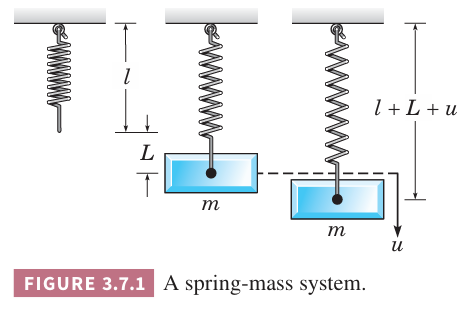
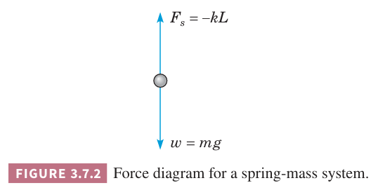
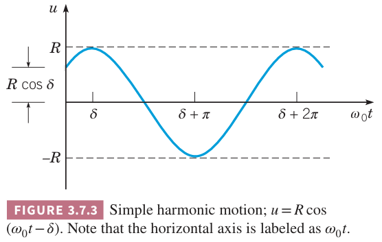
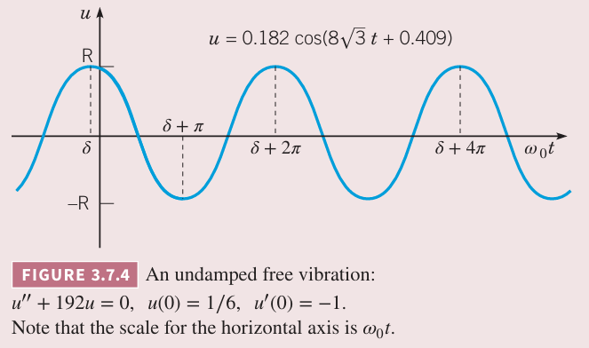

研究常系数二阶线性微分方程的原因之一这个数学模型可以用于很多物理问题。两个重要的领域就是机械振动和电振荡，都可以使用
$$ay''+by'+cy=g(t),y(0)=y_0,y'(0)=y'_0\tag{1}$$
来建模。

一旦知道了如何求解初值问题 $(1)$，并且能够根据物理问题使用合适的方式来表达常量 $a,b,c$ 和函数 $y,g$，就能得到不同物理问题的解。

我们首先会讨论弹簧一端的物体的运动，这是研究更复杂振动问题的第一步。此外，该问题涉及的原理在很多问题中都适用。

弹簧原始长度为 $l$，一端挂了一个质量为 $m$ 的物体，使弹簧伸长了 $L$，如下图所示。

在静止情况下，物体受到两个力，向下的重力 $w=mg$ 和弹簧施加的向上的拉力 $F_s$。假定 $L$ 很小，弹簧的拉力正比于 $L$，这就是胡克定律（`Hooke's law`），写作 $F_s=-kL$，常量 $k$ 是弹性系数，符号表示力的方向向上，这里假定向下为正向。由于物体处于平衡状态，两个力相互平衡，那么
$$w+F_s=mg-kL=0\tag{2}$$

给定 $w=mg$，根据 $(2)$，测量了 $L$ 就可以确定 $k$。

下面研究动态问题，物体受到外力运动或者初始时偏离平衡位置。令 $u(t)$ 表示 $t$ 时刻离开平衡位置的位移，假定向下为正。如上图 3.7.1 所示。根据牛顿定律有
$$mu''(t)=f(t)\tag{3}$$
其中 $u''$ 是加速度 $f$ 是作用于物体的净力。这里 $u,f$ 都是关于时间的函数。在这个问题中，有需要力需要考虑。

1. 重力 $w=mg$ 向下。
2. 弹簧的拉力或者推力，这取决于 $L+u$ 是正还是负。此时
$$F_s=-k(L+u)\tag{4}$$
3. 阻尼或阻力 $F_d$，始终和运动方向相反。这个力可能来自：空气阻力或者物体所在介质给与的阻力，弹簧伸长和压缩导致内能减少，如果有运动导轨的话产生的摩擦力，机械阻尼施加给物体的例。不管怎样，我们假定这个力的大小正比于速度 $|du/dt|$，通常称为粘性阻尼（`viscous damping`）。如果 $du/dt>0$，$u$ 在递增，运动方向向下，那么 $F_d$ 向上
$$F_d(t)=-\gamma u'(t)\tag{5}$$
其中 $\gamma$ 是正数，表示阻尼系数。如果 $du/dt<0$，$u$ 递减，物体向上运动，此时 $F_d$ 向下，也能用 $(5)$ 来表示。阻力可能更为复杂，但是这里仅阐述数学问题，使用 $(5)$ 来建模能够表示很多物理问题，同时更重要的是最后是线性而不是非线性微分方程。
4. 额外的力 $F(t)$，正表示向下，负表示向上。这个力是直接作用于物体的外力。这个力经常是周期性的。

考虑完这些因素后，$(3)$ 可以写作
$$mu''(t)=w+F_s(t)+F_d(t)+F(t)=mg-k(L+u(t))-\gamma u'(t)+F(t)\tag{6}$$
根据 $(2)$ 有 $mg-kL=0$，那么上式简化为
$$mu''(t)+\gamma u'(t)+ku(t)=F(t)\tag{7}$$
其中 $m,\gamma,k$ 是正数。注意 $(7)$ 和 $(1)$ 形式一样，是常系数非齐次二阶线性微分方程。

振动问题的完整公式还需要指定两个初始条件，即初始位置 $u_0$ 和初始速度 $v_0$
$$u(0)=u_0,u'(0)=v_0\tag{8}$$
根据定理 3.2.1，加上初始条件的微分方程 $(7)$ 有唯一解。这和物理问题是一致的，当初始位置和初始速度一旦确定，那么后续的运动都是确定的。

例 1 质量为 4 英镑的物体使弹簧伸长 2 英寸。假定把物体额外拉出 6 英寸之后释放。当运动速度是 3 英尺每秒时物体运动的介质给物体的阻力是 6 磅。在之前讨论的假设下，对该初值问题建模。

解：初值问题需要得到微分方程 $(7)$ 和初始条件 $(8)$，这里的任务是确定方程中的系数。题目整体用英制表示，有点讨厌。假定时间的单位用秒，$u$ 的单位统一到英尺。这里没有提及外力，因此 $F(t)=0$。质量是
$$m=\frac{w}{g}=\frac{4}{32}=\frac{1}{8}$$
重力单位是英尺每秒的平方。阻尼系数 $\gamma$ 是
$$\gamma=\frac{6}{3}=2$$
弹性系数 $k$ 可以从 4 磅拉伸 2 英寸，即 1/6 英尺得到
$$k=\frac{4}{1/6}=24$$
那么微分方程 $(7)$ 是
$$\frac{1}{8}u''+2u'+24u=0$$
或
$$u''+16u'+192u=0\tag{9}$$
初始条件是
$$u(0)=\frac{1}{2},u'(0)=0\tag{10}$$
释放说明初始速度为零，初始位移 6 英寸，即 1/2 英尺。

### 无阻尼自由振动
如果没有外力，即 $(7)$ 中的 $F(t)=0$。假定没有阻尼，即 $\gamma=0$。那么微分方程简化为
$$mu''+ku=0\tag{11}$$
方程 $(11)$ 的特征方程是
$$mr^2+k=0$$
根是 $r=\pm i\sqrt{k/m}$，因此通解是
$$u=A\cos\omega_0 t+B\sin\omega_0 t\tag{12}$$
其中
$$\omega_0^2=\frac{k}{m}\tag{13}$$
$A,B$ 是任意常数，由初始条件 $(8)$ 确定。

为了讨论 $(11)$ 的解，将 $(12)$ 改写为
$$u=R\cos(\omega_0 t-\delta)\tag{14}$$
或
$$u=R\cos\delta\cos\omega_0 t+R\sin\delta\sin\omega_0 t\tag{15}$$
比较方便。对比方程 $(12)$ 和 $(15)$，可以得到 $A,B,R,\delta$ 的关系如下
$$A=R\cos\delta,B=R\sin\delta\tag{16}$$
因此
$$R=\sqrt{A^2+B^2},\tan\delta=\frac{B}{A}\tag{17}$$
当计算 $\delta$ 时，需要根据 $(16)$ 中的 $\cos\delta,\sin\delta$ 符号选择象限。

方程 $(14)$ 的图像如下图所示，这里对应某个初始条件。图像是有位移的余弦波，物体运动称为简谐（`simple harmonic`）运动。运动周期是
$$T=\frac{2\pi}{\omega_0}=2\pi\bigg(\frac{m}{k}\bigg)^{1/2}\tag{18}$$

角速度（圆周频率） $\omega_0=\sqrt{k/m}$ 称为振动的自然频率（`natural frequency`），物理中也称固有频率。物体离开平衡位置的最大位移 $R$ 是振幅（`amplitude`）。无量纲参数 $\delta$ 称为相位（`phase`）或相角（`phase angle`）。

注意，方程 $(14)$ 的振幅是常量，既不增长也会衰退。没有阻尼时，系统能量不会减少。给定质量 $m$ 和弹性系数 $k$，振动频率总是 $\omega_0$，与初始条件无关。初始条件会决定振幅。从 $(18)$ 可以看出周期 $T$ 随着质量 $m$ 的增加而增加，即大质量的物体振动的慢，另一方面 $T$ 与弹性系数 $k$ 成反比，越硬的弹簧振动的越快。

例 2 假定 10 磅的物体使弹簧伸长了 2 英寸。初始时，偏移额外的 2 英寸，并有一个向上的初始速度 1 英尺每秒，确定后续物体的位置。同时确定周期、振幅和相位。

解：这里单位统一与例 1 相同。$k=60,m=10/32$，因此运动方程是
$$u''+192u=0\tag{19}$$
那么通解是
$$u=A\cos 8\sqrt{3}t+B\sin 8\sqrt{3}t$$
方程满足初始条件 $u(0)=1/6,u'(0)=-1$，那么
$$u=\frac{1}{6}\cos 8\sqrt{3}t-\frac{1}{8\sqrt{3}}\sin 8\sqrt{3}t\tag{20}$$
固有频率 $\omega_0=8\sqrt{3}$。振幅 $R$ 是
$$R^2=\frac{1}{36}+\frac{1}{192}=\frac{19}{576}$$
$(17)$ 的第二个式子决定相位，不过由于 $\cos\delta>0,\sin\delta<0$，那么 $\delta$ 属于第四象限，因此
$$\delta=-\arctan\frac{\sqrt{3}}{4}$$
解 $(20)$ 的图像图下图所示

### 阻尼自由振动
当包含阻尼时，微分方程如下
$$mu''+\gamma u'+ku=0\tag{21}$$
现在讨论当 $m,k$ 给定时，阻尼系数 $\gamma$ 对系统的影响。相应的特征方程是
$$mr^2+\gamma r+k=0$$
根是
$$r_1,r_2=\frac{-\gamma\pm\sqrt{\gamma^2-4mk}}{2m}=\frac{\gamma}{2m}\bigg(-1\pm\sqrt{1-\frac{4km}{\gamma^2}}\bigg)\tag{22}$$
依赖于 $\gamma^2-4km$ 的符号，解有不同的形式。
$$\gamma^2-4km>0,u=Ae^{r_1t}+Be^{r_2t}\tag{23}$$
$$\gamma^2-4km=0,u=(A+Bt)e^{-\gamma t/(2m)}\tag{24}$$
$$\gamma^2-4km<0,u=e^{-\gamma t/(2m)}(A\cos\mu t+B\sin\mu t),\mu=\frac{1}{2m}(4km-\gamma^2)^{1/2}>0\tag{25}$$

