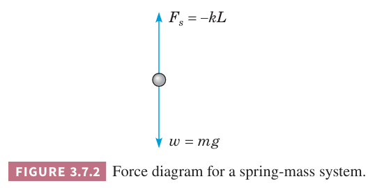

研究常系数二阶线性微分方程的原因之一这个数学模型可以用于很多物理问题。两个重要的领域就是机械振动和电振荡，都可以使用
$$ay''+by'+cy=g(t),y(0)=y_0,y'(0)=y'_0\tag{1}$$
来建模。

一旦知道了如何求解初值问题 $(1)$，并且能够根据物理问题使用合适的方式来表达常量 $a,b,c$ 和函数 $y,g$，就能得到不同物理问题的解。

我们首先会讨论弹簧一端的物体的运动，这是研究更复杂振动问题的第一步。此外，该问题涉及的原理在很多问题中都适用。

弹簧原始长度为 $l$，一端挂了一个质量为 $m$ 的物体，使弹簧伸长了 $L$，如下图所示。

在静止情况下，物体受到两个力，向下的重力 $w=mg$ 和弹簧施加的向上的拉力 $F_s$。假定 $L$ 很小，弹簧的拉力正比于 $L$，这就是胡克定律（`Hooke's law`），写作 $F_s=-kL$，常量 $k$ 是弹性系数，符号表示力的方向向上，这里假定向下为正向。由于物体处于平衡状态，两个力相互平衡，那么
$$w+F_s=mg-kL=0\tag{2}$$

给定 $w=mg$，根据 $(2)$，测量了 $L$ 就可以确定 $k$。

下面研究动态问题，物体受到外力运动或者初始时偏离平衡位置。令 $u(t)$ 表示 $t$ 时刻离开平衡位置的位移，假定向下为正。如上图 3.7.1 所示。根据牛顿定律有
$$mu''(t)=f(t)\tag{3}$$
其中 $u''$ 是加速度 $f$ 是作用于物体的净力。这里 $u,f$ 都是关于时间的函数。在这个问题中，有需要力需要考虑。

1. 重力 $w=mg$ 向下。
2. 弹簧的拉力或者推力，这取决于 $L+u$ 是正还是负。此时
$$F_s=-k(L+u)\tag{4}$$
3. 阻尼或阻力 $F_d$，始终和运动方向相反。这个力可能来自：空气阻力或者物体所在介质给与的阻力，弹簧伸长和压缩导致内能减少，如果有运动导轨的话产生的摩擦力，机械阻尼施加给物体的例。不管怎样，我们假定这个力的大小正比于速度 $|du/dt|$，通常称为粘性阻尼（`viscous damping`）。如果 $du/dt>0$，$u$ 在递增，运动方向向下，那么 $F_d$ 向上
$$F_d(t)=-\gamma u'(t)\tag{5}$$
其中 $\gamma$ 是正数，表示阻尼系数。如果 $du/dt<0$，$u$ 递减，物体向上运动，此时 $F_d$ 向下，也能用 $(5)$ 来表示。阻力可能更为复杂，但是这里仅阐述数学问题，使用 $(5)$ 来建模能够表示很多物理问题，同时更重要的是最后是线性而不是非线性微分方程。
4. 额外的力 $F(t)$，正表示向下，负表示向上。这个力是直接作用于物体的外力。这个力经常是周期性的。

考虑完这些因素后，$(3)$ 可以写作
$$mu''(t)=w+F_s(t)+F_d(t)+F(t)=mg-k(L+u(t))-\gamma u'(t)+F(t)\tag{6}$$
根据 $(2)$ 有 $mg-kL=0$，那么上式简化为
$$mu''(t)+\gamma u'(t)+ku(t)=F(t)\tag{7}$$
其中 $m,\gamma,k$ 是正数。注意 $(7)$ 和 $(1)$ 形式一样，是常系数非齐次二阶线性微分方程。

振动问题的完整公式还需要指定两个初始条件，即初始位置 $u_0$ 和初始速度 $v_0$
$$u(0)=u_0,u'(0)=v_0\tag{8}$$
根据定理 3.2.1，加上初始条件的微分方程 $(7)$ 有唯一解。这和物理问题是一致的，当初始位置和初始速度一旦确定，那么后续的运动都是确定的。

例 1 质量为 4 英镑的物体使弹簧伸长 2 英寸。假定把物体额外拉出 6 英寸之后释放。当运动速度是 3 英尺每秒时物体运动的介质给物体的阻力是 6 磅。在之前讨论的假设下，对该初值问题建模。

解：初值问题需要得到微分方程 $(7)$ 和初始条件 $(8)$，这里的任务是确定方程中的系数。题目整体用英制表示，有点讨厌。假定时间的单位用秒，$u$ 的单位统一到英尺。这里没有提及外力，因此 $F(t)=0$。质量是
$$m=\frac{w}{g}=\frac{4}{32}=\frac{1}{8}$$
重力单位是英尺每秒的平方。阻尼系数 $\gamma$ 是
$$\gamma=\frac{6}{3}=2$$
弹性系数 $k$ 可以从 4 磅拉伸 2 英寸，即 1/6 英尺得到
$$k=\frac{4}{1/6}=24$$
那么微分方程 $(7)$ 是
$$\frac{1}{8}u''+2u'+24u=0$$
或
$$u''+16u'+192u=0\tag{9}$$
初始条件是
$$u(0)=\frac{1}{2},u'(0)=0\tag{10}$$
释放说明初始速度为零，初始位移 6 英寸，即 1/2 英尺。

### 无阻尼自由振动
如果没有外力，即 $(7)$ 中的 $F(t)=0$。假定没有阻尼，即 $\gamma=0$。那么微分方程简化为
$$mu''+ku=0\tag{11}$$
方程 $(11)$ 的特征方程是
$$mr^2+k=0$$
根是 $r=\pm i\sqrt{k/m}$，因此通解是
$$u=A\cos\omega_0 t+B\sin\omega_0 t\tag{12}$$
其中
$$\omega_0^2=\frac{k}{m}\tag{13}$$
$A,B$ 是任意常数，由初始条件 $(8)$ 确定。

为了讨论 $(11)$ 的解，将 $(12)$ 改写为
$$u=R\cos(\omega_0 t-\delta)\tag{14}$$
或
$$u=R\cos\delta\cos\omega_0 t+R\sin\delta\sin\omega_0 t\tag{15}$$
比较方便。对比方程 $(12)$ 和 $(15)$，可以得到 $A,B,R,\delta$ 的关系如下
$$A=R\cos\delta,B=R\sin\delta\tag{16}$$
因此
$$R=\sqrt{A^2+B^2},\tan\delta=\frac{B}{A}\tag{17}$$
当计算 $\delta$ 时，需要根据 $(16)$ 中的 $\cos\delta,\sin\delta$ 符号选择象限。

方程 $(14)$ 的图像如下图所示，这里对应某个初始条件。图像是有位移的余弦波，物体运动称为简谐（`simple harmonic`）运动。运动周期是
$$T=\frac{2\pi}{\omega_0}=2\pi\bigg(\frac{m}{k}\bigg)^{1/2}\tag{18}$$

角速度（圆周频率） $\omega_0=\sqrt{k/m}$ 称为振动的自然频率（`natural frequency`），物理中也称固有频率。物体离开平衡位置的最大位移 $R$ 是振幅（`amplitude`）。无量纲参数 $\delta$ 称为相位（`phase`）或相角（`phase angle`）。

注意，方程 $(14)$ 的振幅是常量，既不增长也会衰退。没有阻尼时，系统能量不会减少。给定质量 $m$ 和弹性系数 $k$，振动频率总是 $\omega_0$，与初始条件无关。初始条件会决定振幅。从 $(18)$ 可以看出周期 $T$ 随着质量 $m$ 的增加而增加，即大质量的物体振动的慢，另一方面 $T$ 与弹性系数 $k$ 成反比，越硬的弹簧振动的越快。

例 2 假定 10 磅的物体使弹簧伸长了 2 英寸。初始时，偏移额外的 2 英寸，并有一个向上的初始速度 1 英尺每秒，确定后续物体的位置。同时确定周期、振幅和相位。

解：这里单位统一与例 1 相同。$k=60,m=10/32$，因此运动方程是
$$u''+192u=0\tag{19}$$
那么通解是
$$u=A\cos 8\sqrt{3}t+B\sin 8\sqrt{3}t$$
方程满足初始条件 $u(0)=1/6,u'(0)=-1$，那么
$$u=\frac{1}{6}\cos 8\sqrt{3}t-\frac{1}{8\sqrt{3}}\sin 8\sqrt{3}t\tag{20}$$
固有频率 $\omega_0=8\sqrt{3}$。振幅 $R$ 是
$$R^2=\frac{1}{36}+\frac{1}{192}=\frac{19}{576}$$
$(17)$ 的第二个式子决定相位，不过由于 $\cos\delta>0,\sin\delta<0$，那么 $\delta$ 属于第四象限，因此
$$\delta=-\arctan\frac{\sqrt{3}}{4}$$
解 $(20)$ 的图像图下图所示

### 阻尼自由振动
当包含阻尼时，微分方程如下
$$mu''+\gamma u'+ku=0\tag{21}$$
现在讨论当 $m,k$ 给定时，阻尼系数 $\gamma$ 对系统的影响。相应的特征方程是
$$mr^2+\gamma r+k=0$$
根是
$$r_1,r_2=\frac{-\gamma\pm\sqrt{\gamma^2-4mk}}{2m}=\frac{\gamma}{2m}\bigg(-1\pm\sqrt{1-\frac{4km}{\gamma^2}}\bigg)\tag{22}$$
依赖于 $\gamma^2-4km$ 的符号，解有不同的形式。
$$\gamma^2-4km>0,u=Ae^{r_1t}+Be^{r_2t}\tag{23}$$
$$\gamma^2-4km=0,u=(A+Bt)e^{-\gamma t/(2m)}\tag{24}$$
$$\gamma^2-4km<0,u=e^{-\gamma t/(2m)}(A\cos\mu t+B\sin\mu t),\mu=\frac{1}{2m}(4km-\gamma^2)^{1/2}>0\tag{25}$$
由于 $m,\gamma,k$ 都是正的，那么 $\gamma^2-4km$ 总是小于 $\gamma^2$。因此，如果 $\gamma^2-4km\geq 0$，那么 $(22)$ 中的 $r_1,r_2$ 都是负数，如果 $\gamma^2-4mk<0$，$r_1,r_2$ 是复数，实数部分是负数。因此，对于这三种情况，当 $t\to\infty$ 时 $u$ 都趋于零。不管 $A,B$ 是何值，即不管初始条件是什么，该结论都成立。这与直观预期一致，阻尼会逐步消耗系统的能量，运动会随着时间消失。

这里最有意思的是第三种情况。如果阻尼比较小，令 $(25)$ 中的 $ $A=R\cos\delta,B=R\sin\delta$，那么
$$u=Re^{-\gamma t/(2m)}\cos(\mu t-\delta)\tag{26}$$
位移 $u$ 介于曲线 $u=\pm Re^{-\gamma t/(2m)}$ 之间，因此它类似余弦曲线，不过振幅随着 $t$ 增长而减小。下图是一个典型例子。这种运动称为阻尼振动或阻尼振荡。振幅 $R$ 依赖于 $m,\gamma,k$ 和初始条件。

尽管运动不是周期的，但是 $\mu$ 决定了物体振荡的频率，因此 $\mu$ 称为准频率（`quasi-frequency`）。将 $\mu$ 与无阻尼运动 $\omega_0$ 相比，得到
$$\frac{\mu}{\omega_0}=\frac{(4kn-\gamma^2)^{1/2}/2m}{\sqrt{k/m}}=\bigg(1-\frac{\gamma^2}{4km}\bigg)^{1/2}\approx 1-\frac{\gamma^2}{8km}\tag{27}$$
当 $\gamma^2/4mk$ 很小时最后的近似成立。此时阻尼很小，稍微减小了振荡的频率。与公式 $(18)$ 类似，$T_d=2\pi/\mu$ 称为准周期（`quasi-period`）。$T_d$ 与 $T$ 的比值是
$$\frac{T_d}{T}=\frac{\omega}{\mu}=\bigg(1-\frac{\gamma^2}{4km}\bigg)^{-1/2}\approx 1+\frac{\gamma^2}{8km}\tag{28}$$
最后的近似在 $\gamma^2/4km$ 很小时成立。很小的阻尼使得周期变长。

从 $(27),(28)$ 可以看出无量纲比值 $\gamma^2/4km$ 的意义。阻尼的大小并不是 $\gamma$ 的大小，而是和 $\gamma^2$ 与 $4km$ 的比值。当 $\gamma^2/(4km)$ 很小的时候，阻尼对准周期和准频率的影响也很小。另一方面，如果要研究物体的运动，不管阻尼多小，也不能直接忽视。

随着 $\gamma^2/4km$ 的增加，准频率 $\mu$ 减小准周期 $T_d$ 增加。当 $\gamma\to2\sqrt{km}$ 时 $\mu\to 0,T_d\to\infty$。当 $\gamma$ 变化经过 $2\sqrt{km}$，解的性质会发生变化。$\gamma=2\sqrt{km}$ 是临界阻尼（`critically damped`）。对于 $\gamma>2\sqrt{km}$ 称为过阻尼的（`overdamped`）。这两种情况的解是 $(24)$ 和 $(23)$，此时物体最多过平衡点一次，如下图所示。物体不会在平衡位置附近振荡。

例 3 弹簧系统的运动方程如下
$$u''+\frac{1}{8}u'+u=0\tag{29}$$
如果 $u(0)=2,u'(0)=0$，求物体运动轨迹方程。求准频率和准周期，以及什么时刻第一次穿过平衡点。并且求 $\tau$，其满足 $|u(t)|<0.1,t>\tau$。

解：方程 $(29)$ 的解是
$$u(t)=e^{-t/16}\bigg(A\cos\frac{\sqrt{255}}{16}t+B\sin\frac{\sqrt{255}}{16}t\bigg)$$
为了满足初始条件有 $A=2,B=2/\sqrt{255}$，因此解是
$$\begin{aligned}
u&=e^{-t/16}\bigg(2\cos\frac{\sqrt{255}}{16}t+\frac{2}{\sqrt{255}}\sin\frac{\sqrt{255}}{16}t\bigg)\\
&=\frac{32}{\sqrt{255}}e^{-t/16}\cos\bigg(\frac{\sqrt{255}}{16}t-\delta\bigg)
\end{aligned}\tag{30}$$
其中 $\delta$ 在第一象限 $\tan\delta=1/\sqrt{255}$。物体的运动如下图所示。为了对比，绿色曲线是没有阻尼的运动方程的图像。

准频率 $\mu=\sqrt{255}/16$，准周期 $T_d=2\pi/\mu$。与无阻尼振动的频率 1 和周期 $2\pi$ 相差很小。从上图也可以看出，两者几乎同时上升或下降。这个例子中，阻尼很小，只有临界值的十六分之一。然后振荡的衰减相当快。

下图是 $40\leq t\leq 60$ 时的图像。要求的 $\tau$ 大约是 47.5，精确值是 $\tau\approx 47.5149$。

为了找到第一次运动穿过平衡点的时间，令 $\sqrt{255}t/16-\delta=\pi/2$，这是余弦为零的值。因此
$$t=\frac{16}{\sqrt{255}}\bigg(\frac{\pi}{2}+\delta\bigg)\approx 1.637$$

### 电路
第二个常系数二阶线性微分方程的例子是对电路建模。下图是一个最简单的电路。电阻 $R$、电容 $C$、电感 $L$ 是常量，电流 $I$、电容的电荷量 $Q$ 和电压 $V$ 是时间 $t$ 的函数。

$Q,I$ 的关系是
$$I=\frac{dQ}{dt}\tag{31}$$

根据基尔霍夫第二定律：闭合电路中施加的电压等于其余电气电压下降之和。简而言之，电压代数之和为零。

在电路中，电阻电压是 $RI$，电容的电压是 $\frac{Q}{C}$，电感的电压是 $L\frac{dI}{dt}$，因此
$$L\frac{dI}{dt}+RI+\frac{1}{C}Q=E(t)\tag{32}$$
将 $(31)$ 的电流表达式代入得到
$$LQ''+RQ'+\frac{1}{C}Q=E(t)\tag{33}$$
初始条件是
$$Q(t_0)=Q_0,Q'(t_0)=I(t_0)=I_0\tag{34}$$
解得方程就知道任意时刻电容中的电量。

方程 $(33)$ 对 $t$ 求导，然后使用 $(31)$ 得到的 $dQ/dt$ 代入，得到电流的微分方程
$$LI''+RI'+\frac{1}{C}=E'(t)\tag{35}$$
初始条件是
$$I(t_0)=I_0,I'(t_0)=I'_0\tag{36}$$
从方程 $(32)$ 可以得到
$$I'_0=\frac{E(t_0)-RI_0-\frac{Q_0}{C}}{L}\tag{37}$$
因此 $I'_0$ 就依赖于初始电荷和电流，这些物理量可以测量得到。

电路的例子和之前讨论的弹簧系统的例子是一样的。一旦学会了解常系数二阶线性微分方程，那么就可以解释物体振动、电路或其他能同样建模的物理问题。
