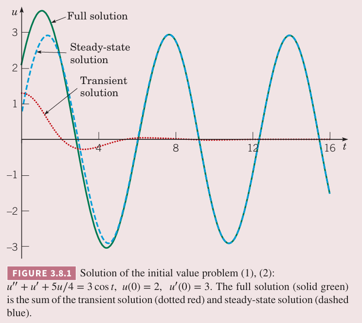

这一节会讨论有周期外力作用的弹簧系统。首先考虑带阻尼的运动，然后讨论理想状态下无阻尼运动。

### 带阻尼的受迫振动
例 1 假定弹簧系统满足微分方程
$$u''+u'+\frac{5}{4}u=3\cos t\tag{1}$$
和初始条件
$$u(0)=2,u'(0)=3\tag{2}$$
求初值问题的解，并且描述当 $t$ 很大时解的行为。

解：方程 $(1)$ 对应的齐次方程的特征方程是 $r^2+r+\frac{5}{4}=0$，根是 $r=-\frac{1}{2}\pm i$。因此齐次方程的通解是
$$u_c(t)=c_1e^{-t/2}\cos t+c_2e^{-t/2}\sin t\tg3$$
方程 $(1)$ 的特解形似是 $U(t)=A\cos t+B\sin t$，那么 $U'(t)=-A\sin t+B\cos t,U''(t)=-A\cos t-B\sin t$，代入 $(1)$ 得到
$$(\frac{1}{4}A+B)\cos t+(-A+\frac{1}{4}B)\sin t=3\cos t$$
那么
$$\frac{1}{4}A+B=3,-A+\frac{1}{4}B=0$$
因此 $A=\frac{12}{17},B=\frac{48}{17}$。特解是
$$U(t)=\frac{12}{17}\cos t+\frac{48}{17}\sin t\tag{4}$$
那么方程 $(1)$ 的通解是
$$u=c_1e^{-t/2}\cos t+c_2e^{-t/2}\sin t+\frac{12}{17}\cos t+\frac{48}{17}\sin t\tag{5}$$
常数 $c_1,c_2$ 由初始条件 $(2)$ 确定。从 $(5)$ 及其一阶导可以得到
$$u(0)=c_1+\frac{12}{17}=2,u'(0)=-\frac{1}{2}c_1+c_2+\frac{48}{17}=3$$
因此 $c_1=\frac{22}{17},c_2=\frac{14}{17}$。最终我们得到了初值问题 $(1),(2)$ 的解
$$u=\frac{22}{17}e^{-t/2}\cos t+\frac{14}{17}e^{-t/2}\sin t+\frac{12}{17}\cos t+\frac{48}{17}\sin t\tag{6}$$
方程 $(6)$ 的图像如下图所示。

解包含两个部分。方程 $(6)$ 的右边的前两项包含 $e^{-t/2}$，会快速趋于零，称为暂态解（`transient solution`）。$(6)$ 右边其余项仅包含正弦和余弦，振动会持续下去，称为稳态解（`steady-state solution`）。上图中分别用红色和绿色虚线表示。暂态解来自 $(1)$ 对应的齐次方程的解，稳态解是非齐次方程的特解。在很短的时间之后，暂态解会非常非常小，进而消失，解与稳态解基本无法区分。

一般有外力 $F(t)$ 的弹簧系统运动方程如下
$$mu''(t)+\gamma u'(t)+ku(t)=F(t)\tag{7}$$
其中 $m,\gamma,k$ 是质量、阻尼系数、弹性系数。假定外力 $F_0\cos\omega t$，其中 $F_0,\omega$ 是正的常数，表示力的振幅和频率。那么方程 $(7)$ 可以改写为
$$mu''(t)+\gamma u'(t)+ku(t)=F_0\cos\omega t\tag{8}$$
方程 $(8)$ 的解与之前的例子相似，通解形式是
$$u=c_1u_1(t)+c_2u_2(t)+A\cos\omega t+B\sin\omega t=u_c(t)+U(t)\tag{9}$$
$(9)$ 的中间前两项是方程 $(8)$ 的齐次微分方程的通解 $u_c(t)$，后面两项是非齐次方程的特解 $U(t)$。$A,B$ 可以通过将 $(9)$ 代入 $(8)$ 确定，如果有初始条件的话可以确定常量 $c_1,c_2$。齐次方程的解 $u_1,u_2$ 依赖于对应的特征方程 $mr^2+\gamma r+k=0$ 的根 $r_1,r_2$。由于 $m,\gamma,k$ 都是正数，那么 $r_1,r_2$ 要么是负的实数要么是实部为负数的复数。不过是哪种情况，当 $t\to\infty$ 时 $u_1,u_2$ 都趋于零。由于 $u_c$ 随着时间会消失，成为暂态解。

$(9)$ 剩余项 $U(t)=A\cos\omega t+B\sin\omega t$ 不会随着 $t$ 而消失，而是只要外力存在就会持续存在。与外力振动频率相同，会稳定的振动，称为稳态解，或是系统的受迫响应（`forced response`）。初始位移和速度的能量会随着时间被阻尼消耗，运动变成了对外部力的响应。如果没有阻尼，初始条件的影响会持续的有影响。

和之前类似，我们将 $U(t)$ 表达成一个三角函数项
$$U(t)=R\cos(\omega t-\delta)\tag{10}$$
振幅 $R$ 和相位 $\delta$ 依赖于 $A,B$，间接依赖于微分方程 $(8)$ 的参数。直接但冗长的代数运算得到
$$R=\frac{F_0}{\Delta},\cos\delta=\frac{m(\omega_0^2-\omega^2)}{\Delta},\sin\delta=\frac{\gamma\omega}{\Delta}\tag{11}$$
其中
$$\Delta=\sqrt{m^2(\omega_0^2-\omega^2)^2+\gamma^2\omega^2},\omega_0^2=\frac{k}{m}\tag{12}$$
$\omega_0$ 是无外力时的固有频率。

现在讨论稳定振动的振幅 $R$ 与外力频率 $\omega$ 的关系。将 $(12)$ 代入 $R$ 的表达式，并经过一些代数运算得到
$$\frac{Rk}{F_0}=\bigg(\bigg(1-\bigg(\frac{\omega}{\omega_0}\bigg)^2\bigg)^2+\Gamma\bigg(\frac{\omega}{\omega_0}\bigg)^2\bigg)^{-1/2},\Gamma=\frac{\gamma^2}{mk}\tag{13}$$
$Rk/F_0$ 是受迫响应的振幅 $R$ 与 $F_0/k$ 的比，后者是力 $F_0$ 作用于弹簧的偏移。

对于很低的频率，即 $\omega\to 0$，根据 $(13)$ 得到 $Rk/F_0\to 1$，那么 $R\to F_0/k$。另一个极端，频率非常高，$\omega\to\infty$，那么 $R\to 0$。$\omega$ 处于中间值的时候，$R$ 或许有最大值。为了找到这个最大值，$R$ 对 $\omega$ 求导，然后令导数为零。那么得到当 $\omega=\omega_{\max}$ 时取得最大值。
$$\omega_{\max}^2=\omega_0^2-\frac{\gamma^2}{2m^2}=\omega_0^2\bigg(1-\frac{\gamma^2}{2mk}\bigg)\tag{14}$$
当 $\gamma$ 很小的时候，$\omega_{\max}<\omega_0$ 且非常接近 $\omega_0$。$R$ 的最大值是
$$R_{\max}=\frac{F_0}{\gamma\omega_0\sqrt{1-(\gamma^2/4mk)}}\approx\frac{F_0}{\gamma\omega_0}\bigg(1+\frac{\gamma^2}{8mk}\bigg)\tag{15}$$
当 $\gamma$ 很小的时候最后的近似成立。如果 $\frac{\gamma^2}{mk}>2$，$(14)$ 给出的 $\omega_{\max}$ 是复数，这种情况下最大值 $R$ 发生在 $\omega=0$ 时，此时 $R$ 是 $\omega$ 的递减函数。之前分析过临界阻尼时有 $\frac{\gamma^2}{mk}=4$。

当 $\gamma$ 很小的时候，根据 $(15)$ 可以近似得到 $R_{\max}\approx\frac{F_0}{\gamma\omega_0}$。

