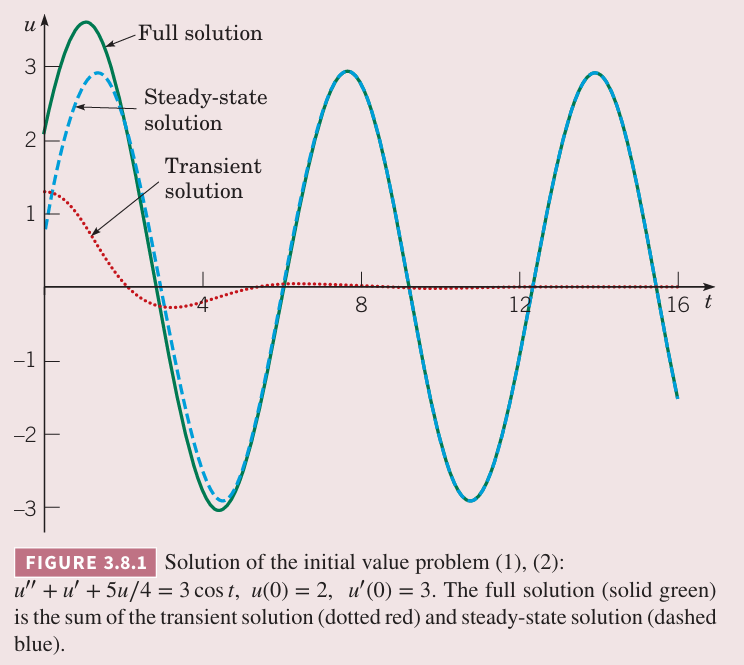
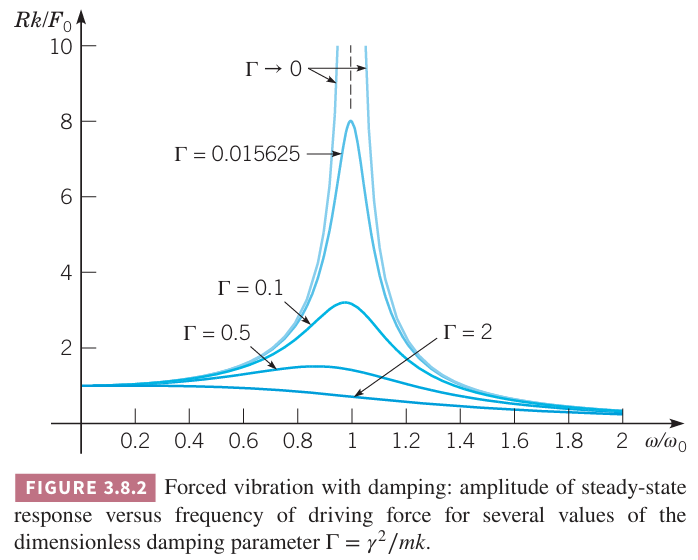
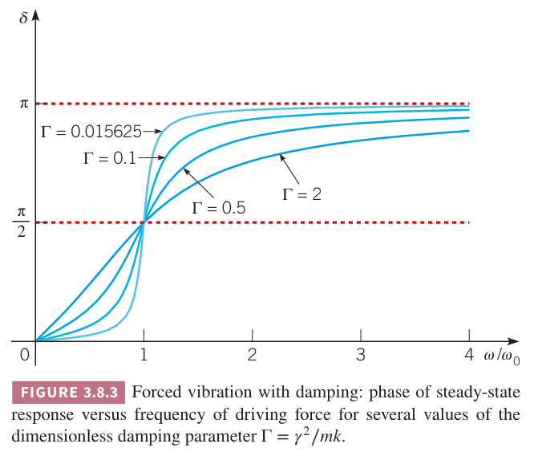
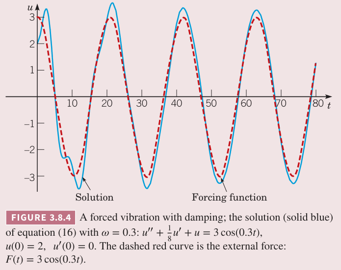
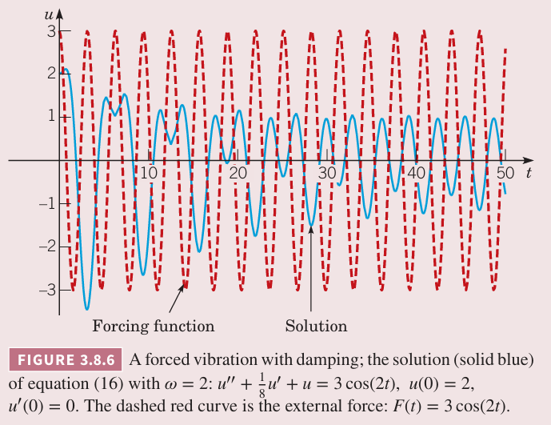
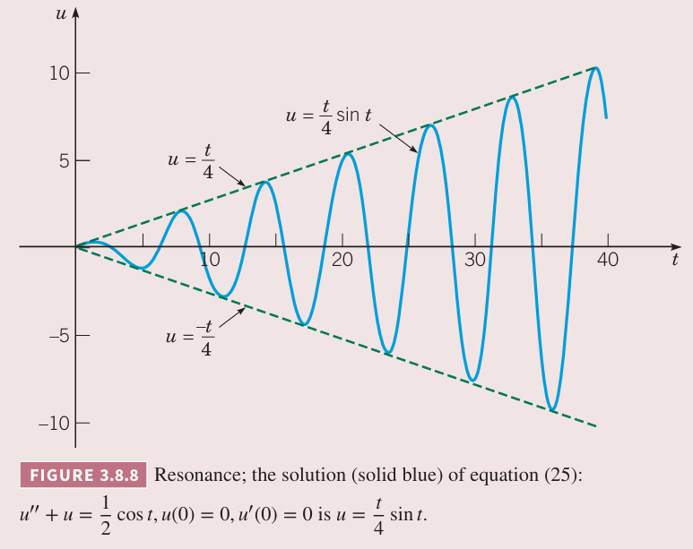

这一节会讨论有周期外力作用的弹簧系统。首先考虑带阻尼的运动，然后讨论理想状态下无阻尼运动。

### 带阻尼的受迫振动
例 1 假定弹簧系统满足微分方程
$$u''+u'+\frac{5}{4}u=3\cos t\tag{1}$$
和初始条件
$$u(0)=2,u'(0)=3\tag{2}$$
求初值问题的解，并且描述当 $t$ 很大时解的行为。

解：方程 $(1)$ 对应的齐次方程的特征方程是 $r^2+r+\frac{5}{4}=0$，根是 $r=-\frac{1}{2}\pm i$。因此齐次方程的通解是
$$u_c(t)=c_1e^{-t/2}\cos t+c_2e^{-t/2}\sin t\tag{3}$$
方程 $(1)$ 的特解形似是 $U(t)=A\cos t+B\sin t$，那么 $U'(t)=-A\sin t+B\cos t,U''(t)=-A\cos t-B\sin t$，代入 $(1)$ 得到
$$(\frac{1}{4}A+B)\cos t+(-A+\frac{1}{4}B)\sin t=3\cos t$$
那么
$$\frac{1}{4}A+B=3,-A+\frac{1}{4}B=0$$
因此 $A=\frac{12}{17},B=\frac{48}{17}$。特解是
$$U(t)=\frac{12}{17}\cos t+\frac{48}{17}\sin t\tag{4}$$
那么方程 $(1)$ 的通解是
$$u=c_1e^{-t/2}\cos t+c_2e^{-t/2}\sin t+\frac{12}{17}\cos t+\frac{48}{17}\sin t\tag{5}$$
常数 $c_1,c_2$ 由初始条件 $(2)$ 确定。从 $(5)$ 及其一阶导可以得到
$$u(0)=c_1+\frac{12}{17}=2,u'(0)=-\frac{1}{2}c_1+c_2+\frac{48}{17}=3$$
因此 $c_1=\frac{22}{17},c_2=\frac{14}{17}$。最终我们得到了初值问题 $(1),(2)$ 的解
$$u=\frac{22}{17}e^{-t/2}\cos t+\frac{14}{17}e^{-t/2}\sin t+\frac{12}{17}\cos t+\frac{48}{17}\sin t\tag{6}$$
方程 $(6)$ 的图像如下图所示。

解包含两个部分。方程 $(6)$ 的右边的前两项包含 $e^{-t/2}$，会快速趋于零，称为暂态解（`transient solution`）。$(6)$ 右边其余项仅包含正弦和余弦，振动会持续下去，称为稳态解（`steady-state solution`）。上图中分别用红色和绿色虚线表示。暂态解来自 $(1)$ 对应的齐次方程的解，稳态解是非齐次方程的特解。在很短的时间之后，暂态解会非常非常小，进而消失，解与稳态解基本无法区分。

一般有外力 $F(t)$ 的弹簧系统运动方程如下
$$mu''(t)+\gamma u'(t)+ku(t)=F(t)\tag{7}$$
其中 $m,\gamma,k$ 是质量、阻尼系数、弹性系数。假定外力 $F_0\cos\omega t$，其中 $F_0,\omega$ 是正的常数，表示力的振幅和频率。那么方程 $(7)$ 可以改写为
$$mu''(t)+\gamma u'(t)+ku(t)=F_0\cos\omega t\tag{8}$$
方程 $(8)$ 的解与之前的例子相似，通解形式是
$$u=c_1u_1(t)+c_2u_2(t)+A\cos\omega t+B\sin\omega t=u_c(t)+U(t)\tag{9}$$
$(9)$ 的中间前两项是方程 $(8)$ 的齐次微分方程的通解 $u_c(t)$，后面两项是非齐次方程的特解 $U(t)$。$A,B$ 可以通过将 $(9)$ 代入 $(8)$ 确定，如果有初始条件的话可以确定常量 $c_1,c_2$。齐次方程的解 $u_1,u_2$ 依赖于对应的特征方程 $mr^2+\gamma r+k=0$ 的根 $r_1,r_2$。由于 $m,\gamma,k$ 都是正数，那么 $r_1,r_2$ 要么是负的实数要么是实部为负数的复数。不过是哪种情况，当 $t\to\infty$ 时 $u_1,u_2$ 都趋于零。由于 $u_c$ 随着时间会消失，成为暂态解。

$(9)$ 剩余项 $U(t)=A\cos\omega t+B\sin\omega t$ 不会随着 $t$ 而消失，而是只要外力存在就会持续存在。与外力振动频率相同，会稳定的振动，称为稳态解，或是系统的受迫响应（`forced response`）。初始位移和速度的能量会随着时间被阻尼消耗，运动变成了对外部力的响应。如果没有阻尼，初始条件的影响会持续的有影响。

和之前类似，我们将 $U(t)$ 表达成一个三角函数项
$$U(t)=R\cos(\omega t-\delta)\tag{10}$$
振幅 $R$ 和相位 $\delta$ 依赖于 $A,B$，间接依赖于微分方程 $(8)$ 的参数。直接但冗长的代数运算得到
$$R=\frac{F_0}{\Delta},\cos\delta=\frac{m(\omega_0^2-\omega^2)}{\Delta},\sin\delta=\frac{\gamma\omega}{\Delta}\tag{11}$$
其中
$$\Delta=\sqrt{m^2(\omega_0^2-\omega^2)^2+\gamma^2\omega^2},\omega_0^2=\frac{k}{m}\tag{12}$$
$\omega_0$ 是无外力时的固有频率。

现在讨论稳定振动的振幅 $R$ 与外力频率 $\omega$ 的关系。将 $(12)$ 代入 $R$ 的表达式，并经过一些代数运算得到
$$\frac{Rk}{F_0}=\bigg(\bigg(1-\bigg(\frac{\omega}{\omega_0}\bigg)^2\bigg)^2+\Gamma\bigg(\frac{\omega}{\omega_0}\bigg)^2\bigg)^{-1/2},\Gamma=\frac{\gamma^2}{mk}\tag{13}$$
$Rk/F_0$ 是受迫响应的振幅 $R$ 与 $F_0/k$ 的比，后者是力 $F_0$ 作用于弹簧的偏移。

对于很低的频率，即 $\omega\to 0$，根据 $(13)$ 得到 $Rk/F_0\to 1$，那么 $R\to F_0/k$。另一个极端，频率非常高，$\omega\to\infty$，那么 $R\to 0$。$\omega$ 处于中间值的时候，$R$ 或许有最大值。为了找到这个最大值，$R$ 对 $\omega$ 求导，然后令导数为零。那么得到当 $\omega=\omega_{\max}$ 时取得最大值。
$$\omega_{\max}^2=\omega_0^2-\frac{\gamma^2}{2m^2}=\omega_0^2\bigg(1-\frac{\gamma^2}{2mk}\bigg)\tag{14}$$
当 $\gamma$ 很小的时候，$\omega_{\max}<\omega_0$ 且非常接近 $\omega_0$。$R$ 的最大值是
$$R_{\max}=\frac{F_0}{\gamma\omega_0\sqrt{1-(\gamma^2/4mk)}}\approx\frac{F_0}{\gamma\omega_0}\bigg(1+\frac{\gamma^2}{8mk}\bigg)\tag{15}$$
当 $\gamma$ 很小的时候最后的近似成立。如果 $\frac{\gamma^2}{mk}>2$，$(14)$ 给出的 $\omega_{\max}$ 是复数，这种情况下最大值 $R$ 发生在 $\omega=0$ 时，此时 $R$ 是 $\omega$ 的递减函数。之前分析过临界阻尼时有 $\frac{\gamma^2}{mk}=4$。

当 $\gamma$ 很小的时候，根据 $(15)$ 可以近似得到 $R_{\max}\approx\frac{F_0}{\gamma\omega_0}$。因此对于阻尼很小的系统，当 $\omega$ 在 $\omega_0$ 附近时，即使外力相对很小，受迫响应的振幅 $R$ 可以非常大，$\gamma$ 越小影响越多。这种现象称为共振（`resonance`），它是重要的设计因素。场景不同共振可以是好的也可以有害。比如设计建筑、桥梁需要考虑共振，否则可能会导致灾难。另一方面，乐器的设计就需要利用共振。

上图的坐标系是 $\frac{Rk}{F_0}-\frac{\omega}{\omega_0}$ 坐标系，几条曲线分别对应着不同的 $\Gamma=\frac{\gamma^2}{mk}$。后面会讨论 $\Gamma$ 是阻尼参数。下文的例 2 就会讨论 $\Gamma=0.015625$ 的情况。这里主义其对应的曲线的最高峰在 $\frac{\omega}{\omega_0}=1$ 附近。上图也展示了 $\Gamma\to 0$ 的情况。根据 $(13)$，或者是 $(11),(12)$，随着 $\gamma\to 0$ 有 $R\to\frac{F_0}{m|\omega_0^2-\omega^2|}$，因此 $\frac{Rk}{F_0}$ 的渐近线是 $\omega=\omega_0$。随着系统阻尼增加，峰值越来越低。

图中出现的三个变量 $\frac{Rk}{F_0},\frac{\omega}{\omega_0},\Gamma$ 都是无量纲的。因此 $(8)$ 的变量由五个减为三个。那么只需要一族曲线（上图只展示了部分）就能没描述方程 $(8)$ 所描述的系统的频率-响应行为。

相位角 $\delta$ 也依赖于 $\omega$。当 $\omega$ 接近零时，根据 $(11),(12)$ 有 $\cos\delta\approx 1,\sin\delta\approx 0$，因此 $\delta\approx 0$，那么响应和外力激发相当接近，这意味它们同时起落，即它们的最大值和最小值相当接近。当 $\omega=\omega_0$ 时，$\cos\delta=0,\sin\delta=1$，那么 $\delta=\frac{\pi}{2}$。此时响应落后外力激发 $\frac{\pi}{2}$，即响应的峰值比激发的峰值落后 $\pi/2$，波谷也类似。如果 $\omega$ 非常大，$\cos\delta\approx -1,\sin\delta\approx 0$，因此 $\delta\approx\pi$，响应与激发恰好相反，激发最大的时候响应最小，反之亦然。下图是不同 $\Gamma$ 值时 $\delta$ 和 $\omega/\omega_0$ 的关系。对于阻尼很小的时候，在 $\delta=0,\delta=\pi$ 附近变化相当剧烈，反之阻尼比较大时，变化相对比较平滑。

例 2 给定微分方程
$$u''+\frac{1}{8}u'+u=3\cos\omega t,u(0)=2,u'(0)=0\tag{16}$$
画出不同外力频率 $\omega$ 的解，并于外力图像比较。

解：对于这个系统，$\omega_0=1,\Gamma=1/64=0.015625$。无外力运动在 3.7 小节例 3 讨论了。下面给出 $\omega=0.3,1,2$ 时的图像。外力的曲线也在图像上。这个例子中，静态位移 $F_0/k=3$。

下图是低频的图像，$\omega/\omega_0=0.3$。暂态解很快就消失了，稳定解是外力激发的响应，稍稍落后与激发，响应的振幅比静态位移稍大一点。$R\approx 3.2939,\delta\approx 0.041185$。

下图是共振，$\omega/\omega_0=1$。此时稳定解的振幅是静态位移的八倍，响应的振幅落后外力 $\pi/2$。

下图是高频激发情况。稳定解的振幅大约是静态位移的三分之一，激发与响应的相位差约为 $\pi$。$R=0.99655,\delta\approx 3.0585$。

### 无阻尼的受迫振动
假定 $(8)$ 中 $\gamma=0$，因此得到无阻尼受迫振动的运动方程
$$mu''+ku=F_0\cos\omega t\tag{17}$$
根据 $\omega$ 是否等于固有频率 $w_0=\sqrt{k/m}$，$(17)$ 的通解形式不同。首先考虑 $\omega\neq\omega_0$ 的情况，$(17)$ 的通解是
$$u=c_1\cos\omega_0 t+c_2\sin\omega_0+\frac{F_0}{m(\omega_0^2-\omega^2)}\cos\omega t\tag{18}$$
常量 $c_1,c_2$ 由初始条件确定。一般情况下运动是两个不同周期（$\omega_0,\omega）和不同振幅的两个周期运动的叠加$。

当初始条件是 $u(0)=0,u'(0)=0$，驱动系统的能量全部来自外力，初始条件没有任何贡献。这种情况下
$$c_1=-\frac{F_0}{m(\omega_0^2-\omega^2)},c_2=0\tag{19}$$
那么方程 $(17)$ 的解是
$$u=\frac{F_0}{m(\omega_0^2-\omega^2)}(\cos\omega t-\cos\omega_0 t)\tag{20}$$
这是两个不同频率但是振幅相同的周期运动的叠加。使用与 $\cos(A\pm B),A=\frac{1}{2}(\omega_0+\omega)t,B=\frac{1}{2}(\omega_0-\omega)t$ 相关的三角恒等式，上面可以写作
$$u=\frac{2F_0}{m}(\omega_0^2-\omega^2)\sin\frac{1}{2}(\omega_0-\omega)t\sin\frac{1}{2}(\omega_0+\omega)t\tag{21}$$
如果 $|\omega_0-\omega|$ 很小，那么 $\omega_0+\omega$ 比 $|\omega_0-\omega|$ 大很多。相比 $\sin\frac{1}{2}(\omega_0-\omega)t$，$\sin\frac{1}{2}(\omega_0-\omega)t$ 振动频率大很多。因此整体运动频率是 $\frac{1}{2}(\omega_0+\omega)$，但是振幅变化是很慢的正弦曲线。
$$\frac{2F_0}{m|\omega_0^2-\omega^2|}\bigg|\sin\frac{1}{2}(\omega_0-\omega)t\bigg|$$
这种振幅周期变化的运动称为拍（`beat`）。比如当两个同频率的音叉靠得很近，同时被激发就会产生这种现象。这种振幅周期变化相当明显。在电子学中，这种振幅的变化称为振幅调制（`amplitude modulation`）。

例 3 求初值问题
$$u''+u=\frac{1}{2}\cos 0.8t,u(0)=0,u'(0)=0\tag{22}$$
并画出解。

解：这种情况下，$\omega_0=1,\omega=0.8,F_0=\frac{1}{2}$，那么从 $(21)$ 可以得到给定微分方程的解
$$u=2.779\sin 0.1t\sin 0.9t\tag{23}$$

如下图所示。振幅变化的频率很低，是 0.1，对应的周期是 $2\pi/0.1=20\pi$。这里振幅递增到递减再到递增的周期是 $10\pi$。物体振动频率相对较高，是 0.9，仅仅比固定频率 $\omega_0$ 少一点。

假定这里外力频率增加到 $\omega=0.9$，那么低频变为一半 0.05，响应的半周期增加到 $20\pi$。乘数 2.779 增加一倍到 5.263。高频只增加一点到 0.95。如果外力频率越来越接近 $\omega_0$，那么低频会趋于零，振幅会无穷大。

现在回到公式 $(17)$。假定 $\omega=\omega_0$，那么非齐次项 $F_0\cos\omega t$ 是齐次方程的解，那么 $(17)$ 的通解是
$$u=c_1\cos\omega_0 t+c_2\sin\omega_0 t+\frac{F_0}{2m\omega_0}t\sin\omega_0 t\tag{24}$$

例 4 求解初值问题
$$u''+u=\frac{1}{2}\cos t,u(0)=0,u'(0)=0\tag{25}$$
并画出解。

解：通解形式是
$$u=c_1\cos t+c_2\sin t+\frac{t}{4}\sin t$$
代入初始条件得到 $c_1=c_2=0$，因此给定初值问题的解是
$$u=\frac{t}{4}\sin t\tag{26}$$
图像如下所示。

由于 $(24)$ 存在 $t\sin\omega_0 t$，因此随着 $t\to\infty$ 振幅无穷大，与 $c_1,c_2$ 无关，上图可以证明这一点。现实中不会如此，因为弹簧的长度有限。此外，随着 $u$ 的增加，数学模型 $(17)$ 不再成立，这是因为弹簧的弹力与长度成正比的前提是位移 $u$ 很小。正如我们前面所述，如果存在阻尼，运动是有界的。不过，如果阻尼比较小并且 $\omega$ 接近 $\omega_0$，那么输入函数 $F_0\cos\omega t$ 的响应会相当大。

### $(10)-(15)$ 及无量纲变量的推导
根据 $(9)$，$(8)$ 的特解形式是
$$U(t)=A\cos\omega t+B\sin\omega t$$
求导得到
$$U'(t)=-A\omega\sin\omega t+B\omega\cos\omega t$$
$$U''(t)=-A\omega^2\cos\omega t-B\omega^2\sin\omega t$$
代入 $(8)$ 整理同类项得到
$$(-m\omega^2 A+\gamma\omega B+kA)\cos\omega t+(-m\omega^2 B-\gamma\omega A+kB)\sin\omega t=F_0\cos\omega t$$
因此
$$\begin{aligned}
(k-m\omega^2)&A+\gamma\omega &B&=F_0\\
-\gamma\omega&A+(k-m\omega^2)&B&=0
\end{aligned}$$
第二个式子可以得到
$$A=\frac{(k-m\omega^2)B}{\gamma\omega}$$
代入第一个式子可以得到
$$B=\frac{F_0\gamma\omega}{(k-m\omega^2)^2+\gamma^2\omega^2}$$
那么
$$A=\frac{F_0(k-m\omega^2)}{(k-m\omega^2)^2+\gamma^2\omega^2}$$
根据 3.7 小节的公式 $(17)$ 得到
$$R=\sqrt{A^2+B^2}=\frac{F_0}{\sqrt{(k-m\omega^2)^2+\gamma^2\omega^2}}$$
$k-m\omega^2$ 可以改写为
$$k-m\omega^2=m(\frac{k}{m}-\omega^2)=m(\omega_0^2-\omega^2)$$
因此 $R=\frac{F_0}{\Delta}$，其中 $\Delta=\sqrt{m^2(\omega_0^2-\omega^2)^2+\gamma^2\omega^2},\omega_0^2=\frac{k}{m}$。

根据 3.7 小节的公式 $(17)$ 第二个式子得到
$$\tan\delta=\frac{B}{A}=\frac{\gamma\omega}{k-m\omega^2}=\frac{\gamma\omega}{m(\omega_0^2-\omega^2)}$$
那么
$$\cos\delta=\frac{m(\omega_0^2-\omega^2)}{\sqrt{m^2(\omega_0^2-\omega^2)^2+\gamma^2\omega^2}}=\frac{m(\omega_0^2-\omega^2)}{\Delta}$$
$$\sin\delta=\frac{\gamma\omega}{\sqrt{m^2(\omega_0^2-\omega^2)^2+\gamma^2\omega^2}}=\frac{\gamma\omega}{\Delta}$$
至此，由方程 $(8)$ 推导出了 $(10),(11),(12)$。

下面推导 $(13)$。
$$\begin{aligned}
\frac{Rk}{F_0}&=\frac{k}{\Delta}\\
&=\frac{k}{\sqrt{m^2(\omega_0^2-\omega^2)^2+\gamma^2\omega^2}}\\
&=\bigg(\frac{m^2}{k^2}(\omega_0^2-\omega^2)^2+\frac{\gamma^2\omega^2}{k^2}\bigg)^{-1/2}\\
&=\bigg(\frac{1}{\omega_0^4}(\omega_0^2)^2\bigg(1-\bigg(\frac{\omega}{\omega_0}\bigg)^2\bigg)^2+\frac{\gamma^2\omega^2}{mk\frac{k}{m}}\bigg)^{-1/2}\\
&=\bigg(\bigg(1-\bigg(\frac{\omega}{\omega_0}\bigg)^2\bigg)^2+\frac{\gamma^2}{mk}\frac{\omega^2}{\omega_0^2}\bigg)^{-1/2}\\
&=\bigg(\bigg(1-\bigg(\frac{\omega}{\omega_0}\bigg)^2\bigg)^2+\Gamma\bigg(\frac{\omega}{\omega_0}\bigg)^2\bigg)^{-1/2}\\
\end{aligned}$$
其中 $\Gamma=\frac{\gamma^2}{mk}$。

回到 $(11)$ 的第一个式子，对 $\omega$ 求导
$$\begin{aligned}
R'&=\bigg(\frac{F_0}{\Delta}\bigg)'\\
&=\bigg(\frac{F_0}{\sqrt{m^2(\omega_0^2-\omega^2)^2+\gamma^2\omega^2}}\bigg)'\\
&=-\frac{1}{2}F_0({m^2(\omega_0^2-\omega^2)^2+\gamma^2\omega^2})^{-3/2}[2\gamma^2\omega+2m^2(\omega_0^2-\omega^2)(-2\omega)]\\
\end{aligned}$$
导数为零，因此
$$\begin{aligned}
2\gamma^2\omega+2m^2(\omega_0^2-\omega^2)(-2\omega)&=0\\
\gamma^2&=2m^2(\omega_0^2-\omega^2)\\
\omega_0^2-\omega^2&=\frac{\gamma^2}{2m^2}\\
\omega^2&=\omega_0^2-\frac{\gamma^2}{2m^2}\\
&=\omega_0^2(1-\frac{\gamma^2}{2m^2\frac{k}{m}})\\
&=\omega_0^2(1-\frac{\gamma^2}{2mk})
\end{aligned}$$
这样推导得到了 $(14)$。将 $(14)$ 代入 $R$ 的公式得到 $(15)$
$$\begin{aligned}
R&=\frac{F_0}{\sqrt{m^2(\omega_0^2-\omega^2)^2+\gamma^2\omega^2}}\\
&=\frac{F_0}{\sqrt{m^2\frac{\gamma^2\gamma^2}{4m^2m^2}+\gamma^2\omega^2(1-\frac{\gamma^2}{2mk})}}\\
&=\frac{F_0}{\gamma\omega_0\sqrt{\frac{\gamma^2}{4m^2\omega_0^2}+(1-\frac{\gamma^2}{2mk})}}\\
&=\frac{F_0}{\gamma\omega_0\sqrt{\frac{\gamma^2}{4m^2\frac{k}{m}}+(1-\frac{\gamma^2}{2mk})}}\\
&=\frac{F_0}{\gamma\omega_0\sqrt{\frac{\gamma^2}{4mk}+(1-\frac{\gamma^2}{2mk})}}\\
&=\frac{F_0}{\gamma\omega_0\sqrt{1-\frac{\gamma^2}{4mk}}}
\end{aligned}$$

下面分析正文提到的三个无量纲变量，这里使用国际单位制。

弹簧系数 $k=-F/L$，因此 $k$ 的单位是 $N/m$，$m$ 的单位是 $kg$，共牛顿第二定律 $F=ma$ 可以得到 $N/(m/s^2)=Ns^2/m$。因此得到 $\omega_0^2=\frac{k}{m}$ 的量纲是 $s^{-1}$，即每秒。$(8)$ 中 $\omega t$ 是无量纲的，那么 $\omega$ 的量纲是 $s^{-1}$，也是每秒，因此 $\frac{\omega}{\omega_0}$ 是无量纲的。

$\gamma$ 是阻尼系数，是力与速度的比值，因此其量纲是 $N/(m/s)$，即 $Ns/m$。$\Gamma=\frac{\gamma^2}{mk}$ 的量纲是 $\frac{N^2s^2}{m^2}\frac{m}{N}\frac{m}{Ns^2}$，因此也是无量纲的。

最后，$(13)$ 右边的式子是无量纲的变量的代数运算，因此左边 $\frac{Rk}{F_0}$ 是无量纲的。
