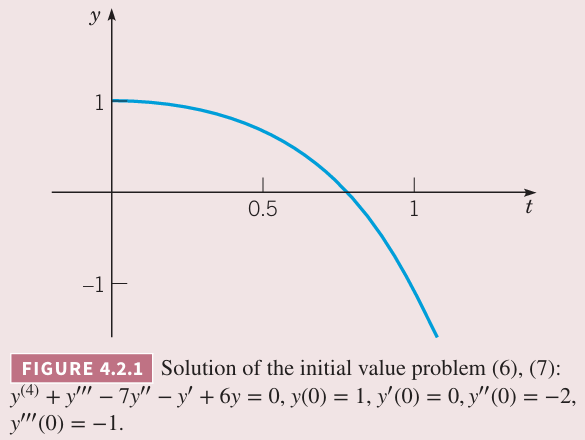
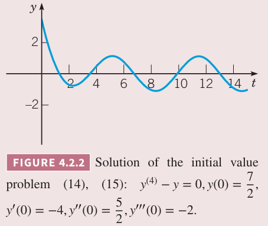
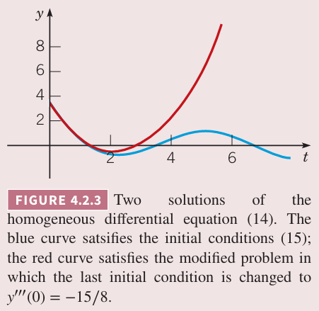

这一节讨论 $n$ 阶线性齐次微分方程
$$L[y]=a_0y^{(n)}+a_1y^{(n-1)}+\cdots+a_{n-1}y'+a_ny=0\tag{1}$$
其中 $a_0,a_1,\cdots,a_n$ 是实数常量，且 $a_0\neq 0$。从常系数二阶线性微分方程可以知道，解是 $y=e^{rt}$，其中 $r$ 是某个合适的数。事实上
$$L[e^{rt}]=e^{rt}(a_0r^n+a_1r^{n-1}+\cdots+a_{n-1}r+a_n)=e^{rt}Z(r)\tag{2}$$
其中
$$Z(r)=a_0r^n+a_1r^{n-1}+\cdots+a_{n-1}r+a_n\tag{3}$$

如果 $r$ 使得 $Z(r)=0$，那么 $L[e^{rt}]=0$，因此 $e^{rt}$ 是方程 $(1)$ 的解。多项式 $Z(r)$ 称为特征多项式（`characteristic polynomial`），方程 $Z(r)=0$ 是微分方程 $(1)$ 的特征方程。由于 $a_0\neq 0$，$Z(r)$ 是 $n$ 阶多项式，特征方程有 $n$ 个根，$r_1,r_2,\cdots,r_n$，这些根可能有相等的，可能有复数。这样特征多项式可以写作
$$Z(r)=a_0(r-r_1)(r-r_2)\cdots(r-r_n)\tag{4}$$

### 实根且无重复
如果特征方程的根都是实数，且没有宠物，那么有 $n$ 个不同的解 $e^{r_1t},e^{r_2t},\cdots,e^{r_nt}$。如果这些函数线性无关，那么齐次 $n$ 阶线性微分方程 $(1)$ 的通解是
$$y=c_1e^{r_1t}+c_2e^{r_2t}+\cdots+c_ne^{r_nt}\tag{5}$$
一种确定 $e^{r_1t},e^{r_2t},\cdots,e^{r_nt}$ 是线性无关的方法是计算其朗斯基行列式的值，下面给出另外一种证明方法。

这些解线性无关，就是要证明线性关系
$$c_1e^{r_1t}+c_2e^{r_2t}+\cdots+c_ne^{r_nt}=0,-\infty<t<\infty$$
中所有的系数均为零。

两边同乘 $e^{-r_1t}$ 然后对 $t$ 求导得到
$$c_2(r_2-r_1)e^{(r_2-r_1)t}+c_3(r_3-r_1)e^{(r_3-r_1)t}+\cdots+c_n(r_n-r_1)e^{(r_n-r_1)t}=0$$
两边再同乘 $e^{-(r_2-r_1)t}$ 然后对 $t$ 求导得到
$$c_3(r_3-r_1)(r_3-r_2)e^{(r_3-r_2)t}+c_n(r_n-r_1)(r_n-r_2)e^{(r_n-r_2)t}=0$$
然后依次乘以 $e^{-(r_3-r_2)t},e^{-(r_4-r_4)t},\cdots,e^{-(r_n-r_{n-1})t}$，每次乘完之后都要求导，这样就得到
$$c_n(r_n-r_1)(r_n-r_2)\cdots(r_n-r_{n-1})e^{(r_n-r_{n-1})}=0$$
由于根 $r_i$ 都不同相同，那么 $c_n=0$。这样就得
$$c_1e^{r_1t}+c_2e^{r_2t}+\cdots+c_{n-1}e^{r_{n-1}t}=0$$
重复上面的过程就能得到 $c_{n-1},\cdots,c_2,c_1$ 都等于零。

例 1 求
$$y^{(4)}+y'''-7y''-y'+6y=0\tag{6}$$
的通解。并求解满足初始条件
$$y(0)=1,y'(0)=0,y''(0)=-2,y'''(0)=-1\tag{7}$$
的解。画出解的图像，确定 $t\to\infty$ 时解的行为。

解：假设解是 $y=e^{rt}$，$r$ 由特征方程
$$r^4+r^3-7r^2-r+6=0\tag{8}$$
决定。方程的根分别是 $r_1=1,r_2=-1,r_3=2,r_4=-3$，因此 $(6)$ 的通解是
$$y=c_1e^{t}+c_2e^{-t}+c_3e^{2t}+c_4e^{-3t}\tag{9}$$
从初始条件 $(7)$ 得到方程组
$$\begin{aligned}
c_1&+c_2&&+c_3&&+c_3&&=1\\
c_1&-c_2&&+2c_3&&-3c_3&&=0\\
c_1&+c_2&&+4c_3&&+9c_3&&=-2\\
c_1&-c_2&&+8c_3&&-27c_3&&=-1\\
\end{aligned}\tag{10}$$
解方程组得到
$$c_1=\frac{11}{8},c_2=\frac{5}{12},c_3=-\frac{2}{3},c_4=-\frac{1}{8}$$
初值问题的解是
$$y=\frac{11}{8}e^{t}+\frac{5}{12}e^{-t}-\frac{2}{3}e^{2t}-\frac{1}{8}e^{-3t}\tag{11}$$
图像如下图所示。当 $t\to\infty$ 时，解是 $-\frac{2}{3}e^{2t}$，因此此时解趋于 $-\infty$。

如例 1 所示，求解常系数 $n$ 阶线性微分方程的过程就是求解相应的 $n$ 阶多项式方程的过程。如果给定了初始条件，那么据此得到 $n$ 个线性方程的方程组，确定 $c_1,c_2,\cdots,c_n$。随着 $n$ 的增加，上述过程会越来越困难，上面的例子忽略的具体的细节。对于这类问题，计算机辅助会很有用。

对于三次和四次方程是有公式的，类似于二次方程，不过更复杂。计算机软件往往能够帮助求根，有时就是包含在求解微分方程的软件中，这样的话求解多形式因子的过程就被隐藏了。

如果需要手算特征方程，下面阐述一个有用的方法。假定多项式方程
$$a_0r^n+a_1r^{n-1}+\cdots+a_{n-1}r+a_n=0\tag{12}$$
的系数是整数。如果 $r=p/q$ 是有理数，$p,q$ 没有公约数，那么 $p$ 是 $a_n$ 的因子，$q$ 是 $a_0$ 的因子。比如方程 $(8)$ 中 $a_0$ 的因子是 $\pm 1$，$a_n$ 的因子是 $\pm 1,\pm 2,\pm 3,\pm 6$，因此可能的根是 $\pm 1,\pm 2,\pm 3,\pm 6$，通过测试我找到 $1,-1,2,-3$ 是根。由于四次多项式最多有四个不同的根，因此不会有其他根了。如果有无理数根或者复数根，这种方法就找不到了，不过可以通过除以包含有理数根的因子来降低幂次。

如果特征方程的根是实数且不重复，那么通解 $(5)$ 是指数函数的和。$t$ 比较大的时候，解中占主导的项是根最大的那一项。如果根是正数，那么解会无限大，依赖于主导项的系数趋于正无穷或负无穷。如果最的根是负数，那么解会趋于零。最后，如果这个根是零，那么解趋于一个非零常数。如果对于某个初始条件，最大根对应的系数为零，那么解的行为由次大的根决定。

### 复数根
由于系数 $a_0,a_1,a_2,\cdots,a_n$ 是实数，如果特征方程有复数根，那么必然是共轭出现的，即 $\lambda\pm i\mu$。假定没有重复的根，那么 $(5)$ 依旧是方程 $(1)$ 的通解。不过和 3.3 小节讨论二阶微分方程一样，通常将复数解 $e^{(\lambda+ i\mu)t},e^{(\lambda- i\mu)t}$ 用实数解
$$e^{\lambda t}\cos\mu t,e^{\lambda t}\sin\mu t\tag{13}$$
代替。因此即使特征方程有复数根，方程 $(1)$ 的通解仍旧可以用实数函数来表示。

例 2 求
$$y^{(4)}-y=0\tag{14}$$
的通解，并求满足初始条件
$$y(0)=\frac{7}{2},y'(0)=-4,y''(0)=\frac{5}{2},y'''(0)=-2\tag{15}$$
的解，画出图像。

解：特征方程是
$$r^4-1=(r^2+1)(r^2-1)=0$$
因此解是 $r=1,-1,i,-i$，那么方程 $(14)$ 的通解是
$$y=c_1e^t+c_2e^{-t}+c_3\cos t+c_4\sin t$$
如果加上初始条件 $(15)$，那么得到
$$c_1=0,c_2=3,c_3=\frac{1}{2},c_4=-1$$
因此初值问题的解是
$$y=3e^{-t}+\frac{1}{2}\cos t-\sin t\tag{16}$$
图像是下图所示。

由于初始条件 $(15)$ 使得指数增长项的系数 $c_1=0$。因此这一项不在 $(16)$ 中，解变成了指数衰减然后振荡。不过稍微改变一下初始条件，那么 $c_1$ 就很可能不为零，那么解会增长到无穷。比如前面三个初始条件不变，$y'''(0)=-2$ 变为 $y'''(0)=-\frac{18}{5}$，那么初值问题的解就变成了
$$y=\frac{1}{32}e^t+\frac{95}{32}e^{-t}+\frac{1}{2}\cos t-\frac{17}{16}\sin t\tag{17}$$
方程 $(17)$ 的系数相较于 $(16)$ 差距很小，即使指数增长项的系数很小，只有 $\frac{1}{32}$，当 $t$ 大于 4 或者 5 之后，也变成了解的主导项。如下图所示。

### 重复根
如果根不是全部唯一的，而是部分跟或者全部跟都重复，那么 $(5)$ 不再是方程 $(1)$ 的解。之前分析过，如果二阶线性方程 $a_0y''+a_1y'+a_2y=0$ 对应的特征方程有重复根 $r_1$，那么两个线性无关解是 $e^{r_1t},te^{r_1t}$。对于 $n$ 阶方程，如果 $Z(r)=0$ 的一个根 $r=r_1$ 重复了 $s\leq n$ 次，那么
$$e^{r_1t},te^{r_1t},t^2e^{r_1t}\cdots,t^{s-1}e^{r_1t}\tag{18}$$
是方程 $(1)$ 的解。

由于 $r=r_1$ 是 $Z(r)=0$ 的根，那么 $Z(r)$ 可以写成 $(r-r_1)^sq(r)$，其中 $q(r)$ 是 $n-s$ 阶多项式且 $q(r_1)\neq 0$。那么 $Z(r_1)=0$，$Z'(r_1)=s(r-r_1)^{s-1}q(r)+(r-r_1)^sq'(r)=0$，二阶导更复杂，但是每一项依次包含 $(r-r_1)^{s-2},(r-r_1)^{s-1},(r-r_1)^s$，因此 $Z''(r_1)=0$。以此类推，$s-1$ 阶导依次包含 $(r-r_1),(r-r_1)^2,\cdots,(r-r_1)^s$，那么 $Z^{(s-1)}(r_1)=0$。但是 $s$ 阶导数的第一项是 $s(s-1)\cdots 2\cdot 1q(r)\neq 0$，因此 $Z^n(r_1)$ 不为零。

我们从 $L[e^{rt}]=e^{rt}Z(r)=e^{rt}(r-r_1)^sq(r)$ 开始。当 $r=r_1$ 时式子的右边是零，因此 $e^{r_1t}$ 是微分方程的解。

上式对 $r$ 求一阶导，因为 $L$ 算子是 $t$ 的函数，可以交换算子与微分算子的顺序，即
$$\frac{\partial}{\partial r}L[e^{rt}]=L[\frac{\partial}{\partial r}e^{rt}]$$
对右边算子内部积分得到
$$L[te^{rt}]=\frac{\partial}{\partial r}L[e^{rt}]=e^{rt}Z'(r)+te^{rt}Z(r)$$
当 $r=r_1$ 时，前面分析过 $Z(r)=Z'(r_1)=0$，那么右边为零，因此 $re^{r_1t}$ 是函数的解。
重复上面的过程，直到
$$\frac{\partial^{s-1}}{\partial r^{s-1}}L[e^{rt}]=L[t^{s-1}e^{rt}]$$
前面分析过，左边每一项有因子 $e^{rt}$ 之外，还依次包含 $Z^{(s-1)}(r),\cdots,Z'(r),Z(r)$，当 $r=r_1$ 时，这些值都是零，因此 $t^{s-1}e^{rt}$ 是函数的解。

如果微分方程 $(1)$ 有重复的复数解，那么至少是四阶方程。如果复数根 $\lambda+ i\mu$ 重复了 $s$ 次，那么其共轭 $\lambda- i\mu$ 也重复 $s$ 次。对应这 $2s$ 个复数解，可以找打 $2s$ 个实数解，这些实数解线性无关且是从 $e^{(\lambda+ i\mu)t},te^{(\lambda+ i\mu)t},\cdots,t^{s-1}e^{(\lambda+ i\mu)t}$ 的实部和虚部得到的。
$$e^{\lambda t}\cos\mu t,e^{\lambda t}\sin\mu t,te^{\lambda t}\cos\mu t,te^{\lambda t}\sin\mu t,\cdots,t^{s-1}e^{\lambda t}\cos\mu t,t^{s-1}e^{\lambda t}\sin\mu t$$
因此方程 $(1)$ 的通解总能表达成 $n$ 个实数解的线性组合的形式。

例 3 求
$$y^{(4)}+2y''+y=0\tag{19}$$
的通解。

解：特征方程是
$$r^4+r^2+1=(r^2+1)^2=0=(r+i)^2(r-i)^2$$
因此两个根是 $r=i,r=-i$，且每个重复两次。因此通解是
$$y=c_1\cos t+c_2\sin t+c_3t\cos t+c_4t\sin t$$

在求解特征方程的根的时候，可能需要计算一个数（可能是复数）的三次方根、四次方根等等。此时使用欧拉公式 $e^{it}=\cos t+i\sin t$ 和一些指数运算会很方便，比如下面的例子。

例 4 求
$$y^{(4)}+y=0\tag{20}$$
的通解。

解：特征方程是
$$r^4+1=0$$
这里要求 -1 的四次方根。首先将其看作是复数 $-1+0i$，那么
$$-1=\cos\pi+i\sin\pi=e^{i\pi}$$
由于 $\cos x,\sin x$ 的周期为 $2\pi$，那么角度加上 $2\pi$ 也成立。
$$-1=\cos(\pi+2m\pi)+i\sin(\pi+2m\pi)=e^{i(\pi+2m\pi)}$$
其中 $m$ 是任意整数（可以为零）。下面利用指数性质得到
$$(-1)^{1/4}=(e^{i(\pi+2m\pi)})^{1/4}=e^{i(\pi/4+m\pi/2)}=\cos\bigg(\frac{\pi}{4}+\frac{m\pi}{2}\bigg)+i\sin\bigg(\frac{\pi}{4}+\frac{m\pi}{2}\bigg)$$
令 $m=0,1,2,3$ 得到 -1 的四个跟
$$\frac{1+i}{\sqrt{2}},\frac{-1+i}{\sqrt{2}},\frac{-1-i}{\sqrt{2}},\frac{1-i}{\sqrt{2}}$$
不难验证，当 $m$ 是其他值时，会得到上述四个中的一个根。比如 $m=4$ 时计算得到 $(1+i)/\sqrt{2}$，与 $m=0$ 一致。那么齐次四阶线性微分方程 $(20)$ 的通解是
$$y=e^{t/\sqrt{2}}\bigg(c_1\cos\frac{t}{\sqrt{2}}+c_2\sin\frac{t}{\sqrt{2}}\bigg)+e^{-t/\sqrt{2}}\bigg(c_3\cos\frac{t}{\sqrt{2}}+c_4\sin\frac{t}{\sqrt{2}}\bigg)\tag{21}$$

言而总之，即使有计算机的辅助，求多项式方程的根也并非易事，特别是判断两个根是很接近还是相等，而这两种情况的通解形式完全不同。

如果方程 $(1)$ 中的常数 $a_0,a_1,\cdots,a_n$ 是负数，解仍旧是 $(5)$ 的形式。不过此时特征方程的根一般情况下是复数，不过解的共轭还是解这一点可能不总是成立了，那么相应的解也是复数解。
