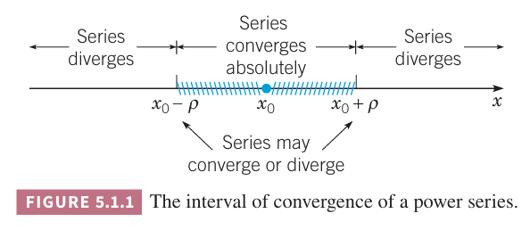

这一章会讨论如何使用幂级数来构造系数是自变量函数的二阶微分方程的基础解系。首先回顾一下本章要用到的幂级数相关知识。更多细节可以参考[微积分级数](../../010-Calculus/090-Infinite-Sequences-and-Series/README.md)这一章。

如果
$$\lim_{m\to\infty}\sum_{n=0}^ma_n(x-x_0)^n$$
在 $x$ 处存在，那么幂级数 $\sum_{n=0}^\infty a_n(x-x_0)^n$ 在 $x$ 处收敛。在 $x=x_0$ 处肯定收敛。或许对所有 $x$ 都收敛，或许仅对部分 $x$ 收敛。

如果
$$\lim_{n=0}^\infty|a_n(x-x_0)^n|=\sum_{n=0}^\infty|a_n||(x-x_0)|^n$$
那么幂级数 $\sum_{n=0}^\infty a_n(x-x_0)^n$ 称为觉得收敛。如果一个级数绝对收敛，那么级数肯定收敛，反之不一定成立。

最常用的判定级数是否绝对收敛的方法是比值测试。如果 $a_n\neq 0$，并且对于固定值 $x$
$$\lim_{n\to\infty}\bigg|\frac{a_{n+1}(x-x_0)^{n+1}}{a_n(x-x_0)^n}\bigg|=|x-x_0|\lim_{n\to\infty}\bigg|\frac{a_{n+1}}{a_n}\bigg|=|x-x_0|L$$
如果 $|x-x_0$L<1$，那么级数绝对收敛，如果 $|x-x_0|L>1$，那么级数发散，如果 $|x-x_0|L=1$，比值测试法无法给出结论。

例 1 求 $x$ 为何值时幂级数
$$\sum_{n=1}^\infty(-1)^{n+1}n(x-2)^n=(x-2)-2(x-2)^2+3(x-2)^3-\cdots$$
收敛？

解：使用比值测试法。
$$\lim_{n\to\infty}\bigg|\frac{(-1)^{n+2}(n+1)(x-2)^{n+1}}{(-1)^{n+1}n(x-2)^n}\bigg|=|x-2|\lim_{n\to\infty}\frac{n+1}{n}=|x-2|$$
如果 $|x-2|<1$，即 $1<x<3$，级数绝对收敛，如果 $|x-2|>1$，级数发散。当 $|x-2|=1$，即 $x=1,x=3$ 时，当 $n\to\infty$ 时，级数的第 $n$ 项不趋于零，因此是发散的。

综上，当 $1<x<3$ 时级数绝对收敛；$x\leq 1,x\geq 3$ 时级数发散。

如果幂级数 $\sum_{n=0}^\infty a_n(x-x_0)^n$ 在 $x=x_1$ 收敛，那么在 $|x-x_0|<|x_1-x_0|$ 时绝对收敛；如果在 $x=x_1$ 处发散，在 $|x-x_0|>|x_1-x_0|$ 时发散。

对于幂级数，存在一个正数 $\rho$ 称为收敛半径，比如 $\sum_{n=0}^\infty a_n(x-x_0)^n$ 在 $|x-x_0|<\rho$ 上绝对收敛，在 $|x-x_0|>\rho$ 上发散。区间 $|x-x_0|<\rho$ 称为收敛区间。如下图所示。在 $|x-x_0|=\rho$ 处可能收敛也可能发散。需要重要的幂级数对所有 $x$ 都收敛。这种情况 $\rho$ 无穷大，收敛区间是整个实轴。还有一种情况是仅在 $x_0$ 处收敛。这种情况下 $\rho=0$ 且没有收敛区间。统一考虑这些情况，每个幂级数有一个非负收敛半径 $\rho$，且如果 $\rho>0$ 那么存在有限或者无穷大的收敛区间。

例 2 求幂级数
$$\sum_{n=1}^\infty\frac{(x+1)^n}{n2^n}$$
的收敛半径。

解：利用比值测试
$$\lim_{n\to\infty}\bigg|\frac{(x+1)^{n+1}}{(n+1)2^{n+1}}\frac{n2^n}{(x+1)^n}\bigg|=\frac{|x+1|}{2}\lim_{n\to\infty}\frac{n}{n+1}=\frac{|x+1|}{2}$$
因此级数在 $|x+1|<2$ 时绝对收敛，即 $-3<x<1$。在 $|x+1|>2$ 时发散。因此收敛半径是 $\rho=2$。最后检查边界条件。在 $x=1$ 处级数变成了调和级数
$$\sum_{n=1}^\infty\frac{1}{n}$$
这是个发散级数。在 $x=-3$ 处，级数是交错调和级数
$$\sum_{n=1}^\infty\frac{(-3+1)^n}{n2^n}=\sum_{n=1}^\infty\frac{(-1)^n}{n}$$
这是一个收敛级数但是不绝对收敛。因此级数在 $x=-3$ 处收敛。

综上，幂级数在 $-3\leq x<1$ 时收敛，否则发散。在 $-3<x<1$ 时绝对收敛，收敛半径是 2。

假定 $\sum_{n=0}^\infty a_n(x-x_0)^n,\sum_{n=0}^\infty b_n(x-x_0)^n$ 收敛到函数 $f(x),g(x)$，收敛区间是 $|x-x_0|<\rho,\rho>0$。

两个级数对应项的和或差组成级数至少在 $|x-x_0|<\rho$ 上收敛。
$$f(x)\pm g(x)=\sum_{n=0}^\infty(a_n\pm b_n)(x-x_0)^n$$

两个级数相乘
$$f(x)g(x)=\big(\sum_{n=0}^\infty a_n(x-x_0)^n\bigg)\big(\sum_{n=0}^\infty b_n(x-x_0)^n\bigg)=\sum_{n=1}^\infty c_n(x-x_0)^n$$
其中 $c_n=a_0b_n+a_1b_{n-1}+\cdots+a_nb_0$。结果至少在 $|x-x_0|<\rho$ 上收敛。

如果 $b_0\neq 0$，那么 $g(x_0)\neq 0$，那么可以做级数的除法。
$$\frac{f(x)}{g(x)}=\sum_{n=0}^\infty d_n(x-x_0)^n$$
大部分时候系数通过下面等式获得
$$\sum_{n=0}^\infty a_n(x-x_0)^n=\bigg(\sum_{n=0}^\infty d_n(x-x_0)^n\bigg)\bigg(\sum_{n=0}^\infty b_n(x-x_0)^n\bigg)=\sum_{n=0}^\infty\bigg(\sum_{n=0}^\infty d_kb_{n-k}\bigg)(x-x_0)^n$$
这种情况下幂级数的收敛半径可能会小于 $\rho$。

函数 $f$ 是连续的，在 $|x-x_0|<\rho$ 上有任意阶导数。$f',f'',\cdots$ 可以通过对各项分别求导得到
$$\begin{aligned}
f'(x)&=a_1+2a_2(x-x_0)+\cdots+na_n(x-x_0)^{n-1}+\cdots\\
&=\sum_{n=1}^\infty na_n(x-x_0)^{n-1}
\end{aligned}$$
$$\begin{aligned}
f''(x)&=2a_2+6a_3(x-x_0)+\cdots+n(n-1)(x-x_0)^{n-2}+\cdots\\
&=\sum_{n=2}^\infty n(n-1)a_n(x-x_0)^{n-2}
\end{aligned}$$
每一个幂级数都在 $|x-x_0|<\rho$ 上绝对收敛。

如果
$$a_n=\frac{f^{(n)}(x_0)}{n!}$$
那么级数是 $f$ 在 $x=x_0$ 处的泰勒级数。

如果在以 $x_0$ 为中心的开区间上有 $\sum_{n=0}^\infty a_n(x-x_0)^n=\sum_{n=0}^\infty b_n(x-x_0)^n$，那么 $a_n=b_n,n=1,2,3,\cdots$。如果对每个 $x$ 都有 $\sum_{n=0}^\infty a_n(x-x_0)^n=0$，那么 $a_0=a_1=\cdots=a_n=0$。

函数 $f$ 在以 $x=x_0$ 为中心收敛半径 $\rho$ 内的泰勒级数是
$$f(x)=\sum_{n=0}^\infty\frac{f^{(n)}(x_0)}{n!}(x-x_0)^n$$
称为在 $x=x_0$ 可分析的（`analytic`）。微积分中常见的函数都是可分析的，除了在一些很明显的间断点上。比如 $\sin x,e^x$ 处处都是可分析的，$1/x$ 除了 $x=0$ 以外都是可分析的。$\tan x$ 在 $\pi/2$ 的整数倍以外的点上都是可分析的。如果 $f,g$ 在 $x_0$ 上是可分析的，那么 $f\pm g,fg,f/g(g(x_0)\neq 0)$ 在 $x=x_0$ 都是可分析的。很多情况下，幂级数应用于复平面。这一章分析的方法和结论可以直接扩展到自变量和应变量是复数的微分方程。

### 移动求和索引
首先，对于求和而言，下标字母不重要，比如
$$\sum_{n=0}^\infty\frac{2^nx^n}{n!}=\sum_{j=0}^\infty\frac{2^jx^j}{j!}$$
类似于改变定积分的上下界的变量，我们也可以修改级数求和时的下标变量，参考下面几个例子。

例 3 将
$$\sum_{n=2}^\infty a_nx^n$$
改写为以 $n=0$ 开始的级数求和。

解：令 $m=n-2$，那么 $n=m+2$，$n=2$ 对应着 $m=0$，代入上式得到
$$\sum_{n=2}^\infty a_nx^n=\sum_{m=0}^\infty a_{m+2}x^{m+2}\tag{1}$$
根据上述分析，下标字母不重要，因此
$$\sum_{n=2}^\infty a_nx^n=\sum_{n=0}^\infty a_{n+2}x^{n+2}\tag{2}$$
指数向上加 2，计数起始位置减 2。

例 4 将
$$\sum_{n=2}^\infty(n+2)(n+1)a_n(x-x_0)^{n-2}\tag{3}$$
改写为 包含 $(x-x_0)^n$ 而不是 $(x-x_0)^{n-2}$ 的式子。

解：用 $n+2$ 代替 $n$ 得到
$$\sum_{n=0}^\infty(n+4)(n+3)a_{n+2}(x-x_0)^n\tag{4}$$

例 5 将
$$x^2\sum_{n=0}^\infty(r+n)a_nx^{r+n-1}\tag{5}$$
写作包含 $x^{r+n}$ 的表达式。

解：首先将外面的 $x^2$ 放入求和表达式内部
$$\sum_{n=0}^\infty(r+n)a_nx^{r+n+1}\tag{6}$$
用 $n-1$ 代替 $n$ 得到
$$\sum_{n=1}^\infty(r+n-1)a_{n-1}x^{r+n}\tag{7}$$

例 6 假定对所有 $x$ 都有
$$\sum_{n=1}^\infty na_nx^{n-1}=\sum_{n=0}^\infty a_nx^n\tag{8}$$
那么系数 $a_n$ 隐含着什么呢？

解：$x^n$ 对应系数相等。等式左边用 $n+1$ 代替 $n$，那么
$$\sum_{n=0}^\infty(n+1)a_{n+1}x^n=\sum_{n=0}^\infty a_nx^n\tag{9}$$
那么
$$(n+1)a_{n+1}=a_n,n=0,1,2,3,\cdots$$
即
$$a_{n+1}=\frac{a_n}{n+1},n=0,1,2,3,\cdots\tag{10}$$
将上式展开前几项得到
$$a_1=a_0,a_2=\frac{a_1}{2}=\frac{a_0}{2},a_3=\frac{a_2}{3}=\frac{a_0}{3!}$$
一般地
$$a_n=\frac{a_0}{n!},n=1,2,3,\cdots\tag{11}$$
给定 $a_0$，方程 $(8)$ 确定了后续的 $a_n$。将 $(11)$ 代回 $(8)$ 得到
$$\sum_{n=0}^\infty a_nx^n=\sum_{n=0}^\infty\frac{a_0}{n!}x^n=a_0\sum_{n=0}^\infty\frac{x^n}{n!}=a_0e^x$$
