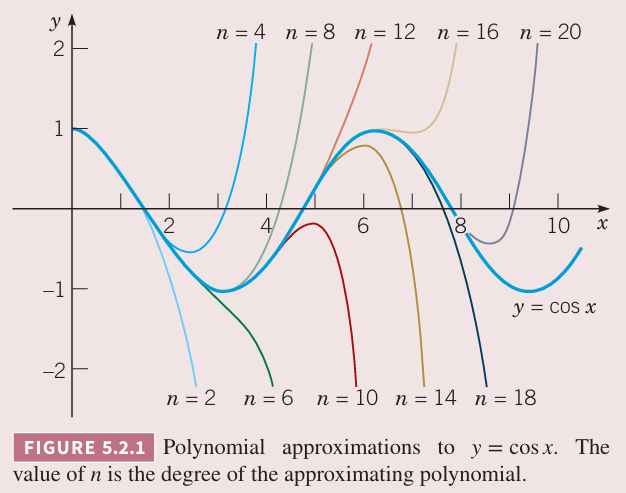
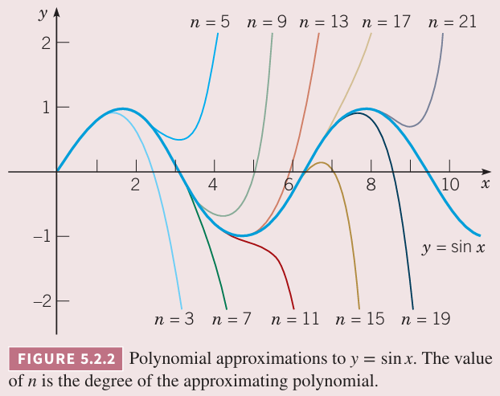
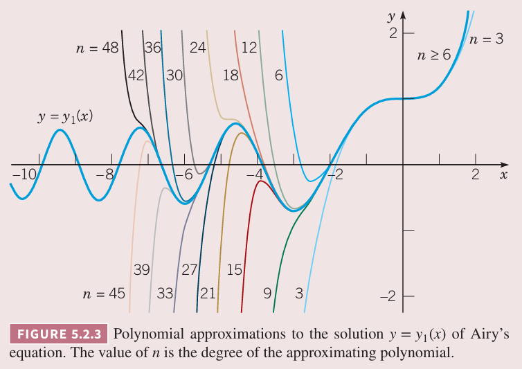
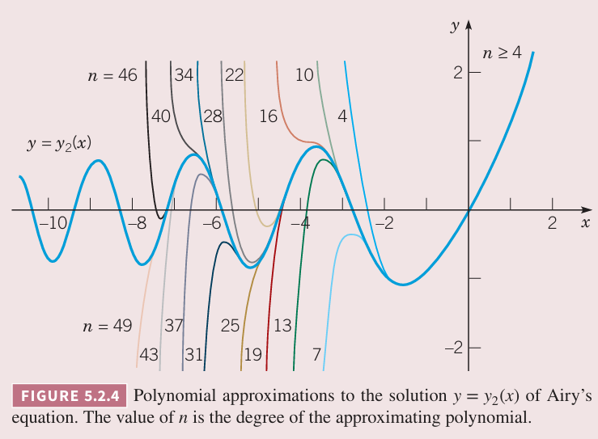

第三章讨论了求解常系数二阶线性微分方程的方法，下面讨论系数是自变量的函数的情况。由于非齐次方程的求解过程类似，这里仅讨论齐次方程
$$P(x)\frac{d^2y}{dx^2}+Q(x)\frac{dy}{dx}+R(x)y=0\tag{1}$$
很多数学物理方程都是形式如 $(1)$ 且系数是多项式，比如贝塞尔方程
$$x^2y''+xy'+(x^2-\nu^2)y=0$$
其中 $\nu$ 是常量。再比如勒让德方程
$$(1-x^2)y''-2xy'+\alpha(\alpha+1)y=0$$
其中 $\alpha$ 是常量。为了简化代数运算，这里也仅考虑 $P,Q,R$ 是多项式的情况。不过分析的方法适用于 $P,Q,R$ 是任意分析函数。

当前，假定 $P,Q,R$ 是多项式且没有公因子 $x-c$。如果有，可以同除以 $x-c$。假定这里求解 $x=x_0$ 附近的解。方程 $(1)$ 在包含 $x_0$ 的区间上的解与该区间上 $P$ 的行为密切相关。

使得 $P(x_0)\neq 0$ 的点成为常点（`ordinary point`），由于 $P$ 是连续的，那么存在包含 $x_0$ 的开区间使得 $P(x)$ 不为零。这个区间 $I$ 上，方程 $(1)$ 两边同除 $P(x)$ 得到
$$y''+p(x)y'+q(x)y=0\tag{2}$$
其中 $p(x)=Q(x)/P(x),q(x)=R(x)/P(x)$，在 $I$ 上都是连续函数。根据定理 3.2.1（存在性和唯一性定理），在区间 $I$ 上方程 $(1)$ 有唯一一个解能满足初始条件 $y(x_0)=y_0,y'(x_0)=y'_0$，这里 $y_0,y'_0$ 是任意值。这一节和下一小节讨论在常点附近的解。

如果 $P(x_0)=0$，那么 $x_0$ 称为奇点（`singular point`）。这种情况下，由于 $(x-x_0)$ 不是 $P,Q,R$ 的公因子，$Q(x_0),R(x_0)$ 至少有一个不为零。那么方程 $(2)$ 中 $p,q$ 至少有一个函数在 $x\to x_0$ 会趋于无穷，定理 3.2.1 不适用于这种情况。5.4 至 5.7 小节会求奇点附近的解。

下面求解方程 $(1)$ 在常点 $x_0$ 附近的解。解的形式是
$$y=a_0+a_1(x-x_0)+\cdots+a_n(x-x_0)^n+\cdots=\sum_{n=0}^\infty a_n(x-x_0)^n\tag{3}$$
假定对某些 $\rho$ 而言，级数在区间 $|x-x_0|<\rho$ 上收敛。

乍一看以幂级数的形式来求解并没有吸引力，但是实际上它是一种方便且有用的解的形式。在收敛区间内，级数行为类似于多项式，方便分析和数值计算。有时即使我们能够得到初等函数形式，比如指数函数或者三角函数，如果想要有数值解或者画图，使用等价的级数形式更好。

确定系数 $a_n$ 的方法就是将 $(3)$ 及其导数 $y',y''$ 代入到方程 $(1)$ 中。下面的例子解释了整个过程。只要在收敛区间内，那么微分等操作都是合理的。

例 1 求方程
$$y''+y=0,-\infty<x<\infty\tag{4}$$
的级数解。

解：这是一个常系数微分方程，$\sin x,\cos x$ 是一组基础解系，不必使用级数方法。不过，这个例子展示了在相对简单的情况下如何使用级数方法。对于方程 $(4)$，$P(x)=1,Q(x)=0,R(x)=1$，每一点都是常点。

这里求 $x=x_0$ 附近的级数解。
$$y=a_0+a_1x+a_2x^2+a_3x^3+\cdots+a_nx^n+\cdots=\sum_{n=0}^\infty a_nx^n\tag{5}$$
假定这个级数在某个区间 $|x|<\rho$ 上收敛。对 $(5)$ 逐项微分得到
$$y'=a_1+2a_2x+3a_3x^2+\cdots+na_nx^{n-1}+\cdots=\sum_{n=1}^\infty na_nx^{n-1}\tag{6}$$
$$y''=2a_1+3\cdot 2a_3x+\cdots+n(n-1)a_nx^{n-2}+\cdots=\sum_{n=2}^\infty n(n-1)a_nx^{n-2}\tag{7}$$
将 $(5),(7)$ 代入 $(4)$ 得到
$$\sum_{n=2}^\infty n(n-1)a_nx^{n-2}+\sum_{n=0}^\infty a_nx^n=0$$
对于上式的第一项，用 $n+2$ 代替 $n$ 得到
$$\sum_{n=0}^\infty (n+2)(n+1)a_{n+2}x^n+\sum_{n=0}^\infty a_nx^n=0$$
$$\sum_{n=0}^\infty ((n+2)(n+1)a_{n+2}+a_n)x^n=0$$
为了满足任意 $x$，任意阶的系数都要为零，因此
$$(n+2)(n+1)a_{n+2}+a_n=0,n=0,1,2,3,\cdots\tag{8}$$
公式 $(8)$ 表示的是递归关系。后续的系数根据前面的系数得到。这里，每个系数仅依赖于两个之前的系数。因此偶数系数 $\{a_0,a_2,a_4,\cdots\}$ 和奇数系数 $\{a_1,a_3,a_5,\cdots\}$ 可以分别确定。

对于偶数项有
$$a_2=-\frac{a_0}{2\cdot 1}=-\frac{a_0}{2},a_4=-\frac{a_2}{4\cdot 3}=+\frac{a_0}{4!},a_6=-\frac{a_4}{6\cdot 5}=-\frac{a_0}{6!},\cdots$$
如果 $n=2k$，那么
$$a_n=a_{2k}=\frac{(-1)^k}{(2k)!}a_0,k=1,2,3,\cdots\tag{9}$$
下面使用归纳法证明 $(9)$。显然 $k=1$ 时是成立的。假定任意 $k$ 成立，来验证 $k+1$ 时的情况。
$$a_{2k+2}=-\frac{a_{2k}}{(2k+2)(2k+1)}=-\frac{(-1)^k}{(2k+2)(2k+1)(2k)!}a_0=\frac{(-1)^{k+1}}{(2k+2)!}a_0$$
因此 $(9)$ 对 $k+1$ 也成立，那么对所有 $k$ 都成立。

类似的，仅考虑奇数项
$$a_3=-\frac{a_1}{3\cdot 2}=-\frac{a_1}{3!},a_5=-\frac{a_3}{5\cdot 4}=+\frac{a_1}{5!},a_7=-\frac{a_5}{7\cdot 6}=-\frac{a_1}{7!},\cdots$$
那么 $n=2k+1$ 时有
$$a_n=a_{2k+1}=\frac{(-1)^k}{(2k+1)!}a_1,k=1,2,3,\cdots\tag{10}$$
将这些系数代入 $(5)$ 有
$$\begin{aligned}
y&=a_0+a_1x-\frac{a_0}{2!}x^2-\frac{a_1}{3!}x^3+\frac{a_0}{4!}x^4+\frac{a_1}{5!}x^5+\cdots+\frac{(-1)^na_0}{(2n)!}x^{2n}+\frac{(-1)^na_1}{(2n+1)!}x^{2n+1}+\cdots\\
&=a_0\bigg[1-\frac{x^2}{2!}+\frac{x^4}{4!}+\cdots+\frac{(-1)^n}{(2n)!}x^{2n}\bigg]+a_1\bigg[x-\frac{x^3}{3!}+\frac{x^5}{5!}+\cdots+\frac{(-1)^n}{(2n+1)!}x^{2n+1}+\cdots\bigg]\\
&=a_0\sum_{n=0}^\infty\frac{(-1)^n}{(2n)!}x^{2n}+a_1\sum_{n=0}^\infty\frac{(-1)^n}{(2n+1)!}x^{2n+1}
\end{aligned}\tag{11}$$
因此方程 $(4)$ 有两个级数解
$$y_1(x)=\sum_{n=0}^\infty\frac{(-1)^n}{(2n)!}x^{2n},y_2(x)=\sum_{n=0}^\infty\frac{(-1)^n}{(2n+1)!}x^{2n+1}$$
使用比值测试可以得到 $y_1(x),y_2(x)$ 两个级数对任意 $x$ 都收敛，那么这意味着上述步骤都是合理的。事实上，$y_1(x)$ 就是 $\cos x$ 在 $x=0$ 处的泰勒级数，$y_2(x)$ 是 $\sin x$ 在 $x=0$ 处的泰勒级数。因此方程 $(4)$ 的通解 $(11)$ 可以表达为 $y=a_0\cos x+a_1\sin x$。

这里 $a_0,a_1$ 可以是任意值。从 $(5),(6)$ 可以看出 $y,y'$ 在 $x=0$ 处的值分别是 $a_0,a_1$。由于初始条件 $y(0),y'(0)$ 可以是任意值，因此 $a_0,a_1$ 可以是任意值，除非预先指定了初始条件。

下面两个图分别是级数 $y_1(x),y_2(x)$ 对 $\cos x,\sin x$ 的近似。随着项数的增多，令人满意的近似区间也在变大，对于这个区间内的每一个 $x$ 近似值也更精确。不过要牢记截断级数仅仅是在点 $x=0$ 附近的近似，无法充分表示 $|x|$ 很大时的解。

在例 1 中，我们知道 $\cos x,\sin x$ 是方程 $(4)$ 的基础解析。不过如果不知道 $(4)$ 有这样的解，仅仅使用级数解法，仍然能够得到解 $(11)$。由于微分方程 $(4)$ 在应用中经常出现，这里给 $(11)$ 的两个解特殊的名字
$$C(x)=\sum_{n=0}^\infty\frac{(-1)^n}{(2n)!}x^{2n},S(x)=\sum_{n=0}^\infty\frac{(-1)^n}{(2n+1)!}x^{2n+1}\tag{12}$$
这两个解 $C(x),S(x)$ 是基础解系吗？从级数可以得到 $C(0)=1,S(0)=0$。逐项微分 $C(x),S(x)$，得到
$$S'(x)=C(x),C'(x)=-S(x)\tag{13}$$
那么当 $x=0$ 时，有 $S'(0)=1,C'(0)=0$。那么 $C,S$ 在 $x=0$ 的朗斯基是
$$W[C,S](0)=\begin{vmatrix}
1&0\\0&1
\end{vmatrix}=1\tag{14}$$
那么这两个函数是基础解系。用 $-x$ 代入 $(12)$ 的 $x$，得到 $C(-x)=C(x),S(-x)=-S(x)$。通过分析无穷级数，函数 $C(x),S(x)$ 和余弦函数、正弦函数有相同的分析和代数属性。

这些函数可以定义为某个简单的二阶线性微分方程的解。函数 $\sin x$ 可以定义为初值问题 $y''+y=0,y(0)=0,y'(0)=1$ 的解；类似的，函数 $\cos x$ 可以定义为初值问题 $y''+y=0,y(0)=1,y'(0)=0$。许多在数学物理应用中重要的函数都可以视为某个初值问题的解。大部分情况下，没有更简单的解或者更基础的方式表示了。

例 2 求艾里方程
$$y''-xy=0,-\infty<x<\infty\tag{15}$$
的级数解。

解：这个方程的 $P(x)=1,Q(x)=0,R(x)=-x$，那么每个点都是常点。假定解是
$$y=\sum_{n=0}^\infty a_nx^n\tag{16}$$
级数在某个区间 $|x|<\rho$ 上收敛。之前 $(7)$ 是 $y''$，和之前类似，稍微调整一下下标得到
$$y''=\sum_{n=0}^\infty ((n+2)(n+1)a_{n+2}+a_n)x^n\tag{17}$$
将 $(16),(17)$ 代入 $(15)$ 得到
$$\sum_{n=0}^\infty ((n+2)(n+1)a_{n+2}+a_n)x^n-x\sum_{n=0}^\infty a_nx^n=\sum_{n=0}^\infty ((n+2)(n+1)a_{n+2}+a_n)x^n-\sum_{n=0}^\infty a_nx^{n+1}\tag{18}$$
对右边第一项的 $n=0$ 单独写，对第二项变换下标得到
$$2a_2+\sum_{n=1}^\infty ((n+2)(n+1)a_{n+2}+a_n)x^n-\sum_{n=1}^\infty a_{n-1}x^n=0$$
$x$ 任意阶的系数都为零，那么 $a_2$ 为零，且有如下递归关系
$$(n+2)(n+1)a_{n+2}-a_{n-1}=0,n=1,2,3,\cdots\tag{19}$$
这里 $a_{n+2}$ 由 $a_{n-1}$ 确定。$a_0$ 确定 $a_3$，进而确定 $a_6,\cdots$，$a_1$ 决定了 $a_4$，等等，$a_2$ 决定了 $a_5$，等等。由于 $a_2=0$，那么 $a_5=a_8=\cdots=0$。

对于序列 $a_0,a_3,a_6,\cdots$，根据递归关系
$$a_3=\frac{a_0}{2\cdot 3},a_6=\frac{a_3}{5\cdot 6}=\frac{a_0}{2\cdot 3\cdot 5\cdot 6},a_9=\frac{a_6}{8\cdot 9}=\frac{a_0}{2\cdot 3\cdot 5\cdot 6\cdot 8\cdot 9},\cdots$$
通向公式是
$$a_{3n}=\frac{a_0}{2\cdot 3\cdot 5\cdot 6\cdots(3n-1)(3n)},n\geq 1$$
对于序列 $a_1,a_4,a_7,\cdots$，根据递归关系
$$a_4=\frac{a_1}{3\cdot 4},a_7=\frac{a_4}{6\cdot 7}=\frac{a_0}{3\cdot 4\cdot 6\cdot 7},a_{10}=\frac{a_7}{9\cdot 10}=\frac{a_0}{3\cdot 4\cdot 6\cdot 7\cdot 9\cdot 10},\cdots$$
通向公式是
$$a_{3n+1}=\frac{a_1}{3\cdot 4\cdot 6\cdot 7\cdots(3n)(3n+1)},n\geq 1$$
那么艾里方程的通解是
$$\begin{aligned}
y(x)&=a_0\bigg[1+\frac{x^3}{2\cdot 3}+\frac{x^6}{2\cdot 3\cdot 5\cdot 6}+\cdots+\frac{x^{3n}}{2\cdot 3\cdots(3n-1)(3n)}+\cdots\bigg]\\
&+a_1\bigg[x+\frac{x^4}{3\cdot 4}+\frac{x^7}{3\cdot 4\cdot 6\cdot 7}+\cdots+\frac{x^{3n+1}}{3\cdot 4\cdots(3n)(3n+1)}+\cdots\bigg]\\
&=a_0y_1(x)+a_1y_2(x)\tag{20}
\end{aligned}$$
现在分析这两个级数的收敛性。由于两个级数的分母快速变大，我们期望这两个级数的收敛半径很大。对第一个级数使用比值测试法有
$$\begin{aligned}
\lim_{n\to\infty}\bigg|\frac{x^{3n+3}}{2\cdot 3\cdots(3n+2)(3n+3)}\frac{2\cdot 3\cdots(3n-1)(3n)}{x^{3n}}\bigg|&=\lim_{n\to\infty}\bigg|\frac{x^3}{(3n+2)(3n+3)}\bigg|\\
&=0
\end{aligned}$$
因此收敛半径无穷大，即对任意 $x$ 都收敛。第二个级数也一样。

令 $a_0=1,a_1=0$ 可以得到 $y_1$ 是 $(15)$ 的解，类似的令 $a_0=0,a_1=1$ 可以得到 $y_2$ 是 $(15)$ 的解。$y_1$ 满足初始条件 $y_1(0)=1,y_1'(0)=0$，$y_2$ 满足初始条件 $y_2(0)=0,y_2'(0)=1$。因此 $W[y_1,y_2](0)=1\neq 0$，那么 $y_1,y_2$ 是基础解系。那么艾里方程的通解是
$$y=a_0y_1(x)+a_1y_2(x),-\infty<x<\infty$$
下面两个图是艾里方程的解和 $y_1,y_2$ 部分和的图像。部分和仅仅是在原点附近解的近似。随着项变多，近似精度提高，但是没有多项式能够充分的表示 $|x|$ 很大时 $y_1,y_2$。

为了估计部分和是足够精确的区间，计算部分和以及包含多一项的部分和。当有明显分离时，那么有足够信息称近似不再精确。比如上图中 $n=24,n=27$ 的情况，在 $x=-9/2$ 时两者分离，那么超过这个点之后，$n=24$ 的部分和不再是解的近似。

$y_1,y_2$ 在 $x>0$ 是单调递增，在 $x<0$ 时振荡。振荡并不是均匀的，随着距原点越来越远，振幅在变小，频率在变大。与例 1 不同，这里艾里方程的解无法再用微积分中常见的基础函数表示。由于这些函数在很多物理问题中的重要性，因此它们被广泛研究，得出很多性质。

例 3 使用 $x-1$ 的幂次表示艾里方程的解。

解：$x=1$ 是方程 $(15)$ 的常点，因此解的形式是
$$y=\sum_{n=0}^\infty a_n(x-1)^n$$
假定级数在区间 $|x-1|<\rho$ 上收敛。那么
$$y'=\sum_{n=1}^\infty na_n(x-1)^{n-1}=\sum_{n=0}^\infty(n+1)a_{n+1}(x-1)^n$$
$$y''=\sum_{n=2}^\infty n(n-1)a_n(x-1)^{n-2}=\sum_{n=0}^\infty(n+2)(n+1)a_{n+2}(x-1)^n$$
代入 $(15)$ 得到
$$\sum_{n=0}^\infty(n+2)(n+1)a_{n+2}(x-1)^n=x\sum_{n=0}^\infty a_n(x-1)^n\tag{21}$$
把 $x$ 写作 $(x-1)+1$ 这样都表达成 $x-1$ 的形式。
$$\begin{aligned}
\sum_{n=0}^\infty(n+2)(n+1)a_{n+2}(x-1)^n&=((x-1)+1)\sum_{n=0}^\infty a_n(x-1)^n\\
&=\sum_{n=0}^\infty a_n(x-1)^{n+1}+\sum_{n=0}^\infty a_n(x-1)^n
\end{aligned}$$
调成下标得到
$$\sum_{n=0}^\infty(n+2)(n+1)a_{n+2}(x-1)^n=\sum_{n=1}^\infty a_{n-1}(x-1)^n+\sum_{n=0}^\infty a_n(x-1)^n$$
$x-1$ 的系数相等，那么
$$\begin{aligned}
2a_2&=a_0\\
(3\cdot 2)a_3&=a_1+a_0\\
(4\cdot 3)a_3&=a_2+a_1\\
(5\cdot 4)a_3&=a_3+a_2\\
&\vdots
\end{aligned}$$
通项公式是
$$(n+2)(n+1)a_{n+2}=a_n+a_{n-1},n\geq 1\tag{22}$$
那么 $a_n,n\geq 2$ 可以用 $a_0,a_1$ 表示
$$\begin{aligned}
a_2&=\frac{a_0}{2}\\
a_3&=\frac{a_1}{6}+\frac{a_0}{6}\\
a_4&=\frac{a_2}{12}+\frac{a_1}{12}&=\frac{a_0}{24}+\frac{a_1}{12}\\
a_5&=\frac{a_3}{20}+\frac{a_2}{20}&=\frac{a_0}{30}+\frac{a_1}{120}\\
&\vdots
\end{aligned}$$
因此
$$\begin{aligned}
y&=a_0\bigg[1+\frac{(x-1)^2}{2}+\frac{(x-1)^3}{6}+\frac{(x-1)^4}{24}+\frac{(x-1)^5}{120}+\cdots\bigg]\\
&+a_1\bigg[(x-1)+\frac{(x-1)^3}{6}+\frac{(x-1)^4}{12}+\frac{(x-1)^5}{120}+\cdots\bigg]
\end{aligned}\tag{23}$$
一般地，如果递归关系多于两项，使用 $a_0,a_1$ 表示 $a_n$ 的公式可能会比较复杂，甚至无法表示。缺少通项公式这里无法通过比值测试法来确定 $(23)$ 中的两个级数的收敛性。我们会在下一节 5.3 看到，即使没有 $a_n$ 的通项公式，也能知道这两个级数对所有 $x$ 都是收敛的。由它们定义的函数 $y_3,y_4$ 是艾里方程 $(15)$ 的基础解系，那么
$$y=a_0y_3(x)+a_1y_4(x)$$
是通解。

当艾里方程不是特别复杂的时候，例 3 展示了在用 $x-x_0,x_0\neq 0$ 表达幂级数时遇到的一些困难。另一个方法是令 $x-x_0=t$，这样得到一个关于 $t$ 的新的微分方程，解的形式是 $\sum_{n=0}^\infty a_nt^n$。当完成计算之后，再用 $x-x_0$ 代替 $t$。

例 2 和例 3 中我们找到两组基础解系，$(20)$ 中定义的 $y_1,y_2$ 和 $(23)$ 中的 $y_3,y_4$，它们都是方程 $(15)$ 的基础解析。根据二阶线性微分方程的基本理论，第一组函数可以表示为第二组函数的线性组合，反之亦然，但是这结论从级数的角度比较难得到。

这里再强调一下，如例 3 中，无法用 $a_0,a_1$ 表示 $a_n$ 的通项形式并不重要。重要的是我们能确认任意多我们期望的项数，这样就能知道两个级数的很多项用于分析。计算过程可能很无趣，用计算机辅助比较好。

最后，我们再讨论一个常用的方程：艾尔米特方程。形式如下
$$y''-2xy'+\lambda y=0,-\infty<x<\infty$$
其中 $\lambda$ 是常量。

假定在 $x=0$ 附近的级数解的形式是
$$\sum_{n=0}^\infty a_nx^n$$
求导完代入方程得到
$$\sum_{n=0}^\infty(n+2)(n+1)a_{n+2}x^n-\sum_{n=1}^\infty 2na_nx^n+\sum_{n=0}^\infty\lambda a_nx^n=0$$
$n=0$ 时有
$$2a_2+\lambda a_0=0$$
那么
$$a_2=-\frac{\lambda}{2}a_0$$
$x$ 的系数要全部相等，那么
$$(n+2)(n+1)a_{n+2}+(\lambda-2n)a_n=0$$
那么
$$a_{n+2}=-\frac{\lambda-2n}{(n+2)(n+1)}a_n$$
上面给出的 $n=0$ 的特殊情况也符合上式。

那么 $a_0$ 对应的函数
$$y_1=1-\frac{\lambda}{2!}x^2+\frac{\lambda(\lambda-4)}{4!}x^4-\frac{\lambda(\lambda-4)(\lambda-8)}{6!}x^6+\cdots$$
$a_1$ 对应的函数
$$y_2=x-\frac{\lambda-2}{3!}x^3+\frac{(\lambda-2)(\lambda-6)}{5!}x^5-\frac{(\lambda-2)(\lambda-6)(\lambda-10)}{7!}x^7+\cdots$$
从这两个级数可以看出，如果 $\lambda$ 是非负偶数，那么其中一个级数变成了多项式。

艾尔米特多项式 $H_n(x)$ 定义为埃米尔特方程的多项式解，并且 $x^n$ 的系数是 $2^n$。

当 $n=0$ 时，$y_1$ 是多项式，且 $x^0$ 的系数是 1，因此 $H_0(x)=1$。

当 $n=1$ 时，$y_2$ 是多项式 $x$，系数应该是 2，因此 $H_1(x)=2x$。

当 $n=2$ 时，多项式是 $1-2x^2$，$x^2$ 的系数要是 4，所以多项式乘以 $-2$ 得到 $H_2(x)=4x^2-2$。

当 $n=3$ 时，多项式是 $x-\frac{2}{3}x^3$，$x^3$ 的系数要是 8，多项式乘以 -12，因此 $H_3(x)=8x^3-12x$。
