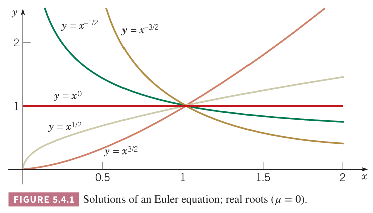
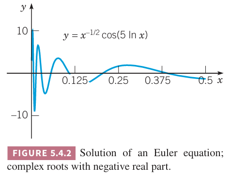
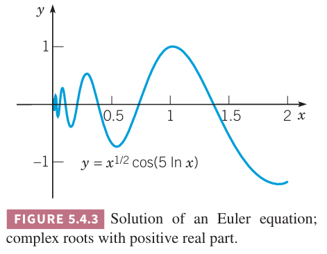
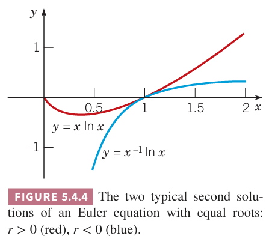

这一节会讨论微分方程
$$P(x)y''+Q(x)y'+R(x)y=0\tag{1}$$
在奇点 $x_0$ 附近的解。如果函数 $P,Q,R$ 是多项式，那么方程 $(1)$ 的奇点位于 $P(x)=0$ 处。

### 欧拉方程
相对简单的有奇点的微分方程是欧拉方程（`Euler equation`）
$$L[y]=x^2y''+\alpha xy'+\beta y=0\tag{2}$$
其中 $\alpha,\beta$ 是实数常量。那么 $P(x)=x^2,Q(x)=\alpha x,R(x)=\beta$，如果 $\beta\neq 0$，那么 $P(x),Q(x),R(x)$ 没有公因子，因此方程 $(2)$ 的奇点是 $x=0$，其他点都是常点。首先讨论 $x>0$ 这个区间，稍后再将结果拓展至 $x<0$ 上。

观察 $(x^r)'=rx^{r-1},(x^r)''=r(r-1)x^{r-2}$，因此假设方程 $(2)$ 的解的形式是
$$y=x^r\tag{3}$$
那么
$$\begin{aligned}
L[x^r]&=x^2(x^r)''+\alpha x(x^r)'+\beta x^r\\
&=x^2r(r-1)x^{r-2}+r\alpha xx^{r-1}+\beta x^r\\
&=x^r(r(r-1)+\alpha r+\beta)
\end{aligned}\tag{4}$$

如果 $r$ 是二次方程
$$F(r)=r(r-1)+\alpha r+\beta=0\tag{5}$$
的根，那么 $L[x^r]=0$，$y=x^r$ 是方程 $(2)$ 的解。$(5)$ 的根是
$$r_1,r_2=\frac{-(\alpha -1)\pm\sqrt{(\alpha-1)^2-4\beta}}{2}\tag{6}$$
那么 $(5)$ 中定义的二次多项式 $F(r)$ 可以写作 $F(r)=(r-r_1)(r-r_2)$。与讨论常系数二阶线性微分方程类似，分成三类讨论：不同的实数根、重复实数根和复数共轭根。整个讨论和第三章常系数二阶线性微分方程的过程一样，只是将 $e^{rx}$ 换成了 $x^r$。

### 实数非重复根
如果 $F(r)=0$ 有两个根 $r_1,r_2,r_1\neq r_2$，那么 $y_1(x)=x^{r_1},y_2(x)=x^{r_2}$ 是方程 $(2)$ 的两个解。由于 $r_1\neq r_2$ 且 $x>0$，那么
$$W[x^{r_1},x^{r_2}]=(r_2-r_1)x^{r_1+r_2-1}$$
不为零，那么方程 $(2)$ 的通解是
$$y=c_1x^{r_1}+c_2x^{r_2},x>0\tag{7}$$
如果 $r$ 不是有理数，那么 $x^r$ 可以定义为 $x^r=e^{r\ln x}$。

例 1 求解微分方程
$$2x^2y''+3xy'-y=0,x>0\tag{8}$$

解：将 $y=x^r$ 代入 $(8)$ 得到
$$x^r(2r(r-1)+3r-1)=x^r(2r^2+r-1)=x^r(2r-1)(r+1)=0$$
因此根是
$$r=\frac{1}{2},r=-1$$
那么 $(8)$ 的通解是
$$t=c_1x^{1/2}+c_2x^{-1},x>0\tag{9}$$

### 重复根
如果根 $r_1=r_2$，那么只能得到 $y_1(x)=x^{r_1}$。第二个方法可以通过降阶法得到，不过为了后续讨论，这里采用另一种方法来求解。由于 $r_1=r_2$，那么 $F(r)=(r-r_1)^2$。因此不仅 $F(r_1)=0$，还有 $F'(r_1)=0$。那么方程 $(4)$ 对 $r$ 微分得到
$$\begin{aligned}
\frac{\partial}{\partial r}L[x^r]&=\frac{\partial}{\partial r}[x^rF(r)]\\
&=\frac{\partial}{\partial r}[x^r(r-r_1)^2]\\
&=(r-r_1)^2x^r\ln x+2(r-r_1)x^r
\end{aligned}\tag{10}$$
通过交换对 $x$ 微分和对 $r$ 微分顺序，可以得到
$$\frac{\partial}{\partial r}L[x^r]=L[\frac{\partial}{\partial r}x^r]=L[x^r\ln x]$$
$r=r_1$ 时方程 $(10)$ 的右边为零，那么 $L[x^r\ln x]=0$。因此方程 $(2)$ 的第二个解是
$$y_2(x)=x^{r_1}\ln x,x>0\tag{11}$$
计算 $y_1,y_2$ 的朗斯基
$$W[x^{r_1},x^{r_1}\ln x]=x^{2r_1-1}$$
不为零。因此 $x^{r_1},x^{r_1}\ln x$ 是 $x>0$ 时的基础解系，因此方程 $(2)$ 的通解是
$$y=(c_1+c_2\ln x)x^{r_1},x>0\tag{12}$$

例 2 求解微分方程
$$x^2y''+5xy'+4y=0,x>0\tag{13}$$
解：将 $y=x^r$ 代入 $(13)$ 得到
$$x^r(r(r-1)+5r+4)=x^r(r^2+4r+4)=0$$
因此 $r_1=r_2=-2$，那么通解是
$$y=x^{-2}(c_1+c_2\ln x),x>0\tag{14}$$

### 复数根
如果方程 $(5)$ 是复数共轭根，$r_1=\lambda+ i\mu,r_2=\lambda- i\mu$。如果 $r$ 是复数，那么 $x^r$ 表示什么意义呢？当 $r$ 是实数时，
$$x^r=e^{r\ln x}\tag{15}$$
其中 $x>0$。可以用这个方程来定义 $r$ 是复数时 $x^r$。使用欧拉公式有
$$\begin{aligned}
x^{\lambda+ i\mu}&=e^{(\lambda+i\mu)\ln x}\\
&=e^{\lambda\ln x}e^{i\mu\ln x}\\
&=x^\lambda e^{i\mu\ln x}\\
&=x^\lambda(\cos(\mu\ln x)+i\sin(\mu\ln x)),x>0
\end{aligned}\tag{16}$$
有了 $r$ 是复数时 $x^r$ 的定义，可以验证一般的代数和微积分定理都是适用的，因此 $x^{r_1},x^{r_2}$ 是方程 $(2)$ 的解。通解是
$$y=c_1x^{\lambda+i\mu}+c_2x^{\lambda-i\mu}\tag{17}$$
上面的表达式中 $x^{\lambda+i\mu},x^{\lambda-i\mu}$ 是复数。和常系数二阶微分方程有共轭复根类似，这里使用定理 3.2.6 得到方程 $(2)$ 的实数解，方法是使用 $x^{\lambda+i\mu}$ 的实部和虚部
$$x^\lambda\cos(\mu\ln x),x^\lambda\sin(\mu\ln x)\tag{18}$$
那么
$$\begin{aligned}
W[x^\lambda\cos(\mu\ln x),x^\lambda\sin(\mu\ln x)]&=\begin{vmatrix}
x^\lambda\cos(\mu\ln x)&x^\lambda\sin(\mu\ln x)\\
\lambda x^{\lambda-1}\cos(\mu\ln x)+x^\lambda\mu(-\sin(\mu\ln x))\frac{1}{x}&\lambda x^{\lambda-1}\sin(\mu\ln x)+x^\lambda\mu(\cos\mu\ln x)\frac{1}{x}
\end{vmatrix}\\
&=\begin{vmatrix}
x^\lambda\cos(\mu\ln x)&x^\lambda\sin(\mu\ln x)\\
x^{\lambda-1}(\lambda \cos(\mu\ln x)-\mu(\sin(\mu\ln x)))&x^{\lambda-1}(\lambda\sin(\mu\ln x)+\mu(\cos\mu\ln x))
\end{vmatrix}\\
&=x^\lambda x^{\lambda-1}\begin{vmatrix}
\cos(\mu\ln x)&\sin(\mu\ln x)\\
(\lambda \cos(\mu\ln x)-\mu(\sin(\mu\ln x)))&(\lambda\sin(\mu\ln x)+\mu(\cos\mu\ln x))
\end{vmatrix}\\
&=x^{2\lambda-1}(\mu\cos^2(\mu\ln x)+\mu\sin^2(\mu\ln x))\\
&=\mu x^{2\lambda-1}
\end{aligned}$$
朗斯基不为零，因此这组解是 $x>0$ 时的基础解系，通解是
$$y=c_1x^\lambda\cos(\mu\ln x)+c_2x^\lambda\sin(\mu\ln x),x>0\tag{19}$$

例 3 求解
$$x^2y''+xy'+y=0\tag{20}$$
解：将 $y=x^r$ 代入方程 $(20)$ 那么
$$x^r(r(r-1)+r+1)=x^r(r^2+1)=0$$
因此 $r=\pm i$，通解是
$$y=c_1\cos(\ln x)+c_2\sin(\ln x),x>0\tag{21}$$
这里 $x^\lambda$ 没有出现在解中，原因是这个例子中 $\lambda=0$ 而 $x^\lambda=1$。

下面定性分析方程 $(2)$ 的解在奇点 $x=0$ 附近的行为，这完全依赖于指数 $r_1,r_2$ 的值。

如果 $r$ 是正实数，那么 $x$ 趋于零时 $x^r\to 0$。如果 $r$ 是负实数，那么 $x^r$ 会无穷大。如果 $r=0$，那么 $x^r=1$。如下图所示。

如果 $r$ 是复数，那么典型解是 $x^\lambda\cos(\mu\ln x)$。如果 $\lambda$ 是负数，函数值无穷大，$\lambda$ 是正数那么函数趋于零，当 $x\to 0$ 时函数会振荡的越来越快。如下图所示。如果 $\lambda=0$，振荡的振幅是常量。

最后，如果是重复根，其中一个解的形式是 $x^r\ln x$，如果 $r>0$ 那么趋于零，如果 $r<0$，那么无穷大。如下图所示。

现在将 $(2)$ 的解扩展到 $x<0$ 的区间。难点在于理解 $x$ 为负数 $r$ 不是整数时 $x^r$ 的含义，类似的，$\ln x$ 在 $x<0$ 上无定义。我们给出的 $x>0$ 区间上的欧拉方程的解对 $x<0$ 也适用，不过通常是复数。因此在例子中 $x^{1/2},x<0$ 是虚数。

通过如下的变量替换，总是可以得到欧拉方程 $(2)$ 在 $x<0$ 区间上的实数解。令 $x=-\xi,\xi>0$，$y=u(\xi)$，那么
$$\frac{dy}{dx}=\frac{du}{d\xi}\frac{d\xi}{dx}=-\frac{du}{d\xi},\frac{d^2y}{d\xi^2}=\frac{d}{d\xi}\bigg(-\frac{du}{d\xi}\bigg)\frac{d\xi}{dx}=\frac{d^u}{d\xi^2}\tag{22}$$
因此，对于 $x<0$，方程 $(2)$ 可以写作
$$\xi^2\frac{du}{d\xi^2}+\alpha\xi\frac{du}{d\xi}+\beta u=0,\xi>0\tag{23}$$
上式和方程 $(2)$ 除了字母不同外都一样，因此
$$u(\xi)=\begin{cases}
c_1\xi^{r_1}+c_2\xi^{r_2}&&r_1,r_2 是不同的实数\\
(c_1+c_2\ln \xi)\xi^{r_1}&&r_1=r_2 且都是实数\\
c_1\xi^\lambda\cos\mu\ln\xi+c_2\xi^\lambda\sin\mu\ln\xi&&r_{1,2}=\lambda\pm i\mu,\mu\neq 0
\end{cases}\tag{24}$$
用 $-x$ 替代 $\xi$ 就能得到原始方程的解。

使用 $|x|$ 可以将 $x<0$ 和 $x>0$ 两部分结合起来。

因此在任意不包含原点的区间上，方程 $(2)$
$$x^2y''+\alpha xy'+\beta y=0$$
的通解由方程
$$F(r)=r(r-1)+\alpha r+\beta=0$$
的两个根 $r_1,r_2$ 决定。如果两个根是实数且 $r_1\neq r_2$，那么
$$y=c_1|x|^{r_1}+c_2|x|^{r_2}\tag{25}$$
如果根是实数相等，那么
$$y=(c_1+c_2\ln|x|)x^{r_1}\tag{26}$$
如果是共轭复根 $r_{1,2}=\lambda\pm i\mu$，那么
$$y=|x|^\lambda(c_1\cos\mu\ln|x|+c_2\sin\mu\ln|x|)\tag{27}$$
如果欧拉方程的形式是
$$(x-x_0)^2y''+\alpha(x-x_0)y'+\beta y=0\tag{28}$$
那么解是类似的。如果解的形式 $y=(x-x_0)^r$，那么上述解 $(25),(26),(27)$ 中 $x$ 代入 $x-x_0$ 即可。或者将 $t=x-x_0$ 代入 $(28)$。

### 正则奇点
现在回到方程 $(1)$
$$P(x)y''+Q(x)y'+R(x)y=0$$
$x_0$ 是奇点，这意味着 $P(x_0)=0$ 并且 $Q,R$ 至少有一个在 $x_0$ 不为零。

如果尝试使用前面两节的方法求解，会失败，因为方程 $(1)$ 的解在 $x_0$ 处往往是不可分析的，无法表示为 $x-x_0$ 的泰勒级数。上面的例 1 2 3 就是例子，在 $x=0$ 处没有泰勒展开。为了求解 $(1)$ 在奇点附近的解，必须使用更一般类型的级数展开。

由于奇点的个数很少，我们是不是可以忽略它们仅求解在常点附近的解。事实是这并不可行。奇点在很大程度上决定了解的主要特征，可能比想象中还大。奇点附近的解可能会变得很大或者快速变化，比如上面三个例子。因此，通过微分方程建模的物理问题往往在奇点附近的行为更为有趣。物理问题中的几何奇点，往往是拐角或者尖刺，这些导致了相应的微分方程的奇点。因此尽管我们第一想法是避开这些很少的奇点，但是正是在这些点上，我们需要更仔细的研究。

另一个可能的方法是使用第八章描述的数值分析法。不过这些方法在奇点附近不适用。即使我们采用数值分析法，结合本章的分析方法，对研究奇点附近的解也是很有帮助的。

如果没有在奇点附近 $Q/P,R/P$ 行为的信息，那么无法描述方程 $(1)$ 在 $x=x_0$ 附近的解的行为。方程 $(1)$ 可能有两个不同的解，$x\to x_0$ 时可能都有界，或许一个有界一个无穷大或者两个都会无穷大。如果方程 $(1)$ 有解在 $x\to x_0$ 时会变得无穷大，会有 $y\to\infty$ 还是其他行为？

下面扩展之前求解方程 $(1)$ 在常点附近的方法使其适用于奇点 $x_0$ 附近。为了做合适的简化，这里对函数 $Q/P,R/P$ 有一些要求，可以看作是“弱奇点”。现在可能还无法看出什么是弱奇点，不过随着讨论相应的方法，这些条件是
$$\lim_{x\to x_0}(x-x_0)\frac{Q(x)}{P(x)}\tag{29}$$
和
$$\lim_{x\to x_0}(x-x_0)^2\frac{R(x)}{P(x)}\tag{30}$$
有限。这意味着在奇点处 $Q/P$ 不会比 $(x-x_0)^{-1}$ 更差，$R/P$ 不会比 $(x-x_0)^{-2}$ 更差。这些点称为方程 $(1)$ 的正则奇点（`regular singular point`）。对于有比多项式更一些的系数的方程，$x_0$ 是正则奇点的条件是如何
$$(x-x_0)\frac{Q(x)}{P(x)},(x-x_0)^2\frac{R(x)}{P(x)}\tag{31}$$
在 $x_0$ 附近有收敛的泰勒级数，即 $(31)$ 的函数在 $x=x_0$ 处是可分析的。当 $P,Q,R$ 是多项式时，$(29),(30)$ 有限就蕴涵这一点。方程 $(1)$ 中不是正则奇点的奇点称为非正则奇点（`irregular singular point`）。

欧拉方程 $(28)$ 满足 $(29),(30)$ 是有限的这一条件。因此欧拉方程的奇点是正则奇点。我们会看到形如 $(1)$ 的方程在正则奇点的行为与欧拉方程很类似，即在正则奇点附近的解可能会包含 $x$ 的幂次（负数或非整数次幂）、对数函数、对数函数的正弦或余弦。

下面两节会讨论如何求解方程 $(1)$ 在正则奇点附近的解。在非正则奇点附近的解超出了本书的范围，在更更等的微分方程课本中会涉及。

例 4 求勒让德方程
$$(1-x^2)y''-2xy'+\alpha(\alpha+1)y=0\tag{32}$$
的奇点，哪些是正则奇点？

解：$P(x)=1-x^2$，那么奇点是 $x=1,x=-1$。方程 $(32)$ 两边同除 $1-x^2$，$y',y$ 的系数分别是 $-2x/(1-x^2),\alpha(\alpha+1)/(1-x^2)$。考虑 $x=1$ 的情况，计算极限
$$\lim_{x\to 1}(x-1)\frac{-2x}{1-x^2}=\lim_{x\to 1}\frac{(x-1)(-2x)}{(1-x)(1+x)}=\lim_{x\to 1}\frac{2x}{1+x}=1$$
$$\lim_{x\to 1}(1-x^2)\frac{\alpha(\alpha+1)}{1-x^2}=\lim_{x\to 1}\frac{(x-1)(-\alpha)(\alpha+1)}{1+x}=0$$
极限都是有限的，那么 $x=1$ 是正则奇点，不难验证 $x=-1$ 也是正则奇点。

例 5 求微分方程
$$2x(x-2)^2y''+3xy'+(x-2)y=0$$
的奇点，哪些是正则奇点，哪些是非正则奇点？

解：两边同除 $2x(x-2)^2$，得到
$$y''+\frac{3}{2(x-2)^2}y'+\frac{1}{2x(x-2)}y=0$$
那么
$$p(x)=\frac{Q(x)}{P(x)}=\frac{3}{2(x-2)^2},q(x)=\frac{R(x)}{P(x)}=\frac{1}{2x(x-2)}$$
奇点是 $x=0,x=2$。首先讨论 $x=0$
$$\lim_{x\to 0}xp(x)=\lim_{x\to 0}\frac{3x}{2(x-2)^2}=0$$
$$\lim_{x\to 0}x^2q(x)=\lim_{x\to 0}\frac{2x}{x-2}=0$$
因此 $x=0$ 是正则奇点。

$x=2$ 时
$$\lim_{x\to 2}(x-2)p(x)=\lim_{x\to 2}\frac{3}{2(x-2)}$$
极限不存在，因此 $x=2$ 是非正则奇点。

例 6 求
$$(x-\frac{\pi}{2})^2y''+(\cos x)y'+(\sin x)y=0$$
的奇点，哪些是正则奇点，哪些是非正则奇点？

解：奇点是 $x=\frac{\pi}{2}$，那么
$$(x-\frac{\pi}{2})p(x)=(x-\frac{\pi}{2})\frac{Q(x)}{P(x)}=\frac{\cos x}{x-\pi/2}$$
$$(x-\frac{\pi}{2})^2q(x)=(x-\frac{\pi}{2})^2\frac{R(x)}{P(x)}=\sin x$$
可以直接求极限，也可以使用 $\cos x$ 在 $x=\frac{\pi}{2}$ 的泰勒展开，那么
$$\frac{\cos x}{x-\pi/2}=-1+\frac{(x-\pi/2)^2}{3!}-\frac{(x-\pi/2)^4}{5!}+\cdots$$
对所有 $x$ 收敛。同时，$\sin x$ 在 $x=\frac{\pi}{2}$ 处是可分析的。因此 $x=\frac{pi}{2}$ 是正则奇点。
