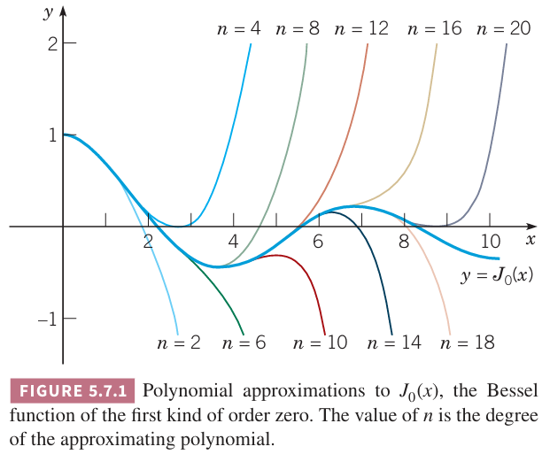
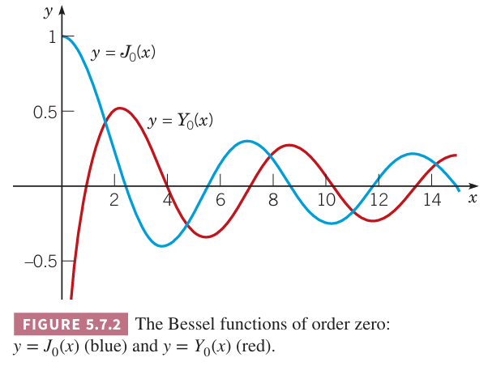
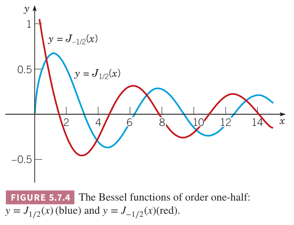
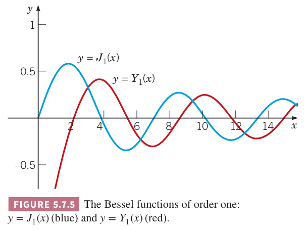

这一节通过讨论贝塞尔方程的三种特殊情况来解释 5.6 小节的分析。下面是贝塞尔方程
$$x^2y''+xy'+(x^2-\nu^2)y=0\tag{1}$$
其中 $\nu$ 是常量。很容易证明 $x=0$ 是方程 $(1)$ 的正则奇点。
$$p_0=\lim_{x\to 0}x\frac{Q(x)}{P(x)}=\lim_{x\to 0}x\frac{1}{x}=1$$
$$q_0=\lim_{x\to 0}x^2\frac{R(x)}{P(x)}=\lim_{x\to 0}x^2\frac{x^2-\nu^2}{x^2}=-\nu^2$$
因此指标方程是
$$F(r)=r(r-1)+p_0r+q_0=r(r-1)+r-\nu^2=r^2-\nu^2=0$$
那么根是 $r=\pm\nu$。下面讨论在区间 $x>0$ 上 $\nu=0,\nu=\frac{1}{2},\nu=1$ 三种情况。贝塞尔函数在 11.4 和 11.5 小节还会出现。

### 零阶贝塞尔方程
此时 $\nu=0$。那么微分方程 $(1)$ 是
$$L[y]=x^2y''+xy'+x^2y=0\tag{2}$$
指标方程的根是 $r_1=r_2=0$。将
$$y=\phi(r,x)=a_0x^r+\sum_{n=1}^\infty a_nx^{r+n}\tag{3}$$
代入 $(2)$ 得到
$$\begin{aligned}
L[\phi](r,x)&=\sum_{n=0}^\infty a_n((r+n)(r+n-1)+(r+n))x^{r+n}+\sum_{n=0}^\infty a_nx^{r+n+2}\\
&=a_0(r(r-1)+r)x^r+a_1((r+1)r+(r+1))x^{r+1}+\\
&\sum_{n=2}^\infty(a_n((r+n)(r+n-1)+(r+n))+a_{n-2})x^{r+n}\\
&=0
\end{aligned}\tag{4}$$
因此递归关系是
$$a_n(r)=-\frac{a_{n-2}(r)}{(r+n)(r+n-1)+(r+n)}=-\frac{a_{n-2}(r)}{(r+n)^2},n\geq 2\tag{5}$$
为了确定 $y_1(x)$，令 $r=0$。由 $(4)$ 可知如果要 $x^{r+1}$ 的系数为零，那么 $a_1=0$，根据递归关系 $(5)$，那么 $a_3=a_5=\cdots=0$。简化递归关系得到
$$a_n(0)=-\frac{a_{n-2}(0)}{n^2},n=2,4,6,8,\cdots$$
或者令 $n=2m$，那么
$$a_{2m}(0)=-\frac{a_{2m-2}(0)}{(2m)^2},m=1,2,3,\cdots$$
因此
$$\begin{aligned}
a_2(0)&=-\frac{a_0}{2^2}\\
a_4(0)&=-\frac{a_2}{4^2}&&=\frac{a_0}{2^42^2}\\
a_6(0)&=-\frac{a_4}{6^2}&&=-\frac{a_0}{2^6(3\cdot 2)^2}
\end{aligned}$$
通项公式是
$$a_{2m}(0)=\frac{(-1)^ma_0}{2^{2m}(m!)^2},m=1,2,3,\cdots\tag{6}$$
因此
$$y_1(x)=a_0\bigg(1+\sum_{m=1}^\infty\frac{(-1)^mx^{2m}}{2^{2m}(m!)^2}\bigg),x>0\tag{7}$$
括号里面的函数称为第一类零阶贝塞尔函数（`Bessel function of the first kind of order zero`），用 $J_0(x)$ 表示。定理 5.6.1 表明级数对所有 $x$ 都收敛并且 $J_0$ 在 $x=0$ 处可分析。下图是 $y=J_0(x)$ 的图像和 $(7)$ 中级数的部分和。

为了找到 $y_2(x)$，我们使用 5.6 小节的 $(17)$，需要计算 $a_n'(0)$。首先，$(4)$ 中 $x^{r+1}$ 的系数为零，即 $(r+1)^2a_1(r)=0$，因此对 $r=0$ 附近的任何 $r$ 都有 $a_1(r)=0$。这里想说明不仅 $a_1(0)=0$，$a_1'(0)=0$，那么根据递归关系 $(5)$，有
$$a_3'(0)=a_5'(0)=\cdots=a_{2n+1}'(0)=\cdots=0$$
因此仅需计算 $a_{2m}'(0),m=1,2,3,\cdots$。从 $(5)$ 我们有
$$a_{2m}=-\frac{a_{2m-2}(r)}{(r+2m)^2},m=1,2,3,\cdots$$
那么
$$a_2=-\frac{a_0}{(r+2)^2},a_4=\frac{a_0}{(r+2)^2(r+4)^2}$$
通项公式是
$$a_{2m}(r)=\frac{(-1)^ma_0}{(r+2)^2(r+4)^2+\cdots(r+2m)^2},m=1,2,3,\cdots$$
计算 $a_{2m}'(r)$ 要利用如下性质：如果
$$f(x)=(x-\alpha_1)^{\beta_1}(x-\alpha_2)^{\beta_2}\cdots(x-\alpha_n)^{\beta_n}$$
并且 $x$ 不等于 $\alpha_1,\alpha_2,\cdots,\alpha_n$，那么
$$\frac{f'(x)}{f(x)}=\frac{\beta_1}{x-\alpha_1}+\frac{\beta_2}{x-\alpha_2}+\cdots+\frac{\beta_n}{x-\alpha_n}$$
对 $(8)$ 应用这个性质得到
$$\frac{a_{2m}'(r)}{a_{2m}(r)}=-2\bigg(\frac{1}{r+2}+\frac{1}{r+4}+\cdots+\frac{1}{r+2m}\bigg)$$
令 $r=0$ 得到
$$a_{2m}'(0)=-2\bigg(\frac{1}{2}+\frac{1}{4}+\cdots+\frac{1}{2m}\bigg)a_{2m}(0)$$
$(6)$ 就是 $a_{2m}(0)$，再令
$$H_m=1+\frac{1}{2}+\frac{1}{3}+\cdots+\frac{1}{m}\tag{9}$$
那么可以得到
$$a_{2m}'(0)=-H_m\frac{(-1)^ma_0}{2^{2m}(m!)^2},m=1,2,3,\cdots$$
令 $a_0=1$，并且将 $a_{2m}'(0)=b_{2m}(0),y_1(x)$ 代入 5.6 小节的 $(23)$ 得到零阶贝塞尔方程的第二个解
$$y_2(x)=J_0(x)\ln x+\sum_{m=1}^\infty\frac{(-1)^{m+1}H_m}{2^{2m}(m!)^2}x^{2m},x>0\tag{10}$$
第二个解往往表示为 $J_0,y_2$ 的线性组合，称为第二类零阶贝塞尔函数（`Bessel function of the second kind of order zero`），用 $Y_0$ 表示
$$Y_0(x)=\frac{2}{\pi}[y_2(x)+(\gamma-\ln 2)J_0(x)]\tag{11}$$
其中 $\gamma$ 是欧拉-马斯克若尼常数，定义如下
$$\gamma=\lim_{n\to\infty}(H_n-\ln n)\approx 0.5772\tag{12}$$
将 $y_2(x)$ 代入 $(11)$ 得到
$$Y_0(x)=\frac{2}{\pi}\bigg[(\gamma+\ln\frac{x}{2})J_0(x)+\sum_{m=1}^\infty\frac{(-1)^{m+1}H_m}{2^{2m}(m!)^2}x^{2m}\bigg],x>0\tag{13}$$
那么零阶贝塞尔方程的通解是
$$y=c_1J_0(x)+c_2Y_0(x),x>0$$
当 $x\to 0$ 时，$J_0(x)\to 1$，那么 $Y_0(x)$ 在 $x=0$ 处有一个对数项。当 $x\to 0$ 时，$Y_0(x)$ 的行为类似 $(2/\pi)\ln x$。如果我们仅对原点有界的解感兴趣，那么需要抛弃 $Y_0$。$J_0,Y_0$ 的图像如下图所示。

从上图可以看出来，当 $x$ 很大的时候，$J_0(x),Y_0(x)$ 都是振荡的。从原始方程看来这种行为是预期的，事实上这对于 $\nu$ 阶贝塞尔方程都是成立的。如果 $(1)$ 两边同时除以 $x^2$，得到
$$y''+\frac{1}{x}y'+\bigg(1-\frac{\nu^2}{x^2}\bigg)y=0$$
如果 $x$ 非常大，那么 $(1/x)y',(\nu^2/x^2)y''$ 非常小，可以忽略。那么 $\nu$ 阶贝塞尔方程近似为
$$y''+y=0$$
这个方程的解是 $\sin x,\cos x$，那么 $x$ 充分大时，贝塞尔函数的解近似是 $\sin x,\cos x$ 的线性组合。某种程度上来说这是对的，不过随着 $x$ 的增加，$J_0,Y_0$ 都会减小，那么方程 $y''+y=0$ 对 $x$ 很大时而言并不是一个很好的近似。事实上，可以证明
$$J_0(x)\approx\bigg(\frac{2}{\pi x}\bigg)^{1/2}\cos(x-\frac{\pi}{4}),x\to\infty\tag{14}$$
$$Y_0(x)\approx\bigg(\frac{2}{\pi x}\bigg)^{1/2}\sin(x-\frac{\pi}{4}),x\to\infty\tag{15}$$
当 $x$ 很大时，这是一个相当好的近似。如下图所示，对于 $x\geq 1$，$J_0(x)$ 与近似 $(14)$ 相当接近。因此，$J_0(x)$ 在零到无穷上的近似可以分成两段，在 $x\leq 1$ 时使用 $(7)$ 中的级数的两、三项近似，在 $x\geq 1$ 时用 $(14)$ 近似。

### 半阶贝塞尔函数
这个例子解释了根的差值是整数但是没有对数项的情况。令 $(1)$ 中的 $\nu=\frac{1}{2}$，那么
$$L[y]=x^2y''+xy'+(x^2-\frac{1}{4})y=0\tag{16}$$
将级数 $(3)$ 代入，得到
$$\begin{aligned}
L[\phi](r,x)=&\sum_{n=0}^\infty((r+n)(r+n-1)+(r+n)-\frac{1}{4})a_nx^{r+n}+\sum_{n=0}^\infty a_nx^{r+n+2}\\
=&(r^2-\frac{1}{4})a_0x^r+((r+1)^2-\frac{1}{4})a_1x^{r+1}\\
&+\sum_{n=2}^\infty(((r+n)^2-\frac{1}{4})a_n+a_{n-2})x^{r+n}\\
=&0
\end{aligned}\tag{17}$$
指标方程是 $r^2-\frac{1}{4}=0$，根是 $r_1=\frac{1}{2},r_2=-\frac{1}{2}$，两者差值是整数。递归关系是
$$((r+n)^n-\frac{1}{4})a_n=a_{n-2},n\geq 2\tag{18}$$
对应较大的根 $r_1=\frac{1}{2}$，从 $(17)$ 的 $x^{r+1}$ 的系数为零可以得到 $a_1=0$。从 $(18)$ 可知 $a_3=a_5=\cdots=a_{2n+1}=\cdots=0$。因此对于 $r=\frac{1}{2}$
$$a_n=-\frac{a_{n-2}}{n(n+1)},n=2,4,6,\cdots$$
令 $n=2m$，那么
$$a_{2m}=-\frac{a_{2m-2}}{2m(2m+1)},m=1,2,3,\cdots$$
通项公式是
$$a_{2m}=\frac{(-1)^ma_0}{(2m+1)!},m=1,2,3,\cdots$$
取 $a_0=1$ 得到
$$y_1(x)=x^{1/2}\bigg(1+\sum_{m=1}^\infty\frac{(-1)^mx^{2m}}{(2m+1)!}\bigg)=x^{-1/2}\sum_{m=0}^\infty\frac{(-1)^mx^{2m+1}}{(2m+1)!},x>0\tag{19}$$
上式是 $\sin x$ 的泰勒级数，因此半阶贝塞尔方程的一个解是 $x^{-1/2}\sin x$。第一类半阶贝塞尔函数 $J_{1/2}$ 定义为 $(2/\pi)^{1/2}y_1$，因此
$$J_{1/2}(x)=(\frac{2}{\pi x})^{1/2}\sin x,x>0\tag{20}$$
对于根 $r_2=-\frac{1}{2}$，由于 $N=r_1-r_2=1$，很难计算 $a_1$。不过从 $(17)$ 可以看出，对于 $r=-\frac{1}{2}$，即使 $a_0,a_1$ 是任意值，$x^r,x^{r+1}$ 的系数都为零。结合 $(18)$，从 $a_0$ 可以得到偶数项系数，从 $a_1$ 开始可以得到奇数项系数。那么
$$a_{2m}=-\frac{a_{2m-2}}{n(n-1)},m=1,2,3,\cdots$$
那么
$$a_{2m}=\frac{(-1)^ma_0}{(2m)!},a_{2m+1}=\frac{(-1)^ma_1}{(2m+1)!},m=1,2,3,\cdots$$
因此
$$\begin{aligned}
y_2(x)&=x^{-1/2}\bigg(a_0\sum_{m=0}^\infty\frac{(-1)^mx^{2m}}{(2m)!}+a_1\sum_{m=0}^\infty\frac{(-1)^mx^{2m+1}}{(2m+1)!}\bigg)\\
&=a_0\frac{\cos x}{x^{1/2}}+a_1\frac{\sin x}{x^{1/2}},x>0
\end{aligned}\tag{21}$$
常量 $a_1$ 仅仅是 $y_1(x)$ 的若干倍。因此，通常通过令 $a_0=(2/\pi)^{1/2},a_1=0$ 得到半阶贝塞尔函数的第二个解
$$J_{-1/2}(x)=(\frac{2}{\pi x})^{1/2}\cos x,x>0\tag{22}$$
方程 $(16)$ 的通解是
$$y=c_1J_{1/2}(x)+c_2J_{-1/2}(x)$$
将 $(20),(22)$ 与 $(14),(15)$ 对比，对于 $x$ 很大的时候，$J_{1/2},J_{-1/2}$ 相比 $J_0,Y_0$ 仅仅差了相位 $\pi/4$。$J_{1/2},J_{-1/2}$ 的图像如下图所示。

### 一阶贝塞尔函数
这个例子讨论两个根差值是整数同时第二个解涉及对数项的情况。令方程 $(1)$ 中 $\nu=1$
$$L[y]=x^2y''+xy'+(x^2-1)y=0\tag{23}$$
代入级数 $(3)$ 后合并同类项得到
$$\begin{align}
L[\phi](r,x)=&a_0(r^2-1)x^r+a_1((r+1)^2-1)x^{r+1}\\
&+\sum_{n=2}^\infty(((r+n)^2-1)a_n+a_{n-2})x^{r+n}\\
=&0
\end{align}\tag{24}$$
指标方程是 $r^2-1=0$，两个根是 $r_1=1,r_2=-1$，递归关系是
$$((r+n)^2-1)a_n(r)=-a_{n-2}(r),n\geq 2\tag{25}$$
对相对较大的根 $r=1$ 而言，递归关系是
$$a_n=-\frac{a_{n-2}}{(n+2)n},n=2,3,4,\cdots$$
从 $(24)$ 的 $x^{r+1}$ 的系数为零可以得到 $a_1=0$，结合递归关系，那么 $a_3=a_5=\cdots=0$。对于偶数 $n$，令 $n=2m$，其中 $m$ 是正整数，那么
$$a_{2m}=-\frac{a_{2m-2}}{(2m+2)(2m)}=-\frac{a_{2m-2}}{2^2(m+1)m},m=1,2,3,\cdots$$
那么通项公式是
$$a_{2m}=\frac{(-1)^ma_0}{2^{2m}(m+1)!m!},m=1,2,3,\cdots\tag{26}$$
令 $a_0=1/2$，得到第一类一阶贝塞尔函数 $J_1$
$$J_1(x)=\frac{x}{2}\sum_{m=0}^\infty\frac{(-1)^mx^{2m}}{2^{2m}(m+1)!m!}\tag{27}$$
这个级数对所有 $x$ 都绝对收敛，因此函数 $J_1$ 处处都是可分析的。

为了求解第二个解，这里使用直接代入。根据定理 5.6.1，假定
$$y_2(x)=aJ_1(x)\ln x+x^{-1}\bigg(1+\sum_{n=1}^\infty c_nx^n\bigg),x>0\tag{28}$$
计算 $y_2'(x),y_2''(x)$，然后代入 $(23)$，结合 $J_1(x)$ 是方程 $(23)$ 的一个解，得到
$$2axJ_1'(x)+\sum_{n=0}^\infty((n-1)(n-2)c_n+(n-1)c_n-c_n)x^{n-1}+\sum_{n=0}^\infty c_nx^{n+1}=0\tag{29}$$
其中 $c_0=1$。代入 $(27)$ 的 $J_1(x)$，调整求和下标，得到
$$\begin{aligned}
-c_1+(0\cdot c_2+c_0)x+&\sum_{n=2}^\infty((n^2-1)c_{n+1}+c_{n-1})x^n\\
&=-a\bigg(x+\sum_{m=1}^\infty\frac{(-1)^m(2m+1)x^{2m+1}}{2^{2m}(m+1)!m!})
\end{aligned}\tag{30}$$
从上式可以看出 $c_1=0,a=-c_0=-1$。由于右边只有 $x$ 的奇数次幂，那么左边偶数次幂项的系数为零。因为 $c_1=0$，那么 $c_3=c_5=\cdots=0$。对于 $x$ 的奇数次幂，令 $n=2m+1$，那么递归关系是
$$((2m+1)^2-1)c_{2m+2}+c_{2m}=\frac{(-1)^m(2m+1)}{2^{2m}(m+1)!m!},m=1,2,3,\cdots\tag{31}$$
令上式 $m=1$ 得到
$$(3^2-1)c_4+c_2=\frac{(-1)3}{2^2\cdot 2!}$$
$c_2$ 可以任意选择，那么就确定了 $c_4$。在上面方程中，$c_2$ 乘以了 0，因此 $c_2$ 可以任意选择，那个式子可以用于确定 $a$。$c_2$ 在式子 $x^{-1}\bigg(1+\sum_{n=1}^\infty c_nx^n\bigg)$ 中是 $x$ 的系数，是第一个非零项，从这个角度分析其也可以任意选择。$c_2$ 生成了 $J_1$ 的若干倍，$y_2$ 是 $J_1$ 的若干倍加上某个值。根据惯例，这里选择 $c_2=1/2^2$，那么
$$\begin{aligned}
c_4&=\frac{-1}{2^4\cdot 2}(\frac{3}{2}+1)\\
&=\frac{-1}{2^4\cdot 2}((1+\frac{1}{2})+1)\\
&=\frac{(-1)}{2^4\cdot 2!}(H_2+H_1)
\end{aligned}$$
可以证明递归关系 $(31)$ 的解是
$$c_{2m}=\frac{(-1)^{m+1}(H_m+H_{m+1})}{2^{2m}m!(m-1)!},m=1,2,3,\cdots$$
其中有 $H_0=1$。因此
$$y_2(x)=-J_1(x)\ln x+\frac{1}{x}\bigg(1-sum_{m=1}^\infty\frac{(-1)^m(H_m+H_{m-1})}{2^{2m}m!(m-1)!}x^{2m}\bigg),x>0\tag{32}$$
计算 $y_2(x)$ 的另一个方法是使用 5.6 小节的式子 $(19),(20)$ 求解 $c_n(r_2)$，可能会稍微简单一点，无需求解递归关系 $(31)$。

方程 $(23)$ 的第二个解，也就是第二类一阶贝塞尔函数，用 $Y_1$ 表示，通常写成 $J_1,y_2$ 的线性组合。
$$Y_1(x)=\frac{2}{\pi}(-y_2(x)+(\gamma-\ln 2)J_1(x))\tag{33}$$
其中 $\gamma$ 由 $(12)$ 定义。那么 $(23)$ 在 $x>0$ 上的通解是
$$y=c_1J_1(x)+c_2Y_1(x)$$
$J_1$ 在 $x=0$ 处是可分析的。当 $x\to 0$ 时，第二个解 $Y_1$ 的行为与 $1/x$ 类似，无穷大。下图是 $J_1,Y_1$ 的图像。

