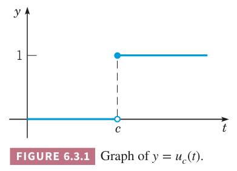
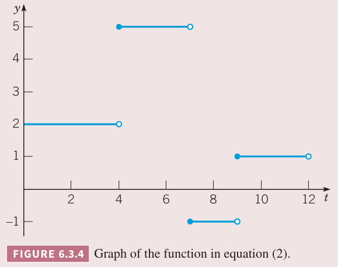

上一节我们讨论了使用拉普拉斯变换求解初值问题的一般过程。变换法最有趣的一些应用是带有求解不连续或脉冲函数的微分方程。这类问题经常出现在电路分析或机械振动系统中。这一节和本章余下各节会讨论一些拉普拉斯变换的性质用于分析这类问题。如果没有特别说明，以下出现的函数都是分段连续并且是指数阶的，也就是说在 $s$ 充分大的情况下拉普拉斯变换存在。

为了高效处理跳跃不连续，这里引入单位阶跃函数（`uint step function`）或赫维赛德函数（`Heaviside function`），其定义如下
$$u_c(t)=\begin{cases}
0,&&t<c\\
1,&&t\geq c
\end{cases}\tag{1}$$
由于拉普拉斯变换涉及的区间是 $[0,\infty)$，因此无需考虑 $c$ 是负数的情况。下图是 $y=u_c(t)$ 的图像。在 $t=c$ 处可以是任意值。对于这种分段连续的函数，不连续点的值不重要。

上述阶跃也可以是负的，比如下面是函数 $y=1-u_c(t)$ 的图像。

如果用 0 表示关 1 表示开，函数 $u_c(t)$ 表示在 $c$ 时刻打开开关，$1-u_c(t)$ 表示在 $c$ 时刻关闭开关。

例 1 给出函数
$$h(t)=u_\pi(t)-u_{2\pi}(t),t\geq 0$$
解：将 $(1)$ 中 $u_c(t)$ 的定义代入得到
$$\begin{aligned}
h(t)&=\begin{cases}
0,&&t<\pi\\1,&&t\geq\pi
\end{cases}-\begin{cases}
0,&&t<2\pi\\1,&&t\geq 2\pi
\end{cases}
&=\begin{cases}
0,&&t<\pi\\1,&&\pi\leq t\leq 2\pi\\0,&&t\geq 2\pi
\end{cases}
\end{aligned}$$
图像如下所示。函数表示开关一开始关闭状态，在 $t=\pi$ 时打开，在 $t=2\pi$ 时关闭。这也成为矩形脉冲（`rectangular pulse`）。

例 2 画出函数
$$f(t)=\begin{cases}
2,&&0\leq t<4\\
5,&&4\leq t<7\\
-1,&&7\leq t<9\\
1,&&t\geq 9
\end{cases}\tag{2}$$
并且用 $u_c(t)$ 表示 $f(t)$。

解：这个函数是分段连续的，图像如下所示。

函数开始时 $f_1(t)=2$，在区间 $[0,4)$ 上成立。在 $t=4$ 是上跃三个单位，$f_1(t)$ 加上 $3u_4(t)$，那么在 $[0,7)$ 上有
$$f_1(t)=2+3u_4(t)$$
在 $t=7$ 时下跃六个单位，那么
$$f_3(t)=2+3u_4(t)-6u_7(t)$$
最后，在 $t=9$ 时上跃两个单位，因此
$$f(t)=2+3u_4(t)-6u_7(t)+2u_9(t)\tag{3}$$
$u_c,c\geq 0$ 的拉普拉斯变换是
$$\begin{aligned}
\mathcal{L}\{u_c(t)\}&=\int_0^\infty e^{-st}u_c(t)dt\\
&=\int_c^\infty e^{-st}dt\\
&=\frac{e^{-cs}}{s},s>0
\end{aligned}\tag{4}$$
当 $c=0$ 时
$$\mathcal{L}\{u_0(t)\}=\frac{e^0}{s}=\frac{1}{s}=\mathcal{L}\{1\}$$
这对所有 $t\geq 0$ 成立。

给定函数 $f,t\geq 0$，相关函数 $g$ 的定义是
$$g(t)=\begin{aligned}
0,&&t<c\\
f(t-c),&&t\geq c
\end{aligned}$$
表示 $f$ 验证 $t$ 的正向平移了 $c$。如下图所示。

使用阶跃函数，$g(t)$ 可以表示为
$$g(t)=u_c(t)f(t-c)$$

**定理 6.3.1**
> 如果 $f(t)$ 的拉普拉斯变换 $F(s)=\mathcal{L}\{f(t)\}$ 在 $s>a\geq 0$ 时存在，$c$ 是一个正常量，那么
> $$\mathcal{L}\{u_c(t)f(t-c)\}=e^{-cs}\mathcal{L}\{f(t)\}=e^{-cs}F(s),s>a\tag{5}$$
> 反过来，如果 $f(t)$ 是 $F(s)$ 的拉普拉斯逆变换，即 $f(t)=\mathcal{L}^{-1}\{F(s)\}$，那么
> $$u_c(t)f(t-c)=\mathcal{L}^{-1}\{e^{-cs}F(s)\}\tag{6}$$

$f(t)$ 向 $t$ 的正向平移 $c$ 的拉普拉斯变换是其拉普拉斯变换 $F(s)$ 乘以 $e^{-cs}$。
$$\begin{aligned}
\mathcal{L}\{u_c(t)f(t-c)\}&=\int_0^\infty e^{-st}u_c(t)f(t-c)dt\\
&=\int_c^\infty e^{-st}f(t-c)dt\\
&=\int_0^\infty e^{-s(\delta+c)}f(\delta)d\delta\\
&=e^{-cs}\int_0^\infty e^{-s\delta}f(\delta)d\delta\\
&=e^{-cs}F(s)
\end{aligned}$$
令 $f(t)=1$，之前讨论过 $\mathcal{L}\{1\}=1/s$，使用 $(5)$ 就得到 $\mathcal{L}\{u_c(t)\}=e^{-cs}/s$，这与 $(4)$ 一致。

例 3 给定函数
$$f(t)=\begin{cases}
\sin t,&0\leq t<\frac{\pi}{4}\\
\sin t+\cos(t-\frac{\pi}{4}),&t>\frac{\pi}{4}
\end{cases}$$
画出其在区间 $0\leq t\leq $ 上的图像，并求 $\mathcal{L}\{f(t)\}$。

解：图像如下图所示。

如果令
$$g(t)=\begin{cases}
0,&t<\frac{\pi}{4}\\
\cos(t-\pi/4),&t\geq\frac{\pi}{4}
\end{cases}=u_{\pi/4}(t)\cos(t-\frac{\pi}{4})$$
因此
$$\begin{aligned}
\mathcal{L}\{f(t)\}&=\mathcal{L}\{\sin t\}+\mathcal{L}\{u_{\pi/4}(t)\cos(t-\frac{\pi}{4})\}\\
&=\mathcal{L}\{\sin t\}+e^{-s\pi/4}\mathcal{L}\{\cos t\}\\
&=\frac{1}{s^2+1}+e^{-s\pi/4}\frac{s}{s^2+1}\\
&=\frac{1+se^{-s\pi/4}}{s^2+1}
\end{aligned}$$

例 4 求
$$F(s)=\frac{1-e^{-2s}}{s^2}$$
的拉普拉斯逆变换，并画出图像。

解：
$$\begin{aligned}
f(t)&=\mathcal{L}^{-1}\{F(s)\}\\
&=\mathcal{L}^{-1}\{\frac{1}{s^2}\}-\mathcal{L}^{-1}\{\frac{e^{-2s}}{s^2}\}\\
&=t-u_2(t)(t-2)\\
&=t-\begin{cases}
0,&0\leq t<2\\t-2,&t\geq 2
\end{cases}\\
&=\begin{cases}
t,&0\leq 2<2\\2,&t\geq 2
\end{cases}
\end{aligned}$$
图像如下所示。

下面的定理也是很有用的拉普拉斯变换的属性，和定理 6.3.1 类似。

**定理 6.3.2**
> 如果 $F(s)=\mathcal{L}\{f(t)\}$ 在 $s>a\geq 0$ 上存在，$c$ 是常量，那么
> $$\mathcal{L}\{e^{ct}f(t)\}=F(s-c),s>a+c\tag{7}$$
> 相反，如果 $f(t)=\mathcal{L}^{-1}\{F(s)\}$，那么
> $$e^{ct}f(t)=\mathcal{L}^{-1}\{F(s-c)\}\tag{8}$$

根据上面的定理，$f(t)$ 与 $e^{ct}$ 的乘积的变换是将拉普拉斯变换严 $s$ 正向移动 $c$ 的距离，或者反之。下面是证明过程。
$$\begin{aligned}
\mathcal{L}\{e^{ct}f(t)\}&=\int_0^\infty e^{-st}e^{ct}f(t)dt\\
&=\int_0^\infty e^{-(s-c)t}f(t)dt\\
&=F(s-c)
\end{aligned}$$
结合定理 6.1.2 的第二个假设，$|f(t)|\leq Ke^{at}$，因此 $|e^{ct}f(t)|\leq Ke^{(a+c)t}$，从推导过程中可以得到要满足 $s>a+c$ 这一条件。公式 $(8)$ 的证明是将上述推导过程反过来。

例 5 求
$$G(s)=\frac{1}{s^2-4s+5}$$
的拉普拉斯逆变换。

解：为了避免求解 $s^2-4s+5$ 的复数根，这里将分母写成平方和的形式。
$$G(s)=\frac{1}{(s-2)^2+1}=F(s-2)$$
其中
$$F(s)=\frac{1}{s^2+1}$$
因此 $\mathcal{L}^{-1}\{F(s)\}=\sin t$，那么
$$g(t)=\mathcal{L}^{-1}\{G(s)\}=e^{2t}\sin t$$

最后，推导几个有用的公式。假定 $\mathcal{L}\{f(t)\}=F(s), s>a\geq 0$，那么
$$\begin{aligned}
\mathcal{L}\{f(ct)\}&=\int_0^\infty e^{-st}f(ct)dt\\
&=\int_0^\infty e^{-s\frac{u}{c}}\frac{1}{c}f(u)du\\
&=\frac{1}{c}\int_0^\infty e^{-u\frac{s}{c}}f(u)du\\
&=\frac{1}{c}F(\frac{s}{c})
\end{aligned}$$
此时要求 $s>ca$。

如果令 $c=\frac{1}{k}$，上式可以写作
$$\mathcal{L}\{f(\frac{t}{k})\}=kF(ks)$$
取逆运算得到
$$\mathcal{L}^{-1}\{F(ks)\}=\frac{1}{k}f(\frac{t}{k})$$
如果 $a,b$ 是常量且 $a>0$，那么有
$$\mathcal{L}^{-1}\{F(as+b)\}=\mathcal{L}^{-1}\{F(a(s+\frac{b}{a}))\}$$
如果将上式中 $-\frac{b}{a}$ 看作是定理 6.3.2 中的 $c$，那么逆变换有一个因子 $e^{-bt/a}$，结合 $\mathcal{L}^{-1}\{F(ks)\}=\frac{1}{k}f(\frac{t}{k})$ 那么有
$$\mathcal{L}^{-1}\{F(as+b)\}=\frac{1}{a}e^{-bt/a}f(\frac{t}{a})$$

如果函数 $f$ 是周期为 $T$ 的周期函数，即 $f(t+T)=f(t)$，那么其拉普拉斯变换是
$$\mathcal{L}\{f(t)\}=\int_0^\infty e^{-st}f(t)dt=\int_0^Te^{-st}f(t)dt+\int_T^{2T}e^{-st}f(t)dt+\cdots$$
其中第 $i$ 项
$$\begin{aligned}
\int_{iT}^{(i+1)T}e^{-st}f(t)dt&=\int_0^Te^{-s(u+iT)}f(u+iT)du\\
&=e^{-isT}\int_0^Te^{-su}f(u)du\\
&=e^{-isT}\int_0^Te^{-st}f(t)dt
\end{aligned}$$
那么
$$\begin{aligned}
\mathcal{L}\{f(t)\}&=(1+e^{-sT}+e^{-2sT}+\cdots)\int_0^Te^{-st}f(t)dt\\
&=\frac{\int_0^Te^{-st}f(t)dt}{1-e^{-sT}}
\end{aligned}$$
