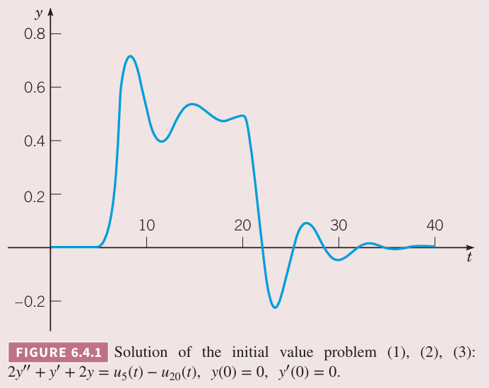

这一节讨论带有不连续的非齐次项的例子，非齐次项也称为强迫函数（`forcing function`）。在不同领域，强迫函数有时也翻译为激励函数、外力函数、驱动函数等。

例 1 求微分方程
$$2y''+y'+2y=g(t)\tag{1}$$
的解，其中
$$g(t)=u_5(t)-u_{20}(t)=\begin{cases}
1,&5\leq t<20\\
0,&0\leq t<5,t\geq 20
\end{cases}\tag{2}$$
假定初始条件是
$$y(0)=0,y'(0)\tag{3}$$
解：对方程 $(1)$ 进行拉普拉斯变换得到
$$\begin{aligned}
2s^2Y(s)-2sy(0)-2y'(0)+sY(s)-y(0)+2Y(s)&=\mathcal{L}\{u_5(t)\}-\mathcal{L}\{u_{20}(t)\}\\
&=\frac{1}{s}(e^{-5s}-e^{-20s})
\end{aligned}$$
代入初始条件得到
$$Y(s)=\frac{e^{-5s}-e^{-20s}}{s(2s^2+s+2)}\tag{4}$$
令
$$Y(s)=(e^{-5s}-e^{-20s})H(s)\tag{5}$$
其中
$$H(s)=\frac{1}{s(2s^2+s+2)}\tag{6}$$
如果 $h(t)=\mathcal{L}^{-1}\{H(s)\}$，那么
$$y(t)=u_5(t)h(t-5)-u_{20}(t)h(t-20)\tag{7}$$
利用部分分式
$$H(s)=\frac{a}{s}+\frac{bs+c}{2s^2+s+2}\tag{8}$$
根据对应系数相等得到 $a=\frac{1}{2},b=-1,c=-\frac{1}{2}$，因此
$$\begin{aligned}
H(s)&=\frac{1}{2}s-\frac{s+\frac{1}{2}}{2s^2+s+2}\\
&=\frac{1}{2}s-\frac{1}{2}\bigg(\frac{s+\frac{1}{4}}{(s+\frac{1}{4})^2+(\frac{\sqrt{15}}{4})^2}+\frac{1}{\sqrt{15}}\frac{\frac{\sqrt{15}}{4}}{(s+\frac{1}{4})^2+(\frac{\sqrt{15}}{4})^2}\bigg)
\end{aligned}\tag{9}$$
那么
$$h(t)=\frac{1}{2}-\frac{1}{2}\bigg(e^{-t/4}\cos\frac{\sqrt{15}}{4}t+\frac{1}{\sqrt{15}}e^{-t/4}\sin\frac{\sqrt{15}}{4}t\bigg)\tag{10}$$

从上图可以看出，$(7),(10)$ 的图像可以分成三个不同的部分。对于 $0\leq t<5$，微分方程是
$$2y''+y'+2y=0\tag{11}$$
和 $(3)$ 给出的初始条件。由于系统没有初始能量，也没有外力驱动，因此系统保持静止，即 $y=0,0\leq t<5$。通过求解初值问题 $(11),(3)$ 来确认这一点。求在 $t=5$ 时的值和导数值有
$$y(5)=0,y'(t)=0\tag{12}$$
一旦 $t>5$，微分方程变成了
$$2y''+y'+2y=1\tag{13}$$
它的解是一个常量（对常量强迫函数的响应）和阻尼振动（齐次方程的解）的和。这就是上图中 $5<t<20$ 的部分。这一部分可以通过解初值问题 $(13),(12)$ 得到。由于 $u_5(t)=1,u_{20}(t)=0,5\leq t<20$，$(7),(10)$ 可以简化为
$$\begin{aligned}
y(t)&=h(t-5)\\
&=\frac{1}{2}-\frac{1}{2}e^{-(t-5)/4}\cos\frac{\sqrt{15}(t-5)}{4}+\frac{1}{2\sqrt{15}}e^{-(t-5)/4}\sin\frac{\sqrt{15}(t-5)}{4}
\end{aligned}\tag{14}$$
最后，$t>20$ 时微分方程又变成了 $(11)$，初始条件是 $t=20$ 时 $(14)$ 及其导数的值，近似地
$$y(20)\approx 0.50162,y'(20)\approx 0.01125\tag{15}$$
初值问题 $(11),(15)$ 没有外力，解是 $y=0$ 附近的阻尼振动。

虽然将上图看作是三个独立初值问题的解很有帮助，但是求解这些独立问题非常繁琐。拉普拉斯变换变换法提供了一种简便优雅的方式来处理不连续强迫函数的问题。

我们再仔细分析一下例 1 中的 $y(t)$ 可以发现不连续强迫函数的影响。根据定理 3.2.1 的存在性和唯一性，$y(t)$ 及其前两阶导在 $t=5,t=20$ 之外都连续。根据 $(7)$ 计算 $y(t),y'(t)$，不难得到在 $t=5,t=20$ 处是连续的。不过如果计算 $y''(t)$ 那么
$$\lim_{t\to 5^-}y''(t)=0,\lim_{t\to 5^+}y''(t)=\frac{1}{2}$$
那么 $y''(t)$ 在 $t=5$ 处会跳变 $\frac{1}{2}$。类似的，$y''(t)$ 在 $t=20$ 处会跳变 $-\frac{1}{2}$。因此在这些点处，强迫函数 $g(t)$ 的跳跃点与最高项 $2y''$ 的跳跃点对应。

回到一般的二阶线性方程
$$y''+p(t)y'+q(t)y=g(t)\tag{16}$$
其中 $p,q$ 在区间 $\alpha<t<\beta$ 上连续，$g$ 是分段连续的。如果 $y(t)$ 是 $(16)$ 的解，那么 $y(t),y'(t)$ 在 $\alpha<t<\beta$ 上是连续的，但是 $y''(t)$ 在 $g$ 不连续的点上不连续。类似的，更高阶的方程中，解的最高阶导数的不连续点与强迫函数一致，其余阶导数和解本身在这些点处都是连续的。

例 2 给出初值问题
$$y''+4y=g(t)\tag{17}$$
$$y(0)=0,y'(0)=0\tag{18}$$
其中
$$g(t)=\begin{cases}
0,&0\leq t<5\\
\frac{1}{5}(t-5),&5\leq t<10\\
1,&t\geq 10
\end{cases}\tag{19}$$
的定性分析，然后求解初值问题。

解：这个例子中强迫函数是线性加载（`ramp loading`），如下所示。

对于 $t<5$，解是 $y=0$。对于 $t>10$，解的形式是
$$y(t)=c_1\cos 2t+c_2\sin 2t+\frac{1}{4}\tag{20}$$
其中常量 $1/4$ 是非齐次方程的特解，另外两项的组合是齐次方程的通解。因此 $(20)$ 是绕 $y=1/4$ 的简谐振动。类似的，当 $5<t<10$ 时，解关于某个线性函数振动。

为了求解这个问题，$g(t)$ 写成如下形式
$$g(t)=\frac{1}{5}(u_5(t)(t-5)-u_{10}(t)(t-10))\tag{21}$$
对初始问题进行拉普拉斯变换得到
$$(s^2+4)Y(s)=\frac{e^{-5s}-e^{-10s}}{5s^2}$$
那么
$$Y(s)=\frac{1}{5}(e^{-5s}-e^{-10s})H(s)\tag{22}$$
其中
$$H(s)=\frac{1}{s^2(s^2+4)}\tag{23}$$
因此初值问题 $(17),(18),(19)$ 的解是
$$y(t)=\frac{1}{5}(u_5(t)h(t-5)-u_{10}(t)h(t-10))\tag{24}$$
其中 $h(t)$ 是 $H(s)$ 的拉普拉斯逆变换。

$H(s)$ 的部分分式展开
$$H(s)=\frac{1/4}{s^2}-\frac{1/4}{s^2+4}\tag{25}$$
那么
$$h(t)=\frac{1}{4}t-\frac{1}{8}\sin 2t\tag{26}$$
$y(t)$ 的图像如下所示，与之前定性分析一致。

为了确定稳定振动的振幅，要找到 $t>10$ 时最大或最小点。令 $(24)$ 导数为零，该点近似为 $(10.642,0.2979)$，那么振幅近似是 $0.2979-0.25=0.0479$。

这个例子中强迫函数 $g$ 是连续的，但是 $g'$ 在 $t=5,t=10$ 处不连续。那么解 $y(t)$ 自身和前两阶导也是连续的，但是 $y'''(t)$ 在 $t=5,t=10$ 处不连续，与 $g'$ 一致。
