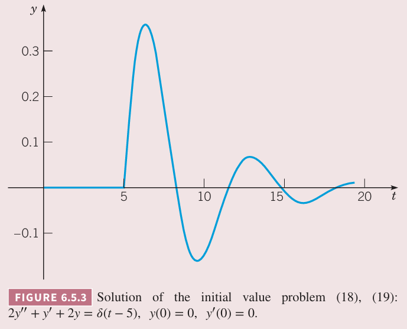

很多应用中需要处理冲激现象。比如微分方程
$$ay''+by'+cy=g(t)\tag{1}$$
其中 $g(t)$ 在很短的区间 $t_0-\tau<t<t_0+\tau$ 的值很大，但是其他区间上的值都为零。

积分 $I(\tau)$ 的定义是
$$I(\tau)=\int_{t_0-\tau}^{t_0+\tau}g(t)dt\tag{2}$$
由于在区间 $t_0-\tau<t<t_0+\tau$ 之外 $g(t)=0$ 那么
$$I(\tau)=\int_{-\infty}^\infty g(t)dt\tag{3}$$
在机械应用中，$g(t)$ 是外力，$I(\tau)$ 是区间 $t_0-\tau<t<t_0+\tau$ 上总的推力。

如果令 $t_0$ 是令，那么 $g(t)$ 是
$$g(t)=d_\tau(t)=\begin{cases}
\frac{1}{2\tau},&-\tau<t<\tau\\
0,&\text{otherwise}
\end{cases}\tag{4}$$
其中 $\tau$ 是很小的常量，如下图所示。

根据 $(2),(3)$，只要 $\tau\neq 0$，那么 $I(\tau)=1$，与 $\tau$ 的值无关。现在让 $d_\tau$ 的区间越来越小，即讨论 $\tau\to 0^+$ 时 $d_\tau$。如下图所示。

取极限可以得到
$$\lim_{\tau\to 0^+}d_\tau(t)=0,t,t\neq 0\tag{5}$$
不过由于 $I(\tau)=1,\tau\neq 0$，那么
$$\lim_{\tau\to 0^+}I(\tau)=1\tag{6}$$
公式 $(5),(6)$ 定理了单位冲激函数（`unit impulse function`）$\delta$，在 $t=0$ 时有巨大的冲激，其余各点为零。也就是说 $\delta$ 函数有如下性质
$$\delta(t)=0,t\neq 0\tag{7}$$
$$\int_{-\infty}^\infty \delta(t)dt=1\tag{8}$$
初等微积分中没有函数满足这些性质。$\delta$ 是广义函数（`generalized function`），通常称为狄拉克 $\delta$ 函数（`Dirac delta function`）。$\delta(t)$ 是在 $t=0$ 有一个单位冲激，那么 $\delta(t-t_0)$ 表示在任意时刻 $t=t_0$ 有一个单位冲激。类似的
$$\delta(t-t_0)=0,t\neq t_0\tag{9}$$
$$\int_{-\infty}^\infty \delta(t-t_0)dt=1\tag{10}$$
狄拉克 $\delta$ 函数不满足定理 6.1.2 的条件，但是其拉普拉斯变换却是有定义的。因为 $\delta(t)$ 定义为 $d_\tau(t)$ 在 $\tau\to 0^+$ 时的极限，那么 $\delta$ 的拉普拉斯变换是 $d_\tau$ 的拉普拉斯变换的极限。假定 $t_0>0$，可以定义
$$\mathcal{L}\{\delta(t-t_0)\}=\lim_{\tau\to 0^+}\mathcal{L}\{d_\tau(t-t_0)\}\tag{11}$$
随着 $\tau\to 0^+$，最终会有 $\tau<t_0$，因此 $t_0-\tau >0$。由于 $d_\tau(t-t_0)$ 只有在区间 $(t_0-\tau,t_0+\tau)$ 不为零，那么
$$\begin{aligned}
\mathcal{L}\{d_\tau(t-t_0)\}&=\int_0^\infty e^{-st}d_\tau(t-t_0)dt\\
&=\int_{t_0-\tau}^{t_0+\tau} e^{-st}d_\tau(t-t_0)dt
\end{aligned}$$
将 $(4)$ 代入
$$\begin{aligned}
\mathcal{L}\{d_\tau(t-t_0)\}&=\frac{1}{2\tau}\int_{t_0-\tau}^{t_0+\tau}e^{-st}dt\\
&=-\frac{1}{2s\tau}e^{-st}\bigg|_{t_0-\tau}^{t_0+\tau}\\
&=\frac{1}{2s\tau}e^{-st_0}(e^{s\tau}-e^{-s\tau})
\end{aligned}$$
或者简写为
$$\mathcal{L}\{d_\tau(t-t_0)\}=\frac{\sinh s\tau}{s\tau}e^{-st_0}\tag{12}$$
当 $\tau\to 0^+$ 时，$\frac{\sinh s\tau}{s\tau}$ 是不定型，使用洛必达法则
$$\lim_{\tau\to 0^+}\frac{\sinh s\tau}{s\tau}=\lim_{\tau\to 0^+}\frac{s\cosh s\tau}{s}=1$$
那么
$$\mathcal{L}\{\delta(t-t_0)\}=e^{-st_0}\tag{13}$$
上式定义了 $t_0>0$ 时 $\mathcal{L}\{\delta(t-t_0)\}$。如果允许 $t_0$ 为零，那么令 $t_0\to 0+$，$(13)$，那么
$$\mathcal{L}\{\delta(t-t_0)\}=\lim_{t_0\to 0^+}=1\tag{14}$$
上面两个式子与拉普拉斯变换的平移性质一致
$$\mathcal{L}\{\delta(t-t_0)\}=e^{-st_0}\mathcal{L}\{\delta(t)\}=e^{-st_0}$$
类似的，可以定义 $\delta$ 函数与任意连续函数 $f$ 的积的积分。
$$\int_{-\infty}^\infty\delta(t-t_0)f(t)dt=\lim_{\tau\to 0^+}\int_{-\infty}^\infty d_\tau(t-t_0)f(t)dt\tag{15}$$
将 $(4)$ 的定义代入并使用积分中值定理，有
$$\begin{aligned}
\int_{-\infty}^\infty d_\tau(t-t_0)f(t)dt&=\frac{1}{2\tau}\int_{t_0-\tau}^{t_0+\tau}f(t)dt\\
&=\frac{1}{2\tau}2\tau f(t^*)\\
&=f(t^*)
\end{aligned}$$
其中 $t_0-\tau<t^*<t_0+\tau$。当 $\tau\to 0^+$ 时，$t^*\to t_0$，因此
$$\int_{-\infty}^\infty\delta(t-t_0)f(t)dt=f(t_0)\tag{16}$$

例 1 求初值问题
$$2y''+y'+2y=\delta(t-5)\tag{17}$$
$$y(0)=0,y'(0)=0\tag{18}$$
的解。

解：对微分方程两边进行拉普拉斯变换并使用初始条件得到
$$(2s^2+s+2)Y(s)=e^{-5s}$$
那么
$$Y(s)=\frac{e^{-5s}}{2s^2+s+2}=\frac{e^{-5s}}{2}\frac{1}{(s+\frac{1}{4})^2+\frac{15}{16}}\tag{19}$$
那么
$$\mathcal{L}^{-1}\bigg\{\frac{1}{(s+\frac{1}{4})^2+\frac{15}{16}}\bigg\}=\frac{4}{\sqrt{15}}e^{-t/4}\sin\frac{\sqrt{15}}{4}t\tag{20}$$
根据定理 6.3.1 有
$$y(t)=\frac{2}{\sqrt{15}}u_5(t)e^{-(t-5)4}\sin\frac{\sqrt{15}}{4}(t-5)\tag{21}$$
图像如下所示。由于 $t=0$ 时到 $t=5$ 时微分方程是齐次方程并且没有外力，那么在 $0<t<5$ 时也没有响应。$t=5$ 时有一个冲激，然后响应式衰退的振动。尽管在 $t=5$ 是冲激函数的奇点，但是响应是连续的。不过，解的一阶导在 $t=5$ 处是跳跃间断，二阶导在该处是无穷间断。这是由微分方程 $(17)$ 确定的，一侧的奇点必须由另一侧相应的奇点来平衡，即一边有奇点（行为），另一边也必须有奇点（行为），以保证方程成立。

在处理涉及冲激函数的问题时，使用狄拉克 $\delta$ 函数可以显著简化数学计算。然而，如果实际冲激持续时间很短但非零，那么将冲激建模为瞬时发生就会引入误差。这种误差可能可以忽略不计，但在实际问题中不能忽视。
