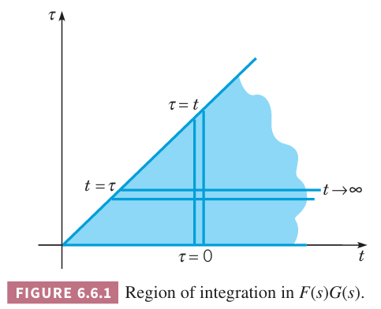

如果 $f,g$ 的拉普拉斯变换是 $F(s),G(s)$，$H(s)$ 是 $F(s),G(s)$ 的积。我们预期 $H(s)$ 是 $f,g$ 积的变换，但事实并不这样，也就是说拉普拉斯变换不能与普通乘法交换。不过如果定义一个合适的“广义乘法”，情况就会发生变化。

**定理 6.6.1 卷积定理 Convolution Theorem**
> 如果 $F(s)=\mathcal{L}\{f(t)\},G(s)=\mathcal{L}\{g(t)\}$ 在 $s>a\geq 0$ 时都存在，那么
> $$H(s)=F(s)G(s)=\mathcal{L}\{h(t)\},s>a\tag{1}$$
> 其中
> $$h(t)=\int_0^t f(t-\tau)g(\tau)d\tau=\int_0^t f(\tau)g(t-\tau)d\tau\tag{2}$$
> 函数 $h$ 是 $f,g$ 的卷积，$(2)$ 是卷积积分。

$(2)$ 的后面的变换很简单，代入 $t-\tau=\xi$ 即可。证明定理之前先讨论一些卷积的性质。两个函数的卷积的拉普拉斯变换，不是普通乘积的变换，等于分别拉普拉斯变换的积。为了强调这种广义乘法，一般写作
$$h(t)=(f*g)(t)\tag{3}$$
这种写法对应着 $(2)$ 的第一个积分，第二个积分式子表示为 $(g*f)(t)$。

卷积 $f*g$ 满足许多普通乘法的性质。比如交换律、分配律、结合律等。
$$f*g=g*f\tag{4}$$
$$f*(g_1+g_2)=f*g_1+f*g_2\tag{5}$$
$$(f*g)*h=f*(g*h)\tag{6}$$
$$f*0=0*f=0\tag{7}$$
$(7)$ 中的 0 并不是表示数 0 而是一个函数，对于所有的 $t$ 其值都为零。

不过也有普通乘法成立而卷积不成立的情况。比如 $f*1$ 不等于 $f$。
$$(f*1)(t)=\int_0^t f(t-\tau)(1)\tau=\int_0^t f(t-\tau)d\tau$$
令 $f=\cos t$，那么
$$\begin{aligned}
(f*1)(t)&-\int_0^t \cos(t-\tau)d\tau\\
&=-\sin(t-\tau)|_0^t\\
&=-\sin 0+\sin t\\
&=\sin t
\end{aligned}$$
$f*f$ 非负这一点也不成立。比如
$$\begin{aligned}
\int_0^t \cos(t-\tau)\cos \tau d\tau&=\frac{1}{2}\int_0^t \cos t+\cos (t-2\tau)d\tau\\
&=\frac{1}{2}t\cos t+\frac{1}{2}\int_0^t \cos(t-2\tau)d\tau\\
&=\frac{1}{2}t\cos t+\frac{1}{2}(-\frac{1}{2})\int_t^{-t} \cos(u)du\\
&=\frac{1}{2}t\cos t-\frac{1}{4}(\sin(-t)-\sin t)\\
&=\frac{1}{2}t\cos t+\frac{1}{4}(2\sin t)\\
&=\frac{1}{2}(t\cos t+\sin t)
\end{aligned}$$
由于 $t$ 会很大，因此第二项可以忽略，那么函数图像是振幅变大的余弦曲线，那么值可以是负数。

卷积会出现在各种系统行为依赖于 $t$ 及过去的系统应用中。这类系统称为滞后系统（`hereditary system`）。

下面证明定理 6.6.1。首先给出定义
$$F(s)=\int_0^\infty e^{-s\xi}f(\xi)d\xi,G(s)=\int_0^\infty e^{-s\tau}g(\tau)d\tau$$
那么
$$F(s)G(s)=\int_0^\infty e^{-s\xi}f(\xi)d\xi\int_0^\infty e^{-s\tau}g(\tau)d\tau\tag{8}$$
由于第一个积分不依赖于第二个积分项，因此可以写成迭代积分的形式
$$\begin{aligned}
F(s)G(s)&=\int_0^\infty e^{-s\tau}g(\tau)\bigg(\int_0^\infty e^{-s\xi}f(\xi)d\xi\bigg)d\tau\\
&=\int_0^\infty g(\tau)\bigg(\int_0^\infty e^{-s(\xi+\tau)}f(\xi)d\xi\bigg)d\tau\\
\end{aligned}\tag{9}$$
令 $=\xi=t-\tau$，那么 $d\xi=dt$，积分上下限也变成 $t=\tau,t=\infty$，因此上式变成对 $t$ 的积分式子
$$F(s)G(s)\int_0^\infty g(\tau)\bigg(\int_\tau^\infty e^{-st}f(t-\tau)dt\bigg)d\tau\tag{10}$$
上面的积分就是在 $t\tau$ 平面上对如下图所示的蓝色区域上积分。交换积分顺序得到
$$F(s)G(s)=\int_0^\infty e^{-st}\bigg(\int_0^t f(t-\tau)g(\tau)\bigg)dt\tag{11}$$
化简得到
$$F(s)G(s)=\int_0^\infty e^{-st}h(t)dt=\mathcal{L}\{h(t)\}\tag{12}$$
其中 $h(t)$ 的定义是 $(2)$。

例 1 求
$$H(s)=\frac{a}{s^2(s^2+a^2)}\tag{13}$$
的拉普拉斯逆变换。

解：$H(s)$ 可以看作是 $1/s^2,a/(s^2+a^2)$ 的乘积，而这两个函数是 $t,\sin at$ 的拉普拉斯变换。根据定理 6.6.1，$H(s)$ 的拉普拉斯逆变换是
$$h(t)=\int_0^t(t-\tau)\sin a\tau d\tau = \frac{at-\sin at}{a^2}\tag{14}$$
上面的计算要利用分部积分法。$h(t)$ 也可以用如下积分求解
$$h(t)=\int_0^\infty \tau\sin a(t-\tau)d\tau$$

例 2 求初值问题
$$y''+4y=g(t)\tag{15}$$
$$y(0)=3,y'(0)=-1\tag{16}$$
解：对微分方程进行拉普拉斯变换，代入初始条件得到
$$s^2Y(s)-3s+1+4Y(s)=G(s)$$
即
$$Y(s)=\frac{3s-1}{s^2+4}+\frac{G(s)}{s^2+4}\tag{17}$$
上式右边的第一项依赖于初始条件，第二项依赖于强迫函数。$Y(s)$ 可以写成
$$Y(s)=3\frac{s}{s^2+4}-\frac{1}{2}\frac{2}{s^2+4}+\frac{1}{2}\frac{2}{s^2+4}G(s)\tag{18}$$
那么
$$y=3\cos 2t-\frac{1}{2}\sin 2t+\frac{1}{2}\int_0^t \sin 2(t-\tau)g(\tau)d\tau\tag{19}$$
如果给出 $g(t)$，那么可能可以对上式最后一项进行积分。

下面考虑更一般的问题。带求解的微分方程如下
$$ay''+by'+cy=g(t)\tag{20}$$
其中 $a,b,c$ 是常量并且 $g(t)$ 使给定的函数，初始条件是
$$y(0)=y_0,y'(0)=y_0'\tag{21}$$

采用拉普拉斯变换方法，可以让我们对此类问题的解的构成方式得到一些重要的、深刻的认识。

对微分方程 $(20)$ 进行拉普拉斯变换，然后代入初始条件 $(21)$ 得到
$$(as^2+bs+c)Y(s)-(as+b)y_0-ay_0'=G(s)$$
令
$$\Phi(s)=\frac{(as+b)y_0+ay_0'}{as^2+bs+c},\Psi(s)=\frac{G(s)}{as^2+bs+c}\tag{22}$$
那么
$$y(t)=\phi(t)+\psi(t)\tag{23}$$
其中 $\phi(t)=\mathcal{L}^{-1}\{\Phi(s)\},\psi(t)=\mathcal{L}^{-1}\{\Psi*(s)\}$。不难发现，$\phi(t)$ 是初值问题
$$ay''+by'+cy=0,y(0)=y_0,y'(0)=y_0'\tag{25}$$
的解，与 $(20),(21)$ 的区别是 $g(t)=0$。类似的，$\psi(t)$ 是
$$ay''+by'+cy=g(t),y(0)=0,y'(0)=0\tag{26}$$
的解，初始条件都是零。

一旦给定了 $a,b,c$，可以求解 $\phi(t)=\mathcal{L}^{-1}\{\Phi(s)\}$，可能需要使用部分分式法。为了求解 $\psi(t)=\mathcal{L}^{-1}\{\Psi(s)\}$，可以将 $\Psi(s)$ 写作
$$\Psi(s)=H(s)G(s)\tag{27}$$
其中 $H(s)=1/(as^2+b^s+c)$。函数 $H$ 被称为传递函数（`transfer function`），它仅依赖于所研究系统的特性；也就是说，$H(s)$ 完全由系数 $a,b,c$ 决定。另一方面 $G(s)$ 则仅取决于施加于系统的强迫函数 $g(t)$。根据卷积定理
$$\psi(t)=\mathcal{L}^{-1}\{H(s)G(s)\}=\int_0^th(t-\tau)g(\tau)d\tau\tag{28}$$
其中 $h(t)=\mathcal{L}^{-1}\{H(s)\}$，$g(t)$ 是给定函数。

为了更好的理解 $h(t)$，令 $G(s)=1$，即 $g(t)=\delta(t)$，那么 $\Psi(s)=H(s)$。那么 $y=h(t)$ 是初值问题
$$ay''+by'+cy=\delta(t),y(0)=0,y'(0)=0\tag{29}$$
的解。因此 $h(t)$ 是系统对一个在 $t=0$ 时刻施加的单位冲激所产生的响应，所以很自然地将 $h(t)$ 称为系统的冲激响应（`impulse response`）。于是，方程 $(28)$ 表明 $\psi(t)$ 是冲激响应与强迫函数的卷积。
