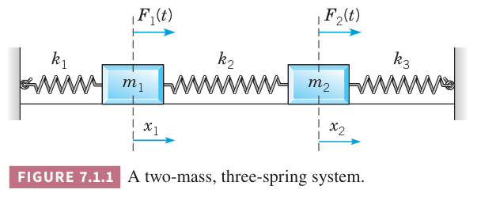
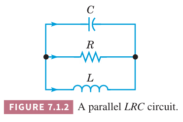

如果一个问题涉及多个因变量且每一个因变量都依赖于同一个自变量时，那么很自然地产生了联立常微分方程组。一般用 $t$ 表示自变量用 $x_1,x_2,\cdots$ 表示 $t$ 的函数。对 $t$ 的微分表示为 $\frac{dx_1}{dt}$ 或者 $x_1'$。

首先讨论如下图所示的弹簧系统。两个物体在无摩擦力的平面上运动，外力分别是 $F_1(t),F_2(t)$，三个弹簧的弹性系数是 $k_1,k_2,k_3$。假定向右运动或者向右偏移为正。

下图是受理分析，根据牛顿第二定律可以得到
$$\begin{aligned}
m_1\frac{d^2x_1}{dt^2}&=k_2(x_2-x_1)-k_1x_1+F_1(t)&&=-(k_1+k_2)x_1+k_2x_2+F_1(t)\\
m_2\frac{d^2x_2}{dt^2}&=-k_3x_2-k_2(x_2-x_1)+F_2(t)&&=k_2x_1-(k_2+k_3)x_2+F_2(t)
\end{aligned}\tag{1}$$

下面讨论如下所示的 LRC 电路。

令 $V$ 是电容 $C$ 两端的电压差，也就是电阻和电感两端的电压差，令 $I_1,I_2,I_3$ 分别是通过电容、电阻和电感的电流，且 $I=I_3$，根据基尔霍夫定律
$$I_1+I_2+I_3=0$$
这些元器件满足
$$CV'=I_1,V=I_2R,LI_3'=V$$
那么
$$I_3'=\frac{V}{L}$$
$$CV'=I_1=-I_2-I_3=-I-\frac{V}{R}$$
那么
$$\begin{aligned}
I'=&\frac{dI}{dt}=\frac{V}{L}\\
V'=&\frac{dV}{dt}=-\frac{I}{C}-\frac{V}{RC}
\end{aligned}\tag{2}$$
一阶方程组重要的原因之一是高阶方程总是可以变换成一阶方程组。第八章会看到，如果需要数值法，那么问题先要转成一阶方程组。下面解释如何做到这一点。

例 1 3.7 小节的例 3 是一个弹簧系统的例子，二阶微分方程是
$$u''+\frac{1}{8}u'+u=0\tag{3}$$
将其转化成一解方程组。

解：令 $x_1=u,x_2=u'$，那么 $x_1'=x_2$，进一步 $u''=x_2'$，代入 $(3)$ 得到
$$x_2'+\frac{1}{8}x_2+x_1=0$$
那么 $x_1,x_2$ 满足两个一阶微分方程组成的系统
$$\begin{aligned}
x_1'&=x_2\\
x_2'&=-x_1-\frac{1}{8}x_2
\end{aligned}\tag{4}$$
弹簧系统的运动方程是
$$mu''+\gamma u'+ku=F(t)\tag{5}$$
令 $x_1=u,x_2=u'$，和例 1 一样得到方程组
$$\begin{aligned}
x_1'&=x_2\\
x_2'&=-\frac{k}{m}x_1-\frac{\gamma}{m}x_2+\frac{1}{m}F(t)
\end{aligned}\tag{6}$$
为了转化任意 $n$ 解阶方程
$$y^{(n)}=F(t,y,y',\cdots,y^{(n-1)})\tag{7}$$
成由 $n$ 个一阶微分方程组成的系统，类似例 1，令
$$x_1=y,x_2=y',x_3=y'',\cdots,x_n=Y^{(n-1)}\tag{8}$$
上面的式子蕴涵着
$$\begin{aligned}
x_1'&=x_2\\
x_2'&=x_3\\
&\vdots\\
x_{n-1}'&=x_n
\end{aligned}\tag{9}$$
方程 $(7)$ 就是
$$x_n'=F(t,x_1,x_2,\cdots,x_{n-1})\tag{10}$$
方程 $(9),(10)$ 是更一般的方程组的特例
$$\begin{aligned}
x_1'&=F_1(t,x_1,x_2,\cdots,x_n)\\
x_2'&=F_2(t,x_1,x_2,\cdots,x_n)\\
&\vdots\\
x_n'&=F_n(t,x_1,x_2,\cdots,x_n)\\
\end{aligned}\tag{11}$$
$(11)$ 这种形式的方程组几乎包含了所有我们感兴趣的情况。微分方程领域里大部分更高级的理论都是专门用来研究这类系统的。

方程组 $(11)$ 在区间 $I:\alpha<t<\beta$ 上有 $n$ 个函数
$$x_1=\phi_1(t),x_2=\phi_2(t),\cdots,x_n=\phi_n(t)\tag{12}$$
其中每一个函数在 $I$ 上处处可导。除了微分方程组，优势会给定 $n$ 个初始条件
$$x_1(t_0)=x_1^0,x_2(t_0)=x_2^0,\cdots,x_n(t_0)=x_n^0\tag{13}$$
其中 $t_0$ 是 $I$ 上给定的 $t$ 值，$x_1^0,x_2^0,\cdots,x_n^0$ 是给定的值。微分方程 $(11)$ 和初始条件 $(13)$ 构成了一个初始问题。

解 $(12)$ 可以看作是 $n$ 维空间上一组参数方程。对于给定值 $t$，$(12)$ 给出了空间上一点 $x_1,x_2,\cdots,x_n$。随着 $t$ 的变化，坐标通常也会变化。在 $\alpha<t<\beta$ 上相应的点的集合形成了空间中的一条曲线，是微分方程 $(11)$ 的轨迹。初始条件 $(13)$ 确定了起点。当 $n=2$ 时很容易可视化，曲线在 $x_1x_2$ 平面上。

给定一个问题，很容易检查 $F_1,F_2,\cdots,F_n$ 是否满足下面的条件来确定初值问题 $(11),(13)$ 是否有唯一解。

**定理 7.1.1**
> 令 $n$ 个函数 $F_1,F_2,\cdots,F_n$ 有 $n^2$ 个一阶导 $\frac{\partial F_1}{\partial x_1},\cdots,\frac{\partial F_1}{\partial x_n},\cdots,\frac{\partial F_n}{\partial x_1},\frac{\partial F_n}{\partial x_n}$，它们在 $tx_1x_2\cdots x_n$ 空间上的区域 $R$ 上连续，其中 $\alpha<t<t\beta,\alpha_1<x_1<\beta_1,\cdots,\alpha_n<x_n<\beta_n$，令点 $(t_0,x_1^0,x_2^0,\cdots,x_n^0)$ 在 $R$ 内，那么在区间 $|t-t_0|<h$ 上，初值问题 $(11),(13)$ 存在唯一的解 $x_1=\phi_1(t),\cdots,x_n=\phi_n(t)$。

这个定理的证明可以通过泛化 2.8 小节的证明得到，这里不再给出。定理中除了要求 $F_1,F_2,\cdots,F_n$ 有对 $t$ 的偏微分外，无其他要求。长度为 $2h$ 的区间并未给出，在一些情况下可能非常短。最后，同样的结论可以建立在更弱但是更复杂的假设之上，因此这个定理的描述并不是更一般的形式，对于结论而言，给出的条件是充分的，但并非都必要。

如果 $(11)$ 中的每个函数 $F_1,F_2,\cdots,F_n$ 变量 $x_1,x_2,\cdots,x_n$ 的线性函数，那么微分方程组是线性的，否则是非线性的。因此更一般的线性微分方程组的形式如下
$$\begin{aligned}
x_1'&=p_11(t)x_1+\cdots+p_{1n}(t)+g_1(t)\\
x_2'&=p_21(t)x_1+\cdots+p_{2n}(t)+g_2(t)\\
&\vdots\\
x_n'&=p_n1(t)x_1+\cdots+p_{nn}(t)+g_n(t)\\
\end{aligned}\tag{14}$$
如果对 $I$ 的所有 $t$，$g_1(t),\cdots,g_n(t)$ 都为零，那么 $(14)$ 是齐次的，否则是非齐次的。除非 $F_1(t)=F_2(t)=0$，否则方程组 $(1)$ 是非齐次的。方程组 $(2)$ 是齐次的。

对于线性方程组 $(14)$，存在性和唯一性定理有更简单也更强的结论。

**定理 7.1.2**
> 如果 $p_{11},p_1{12},\cdots,p_{nn}, g_1,\cdots,g_n$ 在开区间 $I:\alpha<t<\beta$ 上连续，那么存在唯一解 $x_1=\phi_1(t),\cdots,x_n=\phi(n)$ 满足方程组 $(14)$ 和初始条件 $(13)$，其中 $t_0$ 是 $I$ 内任意点，$x_1^0,x_2^0,\cdots,x_n^0$ 提前给定了。解在整个 $I$ 上都存在。

与非线性方程组的解不同，线性方程组在假设满足的区间上都存在解并且是唯一的。同时，线性方程组在 $t=t_0$ 的初始值 $x_1^0,x_2^0,\cdots,x_n^0$ 是任意的，而定理 7.1.1 中必须在区域 $R$ 内。

这一章余下的部分讨论线性一阶微分方程组，第八章第九章讨论非线性方程组。
