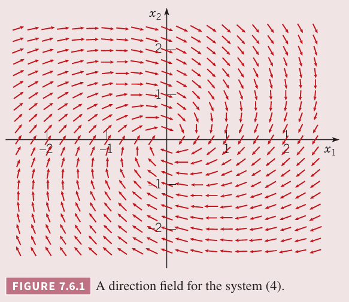
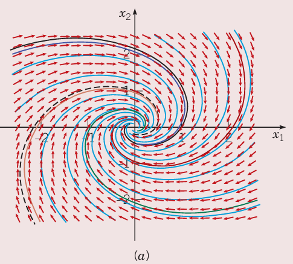
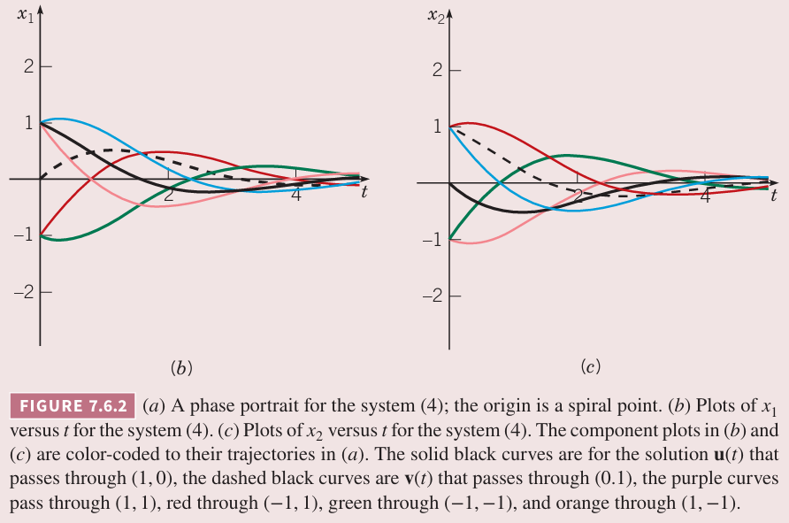
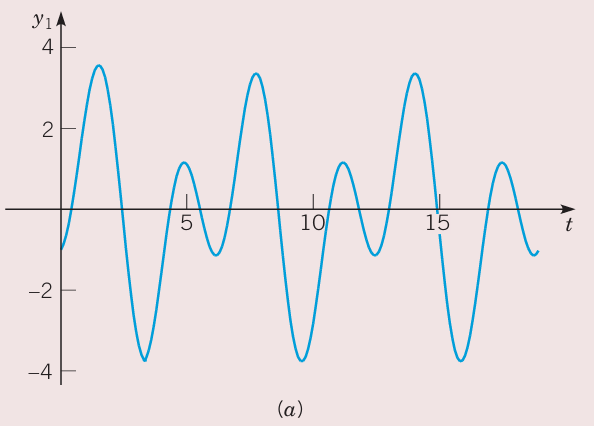

这一节继续讨论 $n$ 个方程组成的常系数线性齐次方正组
$$\bold{x}'=\bold{A}\bold{x}\tg1$$
其中系数矩阵 $\bold{A}$ 是实数矩阵。如果解的形式是 $\bold{x}=\bold{\xi}e^{rt}$，那么 $r,\bold{\xi}$ 是系数方程 $\bold{A}$ 的特征值和特征向量。$\bold{A}$ 的特征值 $r_1,\cdots,r_n$ 是特征方程
$$\det(\bold{A}-r\bold{I})=\bold{0}\tag{2}$$
的根，相应的非零特征向量满足
$$(\bold{A}-r\bold{I})\bold{\xi}=\bold{0}\tag{3}$$
如果 $\bold{A}$ 的系数是实数，多项式方程 $(2)$ 的系数是实数，任意复数根会共轭出现。如果 $r_1=\lambda+i\mu$ 是 $\bold{A}$ 的特征向量，其中 $\lambda,\mu$ 是实数，那么 $r_2=\lambda-i\mu$ 也是 $\bold{A}$ 的特征向量。在正式讨论之前先看个例子。

例 1 求方程组
$$\bold{x}'=\begin{pmatrix}
-\frac{1}{2}&1\\-1&-\frac{1}{2}
\end{pmatrix}\bold{x}\tag{4}$$
的实数基础解系。给出相图和一些解的曲线。

解：下图是方程组 $(4)$ 的方向场。解的轨迹顺时针向原点旋转。

假定解的形式是
$$\bold{x}=\bold{\xi}e^{rt}\tag{5}$$
那么得到线性方程组
$$\begin{pmatrix}
-\frac{1}{2}-r&1\\-1&-\frac{1}{2}-r
\end{pmatrix}\begin{pmatrix}
\xi_1\\\xi_2
\end{pmatrix}=\begin{pmatrix}
0\\0
\end{pmatrix}\tag{6}$$
特征方程是
$$\begin{vmatrix}
-\frac{1}{2}-r&1\\-1&-\frac{1}{2}-r
\end{vmatrix}=r^2+r+\frac{5}{4}=0\tag{7}$$
因此特征值是 $r_1=-\frac{1}{2}+i,r_2=0\frac{1}{2}-i$，代入 $(6)$ 得到对应的特征向量是
$$\bold{\xi}^{(1)}=\begin{pmatrix}
1\\i
\end{pmatrix},\bold{\xi}^{(2)}=\begin{pmatrix}
1\\-i
\end{pmatrix}\tag{8}$$
从上面可以看出特征向量 $\bold{\xi}^{(1)},\bold{\xi}^{(2)}$ 也互为复共轭。因此方程组 $(4)$ 的基础解析是
$$\bold{x}^{(1)}(t)=\begin{pmatrix}
1\\i
\end{pmatrix}e^{(-1/2+i)t},\bold{x}^{(2)}(t)=\begin{pmatrix}
1\\-i
\end{pmatrix}e^{(-1/2-i)t}\tag{9}$$
为了获得实数解，可以取 $\bold{x}^{(1)}$ 或 $\bold{x}^{(2)}$ 的实部和虚部。那么
$$\bold{x}^{(1)}(t)=\begin{pmatrix}
1\\i
\end{pmatrix}e^{-t/2}(\cos t+i\sin t)=\begin{pmatrix}
e^{-t/2}\cos t\\-e^{-t/2}\sin t
\end{pmatrix}+i\begin{pmatrix}
e^{-t/2}\sin t\\e^{-t/2}\cos t
\end{pmatrix}\tag{10}$$
因此方程组 $(4)$ 的实数解是
$$\bold{u}(t)=e^{-t/2}\begin{pmatrix}
\cos t\\-\sin t
\end{pmatrix},\bold{v}=e^{-t/2}\begin{pmatrix}
\sin t\\\cos t
\end{pmatrix}\tag{11}$$
它们的朗斯基是
$$W[\bold{u},\bold{v}]=\begin{vmatrix}
e^{-t/2}\cos t&e^{-t/2}\sin t\\
-e^{-t/2}\sin t&e^{-t/2}\cos t
\end{vmatrix}=e^{-t}$$
不会为零，因为 $\bold{u},\bold{v}$ 是线性无关的，是方程组 $(4)$ 的基础解系。

解 $\bold{u},\bold{v}$ 的图分别在下图中黑色实线和虚线表示。

因为
$$\bold{u}(0)=\begin{pmatrix}
1\\0
\end{pmatrix},\bold{v}(0)=\begin{pmatrix}
0\\1
\end{pmatrix}$$
因此 $\bold{u},\bold{v}$ 分别会通过 $(1,0),(0,1)$。方程组 $(4)$ 的其他解是这两个解的线性组合，其中一些如上图所示。当 $t\to\infty$ 时，每个解都沿着螺旋线趋于原点，并绕着原点旋转无数次，这是因为解 $(11)$ 是一个衰减的指数和正弦、余弦函数的乘积。下图是 $x_1$ 随 $t$ 变化的图像如下（b）所示，每一条曲线代表一种随时间衰减的振荡。$x_2$ 随 $t$ 变化的图像如（c）所示。

上面的（a）图是一个典型的特征值是共轭复数且实部为负数的 $2\times 2$ 的方程组 $\bold{x}'=\bold{A}\bold{x}$ 的解的图像。原点称为螺旋点（`spiral point`），随着 $t$ 的增加，所有轨迹都趋于原点，因此是渐进稳定的。如果复数的实部是正数，图像也和（a）类似，不过轨迹方向是远离原点的，因此轨迹会变得无穷大，此时原点是不稳定的。

如果实部为零，那么既不会趋于原点也不会远离原点，轨迹是周而复始的绕着原点的曲线。后续会有这样的例子。此时原点称为中心（`center`），也被称为是稳定的，但不是渐进稳定的。这三种情况下，运动方向可能是顺时针，也可能是逆时针，这依赖于系数矩阵 $\bold{A}$。

上面的图是计算机辅助作图，但是人工可以给出草图。假设特征值是 $\lambda\pm i\mu$，如果 $\lambda<0$，向内旋转，$\lambda>0$，向外旋转，如果 $\lambda=0$，那么是闭合曲线。为了确定是顺时针还是逆时针，只需要确定一个点的方向即可。比如 $(4)$ 中我们选择 $\bold{x}=(0,1)^T$，那么 $\bold{A}\bold{x}=(1,-\frac{1}{2})^T$。因此该点处切线方向 $\bold{x}'$ 确定了，$x_1$ 方向上是正的，因此轨迹从第二象限到第一象限，那么是顺时针运动。

回到线性微分方程组 $(1)$
$$\bold{x}'=\bold{A}\bold{x}$$
假定有一组共轭复数特征值 $r_1=\lambda+i\mu,r_2=\lambda-i\mu$，相应的特征向量是 $\bold{\xi}^{(1)},\bold{\xi}^{(2)}$ 也是共轭的。$r_1,\bold{\xi}^{(1)}$ 满足
$$(\bold{A}-r_1\bold{I})\bold{\xi}^{(1)}=\bold{0}\tag{12}$$
$\bold{A},\bold{I}$ 是实数矩阵，取上面方程的共轭得到
$$\overline{(\bold{A}-r_1\bold{I})\bold{\xi}^{(1)}}=(\bold{x}-\overline{r_1}\bold{I})\overline{\bold{\xi}^{(1)}}=\bold{0}\tag{13}$$
其中 $\overline{r_1},\overline{\bold{\xi}^{(1)}}$ 是 $r_1,\bold{\xi}^{(1)}$ 的共轭，那么 $r_2=\overline{r_1},\bold{\xi}^{(2)}=\overline{\bold{\xi}^{(1)}}$。那么解是
$$\bold{x}^{(1)}(t)=\bold{\xi}^{(1)}e^{r_1t},\bold{x}^{(2)}=\overline{\bold{\xi}^{(1)}}e^{\overline{r_1}t}\tag{14}$$
它们彼此复共轭。和例 1 一样，可以取 $\bold{x}^{(1)}$ 或 $\bold{x}^{(2)}$ 的实部和虚部，得到方程 $(1)$ 的实数解。

令 $\bold{\xi}^{(1)}=\bold{a}+i\bold{b}$，其中 $\bold{a},\bold{b}$ 是实数，那么
$$\bold{x}^{(1)}(t)=(\bold{a}+i\bold{b})e^{(\lambda+i\mu)t}=(\bold{a}+i\bold{b})e^{\lambda t}(\cos\mu t+i\sin\mu t)\tag{15}$$
分离实部和虚部得到
$$\bold{x}^{(1)}=e^{\lambda t}(\bold{a}\cos\mu t-\bold{b}\sin\mu t)+ie^{\lambda t}(\bold{a}\sin\mu t+\bold{b}\cos\mu t)\tag{16}$$
令 $\bold{x}^{(1)}(t)=\bold{u}(t)+\bold{v}(t)$，那么
$$\begin{aligned}
\bold{u}(t)&=e^{\lambda t}(\bold{a}\cos\mu t-\bold{b}\sin\mu t)\\
\bold{v}(t)&=e^{\lambda t}(\bold{a}\sin\mu t+\bold{b}\cos\mu t)
\end{aligned}\tag{17}$$
是方程 $(1)$ 的实数解。$\bold{u},\bold{v}$ 是线性无关的。下面给出证明。

首先证明 $\bold{a},\bold{b}$ 是线性无关的，使用 $\bold{\xi}^{(1)},\overline{\bold{\xi}^{(1)}}$ 来表示 $\bold{a},\bold{b}$
$$\bold{a}=\frac{\bold{\xi}^{(1)}+\overline{\bold{\xi}^{(1)}}}{2},\bold{b}=\frac{\bold{\xi}^{(1)}-\overline{\bold{\xi}^{(1)}}}{2i}$$
代入 $c_1\bold{a}+c_2\bold{b}=\bold{0}$ 得到
$$c_1(\bold{\xi}^{(1)}+\overline{\bold{\xi}^{(1)}})-ic_2(\bold{\xi}^{(1)}-\overline{\bold{\xi}^{(1)}})=\bold{0}$$
那么
$$(c_1-ic_2)\bold{\xi}^{(1)}+(c_1+ic_2)\overline{\bold{\xi}^{(1)}}=\bold{0}$$
由于 $\bold{\xi}^{(1)},\overline{\bold{\xi}^{(1)}}$ 线性无关，那么
$$c_1-ic_2=0,c_2+ic_2=0$$
因此 $c_1=0,c_2=0$，这就得到了 $\bold{a},\bold{b}$ 是线性无关的。

下面证明 $\bold{u},\bold{v}$ 是线性无关的，那么需要证明
$$c_1e^{\lambda t}(\bold{a}\cos\mu t-\bold{b}\sin\mu t)+c_2e^{\lambda t}(\bold{a}\sin\mu t+\bold{b}\cos\mu t)=\bold{0}$$
中 $c_1=c_2=0$。按照 $\bold{a},\bold{b}$ 合并同类项得到
$$(c_1\cos\mu t+c_2\sin\mu t)\bold{a}+(-c_1\sin\mu t+c_2\cos\mu t)\bold{b}=\bold{0}$$
因为 $\bold{a},\bold{b}$ 线性无关，那么
$$c_1\cos\mu t+c_2\sin\mu t=0,-c_1\sin\mu t+c_2\cos\mu t=0$$
解这个方程组得到 $c_1=0,c_2=0$，因此 $\bold{u},\bold{v}$ 线性无关。

假定矩阵 $\bold{A}$ 有共轭特征值 $r_1=\lambda+i\mu,r_2=\lambda-i\mu$，$r_3,r_4,\cdots,r_n$ 是实数特征值且不相等，特征向量是 $\bold{\xi}^{(1)}=\bold{a}+i\bold{b},\bold{\xi}^{(2)}=\bold{a}-i\bold{b},\bold{\xi}^{(3)},\cdots,\bold{\xi}^{(n)}$。那么方程组 $(1)$ 的通解是
$$\bold{x}=c_1\bold{u}(t)+c_2\bold{v}(t)+c_3\bold{\xi}^{(3)}e^{r_3t}+\cdots\bold{\xi}^{(n)}e^{r_nt}\tag{18}$$
其中 $\bold{u}(t),\bold{v}(t)$ 由 $(17)$ 给出。这里要强调 $\bold{A}$ 矩阵都是实数，因为这样复数特征值和特征向量才是共轭的。

对于 $2\times 2$ 的实系数方程组，有如下三种情况：

* 特征值是实数且符号相反，$\bold{x}=\bold{0}$ 是鞍点
* 特征值是实数且符号相同，且不相等，$\bold{x}=\bold{0}$ 是节点
* 特征值是复数且实部不为零，$\bold{x}=\bold{0}$ 是螺旋点

其他可能情况是上述两种情况之间的过渡状态，不过现实应用中不常遇到。比如零特征值对应鞍点和节点之间。纯虚特征值的情况介于渐进稳定螺旋点和不稳定螺旋点之间。实数且相等的情况介于节点和螺旋点之间。

例 2 方程组
$$\bold{x}'=\begin{pmatrix}
\alpha&2\\-2&0
\end{pmatrix}\bold{x}\tag{19}$$
包含参数 $\alpha$，描述系统的解是如何依赖于 $\alpha$ 的，特别是找到 $\alpha$ 的分叉点，也就是轨迹的行为发生显著变化的点。

解：轨迹的行为完全由特征值确定。特征方程是
$$r^2-\alpha r+4=0\tag{20}$$
那么特征值是
$$r=\frac{\alpha\pm\sqrt{\alpha^2-16}}{2}\tag{21}$$
根据上式可知当 $-4<\alpha<4$ 是复共轭特征值，其他时候特征值是实数。

$\alpha=-4,\alpha=4$ 是两个分叉点，特征值从实数变为复数，或者反之。对于 $\alpha<-4$，特征值都是负数，轨迹趋于原点（渐进稳定点）。$\alpha>4$ 时，特征值都是正数，轨迹远离原点（非稳定点）。$-4<\alpha<4$ 时，特征值是复数，轨迹是螺旋线。当 $-4<\alpha<0$ 时，特征值实部是负数，螺旋线向内，当 $0<\alpha<4$ 时，特征值实部是正数，螺旋线向内。

第三个分叉点是 $\alpha=0$，螺旋线的旋转方向发生了变化。当 $\alpha=0$ 时，轨迹是绕着原点的封闭曲线。在分叉点 $\alpha=\pm 4$ 时，特征值是实数并且相等。这种情况下原点还是节点，但是相图和 7.5 有所不同，在 7.8 小节讨论。

### 多弹簧系统
下面讨论 7.1 小节开始时由两个物体三个弹簧组成的系统。假定没有外力，那么 $F_1(t)=0,F_2(t)=0$ 那么方程组是
$$\begin{aligned}
m_1\frac{d^2x_1}{dt^2}&=-(k_1+k_2)x_1+k_2x_2\\
m_2\frac{d^2x_2}{dt^2}&=k_2x_1-(k_2+k_3)x_2
\end{aligned}\tag{22}$$
这个方程组可以当做两个二阶方程的方程组求解，也可以变成四个一阶方程组成的方正组。令 $y_1=x_1,y_2=x_2,y_3=x_1',y_4=x_2'$，那么
$$y_1'=y_3,y_2'=y_4\tag{23}$$
$(22)$ 可以写作
$$m_1y_3'=-(k_1+k_2)y_1+k_2y_2,m_2y_4'=k_2y_1-(k_2+k_3)y_2\tag{24}$$

例 3 假定 $(23),(24)$ 中 $m_1=2,m_2=9/4,k_1=1,k_2=3,k_3=15/4$，那么这些方程是
$$y_1'=y_3,y_2'=y_4,y_3'=-2y_1+\frac{3}{2}y_2,y_4'=\frac{4}{3}y_1-3y_2\tag{25}$$
分析运行，画出典型轨迹图。

解：令 $\bold{y}=(y_1,y_2,y_3,y_4)^T$，那么 $(25)$ 写成矩阵形式是
$$\bold{y}'=\begin{pmatrix}
0&0&1&0\\
0&0&0&1\\
-2&\frac{3}{2}&0&0\\
\frac{4}{3}&-3&0&0
\end{pmatrix}\bold{y}=\bold{A}\bold{y}\tag{26}$$
$y_1,y_2$ 两个物体相对平衡位置的位移，$y_3,y_4$ 是它们的速度。假定解 $\bold{y}=\bold{\xi}e^{rt}$，其中 $r$ 是矩阵 $\bold{A}$ 的特征值，$\bold{\xi}$ 是对应的特征向量。可以手算，也可以使用计算机辅助计算。得到 $\bold{A}$ 的特征方程是
$$r^4+5r^2+4=(r^2+1)(r^2+4)\tag{27}$$
因此特征值是 $r_1=i,r_2=-i,r_3=2i,r_4=-2i$，对应的特征向量是
$$\bold{\xi}^{(1)}=\begin{pmatrix}
3\\2\\3i\\2i
\end{pmatrix},\bold{\xi}^{(2)}=\begin{pmatrix}
3\\2\\-3i\\-2i
\end{pmatrix},\bold{\xi}^{(3)}=\begin{pmatrix}
3\\-4\\6i\\-8i
\end{pmatrix},\bold{\xi}^{(4)}=\begin{pmatrix}
3\\-4\\-6i\\8i
\end{pmatrix}\tag{28}$$
$\bold{\xi}^{(1)}e^{it},\bold{\xi}^{(2)}e^{-it}$ 是共轭解，可以找到其实部和虚部得到实数解。有
$$\begin{aligned}
\bold{\xi}^{(1)}e^{it}&=\begin{pmatrix}
3\\2\\3i\\2i
\end{pmatrix}(\cos t+i\sin t)\\
&=\begin{pmatrix}
3\cos t\\2\cos t\\-3\sin t\\-2\sin t
\end{pmatrix}+i\begin{pmatrix}
3\sin t\\2\sin t\\3\cos t\\2\cos t
\end{pmatrix}\\
&=\bold{u}^{(1)}(t)+i\bold{v}^{(1)}(t)\tag{29}
\end{aligned}$$
类似的
$$\begin{aligned}
\bold{\xi}^{(3)}e^{2it}&=\begin{pmatrix}
3\\-4\\6i\\-8i
\end{pmatrix}(\cos 2t+i\sin 2t)\\
&=\begin{pmatrix}
3\cos 2t\\-4\cos 2t\\-6\sin 2t\\8\sin 2t
\end{pmatrix}+i\begin{pmatrix}
3\sin 2t\\-4\sin 2t\\6\cos 2t\\-8\cos 2t
\end{pmatrix}\\
&=\bold{u}^{(2)}(t)+i\bold{v}^{(2)}(t)\tag{30}
\end{aligned}$$
$\bold{u}^{(1)}(t),\bold{v}^{(1)}(t),\bold{u}^{(2)}(t),\bold{v}^{(2)}(t)$ 线性无关，因此是基础解系。方程 $(26)$ 的通解是
$$\bold{y}=c_1\begin{pmatrix}
3\cos t\\2\cos t\\-3\sin t\\-2\sin t
\end{pmatrix}+c_2\begin{pmatrix}
3\sin t\\2\sin t\\3\cos t\\2\cos t
\end{pmatrix}+c_3\begin{pmatrix}
3\cos 2t\\-4\cos 2t\\-6\sin 2t\\8\sin 2t
\end{pmatrix}+c_4\begin{pmatrix}
3\sin 2t\\-4\sin 2t\\6\cos 2t\\-8\cos 2t
\end{pmatrix}\tag{31}$$
其中 $c_1,c_2,c_3,c_4$ 是任意常量。

这个方程组的相空间是四维的，每一解由一组特定的 $c_1,c_2,c_3,c_4$ 确定，对应着四维空间的一条轨迹。$(31)$ 的解的周期是 $2\pi$，因此轨迹是闭合曲线。不管 $t=0$ 是从哪个点开始，在 $t=2\pi,4\pi,\cdots$ 时回到起点然后循环。这里无法给出四维空间的区间，而是给出在 $y_1y_3$ 平面或者 $y_2y_4$ 平面上的投影。

首先分析 $(31)$ 的前两项，其频率是 1，周期是 $2\pi$。注意 $y_2=\frac{2}{3}y_1$，$y_4=\frac{2}{3}y_3$，这意味着两个物体始终同向运动，位移也同向，第二个物体的位移和速度都是第一个物体的三分之二。聚焦于 $\bold{u}^{(1)}(t)$，如果画出 $y_1,y_2$ 相对于 $t$ 的曲线，得到的是振幅为 3 和 2 的余弦曲线，如下图（a）所示。曲线在 $y_1y_3$ 平面的投影是半径为 3 的圆，如下图（b）所示，从 $(3,0)$ 点开始顺时针运动，周期是 $2\pi$。（b）图也展示了曲线在 $y_2y_4$ 平面的投影，是半径为 2 的圆，从 $(2,0)$ 开始顺时针运动，周期也是 $2\pi$。原点是中心点。分析 $\bold{v}^{(1)}(t)$ 或者是 $\bold{u}^{(1)}(t),\bold{v}^{(1)}(t)$ 的线性组合可以得到类似的图像。

$(31)$ 的后两项描述了频率为 1 周期为 $\pi$ 的运动。类似的，$y_2=-\frac{4}{3}y_1,y_4=-\frac{4}{3}y_3$。这说明两个物体运动反向，第二个物体的位移和速度都是第一个物体的三分之四。和之前类似，分析 $\bold{u}^{(2)}(t)$，画出 $y_1,y_2$ 相对于 $t$ 的曲线，如下图（a）所示。相位差是 $\pi$，$y_2$ 的振幅是 $y_1$ 的三分之四。（b）图展示了两个物体在各自相平面的轨迹投影。两个图像都是椭圆，内圈从 $(3,0)$ 开始，外圈从 $(-4,0)$ 开始，顺时针运动，周期是 $\pi$。原点是中心。分析 $\bold{v}^{(2)}(t)$ 或者是 $\bold{u}^{(2)}(t),\bold{v}^{(2)}(t)$ 的线性组合可以得到类似的图像。

前面两段描述了两个物体组成的系统的基本模式（`fundamental mode`）。每一个都需要特殊的初始条件。比如为了得到频率为 1 的情况，$(31)$ 中的 $c_3,c_4$ 应该为零。这意味着初始条件是 $3y_2(0)=2y_1(0),3y_4(0)=2y_3(0)$。类似的，当 $(31)$ 中 $c_1,c_2$ 为零时得到的是频率为 2 的模式，此时初始条件是 $3y_2(0)=-4y_1(0),3y_4(0)=-4y_3(0)$。

如果是更一般的初始条件，解是两种基本模式的组合。比如下图（a）是 $y_1$ 相对 $t$ 的变化。

下图（b）是轨迹在 $y_1y_3$ 上的投影。

后面这张图有一点误导性，轨迹的投影有相交的点，但是这在四维空间中是不会发生的，因为这违反了解的唯一性：不能有两个不同的解从同一个点开始。
