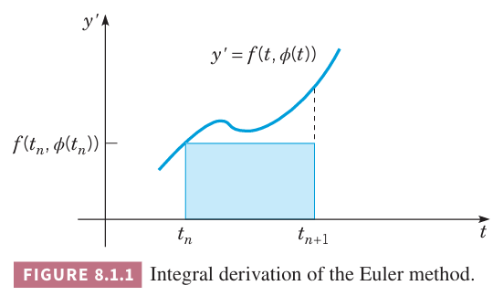

为了讨论数值近似法，主要集中于一阶微分方程的初值问题
$$\frac{dy}{dt}=f(t,y)\tag{1}$$
$$y(t_0)=y_0\tag{2}$$
假定 $f,f_y$ 在平面 $ty$ 内某个包含 $(t_0,y_0)$ 的矩形内是连续的，根据定理 2.4.2，在包含 $t_0$ 的某个区间内有唯一解 $y=\phi(t)$。如果方程 $(1)$ 是非线性的，解存在的区间比较难确定，或许无法表达成 $f$ 的某种简单关系。不过这里假定要讨论的各种情况下，在感兴趣的区间内，初始问题 $(1),(2)$ 存在唯一解。

在 2.7 小节，我们简单的讨论过欧拉法，也称为切线法。为了推导这种方法，将 $(1)$ 在 $t=t_n$ 写作如下形式
$$\frac{d\phi}{dt}(t_n)=f(t_n,\phi(t_n))\tag{3}$$
使用差的商表示微分得到
$$\frac{\phi(t_{n+1}-\phi(t_n))}{t_{n+1}-t_n}\approx f(t_n,\phi(t_n))\tag{4}$$
如果用 $y_n,y_{n+1}$ 代替 $\phi(t_n),\phi(t_{n+1})$ 那么就得到了欧拉公式
$$y_{n+1}=y_n+f(t_n,y_n)(t_{n+1}-t_n),n=0,1,2,\cdots\tag{5}$$
如果步长 $t_{n+1}-t_n$ 一样，用 $h$ 表示，用 $f_n$ 表示 $f(t_n,y_n)$，那么上式可以简化为
$$y_{n+1}=y_n+hf_n,n=0,1,2,\cdots\tag{6}$$
欧拉法就是反复使用 $(5)$ 或者 $(6)$ 计算得到一系列的值 $y_0,y_1,y_2,\cdots$，它们是解 $\phi(t)$ 在 $t_0,t_1,t_2,\cdots$ 的近似值。

这里我们分析的初值问题如下。
$$y'=1-t+4y\tag{7}$$
$$y(0)=1\tag{8}$$
$(7)$ 是一阶线性方程，容易求解，结合初始条件 $(8)$ 那么解是
$$y=\phi(t)=\frac{1}{4}t-\frac{3}{16}+\frac{19}{16}e^{4t}\tag{9}$$
这个问题有解析解，因此不必使用数值法。不过精确的解可以用于评估数值法的精度。这一章我们会始终使用这个问题来评估不同的数值方法。$(7)$ 的解彼此迅速发散，因此可以预见在中等长度的区间上，想要近似都是一个很困难的事情。这也是选择这个问题的原因之一，它能很容易的观察到更有效的方法的收益。

例 1 使用欧拉公式 $(6)$ 来近似求解初值问题 $(7),(8)$ 的解 $y=\phi(t)$，区间要求是 $0\leq t\leq 2$，步长 $h=0.05,0.025,0.01,0.001$。

解：使用计算机辅助，得到下表。精度一般。如果 $h=0.001$，从 $t=0$ 到 $t=2$ 需要 2000 步，计算量相当大才得到一个比较好的精度。后续会讨论其他数值方法，使用更大的步长更少的计算步骤就能得到同样甚至更好的精度。

| $t$ | $h=0.05$ | $h=0.025$ | $h=0.01$ | $h=0.001$ | Exact |
|--|--|--|--|--|--|
| 0.0 | 1.0000000 | 1.0000000 | 1.0000000 | 1.0000000 | 1.0000000 |
| 0.1 | 1.5475000 | 1.5761188 | 1.5952901 | 1.6076289 | 1.6090418 |
| 0.2 | 2.3249000 | 2.4080117 | 2.4644587 | 2.5011159 | 2.5053299 |
| 0.3 | 3.4333560 | 3.6143837 | 3.7390345 | 3.8207130 | 3.8301388 |
| 0.4 | 5.0185326 | 5.3690304 | 5.6137120 | 5.7754845 | 5.7942260 |
| 0.5 | 7.2901870 | 7.9264062 | 8.3766865 | 8.6770692 | 8.7120041 |
| 1.0 | 45.588400 | 53.807866 | 60.037126 | 64.382558 | 64.897803 |
| 1.5 | 282.07187 | 361.75945 | 426.40818 | 473.55979 | 479.25919 |
| 2.0 | 1745.6662 | 2432.7878 | 3029.3279 | 3484.1608 | 3540.2001 |

为了研究使用数值近似时的误差，同时也为了提出更精确的方法，从不同视角来审视欧拉法是很有帮助的。

一种方式是将问题写成积分方程。令 $y=\phi(t)$ 是初值问题 $(1),(2)$ 的解，那么从 $t_n$ 到 $t_{n+1}$ 积分得到
$$\int_{t_n}^{t_{n+1}}\phi'(t)dt=\int_{t_n}^{t_{n+1}}f(t,\phi(t))dt$$
那么
$$\phi(t_{n+1})=\phi(t_n)+\int_{t_n}^{t_{n+1}}f(t,\phi(t))dt\tag{10}$$
$(10)$ 里面的积分的几何意义是 $t=t_n$ 到 $t=t_{n+1}$ 之间曲线下的面积。如果我们用 $f(t,\phi(t))$ 在 $t=t_n$ 处的值 $f(t_n,\phi(t_n))$ 代替函数，就是用矩形面积来代替实际区域。假定步长 $h$ 都相等，那么 $t_{n+1}-t_n=h$，得到
$$\begin{aligned}
\phi(t_{n+1})&\approx\phi(t_n)+f(t_n,\phi(t_n))(t_{n+1}-t_n)\\
&=\phi(t_n)+hf(t_n,\phi(t_n))
\end{aligned}\tag{11}$$

为了得到 $\phi(t_{n+1})$ 的近似 $y_{n+1}$，将 $(11)$ 中 $\phi(t_n)$ 替换成其近似 $y_n$。这样就得到了欧拉公式 $y_{n+1}=y_n+hf(t_n,y_n)$。下一节会讨论通过更精确的积分近似得到更精确的算法。

另一个方法是假定 $y=\phi(t)$ 在 $t_n$ 附近存在泰勒级数
$$\phi(t_n+h)=\phi(t_n)+\phi'(t_n)h+\phi''(t_n)\frac{h^2}{2!}+\cdots$$
即
$$\phi(t_{n+1})=\phi(t_n)+\phi'(t_n)h+\phi''(t_n)\frac{h^2}{2!}+\cdots\tag{12}$$
如果仅保留两项，并且用 $y_n,y_{n+1}$ 代替 $\phi(t_n),\phi(t_{n+1})$ 那么得到了公式 $(6)$。如果保留更多项，那么近似会更精确。通过泰勒级数的余项可以估算误差。

### 后向欧拉公式
欧拉公式的一个变化是使用区间右侧的函数值来估算积分，那么
$$\phi(t_{n+1})=\phi(t_n)+f(t_{n+1},\phi(t_{n+1}))(t_{n+1}-t_n)$$
这就是后向欧拉公式（`backward Euler formula`）
$$y_{n+1}=y_n+hf(t_{n+1},y_{n+1})\tag{13}$$
假定知道了 $y_n$ 需要计算 $y_{n+1}$，而 $(13)$ 并没有给出计算 $y_{n+1}$ 的显式公式。这里仅仅是隐式地定义了 $y_{n+1}$。因此，这个公式也称为隐式欧拉公式（`implicit Euler formula`）。如何求解 $y_{n+1}$ 依赖于函数 $f$。

例 2 使用后向欧拉公式 $(13)$ 来近似求解初值问题 $(7),(8)$ 的解 $y=\phi(t)$，区间要求是 $0\leq t\leq 2$，步长 $h=0.05,0.025,0.01,0.001$。

解：对于 $(7)$，后向欧拉公式 $(13)$ 变成
$$y_{n+1}=y_n+h(1-t_{n+1}+4y_{n+1})$$
微分方程 $(7)$ 是线性的，因此上式也是线性的。整理得到
$$y_{n+1}=\frac{y_n+h(1-t_{n+1})}{1-4h}$$
使用计算机辅助，得到下表。对于这个问题，后向欧拉法的值比精确值要大，而欧拉法的估算要比精确值小。后向欧拉法的误差也要比欧拉法大一些，不过当 $h$ 很小时，差异不显著。

| $t$ | $h=0.05$ | $h=0.025$ | $h=0.01$ | $h=0.001$ | Exact |
|--|--|--|--|--|--|
| 0.0 | 1.0000000 | 1.0000000 | 1.0000000 | 1.0000000 | 1.0000000 |
| 0.1 | 1.6929688 | 1.6474375 | 1.6236638 | 1.6104634 | 1.6090418 |
| 0.2 | 2.7616699 | 2.6211306 | 2.5491368 | 2.5095731 | 2.5053299 |
| 0.3 | 4.4174530 | 4.0920886 | 3.9285724 | 3.8396379 | 3.8301388 |
| 0.4 | 6.9905516 | 6.3209569 | 5.9908303 | 5.8131282 | 5.7942260 |
| 0.5 | 10.996956 | 9.7050002 | 9.0801473 | 8.7472667 | 8.7120041 |
| 1.0 | 103.06171 | 80.402761 | 70.452395 | 65.419964 | 64.897803 |
| 1.5 | 959.44236 | 661.00731 | 542.12432 | 485.05825 | 479.25919 |
| 2.0 | 8934.0696 | 5435.7294 | 4172.7228 | 3597.4478 | 3540.2001 |

后向欧拉法的名字由来是因为它使用后向差的商 $\frac{1}{n}(\phi(t_n)-\phi(t_{n-1}))$ 来近似微分方程 $(3)$ 中的导数，而不是不是公式 $(4)$ 中的前向差的商。

既然后向欧拉公式并不比前向欧拉公式更精确，还比前向欧拉公式更复杂，那么讨论的目的是什么呢？这是后向微分公式中最简单的例子，这类方法在讨论特定的微分方程时非常有效且更为精确。8.4 小节的末尾还会讨论这一点。

### 数值近似的误差

下面分析微分方程
$$y'=1-t+4y,y(0)=1\tag{26}$$
在区间 $0\leq t\leq 2$ 上的行为做例子。令 $y=\phi(t)$ 是初值问题 $(26)$ 的解，那么
$$\phi(t)=\frac{1}{16}(4t-3+19e^{4t})$$
因此
$$\phi''(t)=19e^{4t}$$
那么 $(22)$ 就是
$$e_{n+1}=\frac{19e^{4\overline{t_n}}h^2}{2},t_n<\overline{t_n}<t_{n+1}\tag{27}$$
因子 19 和快速增长的 $e^{4t}$ 的出现解释了上面的表格为什么不精确。

比如对于 $h=0.05$，第一步的误差是
$$e_1=\phi(t_1)-y_1=\frac{19e^{4\overline{t_0}}(0.0025)}{2},0<\overline{t_0}<0.05$$
很明显 $e_1$ 是正的，由于 $e^{4\overline{t_0}}<e^{0.2}$，那么
$$e_1\leq\frac{19e^{0.2}(0.0025)}{2}\approx 0.02901\tag{28}$$
同时，$e^{4\overline{t_0}}>1$，因此 $e_1>\frac{19}{2}(0.0025)=0.02375$，实际误差是 0.02542。根据 $(27)$，随着 $t$ 的增加误差会快速增长。这和上面的表格结论一致。类似的，可以计算得到从 0.95 到 1.0 时的局部截断误差上下界
$$1.0617\approx\frac{19e^{3.8}(0.0025)}{2}\leq e_{20}\leq\frac{19e^4(0.0025)}{2}\approx1.2967\tag{29}$$
从 1.95 到 2.0 的上下界是
$$57.96\approx\frac{19e^{7.8}(0.0025)}{2}\leq e_{40}\leq\frac{19e^8(0.0025)}{2}\approx70.80\tag{30}$$
这个结果意味着在 $t=2$ 附近的局部截断误差是 $t=0$ 附近的 2500 倍。为了在整个区间上将误差减少到一个可以接受范围，我们必须基于 $t=2$ 附近来选择步长 $h$，当然这个步长小于 $t=0$ 附近对步长的要求。比如我们要达到局部截断误差小于 0.01 的目标，$t=0$ 附近的步长要求是 0.032 附近即可，而 $t=2$ 附近的补偿要求是 0.00059。在整个区间上选择一个更小的统一的步长会导致更多的计算，更多的消耗，更危险的是无可接受的舍入误差。

另一个保持局部截断误差常量的方法是随着 $t$ 的方法逐步减少步长。比如这个问题，从 $t=0$ 到 $t=2$ 步长逐渐减少 50 倍。这个变步长的方法称为自适应（`adaptive`）。现在解决微分方程的软件都有这个能力。
