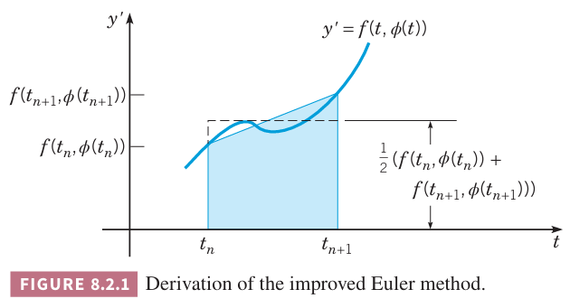

对于很多问题，欧拉方法需要很小的步长才能得到充分精确的结果。已经有大量研究致力于精度更高的方法。下面三节会讨论其中的一些方法。回到初值问题
$$y'=f(t,y),y(t_0)=y_0\tag{1}$$
令 $y=\phi(t)$ 是初值问题的解。8.1 节通过在 $t_n$ 到 $t_{n+1}$ 上积分将微分方程写作
$$\phi(t_{n+1})=\phi(t_n)+\int_{t_n}^{t_{n+1}}f(t,\phi(t))dt\tag{2}$$
欧拉公式是
$$y_{n+1}=y_n+hf(t_n,y_n)\tag{3}$$
上面的式子可以通过使用积分的左端点 $f(t_n,y_n)$ 来近似积分式 $f(t,\phi(t))$ 得到。其他定积分的近似方法就可以得到不同的数值解法。

### 改进的欧拉法
如果 $(2)$ 中的定积分有更精确的近似，那么就可以得到初值问题 $(1)$ 更精确的近似解。一种方式是使用两个端点的值的平均来近似，即 $\frac{1}{2}(f(t_n,\phi(t_n)),f(t_{n+1},\phi(t_{n+1})))$。在 $t_n$ 到 $t_{n+1}$ 这个区间上的积分近似如下图中的阴影所示。将 $\phi(t_n),\phi(t_{n+1})$ 替换成近似 $y_n,y_{n+1}$，就可以得到如下公式
$$y_{n+1}=y_n+\frac{f(t_n,y_n)+f(t_{n+1},y_{n+1})}{2}h\tag{4}$$

由于 $(4)$ 右侧的 $f$ 中的参数 $y_{n+1}$ 是未知的，因此 $y_{n+1}$ 是隐式定义。依赖于 $f$ 的性质，可能求解 $y_{n+1}$ 是非常困难的。如果将 $(3)$ 代入 $(4)$ 可以解决这个问题，因此
$$\begin{aligned}
y_{n+1}&=y_n+\frac{f(t_n,y_n)+f(t_n+h,y_n+hf(t_n,y_n))}{2}h\\
&=y_n+\frac{f_n+f(t_n+h,y_n+hf_n)}{2}h
\end{aligned}\tag{5}$$
其中 $t_{n+1}$ 被替换为 $t_n+h$。

$(5)$ 是 $y_{n+1}$ 的显式定义，使用 $t_n$ 时刻的数据来近似 $\phi(t_{n+1})$。这个公式称为改进欧拉公式（`improved Euler formula`）或 Heun 公式（`Heun formula`）。改进的欧拉公式一个两阶段方法：先使用欧拉法计算 $y_n+hf_n$，然后使用 $(5)$ 来计算 $y_{n+1}$。

欧拉公式 $(3)$ 的局部截断误差正比于 $h^2$，而改进的欧拉公式 $(5)$ 的局部截断误差正比于 $h^3$。可以证明在有限的区间内，改进的欧拉公式的全局截断误差的上界是 $h^2$ 的常量倍，因此这个方法是一个二阶方法。从 $t_n$ 到 $t_{n+1}$ 需要计算两次 $f(t,y)$，运算量更大，效果是精度更高。

如果 $f(t,y)$ 只依赖于 $t$ 而不依赖于 $y$，那么求解微分方程 $y'=f(t,y)$ 简化为对 $f(t)$ 积分。这种情况下 $(5)$ 变为
$$y_{n+1}=y_n+\frac{h}{2}(f(t_n)+f(t_n+h))\tag{6}$$
这正是数值积分中的梯形法则。

例 1 使用改进的欧拉公式 $(5)$、步长 $h=0.025,h=0.01$ 来估算初值问题
$$y'=1-t+4y,y(0)=1\tag{7}$$
解的值。

解：为了清晰起见，这里给出一些详细步骤。对于问题 $y'=1-t+4y$ 有
$$f_n=1-t_n+4y_n$$
$$f(t_n+h,y_n+hf_n)=1-(t_n+h)+4(y_n+hf_n)$$
当 $t_0=0$ 时，$y_0=1,f_0=1-t_0+4y_0=5$。当 $h=0.025$ 时有
$$f(t_0+h,y_0+hf_0)=1-0.025+4(1+0.025)(5)=5.475$$
那么根据 $(5)$
$$y_1=1+(0.5)(5+5.475)(0.025)=1.1309375\tag{8}$$
第二步
$$\begin{aligned}
f_1&=1-0.02+4(1.1309375)=5.49875\\
y_1+hf_1&=1.1309375+(0.025)(5.49875)=1.26840625\\
f(t_2,y_1+hf_1)&=1-0.05+4(1.26840625)=6.023625
\end{aligned}$$
代入公式 $(5)$
$$y_2=1.1309375+(0.5)(5.49875+6.023625)(0.025)=1.2749671875\tag{9}$$
下表第四列和第五列是 $0\let t\leq 2$ 区间上 $h=0.025,h=0.01$ 时改进的欧拉方法的近似解。

| $t$ | $h=0.01$ | $h=0.001$ | $h=0.025$ | $h=0.01$ | Exact |
|--|--|--|--|--|--|
| 0.0 | 1.0000000 | 1.0000000 | 1.0000000 | 1.0000000 | 1.0000000 |
| 0.1 | 1.5952901 | 1.6076289 | 1.6079462 | 1.6088585 | 1.6090418 |
| 0.2 | 2.4644587 | 2.5011159 | 2.5020618 | 2.5047827 | 2.5053299 |
| 0.3 | 3.7390345 | 3.8207130 | 3.8228282 | 3.8289146 | 3.8301388 |
| 0.4 | 5.6137120 | 5.7754845 | 5.7796888 | 5.7917911 | 5.7942260 |
| 0.5 | 8.3766865 | 8.6770692 | 8.6849039 | 8.7074637 | 8.7120041 |
| 1.0 | 60.037126 | 64.382558 | 64.497931 | 64.830722 | 64.897803 |
| 1.5 | 426.40818 | 473.55979 | 474.83402 | 478.51588 | 479.25919 |
| 2.0 | 3029.3279 | 3484.1608 | 3496.6702 | 3532.8789 | 3540.2001 |

为了能够与欧拉方法有可比性，要注意改进的欧拉法每次迭代需要计算两次 $f$ 的值，而欧拉法只需要一次。由于大部分的开销都是计算 $f$，因此要评估总的开销才能使得比较合理。对于给定 $h$，改进的欧拉法需要两倍的开销。因此改进欧拉法对于步长 $h$ 的计算量和步长使用 $h/2$ 的欧拉法大致一样。

上表第二列和第三列是欧拉法的估算值。改进的欧拉法使用步长 $h=0.025$ 要比欧拉法使用步长 $h=0.01$ 好很多。从 $t=0$ 到 $t=2$，前者计算 160 次 $f$ 的值，而后者计算 200 次 $f$ 的值。值得注意的是，改进的欧拉法使用步长 $h=0.025$ 甚至比欧拉法使用步长 $h=0.001$ 还要略微好点，而后者需要 2000 次计算。也就是说，改进的欧拉法仅用了十二分之一的计算量就能得到一个差不多甚至略好的结果，可见改进的欧拉法十分高效。

### 步长的变化
在 8.1 节中，我们提到了在计算过程中调整步长的可能性，以便将局部截断误差保持在相对稳定的水平。目标是在尽量减少步数以节省计算量的同时，能够控制近似值的精度。下面讨论具体的操作方法。首先，选定一个误差容限（`error tolerance`）$\epsilon$，即可以接受的局部截断误差的上限。假设经过 $n$ 步后，到了点 $(t_n, y_n)$。选择一个步长 $h$ 并计算出 $y_{n+1}$。接下来，需要估计计算 $y_{n+1}$ 时产生的误差。在不知道精确解的情况下，最好的办法是使用一种更精确的方法，从 $(t_n, y_n)$ 出发重复计算。比如如果原始计算使用的是欧拉法，那么可以用改进的欧拉法重复该步骤。这两个计算值之间的差值就是对原始方法的误差的估算 $e_{n+1}^{est}$。如果估算的误差大于误差容限 $\epsilon$，那么就调整步长并重新计算。高效调整步长的关键在于了解局部截断误差 $e_{n+1}$ 是如何依赖于步长 $h$ 的。对于欧拉法，局部截断误差与 $h^2$ 成正比。因此，为了将估算误差降低至上界 $\epsilon$，将原始步长乘以 $\sqrt{\epsilon/e_{n+1}^{est}}$ 即可。

下面用一个例子说明这一过程，如下初值问题 $(7)$
$$y'=1-t+4y,\quad y(0)=1$$
假设误差容限 $\epsilon=0.05$。可以验证，在步长 $h=0.1$ 运行一步后，欧拉法和改进欧拉法得到的值分别为 1.5 和 1.595。因此，使用欧拉法的估算误差为 0.095。由于该误差大于容限 0.05，我们步长乘以 $\sqrt{0.05/0.095}\approx 0.73$。保守起见向下取整，选择调整后的步长 $h=0.07$。此时，利用欧拉公式得到
$$y_1=1+(0.07)f(0,1)=1.35\approx\phi(0.07)$$
接着使用步长 $h=0.07$ 的改进的欧拉方法得到 $y_1=1.39655$。于是，欧拉公式的估算误差变为 0.04655，略小于规定的容限。而基于精确解对比得到的实际误差稍大一些，为 0.05122。

我们可以在计算的每一步都遵循这个过程，从而在整个数值计算过程中使局部截断误差基本保持不变。现代求解微分方程的自适应代码就是以这种方式在运行过程中调整步长的，尽管通常使用比欧拉法和改进欧拉法更精确的公式。因此，这些算法能够仅在真正需要的地方使用极小的步长从而兼顾效率与精度。
