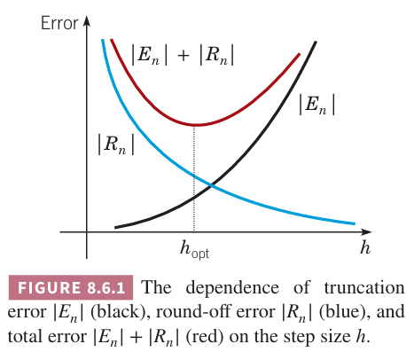
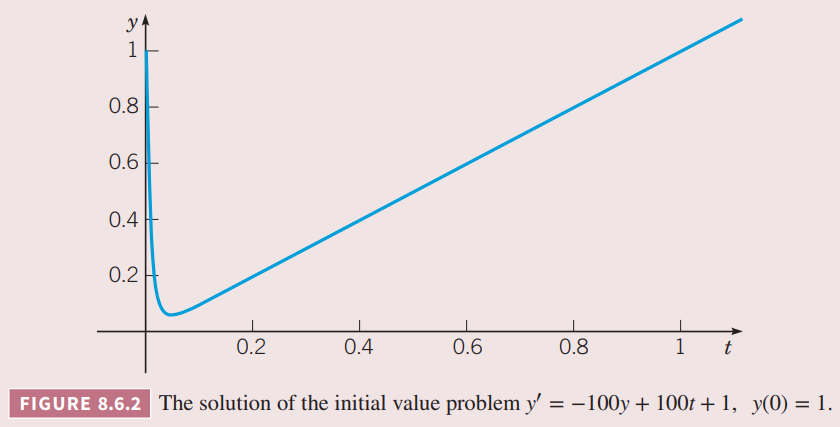

8.1 小节我们讨论了当使用数值法求解初值问题
$$y'=f(x,y),\quad y(x_0)=y_0\tag{1}$$
的近似值时的误差问题。

这一节我们继续讨论误差问题，并指出可能出现的困难。某些观点可能难以阐述，会通过具体的例子来说明。

### 截断误差与舍入误差
对于步长相等的 $h$，欧拉法的局部截断误差正比于 $h^2$，而全局截断误差正比于 $h$。通常来讲，对于 $p$ 阶方法，局部截断误差正比于 $h^{p+1}$，全局截断误差正比于 $h^p$。比如这里的欧拉法是一阶方法。

为了达到更高的精度，对于 $p$ 的选择会更大一些，比如 4 或者更大。随着 $p$ 的增加，计算 $y_{n+1}$ 的计算量也会增加，每一步也需要更大的计算量。不过，除非 $f(t,y)$ 非常复杂或者需要重复计算非常多次，否则这不是一个严重的问题。

如果步长 $h$ 减小，局部误差会正比于 $p$ 的幂次减小。不过，正如 8.1 小节提到的，如果 $h$ 太小，需要太多步才能覆盖固定区间，这样全局舍入误差就会比全局阶段误差更大了。这种情况如下图所示，假定舍入误差 $R_n$ 正比于计算执行的次数，反比于 $h$。另一方面阶段误差 $E_n$ 正比于 $h$ 的幂次。因此总误差的大小由 $|E_n|+|R_n|$ 决定。因此我们希望选择一个合适的 $h$，使得总误差最小。当阶段误差的增长率与舍入误差的下降率相平衡时 $h$ 是最优的。

例 1 考虑之前的问题
$$y'=1-t+4y,y(0)=1\tag{2}$$
使用不同步长的欧拉法近似估算 $\phi(t)$ 在 $t=0.5$ 和 $t=1$ 处的值。确定最优步长。

解：下表是不同步长 $h$ 对应的结果。

| $h$ | $N$ | $y_{N/2}$ | Error | $y_N$ | Error |
|--|--|--|--|--|--|
| 0.01 | 100 | 8.390 | −0.322 | 60.12 | −4.78 |
| 0.005 | 200 | 8.551 | −0.161 | 62.51 | −2.39 |
| 0.002 | 500 | 8.633 | −0.079 | 63.75 | −1.15 |
| 0.001 | 1000 | 8.656 | −0.056 | 63.94 | −0.96 |
| 0.0008 | 1250 | 8.636 | −0.076 | 63.78 | −1.12 |
| 0.000625 | 1600 | 8.616 | −0.096 | 64.35 | −0.55 |
| 0.0005 | 2000 | 8.772 | 0.060 | 64.00 | −0.90 |
| 0.0004 | 2500 | 8.507 | 0.205 | 63.40 | −1.50 |
| 0.00025 | 4000 | 8.231 | 0.481 | 56.77 | −8.13

这里计算过程使用四位有效数字，目的是让 $h$ 在较大时就出现舍入误差比较大的情况，如果使用更多的有效数字，那么舍入误差显著的情况会在更小的 $h$ 时出现。第一列是步长 $h$，第二列是计算到 $t=1$ 时需要计算的次数 $N$，第三列和第五列分别是 $t=0.5$ 和 $t=1$ 处的近似值，第四列和第六列分别是对应的误差。计算误差使用的精确值是 $\phi(0.5)=8.712,\phi(1)=64.90$。

对于不较大的步长，舍入误差比全局阶段误差小。总误差近似是全局阶段误差，是 $h$ 的常数倍。因此随着步长减少，误差成比例地减少。上表的前面三行可以说明这一点。对于 $h=0.001$，误差进一步减少，但是比成比例更小，这意味着舍入误差变得重要了。随着 $h$ 进一步减少，总误差开始震荡，进一步提高进度就成了一个问题。对于 $h$ 小于 0.0005，总误差开始增大，这意味着舍入误差已经占主导了。

这个结果也可以用步数 $N$ 来说明。对于 $N$ 小于 1000，误差随着 $N$ 的增加而减少。对于 $N$ 大于 2000，增加步数有负面效果。因此对这个问题来说，最佳的 $N$ 介于 1000 和 2000 之间。从上表可以看出，对于 $t=0.5$，最佳的 $N$ 是 1000，而对于 $t=1$，最佳的 $N$ 是 1600。

不要对例 1 中的结果做过度的解读。$h$ 和 $N$ 的最佳范围取决于微分方程自身、所使用的数值方法以及浮点运算中保留的有效数字位数。不过通常情况下是这样的：如果计算所需的步数过多，舍入误差最终很可能会累积到严重降低精度的程度。对于许多问题，使用 8.3 和 8.4 小节讨论的四阶方法无需考虑这个问题，在远低于舍入误差占主导的步数就可以给出非常好的近似值了。不过对于某些问题，舍入误差就变得很重要了。对于这些问题，方法的选择可能也很关键。这就是为什么现代软件提供了自适应步长，尽可能使用较大的步长，只在必要时使用较小的步长。

### 垂直渐进
下面看一个例子，求微分方程
$$y'=t^2+y^2,y(0)=1\tag{3}$$
的解 $y=\phi(t)$ 的近似值。

由于这个微分方程是非线性的，因此根据 存在性和唯一性定理 2.4.2，只能确保在包含 $t=0$ 的一些区间上有解。下面尝试使用数值法来近似 $0\leq t\leq 1$ 这个区间上的解。

首先使用步长为 $h=0.1,0.05,0.01$ 的欧拉法来近似，得到 $t=1$ 时的值分别是 $7.189548,12.32093,90.75551$。差距非常大，这使得我们要用更精确的方法来近似。使用四阶龙格-库塔方法，步长是 $h=0.1$，得到 $t=1$ 时的值是 735.0991，这和之前欧拉法的结果差距也特别大。如果使用 $h=0.05,0.01$ 我们得到如下表格

| $h$ | $t=0.90$ | $t=1.0$ |
|--|--|--|
| 0.1 | 14.02182 | 735.0991 |
| 0.05 | 14.27117 | $1.75863 \times 10^5$ |
| 0.01 | 14.30478 | $2.0913 \times 10^{2893}$ |
| 0.001 | 14.30486 | |

$t=0.9$ 时近似值是合理的，因此可以认为在 $t=0.9$ 时函数值是 14.305。不过，我们无法确定在 0.9 到 1 之间发生了什么。为了确定这一点，这里需要一些分析方法。在 $0\leq t\leq 1$ 时
$$y^2\leq t^2+y^2\leq 1+y^2\tag{4}$$
因此
$$y'=1+y^2,y(0)=1\tag{5}$$
的解 $\phi_1(t)$ 和
$$y'=y^2,y(0)=1\tag{6}$$
的解 $\phi_2(t)$ 分别是 $\phi(t)$ 的上界和下界，原因是这些解都通过同一个点。事实上，能够证明只要解存在，那么 $\phi_2(t)\leq \phi(t)\leq \phi_1(t)$。注意到，初值问题 $(5),(6)$ 的解分别是
$$\phi_1(t)=\tan(t+\frac{\pi}{4}),\quad \phi_2(t)=\frac{1}{1-t}\tag{7}$$
当 $t\to 1$ 时，$\phi_2(t)\to\infty$，当 $t\to\frac{\pi}{4}$ 时，$\phi_1(t)\to\infty$。因此原始的解至少在 $0\leq t<\frac{\pi}{4}$ 之间是存在的，并且至多在 $0\leq t<1$ 之间是存在的。在 $\frac{\pi}{4}\leq t<1$ 之间的某个点 $t$ 上问题 $(3)$ 的解有一个垂直渐近线，因此不可能在整个区间 $0\leq t\leq 1$ 上存在解。

前面的数值分析表明垂直渐近线所在的点比 $\frac{\pi}{4}$ 要大，甚至比 $t=0.9$ 要大。假定初值问题的解在 $t=0.9$ 处存在并且它的值是 14.305，将 $y(0)=1,y(0.9)=14.305$ 代入初值问题 $(5),(6)$ 的解中，得到更精确的上下界
$$\phi_1(t)=\tan(t+0.60100),\phi_2(t)=\frac{1}{0.96991-t}\tag{8}$$
其中计算过程保留了五位有效数字。因此当 $t\to\frac{\pi}{2}-0.60100\approx 0.96980$ 时 $\phi_1(t)\to\infty$，当 $t\to 0.96991$ 时 $\phi_2(t)\to\infty$。因此原始的解的垂直渐近线在这两个值之间。这个例子通过结合数值方法和分析方法能够确定更多的有用信息。

### 稳定性
稳定的概念是说在数学运算过程中引入微小的误差时会随着运算的继续而消失或者衰减。如果差误增大甚至无限增长，那么就是不稳定的。之前我们讨论过微分方程的平衡解的稳定性，取决于在平衡解附近开始的解是趋于平衡解还是远离平衡解的。也就是说，如果附近的解趋于给定的解，那么这个解就是渐进稳定的；如果附近的解远离给定的解，那么这个解就是渐进不稳定的。从可视化角度看，渐进稳定的图像会汇聚到一起，而渐进不稳定的图像会发散开来。

如果研究数值法求解初值问题，我们期望数值解的行为和微分方程的解的行为相似。我们无法通过数值方法就将一个不稳定问题变成稳定的问题。不过数值近似的过程中可能引入不稳定因素，而这并不是原始问题的固有性质，这可能会导致一些问题。避免这样的不稳定因素需要限制步长 $h$ 的大小。

这里用最简单的问题来解释。有如下微分方程
$$\frac{dy}{dt}=ry\tag{9}$$
其中 $r$ 是一个常数。假定通过数值法来近似这个问题的解，已经计算得到了点 $(t_n,y_n)$。通过这个点的 $(9)$ 的精确解是
$$\phi(t)=y_n\exp(r(t-t_n))\tag{10}$$
使用欧拉法得到
$$y_{n+1}=y_n+hf(t_n,y_n)\tag{11}$$
使用后向欧拉法得到
$$y_{n+1}=y_n+hf(t_{n+1},y_{n+1})\tag{12}$$
从 $(11)$ 可以得到
$$y_{n+1}=y_n+hry_n=y_n(1+rh)\tag{13}$$
从 $(12)$ 可以得到
$$y_{n+1}=y_n+hry_{n+1}$$
或
$$y_{n+1}=\frac{y_n}{1-rh}=y_n(1+rh+(rh)^2+\cdots)\tag{14}$$
计算 $(10)$ 在 $t_n+h$ 处的值，得到
$$\phi(t_{n+1})=y_n\exp(rh)=y_n(1+rh+\frac{(rh)^2}{2!}+\cdots)\tag{15}$$
对比 $(13),(14),(15)$ 可以看出欧拉公式和后向欧拉公式的误差 $y_{n+1}-\phi(t_{n+1})$ 正比于 $h^2$，这和之前的讨论结果一致。

现在将 $y_n$ 的值修改为 $y_n+\delta$。我们可以假定 $\delta$ 是计算到 $t=t_n$ 时累积的误差。需要讨论的问题是当继续计算到 $t_{n+1}$ 时，误差会会变大还是变小。

对于 $(15)$，$y_n$ 的变化 $\delta$ 会导致 $\phi(t_{n+1})$ 的变化是 $\delta\exp(rh)$。如果 $\exp(rh)<1$，那么这个量小于 $\delta$，也就是说 $r<0$ 时误差会变小。这与 $r<0$ 时 $(9)$ 的解是渐进稳定的情况是一致的，如果 $r>0$ 是不稳定解。

对于后向欧拉法，$y_n$ 的变化 $\delta$ 会导致 $y_{n+1}$ 的变化是 $\frac{\delta}{1-rh}$。对于 $r<0$，$1/(1-rh)$ 是负数并且小于 1。因此如果微分方程是稳定的，那么后向欧拉方法对任意步长 $h$ 都是稳定的。

对于欧拉法，$y_n$ 的变化 $\delta$ 会导致 $y_{n+1}$ 的变化是 $\delta(1+rh)$。对于 $r<0$，$1+rh$ 可以写作 $1-r|h|$。那么需要 $|1+rh|<1$，这等价于
$$-1<1-r|h|<1,0<r|h|<2$$
那么 $h$ 必须满足 $h<\frac{2}{|r|}$。因此如果 $h$ 不是充分小，那么欧拉法是不稳定的。

这个例子说明除非 $|r|$ 非常大，那么欧拉法对于 $h$ 的限制相当宽松。尽管如此，即便初值问题是稳定的，但为了保证数值方法的稳定性，可能有必要对 $h$ 进行限制。如果为了满足稳定性而不是精度要使用更小的步长，这类问题称为刚性（`stiff`）问题。8.4 小节讨论的后向微分公式（后向欧拉公式是最低阶特例）是处理刚性问题的常见方法。下面的例子阐述了近似求解刚性问题时可能出现的不稳定性问题。

例 2 刚性问题

考虑如下初值问题
$$y'=-100y+100t+1,y(0)=1\tag{16}$$
使用欧拉法、后向欧拉法和龙格-库塔方法来求 $0\leq t\leq 1$ 上的近似值。并于精确解进行比较。

解：由于微分方程是线性的，容易求解得到这个初值问题的解是
$$y=\phi(t)=e^{-100t}+t\tag{17}$$
图像如下图所示。有很薄的一层（有时也称为边界层（`boundary layer`））在 $t=0$ 附近，这里指数项是主导的，解变化非常快。一旦过了这一层，$\phi(t)\approx t$，解的图像就是一条直线了。边界层的宽度可以相对比较任意，但是非常小。在这个例子中，$t=0.1$ 时 $\exp(-100t)\approx 0.000045$。

解 $\phi(t)$ 的解的近似值如下表所示，六位有效数字，精确值是第二列。

| $t$ | Exact | Euler $h=0.025$ | Euler $h=0.0166\cdots$ | Runge-Kutta $h=0.0333\cdots$ | Runge-Kutta $h=0.025$ | Backward Euler $h=0.1$ |
|--|--|--|--|--|--|--|
| 0.0 | 1.000000 | 1.000000 | 1.000000 | 1.000000 | 1.000000 | 1.000000 |
| 0.05 | 0.056738 | 2.300000 | −0.246296 | 0.470471 | 0.056738 | 0.056738 |
| 0.1 | 0.100045 | 5.162500 | 0.187792 | 10.6527 | 0.276796 | 0.190909 |
| 0.2 | 0.200000 | 25.8289 | 0.207707 | 111.559 | 0.231257 | 0.208264 |
| 0.4 | 0.400000 | 657.241 | 0.400059 | $1.24\times 10^4$ | 0.400977 | 0.400068 |
| 0.6 | 0.600000 | $1.68\times 10^4$ | 0.600000 | $1.38\times 10^6$ | 0.600031 | 0.600001 |
| 0.8 | 0.800000 | $4.31\times 10^5$ | 0.800000 | $1.54\times 10^8$ | 0.800001 | 0.800000 |
| 1.0 | 1.000000 | $1.11\times 10^7$ | 1.000000 | $1.71\times 10^{10}$ | 1.000000 | 1.000000 |

如果使用数值法近似 $(17)$ 的解，那么在边界层要使用非常小的步长。更精确的分析，欧拉法和后向欧拉法的局部截断误差正比于 $\phi''(t)h^2$。在这个问题中，$\phi''(t)=10^4e^{-100t}$，在 $t=0$ 时值是 $10^4$，而 $t>0.2$ 时这个值几乎为零，变化非常大。因此在 $t=0$ 附近为了足够的精度，需要很小的步长，当 $t$ 稍微大一点的时候，步长大一些精确也足够了。

根据之前 $(9)$ 到 $(15)$ 的分析，由于 $r=-100$，那么对于欧拉法而言 $h<2/|r|=0.02$，但是对后向欧拉法没有限制。

$h=0.025$ 时欧拉法的结果没有意义，因为非常不稳定，$h=0.0166\cdots$ 时欧拉法的结果是合理的。对于后向欧拉法，$h=0.1$ 就足够了，结果精度是可比较的。

使用更精确的方法，比如龙格-库塔方法，情况也没有变好。对于 $h=0.0333\cdots$，结果是不稳定的，而对于 $h=0.025$，结果是稳定的。

上表 $t=0.05,t=0.1$ 的结果表明在边界层内，数值方法需要更小的步长才能获得精确的近似解。

下面的例子阐述了在处理不稳定微分方程的数值方法中可能出现的其他困难。

例 3 求二阶微分方程
$$y''-10\pi^2y=0\tag{18}$$
的两个线性独立解的数值近似。

解：为了使用数值法求解这个问题，首先将 $(18)$ 转化为两个一阶微分方程的方程组。令 $x_1=y,$ $x_2=y'$，则有
$$x_1'=x_2,x_2'=10\pi^2x_1$$
如果 $\boldsymbol{x}=(x_1,x_2)^T$，那么
$$\boldsymbol{x}'=\begin{pmatrix}0 & 1\\10\pi^2 & 0\end{pmatrix}\boldsymbol{x}\tag{19}$$
方程 $(19)$ 的系数矩阵的特征值和特征向量是
$$r_1=\sqrt{10}\pi,\boldsymbol{\xi}^{(1)}=\begin{pmatrix}
1\\\sqrt{10}\pi
\end{pmatrix};r_2=-\sqrt{10}\pi,\boldsymbol{\xi}^{(2)}=\begin{pmatrix}
1\\-\sqrt{10}\pi
\end{pmatrix}\tag{20}$$
那么方程组 $(19)$ 的两个线性独立的解分别是
$$\boldsymbol{x}^{(1)}(t)=\begin{pmatrix}
1\\\sqrt{10}\pi
\end{pmatrix}e^{\sqrt{10}\pi t},\quad \boldsymbol{x}^{(2)}(t)=\begin{pmatrix}
1\\-\sqrt{10}\pi
\end{pmatrix}e^{-\sqrt{10}\pi t}\tag{21}$$
那么二阶微分方程 $(18)$ 相应的两个解是 $\boldsymbol{x}^{(1)}(t)$ 和 $\boldsymbol{x}^{(2)}(t)$ 的第一个分量，即 $y_1(t)=e^{\sqrt{10}\pi t},y_2(t)=e^{-\sqrt{10}\pi t}$。

下面讨论另外一对线性无关的解，它们是由 $\boldsymbol{x}^{(1)}(t)$ 和 $\boldsymbol{x}^{(2)}(t)$ 的线性组合得到的。
$$\boldsymbol{x}^{(3)}(t)=\frac{1}{2}\boldsymbol{x}^{(1)}(t)+\frac{1}{2}\boldsymbol{x}^{(2)}(t)=\begin{pmatrix}
\cosh(\sqrt{10\pi t})\\\sqrt{10}\pi\sinh(\sqrt{10\pi t})
\end{pmatrix}\tag{22}$$
$$\boldsymbol{x}^{(4)}(t)=\frac{1}{2}\boldsymbol{x}^{(1)}(t)-\frac{1}{2}\boldsymbol{x}^{(2)}(t)=\begin{pmatrix}
\sinh(\sqrt{10\pi t})\\\sqrt{10}\pi\cosh(\sqrt{10\pi t})
\end{pmatrix}\tag{23}$$
尽管 $\boldsymbol{x}^{(3)}(t),\boldsymbol{x}^{(4)}(t)$ 相当的复杂，不过当 $t$ 充分大的时候，有 $\cosh(\sqrt{10}\pi t)\approx\frac{1}{2}e^{\sqrt{10}\pi t}$，$\sinh(\sqrt{10}\pi t)\approx\frac{1}{2}e^{\sqrt{10}\pi t}$。因此如果 $t$ 充分大并且固定数字的个数，$\boldsymbol{x}^{(3)}(t)$ 和 $\boldsymbol{x}^{(4)}(t)$ 看起来是一样的。比如，使用八个有效数字，对于 $t=1$
$$\sinh(\sqrt{10}\pi)=\cosh(\sqrt{10}\pi)=10,315.894$$
在 $t=1$ 时，$\boldsymbol{x}^{(3)}(t)$ 和 $\boldsymbol{x}^{(4)}(t)$ 时是一样的，那么对 $t>1$ 而言也是如此。即使保留更多的有效数字，最终两个数值解也会一样。这种现象称为数值依赖性（`numerical dependence`）。数值方法得出哪一个解取决于初始条件。$\boldsymbol{x}^{(1)}$ 是由初始条件 $\boldsymbol{x}(0)=(1,\sqrt{10}\pi)^T$ 得到的，而 $\boldsymbol{x}^{(2)}$ 是由初始条件 $\boldsymbol{x}(0)=(1,-\sqrt{10}\pi)^T$ 得到的，类似的 $\boldsymbol{x}^{(3)},\boldsymbol{x}^{(4)}$ 由 $\boldsymbol{x}(0)=(1,0)^T$ 和 $\boldsymbol{x}(0)=(0,1)^T$ 得到。
