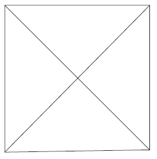
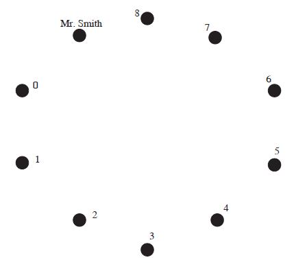
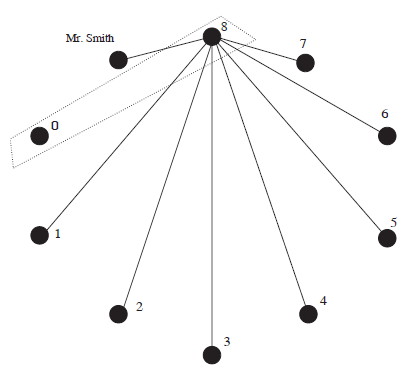

## The Basic Pigeon-Hole Principle
**Theorem 1.1.** [鸽巢原理] 把$n$个球放入$k$个盒子，如果$n>k$，那么至少有一个盒子里面至少有两个球。  
**Proof.**  
使用间接法（反证法）来这个定理。  
假设没有盒子至少有两个球，也就是说每个盒子有0个或者1个球。假设有$m$个盒子有0个球，显然$m\geq 0$，那么有$k-m$个盒子有1个球。进而球的总数是$k-m$，而它不等于$n$，因为$k-m\leq k<n$。出现了矛盾，假设不成立，所以至少有一个盒子里面至少有两个球。

**Example 1.2.** 在序列$7,77,777,\ldots$中有一个元素能被2003整除。  
**Solution.** 我们证明一个更强的命题，前2003个元素中有一个元素能被2003整除。反证法。假设都不能被2003整除，那么余数是1到2002的某数，由于有2003个余数，所以根据鸽巢原理，那么至少有两个数对应的余数相同。不妨设第$i$个和第$j$个数，$a_i,a_j$，具有相同余数，其中$i<j$。  
$$a_i=2003k_i+r$$
$$a_j=2003k_j+r$$
所以
$$a_j-a_i=2003(k_j-k_i)$$
那么$a_j-a_i$能够整除2003。  
另一方面$a_j-a_i$是由$j-i$个7和$i$个0组成的数。
$$a_j-a_i=a_{j-i}\cdot 10^i$$
由于$10^i$不能被2003整除，所以$a_{j-i}$能被2003整除。与假设矛盾。

**Example 1.3.** $n$个人参加单循环象棋比赛。证明任何时间点，有两个人的比赛场数相同。  
**Solution.** $n$个参赛者相当于鸽巢原理的球。比赛场数的可能性相当于抽屉。比赛场数从$0$到$n-1$，共有$n$种可能性。但是仔细考虑比赛规则，如果某个人比赛了$n-1$场的话，那么其他人至少比赛了1场，所以$0$和$n-1$这两种可能性不能同时存在，所以比赛场数有
$n-1$种可能性。根据鸽巢原理，至少有两个人的比赛场数是相同的。

## The Generalized Pigeon-Hole Principle
**Theorem 1.4** 将$n$个球放到$m$个盒子中，其中$n>rm$，那么至少有一个盒子里面至少有$r+1$个球。  
**Proof.** 反证法。命题的反面是每个盒子最多有$r$个球，那么球数最多是$rm$，小于$n$。矛盾。

**Example 1.5.** 十个点放到单位正方形中。有两点距离小于0.48，有三点能被半径0.5的圆覆盖。  
**Solution.** 对于第一个命题，如下图分成9个等大的小正方形。  
  
那么至少有一个小正方形里面有两个点，这两点的距离最大是$\frac{\sqrt{2}}{3}<0.48$。  
第二个命题，如下图分成4个等大的三角形。  
  
那么至少有一个三角形中包含三个点，而该三角形能被一个半径为0.5的圆覆盖。

**Example 1.6.** 在过去1000年中，读者的某个祖先A，存在一个人P，既是A的父亲的祖先，也是A的母亲的祖先。  
**Solution.** 从读者开始构成一棵家族树。前三代不会有重合。  
假设25年一代人（实际上要比这个值低，往较宽松的方向估计），共计40代人。节点数共计$1+2+\cdots+2^{40}=2^{41}-1$。  
如果有两个节点是同一个人B，那么该B就是我们要找的P。  
如果没有，那$2^{41}-1$是完全不同的人。但是目前地球上人数少于$10^{10}$，历史上任意时期都比这个值少的多，那么40代人共计$40\cdot10^{10}<2^{41}-1$，矛盾。那么一定有两个节点是同一个人。

**Example 1.7.** 史密斯夫妇邀请了4对夫妇到他家参加聚会。这8个人一些是史密斯先生的朋友，另一些是史密斯太太的朋友。如果两人在聚会前就认识，那么见面时会握手。事后，史密斯先生说：“如果排除我，其他人握手次数均不相同”。问，史密斯太太握了几次手。  
**Solution.** 我们使用图(`graph`)和鸽巢原理来解决这个问题。  
十个点代表十个人，除了史密斯先生外，标记握手次数。由于每个人不会和自己的配偶握手，也不可能和自己握手，所以握手的最大次数就是8。九个人握手次数各不相同，那么他们握手次数必须是0,1,2,3,4,5,6,7,8。  
  
用$Y_i$来表示握手次数为$i$的人。那么谁是$Y_8$的配偶呢？$Y_8$除了自己的配偶外都握了手。$Y_0$握手次数，也就是说，$Y_8$没有和$Y_0$握手，所以$Y_8$和$Y_0$是一对。  
  
$Y_7$没有和$Y_0$握手外，还没有和自己的配偶握手。而$Y_1$已经和$Y_8$握手了，所以他不会再和其他人握手。所以$Y_7$的配偶是$Y_1$。  
同理，$Y_6$和$Y_2$是一对，$Y_5$和$Y_3$是一对。那么$Y_4$是史密斯太太，她握了4次手。  

## Exercises
(4) 将200个球分到100个盒子中，每个盒子最少1个，最多100个。求证可以找到一些盒子，这些盒子共有100个球。  
**Solution.** 分两种情况。  
每个盒子包含的球数相同，那么任意50个盒子都是满足题意的。  
另一种情况，至少有两个盒子包含不同数量的球。不妨设为$a_1$和$a_2$，其他盒子的球的数量为$a_3,a_4,\cdots,a_{100}$。考虑下面这个数列
$$a_1,a_1+a_2,a_1+a_2+a_3,\cdots,a_1+a_2+\cdots+a_{100}$$
假设这100项有两项除以100的余数相同，那么这两项相减的值恰为100。也就是说$a_i + a_{i+1} + \cdots + a_j = 100$。  
如果除以100的余数均不同，我们把$a_2$放入数列中，由于$a_1\neq a_2$，所以这是一项新的值，此时，数列共有101相。那么一定有一项模100和$a_2$相同，假定是第$i$项，其和是$S$，那么$S-a_2=a_1+a_3+\cdots+a_i=100$。  
其实证明了一个更严格的命题，这些盒子是连续的或者基本是连续的。  
对于$2n$个盒子和$4n$个球而言，命题都是成立的。

(7) 集合$L$包含2003个元素，其质因数均小于24。求证$L$中有四个数，其乘积是某个整数的四次方。  
**Solution.** 小于24的质数有9个。  
按照各质数的指数模4的余数分类，共有$4^9$个，远大于2003，所以不能这么分。  
4个数乘积是某数的四次方，没有必要这四个都满足其质因数的指数是4的倍数。只要其相加是4的倍数即可。  
那我们渐进式的处理这些数。按照质因数的指数的奇偶性来分类，共分成$2^9=512$类。从同组里面取两数，相乘放入集合$L'$中。最终，$L$最多剩余511个数（2003是奇数，所以不可能512组每组都剩一个数），那么$L'$中至少有$(2003-511)/2=746$个数。  
将$L'$中的数一定是某数的平方，其质因数的指数均为偶数，那么模4的余数是0或者2。按照该性质将其分成512类，至少有一类里面包含两个数，其乘积是某数的四次方，因为质因数的指数是4的倍数。这两个数均是集合$L$某两数的乘积，所以$L$中存在四个数，其乘积是某个整数的四次方。

(8) 100个实数之和是0。求证至少有99对数之和是非负的。  
**Solution.** 将这100个数从小到大排列。
$$a_1\leq a_2\leq\cdots\leq a_{100}$$
按照$a_{50}+a_{99}$的符号分两种情况讨论。  
(a) $a_{50}+a_{99}\geq 0$  
那么
$$0\leq a_{50}+a_{99}\leq a_{51}+a_{99}\leq\cdots\leq a_{100}+a_{99}$$
有51对和为非负的数。
$$0\leq a_{50}+a_{99}\leq a_{50}+a_{100}\leq a_{51}+a_{100}\leq\cdots\leq a_{98}+a_{100}$$
有49对和为非负的数。  
(b) $a_{50}+a_{99}< 0$  
那么
$$a_1 + a_2 + \cdots + a_{49} + a_{51} + \cdots + a_{98} + a_{100} > 0$$
由于
$$a_2+a_{51}\leq a_3+a_{52}\leq\cdots\leq a_{49}+a_{98}\leq a_{50}+a_{99}<0$$
左边的48对之和都小于0，所以$a_1+a_{100}$必须大于0。  
那么
$$a_i+a_{100}>0, i=1,2,3\ldots,99$$

(14)  
(a) 一个足球队一年比赛30场，进球数53个，每场球都至少进一个球。求证有连续若干场球的进球数是6个。  
(b) 如果总进球数是60个。求证上述命题不成立。  
(c) 如果总进球数是59个。求证(a)中命题成立。  
**Solution.** (a) $a_i$表示第$i$场的进球数，$b_i$定义如下
$$b_i=a_1+a_2+\cdots+a_i$$
其中$1\leq i\leq 30$。这是30个数，同时我们再构造30个数
$$b_i+6$$
这60个整数，最大值是$53+6=59$。根据鸽巢原理，必定有两个数相同，由于$b_i$各不相同，那么$b_i+6$也各不相同，所以这两个相同的数的形式一定是$b_i$和$b_j+6$，其中$j<i$。那么$j+1,j+2,\cdots,i$这些连续场次的进球数是6个。  
(b) 不成立，举出一个反例即可。$1,1,1,1,1,7$，然后再重复6次。  
(c) 反证法。  
集合$B=\{b_i|1\leq i\leq 30\}$。  
考虑集合$F=\{1,7,13,\cdots,55\}$。连续两个数不能同时出现在集合$B$中，否则有连续若干场比赛进球数为6。那么$F$最多有五个数属于$B$。  
类似的，$2, 8, \cdots , 56|3, 9, \cdots , 57|4, 10, \cdots , 58|5, 11, \cdots , 59$，每组也最多五个数属于$B$。至此，$B$中包含25个数。  
那么数列$6,12,18,24,\cdots,54$中最少要有5个数属于$B$。显然，$6\notin B$。剩下八个数中要有5个属于$B$，那必须有两个连续的数，和假设矛盾。

(39) 令$K$表示三维空间中的坐标位于$[1，10]$中的所有整数的1000个点。令$S$为$K$的子集，该子集至少具有272点。证明$S$包含两个点$u$和$v$，$v$的每个维度坐标严格大于$u$的对应坐标。  
**Solution.**
> 我花了很久都没能解出这道题，于是乎在`Mathematics`上提了[问题](https://math.stackexchange.com/questions/3587593/prove-a-subset-from-1000-points-contains-one-point-that-is-strictly-larger-than)，并且有其他数学爱好者回答了我的问题。好幸运！

如果两个点$(a,b,c)$和$(d,e,f)$满足
$$(a,b,c)+\lambda(1,1,1)=(d,e,f)$$
其中$\lambda\in\mathbb{Z}$。那么这两点属于同一个等价类。  
那么共有271个等价类。因为每个等价类最接近原点的点必须包含1，包含1个1的点有$3\times 9\times 9=243$个，包含2个1的点有$3\times 9=27$个，包含3个1的点只有1个，共计271个。  
子集$S$至少272个点，那么至少有2个点属于同一个等价类，那么这两个点满足题意。
