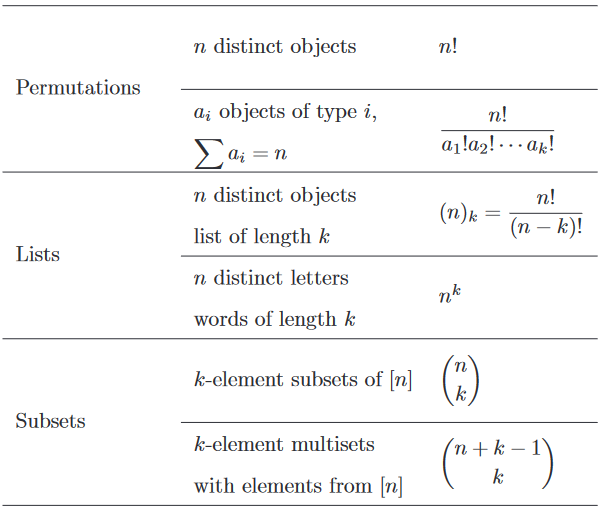
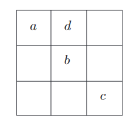
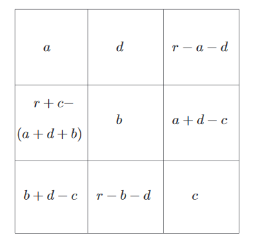

## Permutations
**Definition 3.1.** 将$n$个不同对象排成一列，且每个对象只能使用一次，这称之为排列(`permutation`)。$n$个对象的所有排列的个数是$n\cdot(n-1)\cdot(n-2)\cdots 2\cdot 1$，这称之为n的阶乘(`factorial`)，用$n!$表示。

**Theorem 3.2.** 一个$n$个元素的集合的所有排列的个数是$n!$。

这里有个约定：$0!=1$。为什么不等于零呢？考虑两个房子，一间$m$个人，一间$n$个人，将两间房的人分别拍成一列，共有$m!n!$种排列。如果$n=0$呢？为了使$m!n!$在这种极端情况下也成立，我们不得不令$0!=1$。  
$n!$是一个重要的数，但是它有多大呢？斯特林公式(`Stirling's formula`)给出了近似值
$$n!\approx\sqrt{2\pi n}(\frac{n}{e})^n$$
符号$n!\approx z(n)$意味着$\lim_{n\to \infty}\frac{n!}{z(n)}=1$。

**Example 3.3.** 三种不同的颜色图一个三个水平条纹的棋子，要求颜色各不相同，多少种图法？  
**Solution.** 略。

**Example 3.4.** 某园丁需要将五朵红花，三朵黄花和两朵白花种成一排。有多少种方式？  
这个题目不能直接套用前面的公式，因为不是所有的对象都是不同的。这种集合称之为多重集(`multiset`)，其排列问题称之为多重集的全排列(`multiset permutation`)。  
假设10朵花都不相同，那么共有$10!$种排列方式，但是对于某种排列，交换任意两朵红花，结果是一致的，对于红花共有$5!$种重复。黄花和白花类似。所以不同排列的方式共有
$$A=\frac{10!}{5!\cdot 3!\cdot 2!}=2520$$

对该问题进行泛化，可以得到如下命题：  
**Theorem 3.5.** 多重集有$n$个对象，它们属于$k$类，每类对应的个数分别是$a_1,a_2,\cdots,a_k$，那么排列数是
$$\frac{n!}{a_1!\cdot a_2!\cdots a_k!}$$

## Strings over a Finite Alphabet
我们接下来要处理的问题是用元素有限的字母表(`alphabet`)来构造字符串。

**Theorem 3.6.** 用$n$个元素的字母表构造长度为$k$的字符串，其数量是$n^k$个。  
**Proof.** 选择第一个字符，有$n$种不同的方式。第二个字符可以和第一个字符相同，也有$n$种方式，依此类推，第$k$个字符也有$n$种方式。选择这$k$个字符是独立的，所有共有$n^k$种选择方式。

**Example 3.7.** $k$位正整数有$9\cdot 10^{k-1}$个。  
**Solution.** 略。

下面介绍组合计数中常用的一种方法：双射(`bijections`)。举个例子，在舞厅中有一些男人和一些女人，我们不知道男人的数量，但是我们知道有243个女人。那么我们可以对男女进行配对。如果没人被剩下来，那么男人也是243个；如果男人剩下了，那么男的比女的多，反之男的比女的少。

**Definition 3.8.** $X$和$Y$是有限集合，$f:X\to Y$满足  
(1) 如果$f(a)=f(b)$，那么$a=b$  
(2) 对所有的$y\in Y$，存在唯一的$x$使得$f(x)=y$  
我们称$f$是$X$到$Y$的双射。

**Definition 3.9.** 令$f:X\to Y$。如果$f$满足`Definition 3.8`的条件(1)，我们称之为单射(`one-to-one`, `injection`)；如果$f$满足`Definition 3.8`的条件(2)，我们称之为满射(`surjection`)。

**Proposition 3.10.** $X$和$Y$是有限集合，如果在$X$到$Y$上存在满射$f$，那么$X$和$Y$的元素数量一样多。  
**Proof.** 满射$f$将$X$和$Y$的元素进行了配对，如果$f$匹配了$m$对，那么$X$和$Y$都有$m$个元素。

这个方法非常重要。如果对$X$计数很难，我们可以找到一个集合$Y$，在$X$到$Y$上存在一个满射，且它较容易计数，那么问题就变得更容易解决了。

**Example 3.11.** $n$个元素的集合所有子集的个数是$2^n$。  
**Solution.** 构造一个双射。任意一个子集$B$可以看作是一个长度为$n$的字符串，如果第$i$个元素在$B$中，那么第$i$个字符是1，否则是0。同时，相同的子集$B$得到的字符串是相同的。  
根据`Theorem 3.6`，这些字符串组成的集合有$2^n$个元素。

**Example 3.12.** 一个城市有10个路口，有些要安装交通灯，这些路口中的某些路口还会盖加气站。共有多少种不同的方式？  
**Solution.** 某个路中有三种可能性，两者都有，只有交通灯，什么也没有。总计有$3^10$种。

**Theorem 3.13.** 从$n$个元素的字母表中组成$k$个字母的字符串，每个字母最多用一次，那么字符串总数是
$$n\cdot (n-1)\cdots (n-k+1)=\frac{n!}{(n-k)!}$$
其中$0<k\leq n$

**Example 3.14.** 总统从20个候选人种选出5个组成内阁，问有多少种选法？  
**Solution.** 略。

## Choice Problems
从给定集合中选出一个子集(`subset`)，顺序是无关紧要的。

**Definition 3.15.** 从集合$[n]$中选出$k$个元素的子集的个数用$\begin{pmatrix}n\\k\end{pmatrix}$来表示，也被称作是二项式系数(`binomial coefficient`)。

**Theorem 3.16.** 对所有非负整数$k\leq n$，
$$\begin{pmatrix}
n\\k
\end{pmatrix}=\frac{n!}{k!(n-k)!}$$

**Definition 3.17.** $S$是集合$[n]$的子集，$S^c$表示$S$的补集。$S^c$是唯一满足下面条件的$[n]$的子集：$i\in S^c$ 当且仅当$i\not\in S$，其中$i\in [n]$。

**Proposition 3.18.** 对所有非负整数$k\leq n$，有以下两个性质：
$$\begin{pmatrix}
n\\k
\end{pmatrix}=\begin{pmatrix}
n\\n-k
\end{pmatrix}$$
$$\begin{pmatrix}
n\\0
\end{pmatrix}=\begin{pmatrix}
n\\n
\end{pmatrix}=1$$
**Proof.** 我们建立一个从$k$个元素的子集到$n-k$个元素的子集的双射$f$：$S$是任意一个$k$个元素的子集，$T=S^c$是对应的$n-k$个元素的子集，$f(S)=T$。根据双射定义，两者元素个数相等，所以$\begin{pmatrix}n\\k\end{pmatrix}=\begin{pmatrix}n\\n-k\end{pmatrix}$。  
取$k=0$即可得到第二个性质。$\begin{pmatrix}n\\0\end{pmatrix}=0$，这个唯一的集合就是空集。

**Example 3.19.** 一个医学院学生一月份要去医院工作五天，但是不能连续两天都去，他有多少种不同的选法呢？  
**Solution.** 不妨设这个学生选择的五天依次是$a_1,a_2,a_3,a_4,a_5$，根据题意$1\leq a_i\leq 31$，那么$1\leq a_1 <a_2-1<a_3-2<a_4-3<a_5-4\leq 27$。我们可以选择$a_i-j$，然后再得到$a_i$，所以问题从集合$[31]$中选择不相邻的五个数转化成了从集合$[27]$选择五个数，那么有$\begin{pmatrix}27\\5\end{pmatrix}$种不同选法。

**Example 3.20.** 从集合$[90]$中有放回的选择五个数，那么有多少种选法？  
**Solution.** 和上题类似，这五个数满足
$$1\leq b_1\leq b_2\leq b_3\leq b_4\leq b_5\leq 90$$
选择一个双射$f(b_1,b_2,b_3,b_4,b_5)=(b_1,b_2+1,b_3+2,b_4+3,b_5+4)$，那么
$$1\leq b_1< b_2+1< b_3+2< b_4+3< b_5+4\leq 94$$
那么共有$\begin{pmatrix}94\\5\end{pmatrix}$种选法。

**Theorem 3.21.** 从集合$[n]$中选择$k$个元素的多重集，有
$$\begin{pmatrix}
n+k-1\\k
\end{pmatrix}$$
种不同选法。

下面是本章的总结。  

## Exercises
(24) 幻方(`magic square`)是每行每列相加都相等的由非负整数组成的方阵。$H_3(r)$表示$3\times 3$的方阵的个数，其中$r$是每行每列的和。求证：
$$H_3(r)=\begin{pmatrix}
r+4\\4
\end{pmatrix}+\begin{pmatrix}
r+3\\4
\end{pmatrix}+\begin{pmatrix}
r+2\\4
\end{pmatrix}$$
**Solution.** 对于$3\times 3$的方阵，如下图所示四个数就能确定一种组成形式。  
  
下图展示了其他位置上的数。  
  
每个数都是非负数，所以有以下一系列的限制
$$a+d\leq r\tag{1}$$
$$b+d\leq r\tag{2}$$
$$c\leq a+d\tag{3}$$
$$c\leq b+d\tag{4}$$
$$a+d+b-c\leq r\tag{5}$$
我们下面分三种情况讨论。  
(a) $0\leq a\leq b,0\leq a\leq c$，那么$(1)(4)(5)$被$(2)(3)$所隐含，也就是冗余的。那么
$$a\leq 2a+d-c\leq a+b+d-c\leq b+d\leq r$$
第一个不等式等价于公式(3)，第二个不等式等价于我们的假设$a\leq b$，第三个不等式等价于我们的假设$a\leq c$，最后一个就是我们的公式(2)。$a,2a+d-c,a+b+d-c,b+d$确定的话，那么$a,b,c,d$也就确定了。利用例题中的方法将不等号变成等号，那么共有$\begin{pmatrix}r+4\\4\end{pmatrix}$种可能性。  
(b) $a>b,c\geq b$，那么$(2)(4)(5)$是冗余的。那么
$$b\leq 2b+d-c\leq a+b+d-c-1\leq a+d-1\leq r-1$$
与(a)同理，那么共有$\begin{pmatrix}r+3\\4\end{pmatrix}$种可能性。  
(c) $a>c,b>c$，那么$(1)(2)(3)(4)$都是冗余的。
$$c\leq b-1\leq b+d-1\leq a+b+d-c-2\leq r-2$$
同理，共有 $\begin{pmatrix}r+2\\4\end{pmatrix}$ 种可能性。
