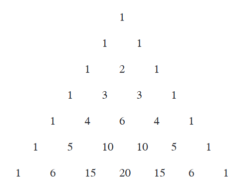

## The Binomial Theorem
**Theorem 4.1** [二项式定理(`Binomial Theorem`)] 对于所有非负整数$n$有
$$(x+y)^n=\sum_{k=0}^n\begin{pmatrix}
n\\k
\end{pmatrix}x^ky^{n-k}$$
**Proof.** 略。

**Theorem 4.2.** 对于所有正整数$n$，二项式系数$\begin{pmatrix}n\\k\end{pmatrix}$的交替和为$0$。
$$\sum_{k=0}^n(-1)^k\cdot\begin{pmatrix}
n\\k
\end{pmatrix}=0$$
**Proof.** 令$x=-1,y=1$即可。

**Theorem 4.3.** 对于所有非负整数$n$和$k$，
$$\begin{pmatrix}
n\\k
\end{pmatrix}+\begin{pmatrix}
n\\k+1
\end{pmatrix}=\begin{pmatrix}
n+1\\k+1
\end{pmatrix}$$
**Proof.** 略。

**Theorem 4.4.** 对于所有非负整数$n$，
$$2^n=\sum_{k=0}^n\begin{pmatrix}
n\\k
\end{pmatrix}$$
**Proof.** 左右两边都是$n$个元素的集合的子集个数。左边是直接计算；右边是得到$k$个元素的子集个数，再相加。  
**Proof 2.** 利用二项式定理，令$x=y=1$即可。

第一个方法是证明组合恒等式的经典方法：利用不同的方法来对同一些对象计数。

帕斯卡三角(`Pascal triangle`):  

**Theorem 4.5.** 对于所有非负整数$n$和$k$，
$$\begin{pmatrix}
k\\k
\end{pmatrix}+\begin{pmatrix}
k+1\\k
\end{pmatrix}+\begin{pmatrix}
k+2\\k
\end{pmatrix}+\cdots\begin{pmatrix}
n\\k
\end{pmatrix}=\begin{pmatrix}
n+1\\k+1
\end{pmatrix}$$
**Proof.** 右边是$n+1$个元素的集合的$k+1$个元素的子集的个数。左边也是计算子集的个数，但是是分成了$n-k+1$个部分，左边第一项是最大的元素是$k+1$的子集个数，第二项是最大元素是$k+2$的子集个数，$\begin{pmatrix}k+i\\k\end{pmatrix}$是$n+1$个元素的集合的最大值是$k+i+1$的$k+1$个元素的子集个数，其中$i\leq n-k$。  
这个定理也意味着我们从帕斯卡三角的第$k$行的最右的元素开始，然后往左下前进，到某个元素终止。路径上的元素之和等于终止元素的下一行右边那个元素。

**Theorem 4.6.** 对于所有非负整数$n$，
$$\sum_{k=1}^nk\begin{pmatrix}
n\\k
\end{pmatrix}=n2^{n-1}$$
**Proof.** 公式两边都是在从$n$个人中选择一个委员会，并选举一个主席。左边的思路是先选择$k$个人组成委员会，再从$k$个人中选择一个当选主席；右边的思路是先从$n$个人中选出一个主席，再从$n-1$个人中选出一些人和主席组成委员会。  
**Proof 2.** 利用二项式定理，令$y=1$
$$(x+1)^n=\sum_{k=0}^n\begin{pmatrix}
n\\k
\end{pmatrix}x^k$$
对$x$求导
$$n(x+1)^{n-1}=\sum_{k=1}^nk\begin{pmatrix}
n\\k
\end{pmatrix}x^{k-1}$$
再令$x=1$即可。

**Theorem 4.7.** [范德蒙恒等式(`Vandermonde's identity`)] 对所有正整数$n,m,k$，
$$\begin{pmatrix}
n+m\\k
\end{pmatrix}=\sum_{i=0}^k\begin{pmatrix}
n\\i
\end{pmatrix}\begin{pmatrix}
m\\k-i
\end{pmatrix}$$
**Proof.** 公式的左边是$n+m$个元素集合的有$k$个元素子集的个数。右边是分两步进行，先从前$n$个元素中选择$i$个，有$\begin{pmatrix}n\\i\end{pmatrix}$种不同的方式，再从后$m$个元素中选择$k-i$个，有$\begin{pmatrix}m\\k-i\end{pmatrix}$种不同的方式，最后对不同的$i$求和。

观察帕斯卡三角的每一行，都是先增加再减少，下面两个定理说明了这一点。

**Theorem 4.8.** 对于所有非负整数$k$和$n$，其中$k\leq\frac{n-1}{2}$，有
$$\begin{pmatrix}
n\\k
\end{pmatrix}\leq\begin{pmatrix}
n\\k+1
\end{pmatrix}$$
当且仅当$n=2k+1$时等号成立。  
**Proof.** 将不等式展开
$$\frac{n!}{k!(n-k)!}\leq\frac{n!}{(k+1)!(n-k-1)!}$$
化简
$$\frac{1}{n-k}\leq\frac{1}{k+1}$$
$$n-k\geq k+1$$
$$2k+1\leq n$$
$$k\leq\frac{n-1}{2}$$

**Corollary 4.9.** 对于所有正整数$k$和$n$，其中$k\geq\frac{n-1}{2}$，有
$$\begin{pmatrix}
n\\k
\end{pmatrix}\geq\begin{pmatrix}
n\\k+1
\end{pmatrix}$$
当且仅当$n=2k+1$时等号成立。  
**Proof.** 略。

一个序列先递增再递减，被称之为单峰(`unimodal`)序列。对于实数序列$a_0,a_2\cdots a_n$，存在一$m$，使得$a_0\leq a_1\leq\cdots\leq a_m$且$a_m\geq\cdots\geq a_n$。

## The Multinomial Theorem
**Example 4.10.** 求证
$$(x+y+z)^3=x^3+y^3+z^3+3x^2y+3x^2z+3y^2x+3y^2z+3z^2x+3z^2y+6xyz$$
**Proof** 略。

**Definition 4.11.** $n=\sum_{i=1}^k a_i$，其中$a_1,a_2,\cdots a_k$是非负整数
$$\begin{pmatrix}
n\\a_1,a_2,\cdots a_k
\end{pmatrix}=\frac{n!}{a_1!\cdot a_2!\cdots a_k!}$$
$\begin{pmatrix}n\\a_1,a_2,\cdots a_k\end{pmatrix}$称之为多项式系数(`multinomial coefficients`)。

**Theorem 4.12** [多项式理论(`Multinomial theorem`)] 对所有非负整数$n$和$k$，有
$$(x_1+x_2+\cdots +x_k)^n=\sum_{a_1,a_2,\cdots a_k} \begin{pmatrix}
n\\a_1,a_2,\cdots a_k
\end{pmatrix} x_1^{a_1}x_2^{a_2}\cdots x_k^{a_k}$$
其中$k$元非负整数$a_1,a_2,\cdots a_k$满足$n=\sum_{i=1}^k a_i$。  
**Proof.** Hint: Theorem 3.5

**Theorem 4.13.** 对于所有非负整数$n$和$a_1,a_2,\cdots,a_k$，其中$n=\sum_{i=1}^k a_i$，有
$$\begin{pmatrix}
n\\a_1,a_2,\cdots,a_k
\end{pmatrix}=\begin{pmatrix}
n\\a_1
\end{pmatrix}\begin{pmatrix}
n-a_1\\a_2
\end{pmatrix}\cdots\begin{pmatrix}
n-a_1-a_2-\cdots -a_i\\a_{i+1}
\end{pmatrix}\cdots\begin{pmatrix}
n-a_1-a_2-\cdots - a_{k-1}\\a_k
\end{pmatrix}$$
**Proof** 略。

## When the Exponent Is Not a Positive Integer
当$m$不是正整数时，$(1 +x)^m$是多少呢？首先给出$m$是任意实数时二项式系数$\begin{pmatrix}m\\k\end{pmatrix}$的定义。  
**Definition 4.14.** 对于任意实数$m$和非负整数$k$，$\begin{pmatrix} m\\0 \end{pmatrix}=1$，$k>0$时有
$$\begin{pmatrix}
m\\k
\end{pmatrix}=\frac{m(m-1)\cdots(m-k+1)}{k!}$$
这个定义扩大了$m$的域。

利用$(1+x)^m$在$x=0$附近的泰勒级数(`Taylor series`)，其$n$阶导为$\frac{m!}{(m-n)!}(1+x)^{m-n}$，可以得到下面定理：  
**Theorem 4.15** $m$为任意实数，有
$$(1+x)^m=\sum_{n\geq 0}\begin{pmatrix}
m\\n
\end{pmatrix}x^n$$
如果$m$不是整数，那么$(1+x)^m$是无穷级数。

**Example 4.16.** 求$\sqrt{1-4x}$的幂级数。  
**Solution.** 根据定理4.15，
$$\sqrt{1-4x}=(1-4x)^{1/2}=\sum_{n\geq 0}\begin{pmatrix}
1/2\\n
\end{pmatrix}(-4x)^n$$
为了简化这个表达式，我们需要简化$\begin{pmatrix}1/2\\n\end{pmatrix}$。$\begin{pmatrix}1/2\\0\end{pmatrix}=1$，$\begin{pmatrix}1/2\\1\end{pmatrix}=1/2$，当$n\geq 2$时，
$$\begin{pmatrix}
1/2\\n
\end{pmatrix}=\frac{\frac{1}{2}\cdot\frac{-1}{2}\cdot\frac{-3}{2}\cdots\frac{-2n+3}{2}}{n!}=(-1)^{n-1}\frac{(2n-3)!!}{2^n\cdot n!}$$
$(2n-3)!!$表示从$1$到$2n-3$所有奇数之积，称之为$2n-3$的半阶乘或双阶乘(`semifactorial` or `double factorial`)。  
代入上式得到
$$\sqrt{1-4x}=1-2x-\sum_{n\geq 2}\frac{2^n\cdot(2n-3)!!}{n!}x^n$$
对$\frac{2^n\cdot(2n-3)!!}{n!}$的分子分母同乘$(n-1)!$，那么$2^{n-1}(n-1)!$就等于从$2$到$2n-2$所有偶数的乘积。所以
$$\frac{2^n\cdot(2n-3)!!}{n!}=2\frac{(2n-2)!}{n!(n-1)!}$$
$$\sqrt{1-4x}=1-2x-\frac{2}{n}\sum_{n\geq 2}\begin{pmatrix}
2n-2\\n-1
\end{pmatrix}x^n$$

## Exercises
(2) 在凸八边形内种13棵数，然后将各点和各个树连接起来，问有多少个三角形？如果在边上多种5棵数呢？  
**Solution.** 我们通过角度来推算三角形的个数。八边形内角和是$180\degree *(8-2)=1080\degree$，13棵树，每棵树一个圆周角，$360\degree *360=4680\degree$，所以若干个三角形内角和是$5760\degree$，所以有$5760\degree/180\degree=32$个三角形。  
如果边上多种五棵树，那么内角和增加了$180\degree *5$，刚好增加了五个三角形，共37个三角形。

(5) 证明对所有整数$0\leq k \leq n-1$，
$$\sum_{j=0}^k\begin{pmatrix}
n\\j
\end{pmatrix}=\sum_{j=0}^k\begin{pmatrix}
n-1-j\\k-j
\end{pmatrix}2^j$$
**Solution.** 左边长度为$n$的0-1序列最多有$k$个1的组合方式。  
右边比较复杂。如果我们能找到$n-k$个0，那么最多只有$k$个1。$k \leq n-1$告诉我们至少有一个0，假设这个0在$n-j$的位置上，其左边有$n-k-1$个零，有$\begin{pmatrix}n-j-1\\n-k-1\end{pmatrix}=\begin{pmatrix}n-1-j\\k-j\end{pmatrix}$种取法，右边$j$个0-1序列不管是多少个零都没有关系了，有$2^j$种可能性。

(7) 有$n$个石头，将其分成两堆，令$p_1$是两堆石头数量的乘积，对每堆石头做重复的操作，令$p_2$是第二次分成两堆石头数量的乘积，以此类推，直至每堆石头都只有一个为止，显然这需要$n-1$步。求$p_1+p_2+\cdots+p_{n-1}$的最大值和最小值。  
**Solution.** 考虑极端情况，每次都取出一个石头单独一堆，那么$p_1=n-1, p_2=n-2,\cdots,p_{n-1}=1$，所以
$$p_1+p_2+\cdots+p_{n-1}=\frac{n(n-1)}{2}=\begin{pmatrix}
n\\2
\end{pmatrix}$$
下面我们证明当$n\geq 2$时，其和都是$\begin{pmatrix}n\\2\end{pmatrix}$。$n=2$时明显成立，假设小于$n$时该命题都成立，现在考察$n$，我们将其分成任意$k$和$n-k$两堆，其乘积是$k(n-k)$，那么总和为
$$k(n-k)+\begin{pmatrix}
k\\2
\end{pmatrix}+\begin{pmatrix}
n-k\\2
\end{pmatrix}=\frac{n(n-1)}{2}=\begin{pmatrix}
n\\2
\end{pmatrix}$$

(8) 证明任意正整数$n$的$4k+1$形式的因数至少和形式为$4k-1$的因数一样多。  
**Solution.** 所有奇数的质因数，其形式要么是$4k+1$，要么是$4k-1$，分别用$a_1,a_2,\cdots,a_m$和$b_1,b_2,\cdots,b_p$
$$n=2^t\cdot a_1^{x_1}\cdots a_m^{x_m}\cdot b_1^{y_1}\cdots b_p^{y_p}$$
$n$的$4k-1$形式的因数一定是一个$4k-1$形式的质数乘以某个倍数；两个$4k-1$形式的质数相乘得到的是$4k+1$形式的因数。  
现在我们来构造从形式为$4k-1$的因数到$4k+1$形式的因数的映射。  
假设$q$是形式为$4k-1$的因数
$$q=a_1^{c_1}\cdots a_m^{c_m}\cdot b_1^{d_1}\cdots b_p^{d_p}$$
其中$c_i\leq x_i, d_i\leq y_i$，且$d_i$之和是奇数。
假设存在$y_i$为奇数，比如$y_1$，我们构造
$$f(q)=a_1^{c_1}\cdots a_m^{c_m}\cdot b_1^{y_1-d_1}\cdots b_p^{d_p}$$
只有$b_1$的奇偶性发生了变化，那么$b_1$的指数之和是偶数，那么$f(q)$是形式为$4k+1$的因数。  
如果$y_i$都是偶数，那么找到第一个$i$，$d_i<y_i$，一定有这么一个$i$，否则$d_i$之和就是偶数，那么$q$的形式就不是$4k-1$了。我们构造
$$g(q)=a_1^{c_1}\cdots a_m^{c_m}\cdot b_1^{d_1}\cdots b_i^{y_i-1-d_i}\cdots b_p^{d_p}$$
是形式为$4k+1$的因数。

(24) 只能向右向上的走田字格，从$(0,0)$到$(n,n)$，且不越过对角线$x=y$的走法共有$\begin{pmatrix}2n\\n\end{pmatrix}-\begin{pmatrix}2n\\n-1\end{pmatrix}=\begin{pmatrix}2n\\n\end{pmatrix}/(n+1)$。  
**Solution.** 从$(0,0)$到$(n,n)$，一共有$\begin{pmatrix}2n\\n\end{pmatrix}$种走法。如果碰到了$y=x+1$，那就不符合题意了，那么一共有多少种不合题意的走法呢？  
设某种不符合题意的走法为$p$，第一个在直线$y=x+1$的点为$P(x,x+1)$，这一段记作$p_s$。考察点$(-1,1)$到点$P$，一个$x+1,x$的矩形，将$p_s$对称的对应到某个点$(-1,1)$到点$P$的路径$p_s'$，那么$p_s$和$p_s'$一一对应，如果将路径$p$的点$P$到点$(n,n)$那一段接到$p_s'$的后面，那么不符合题意的路径和点$(-1,1)$到点$(n,n)$一一对应，而后者共有$\begin{pmatrix}2n\\n-1\end{pmatrix}$种走法。

(48) 令$n=4k$且$k\geq 0$，求证
$$\sum_{i=0}^{2k}\begin{pmatrix}
n\\2i
\end{pmatrix}(-1)^i=2^{2k}(-1)^k$$
> 准备在Mathematics Stack Exchange上面提问，敲完公式自动排配到一个链接，已经有人问且有大神[回答了](https://math.stackexchange.com/questions/533978/given-n-4k-prove-that-sum-i-02k-binomn2i-1i-22k-1k)，个人觉得RobPratt比较容易懂，复制下来以供参考。

**Solution.** Let $i=\sqrt{-1}$, and note that $(1+i)^4=(1-i)^4=-4$. Also, for $j \ge 0$, we have
$$\frac{1+(-1)^j}{2} = \begin{cases}1 &\text{if $2|j$}\\0 &\text{otherwise}\end{cases}$$
Then
$$\begin{aligned}
\sum_{j\ge 0}\binom{4k}{2j}(-1)^j
&=\sum_{j\ge 0}\binom{4k}{2j}i^{2j} \\
&=\sum_{j\ge 0}\frac{1+(-1)^j}{2}\binom{4k}{j}i^{j} \\
&=\frac{1}{2}\sum_{j\ge 0}\binom{4k}{j}i^{j} + \frac{1}{2}\sum_{j\ge 0}\binom{4k}{j}(-i)^{j} \\
&=\frac{1}{2}(1+i)^{4k} + \frac{1}{2}(1-i)^{4k} \\
&=\frac{1}{2}(-4)^k + \frac{1}{2}(-4)^k \\
&=(-4)^k \\
&=2^{2k}(-1)^k
\end{aligned}$$

(49) $n=3k$，证明
$$\lim_{n\to \infty}\frac{\sum_{i=0}^k\begin{pmatrix}
n\\3i
\end{pmatrix}}{2^n}=\frac{1}{3}$$
> 贴大神的[回答](https://math.stackexchange.com/questions/2200539/show-that-lim-n-rightarrow-infty-frac-sigma-i-0k-binomn3i2n)

(53) $(\sqrt{3}+\sqrt{2})^{2002}$小数点后第一个数字是几？  
**Solution.**
$$\begin{aligned}
&(\sqrt{3}+\sqrt{2})^{2002}+(\sqrt{3}-\sqrt{2})^{2002}\\
=&\sum_{i=0}^{2002}\begin{pmatrix}
2002\\i
\end{pmatrix}\sqrt{3}^i\sqrt{2}^{2002-i}+\sum_{i=0}^{2002}\begin{pmatrix}
2002\\i
\end{pmatrix}\sqrt{3}^i(-\sqrt{2})^{2002-i}\\
=&\sum_{i=0}^{2002}\begin{pmatrix}
2002\\i
\end{pmatrix}(\sqrt{3}^i\sqrt{2}^{2002-i})(1+(-1)^{2002-i})
\end{aligned}$$
如果$i$是奇数，$(1+(-1)^{2002-i})=0$  
如果$i$是偶数，$(\sqrt{3}^i\sqrt{2}^{2002-i})$是整数。  
所以$(\sqrt{3}+\sqrt{2})^{2002}+(\sqrt{3}-\sqrt{2})^{2002}$是整数，由于$\sqrt{3}-\sqrt{2}<1/2$，所以其2002次方远远小于0，那么$(\sqrt{3}+\sqrt{2})^{2002}$的小数点后面有数百个9。
