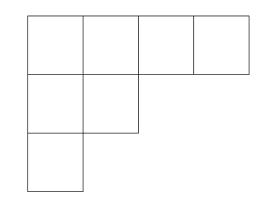
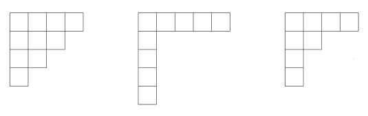
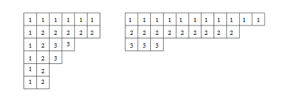
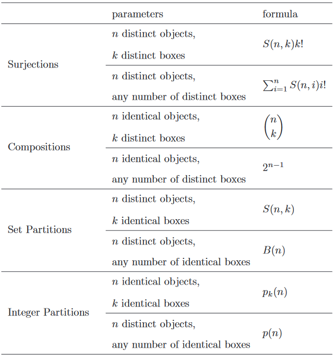
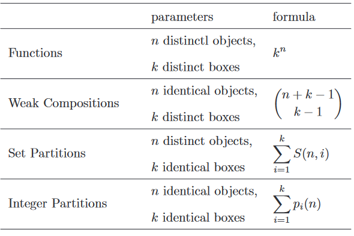

## Compositions
将20个一模一样的小球分给四个小朋友，有多少种分发呢？顺序很重要，比如$1 + 6 + 8 + 5$和$6 + 1 + 8 + 5$是两种，因为前者第一个小朋友有1个球而后者第一个小朋友有6个！

**Definition 5.1.** 一个序列$(a_1,a_2,\cdots,a_k)$，对于所有的$i$，$a_i\geq0$，满足$(a_1+a_2+\cdots+a_k)=n$，称之为$n$的弱composition(`weak composition`)。如果$a_i>0$，则称之为$n$的composition。  
> 不确定composition对应的中文翻译，故用英文代替。

**Theorem 5.2.** 对于正整数$n$和$k$，分为$k$部分的弱composition的数量是
$$\begin{pmatrix}
n+k-1\\k-1
\end{pmatrix}=\begin{pmatrix}
n+k-1\\n
\end{pmatrix}$$
**Proof.** 该问题其实就是将$n$个球放到$k$个盒子中，等价于用$k-1$个隔板将$n$个球分开。将$n$个球和$k-1$个隔板拍成一行，**Theorem 3.5**告诉我们共有
$$\frac{(n+k-1)!}{n!(k-1)!}$$
种不同的排列方式。

如果要求每个小孩至少一个呢？先每人分一个，然后问题就转化为了已知问题。  
**Corollary 5.3.** 对于正整数$n$和$k$，分为$k$部分的composition的数量是
$$\begin{pmatrix}
n-1\\k-1
\end{pmatrix}$$

将$n$分成任意多的部分，那么所有的composition数是多少呢？明显地，每个部分不能是0个，也就是说不是弱composition，因为如果可以为0，那么个数就是无穷多，因为可以向每个composition $C$构成一个新的composition。  
**Corollary 5.4** 对于正整数$n$，其所有composition的个数是$2^{n-1}$。  
**Proof.** 任意部分从1开始一直到$n$，所以
$$\sum_{i=1}^n\begin{pmatrix}
n-1\\i-1
\end{pmatrix}=\sum_{i=0}^{n-1}\begin{pmatrix}
n-1\\i
\end{pmatrix}=2^{n-1}$$
**Proof 2.** 使用递归法来证明。$n=1$时，只有一种组合方式。假设$n$时命题成立，我们考虑$n+1$时即可。对于$n$的每个composition$C$，我们将多出来的一个1分两类处理。1）加到$C$的第一个值上，那么有$2^{n-1}$个，2）放到$C$的第一个值的前面，和1）里面的肯定不同，因为1）里面第一个值至少为2，又有$2^{n-1}$个，共计$2^{n}$个不同的composition。

## Set Partitions
我们现在考虑球不一样但是盒子是一样的，也就是将集合$[n]$分配到$k$个非空的盒子中。

**Definition 5.5.** 集合$[n]$的分割(`partition`)是将每个元素唯一的分配到一个非空块(`block`)的集合。  
我们将集合$[n]$分配到$k$个非空的块中表示为$S(n,k)$，其称之为第二类斯特朗数(`Stirling numbers of the secondkind`)。  
如果$n<k$，那么$S(n,k)=0$。我们约定$S(0,0)=1$，下一章会解释为什么。

**Example 5.6.** $n\geq 1$时，$S(n,1) =S(n, n)=1$。$n\geq 2$时，$S(n,n-1)=\begin{pmatrix}n\\2\end{pmatrix}$，任选两个组成一块，其余每个元素自成一块。

**Example 5.7.** 集合$[4]$有七种分成两个非空块的分割：
$$\{1,2,3\}\{4\}\\\{1,2,4\}\{3\}\\\{1,3,4\}\{2\}\\\{2,3,4\}\{1\}\\\{1,2\}\{3,4\}\\\{1,3\}\{2,4\}\\\{1,4\}\{2,3\}$$
所以$S(4,2)=7$。

第一类斯特林数呢？第六章会讲解。  
有通项公式吗？第七章会给出一个包含求和记号的公式。

**Theorem 5.8.** 对于所有的正整数$k\leq n$，有
$$S(n,k)=S(n-1,k-1)+k\cdot S(n-1,k)$$
**Proof.** 如果第$n$个元素自成一块，那么剩下的问题就是将$[n-1]$分成$k-1$块，即右边的第一项；如果第$n$个元素混杂在$k$块中，那么先将$[n-1]$分成$k$块，即$S(n-1,k)$，任选一块，有$k$种选法。

如果将$n$个不同的球分到$k$个不同的盒子里面，共有$k!\cdot S(n,k)$种分法。

**Corollary 5.9.** 所有$[n]\to[k]$上的满射函数$f$的数量是$k!\cdot S(n,k)$  
**Proof.** 略。

**Corollary 5.10.** 对于所有的实数$x$和非负整数$n$，有
$$x^n=\sum_{k=0}^nS(n,k)(x)_k$$
**Proof.** 等式两边是$x$的$n$阶多项式，所以我们如果能够证明多于$n$个的$x$值都成立，那么上述等式成立。我们证明一个更强的命题，对于所有的正整数$x$其都成立。
> 上面这段初看时我有两点不懂，这里是[我的提问和大神的回答](https://math.stackexchange.com/questions/3731157/why-is-it-stronger-statement-for-all-positive-integers-x-but-x-is-real-numb)。

左边是所有$[n]\to[x]$的函数的个数，注意，不必是满射；右边是对于$[x]\to[k]$上函数个数求和，先选出$k$个数，$\begin{pmatrix}x\\k\end{pmatrix}$，根据Corollary 5.9.，函数个数是$k!\cdot S(n,k)$，其积是$k!\cdot S(n,k)\begin{pmatrix}x\\k\end{pmatrix}$，$(x)_k=\begin{pmatrix}x\\k\end{pmatrix}\cdot k!$

**Definition 5.11.** 集合$[n]$的所有分割的个数（不限定块的大小）记作$B(n)$，称之为第$n$贝尔数($n$`th Bell number`)，习惯上$B(0)=1$。  
所以$B(n)=\sum_{i=0}^nS(n,i)$，同时它也满足一个优雅的递归关系。

**Theorem 5.12.** 对于所有非负整数$n$，有
$$B(n+1)=\sum_{i=0}^n\begin{pmatrix}
n\\i
\end{pmatrix}B(i)$$
**Proof.** 左边是集合$[n+1]$所有分割的个数。假设第$n+1$元素所在块的大小是$n-i+1$，也就是有$i$个元素不在这个块。有$\begin{pmatrix}n\\i\end{pmatrix}$种方式取出这$i$个数，然后有$B(i)$个分割数，对所有可能的$i$求和。

## Integer Partitions
现在我们分析球和盒子都一样的情况。

**Definition 5.13.** $a_1\ge a_2\ge \cdots \ge a_k\ge 1$都是整数且$a_1+a_2+\cdots +a_k=n$，序列$(a_1,a_2,\cdots, a_k)$是整数$n$的分割(`partition`)。整数$n$的所有分割的数目用$p(n)$表示，精确的分成$k$个部分用$p_k(n)$表示。  
和**Definition 5.5.** 一样使用了同一个词分割(`partition`)，通过上下文我们能够区分两者，一个是集合$[n]$的分割，一个是整数$n$的分割。

**Example 5.14.** 正整数5有7个分割，分别是$(5); (4,1); (3,2); (3,1,1); (2,2,1); (2,1,1,1); (1,1,1,1,1)$。因此$p(5) = 7$.

找到$p(n)$的公式是很困难的事情。即使我们知道所有的$p(i), i< n$，也不能直接计算出$p(n)$。$p(n)$有一个近似值如下
$$p(n)\sim \frac{1}{4\sqrt{3}}e^{\pi \sqrt{\frac{2n}{3}}}$$
$p(n)$比任何多项式增长都快，但是比任何指数函数$g(n)=c^n,c>1$都慢。

到第八章之前，我们不会讨论太多有用的结果，下面主要集中讨论分区的图形表示。  
一个分割$p=(x_1,x_2,\cdots,x_k)$的Ferrers(`Norman Macleod Ferrers`) shape是一个边长为$n$的正方形，第$i$行有$x_i$个盒子。下图是$p=(4,2,1)$的分割。很明显，Ferrers shape和$n$的分割一一对应。  

将图形延对角线反转得到另外一个图形，表示的是分割$p$的共轭(`conjugate`)。比如$(4,2,1)$和$(3,2,1,1)$共轭。原图形的第$i$行是共轭图形的第$i$列。

**Definition 5.15.** 如果$n$的一个分割和其共轭相同，称之为自共轭(`self-conjugate`)。

**Example 5.16.** 分割$(4,3,2,1)$，$(5,1,1,1,1)$和$(4,2,1,1)$都是自共轭的。  

Example 5.14 告诉我们整数5的分割中，最多分成两部分的有三种，同时，每堆最多2个的分割也有三种。

**Theorem 5.17.** 将$n$最多分成$k$部分的分割数等于每堆数量不大于$k$的分割数。  
**Proof.** 前者对应的是Ferrers shape最多有$k$行的图，而后者对应那些最多有$k$列的图，根据共轭，我们可以将两者一一映射。

**Theorem 5.18.** $n$分成不同的奇数部分的分割数等于其共轭的分割数。  
**Proof.** 在两者之间建立双射。  
取任意一个共轭分割$\pi=(\pi_1,\pi_2,\cdots,\pi_t)$，我们移除图形的第一列和第一行，共计$2\pi_1-1$个，接着移除新的第一列和第一行，共计$2\pi_2-3$个，以此类推。我们得到了$f(\pi)=(2\pi_1-1,2\pi_2-3,\cdots,2\pi_i-(2i-1),\cdots)$。每一块都是奇数，且因为$\pi_1\ge \pi_2\ge \cdots\ge \pi_t$，所以每一块的数量都不同。一个块$b$下方和右侧的块被称为`hook`，使用这个术语来描述的话就是每次都移除了左上角的`hook`。  
任意一个全都是奇数且均不相同的分割$\alpha=(2a_1-1,2a_2-3,\cdots,2a_u-(2u-1))$，第一行和第一列有$a_1$个块，第二行和第二列$a_2$个块，依次类推，组成了一个自共轭的分割。

**Example 5.19.** $\pi=(6,6,4,3,2,2)$，有$f(\pi)=(11,9,3)$。下图展示了两者的对应，其中的数字表示第$i$步移除的块。  

**Theorem 5.20.** $q(n)$表示$n$的每块至少为2的分割数，对于所有的正整数$n\le 2$，有$q(n)=p(n)-p(n-1)$。  
**Proof.** 我们需要构造$n-1$的所有分割和有一个块为1的$n$的分割的双射。其实很简单，对于$n-1$的每个分割，后面增加一个块，其数量为1，构成了一个有一个块为1的$n$的分割。

下面我们分析下集合$[n]$的分割和正整数$n$的分割的关系。$\pi=(\pi_1,\pi_2,\cdots,\pi_k)$是集合$[n]$的一个分割，我们将其大小$|\pi_1|,|\pi_2|,\cdots,|\pi_k|$按非递增序排列得到$a_1\ge a_2\ge \cdots\ge a_k$，序列$a=(a_1,a_2,\cdots,a_k)$是正整数$n$的一个分割。我们称$a$是集合分割$\pi$的类型。

**Example 5.21.** 集合分割$\{1,5,6\},\{2,7\},\{3,9\},\{4,8\},\{10\}$是类型$(3,2,2,2,1)$的一个分割。

**Theorem 5.22.** $a=(a_1,a_2,\cdots,a_k)$是正整数$n$的一个分割，$m_i$是$i$在$a$中出现的次数，那么集合$[n]$中属于类型$a$的分割数是
$$P_a=\frac{\begin{pmatrix}
n\\a_1,a_2,\cdots,a_k
\end{pmatrix}}{\prod_{i\ge 1}m_i!}$$
**Proof.** 取$a_i$个颜色为$i$的小球，共$n$个，排成一列，共$\begin{pmatrix}n\\a_1,a_2,\cdots,a_k\end{pmatrix}$中排法。$i$和$j$在同一块，当且仅当二者是相同的颜色。这些分割显然属于类型$a$。  
不过我们重复计算了很多。比如$a_1=a_2$，有$a_1$个颜色为1的球在子集$A$对应的位置上，有同样多个颜色为2的球在子集$B$对应的位置上，这是一种分割，相反，$a_1$个颜色为2的球在子集$A$对应的位置上和同样多个颜色为1的球在子集$B$对应的位置上也是一种分割，但是这两种本质上是一种。一般地，$i$在$a$中出现了$m_i$次，我们重复计算了$m_i!$次，所有结果要除以$\prod_{i\ge 1}m_i!$。

下面是本章的总结。  
如果盒子不能是空的：  
  
> $n$个一样的物体，$k$个不同的盒子，对应的公式应该是$\begin{pmatrix}
n-1\\k-1
\end{pmatrix}$

如果盒子能空，那么我们要说明盒子的数量，否则可以通过无限添加空盒子来增加分割数量。  

**Note**
本章讨论的很多问题不仅吸引研究组合的人，也吸引很多研究数论的人。比如形如$k(3k-1)/2$的五角形数(`pentagonal numbe`)，$k$是任意整数。前几个数是$0,1,2,5,7,12$。对于正整数$n$，有
$$p(n)=p(n-1)+p(n-2)-p(n-5)-p(n-7)+\cdots$$
第$i$项的符号是$(-1)^{\lfloor i/2\rfloor}$，绝对值是$p(n-k_i$)。  
欧拉也有一个关于五角形数的定理，是说如果$n$不是五角形数，将其分成奇数个各不相同的块的分割数和将其分成偶数个各不相同的块的分割数相同；若$n$是五角形数，则两者差一。比如6不是五角形数，其奇数个各不相同的块分割是6和3+2+1，其偶数个各不相同的块分割是5+1和4+2，两则相同。

## Exercises
(1) 求$S(n,3)$
**Solution.** 函数$f:[n]\to[3]$有$3^n$个，其中都映射到同一个值的函数有3个，现在求有多少个映射到其中两个值。  
根据**Corollary 5.9.**，其个数是$3!\cdot S(n,2)$，现在我们需要求$S(n,2)$。  
$$\begin{aligned}
S(n,2)&=S(n-1,1)+2\cdot S(n-1,2)\\
&=1+2\cdot [S(n-2,1)+2\cdot S(n-2,2)]\\
&=1+2+4\cdot S(n-2,2)\\
&=1+2+4+8+\cdots +2^{n-2}\cdot S(2,2)\\
&=1+2+4+\cdots +2^{n-2}\\
&=2^{n-1}-1
\end{aligned}$$
所以$f:[n]\to[3]$满射有$3^n-3!\cdot (2^{n-1}-1)-3$个，进而
$$\begin{aligned}
S(n,3)&=\frac{3^n-3!\cdot (2^{n-1}-1)-3}{3!}\\
&=\frac{3^{n-1}-2^n+2-1}{2}\\
&=\frac{3^{n-1}-1}{2}-2^{n-1}
\end{aligned}$$

(9) $k$是正整数，$q$是非负整数且$q<k$，令$p_{k,q}(r)=p_k(rk+q)$，证明$p_{k,q}(r)$是$r$的多项式函数。  
**Solution.** 我们用归纳法证明一个更强的命题，$p_{k,q}(r)$是$k-1$次多项式。$k=1$，$p_{k,q}(r)=p_1(r+q)=1$，显然成立。  
将$rk+q$分成$k$部分，如果每个部分减去1，等价于$(r-1)k+1$分成至多$k$部分。因此
$$p_{k,q}(r)=p_{k,q}(r-1)+p_{k-1,q}(r-1)+\cdots+p_{0,q}(r-1)$$
移项得
$$p_{k,q}(r)-p_{k,q}(r-1)=\sum_{i=0}^{k-1}p_{i,q}(r-1)$$
右边幂次最高是$k-2$，所以右边是$k-2$次多项式。  
有个定理是说$f(n)$是$n$次多项式当且仅当$g(n)=f(n)-f(n-1)$是$n-1$次多项式。根据这个定理，可以得到$p_{k,q}(r)$是$k-1$次多项式。

(32) 求证对所有正整数$n$有$p(n)^2<p(n^2+2n)$。  
> 参考了[这个回答](https://math.stackexchange.com/questions/506636/proving-an-inequality-involving-integer-partitions)

**Solution.** 使用文中描述的Ferrers shape来帮助证明。先放$n\times n$个块，然后取两个$n$的分割，一个放在其右边，一个放在其下边，那么得到了$n^2+2n$的分割。这样建立了$p(n)^2$和盒子数大于$n$且前$n$个盒子的球的数量大于等于$n$的$n^2+2n$的分割的映射关系，显然$p(n^2+2n)$比后者大。

(36) - (39)
> 想了半个多小时，基本思路就是利用**Corollary 5.4** **Proof 2**的分割思想。
