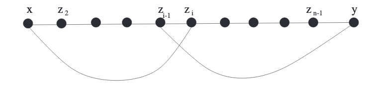
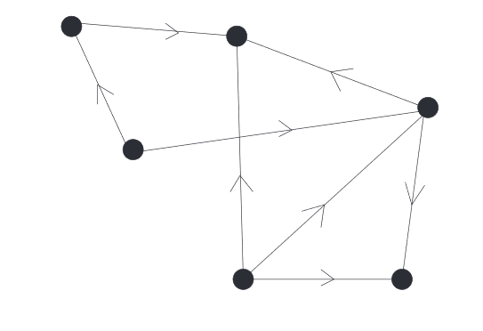
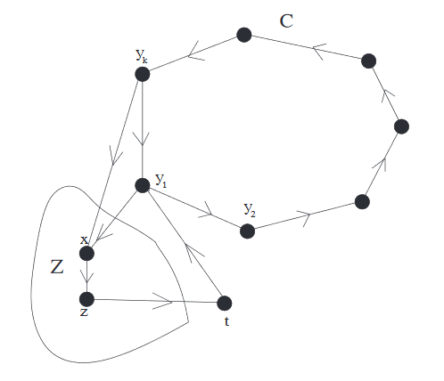
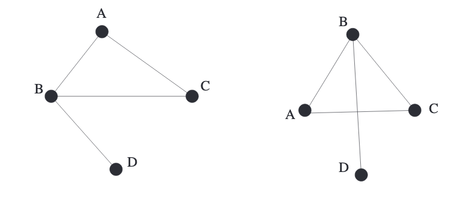
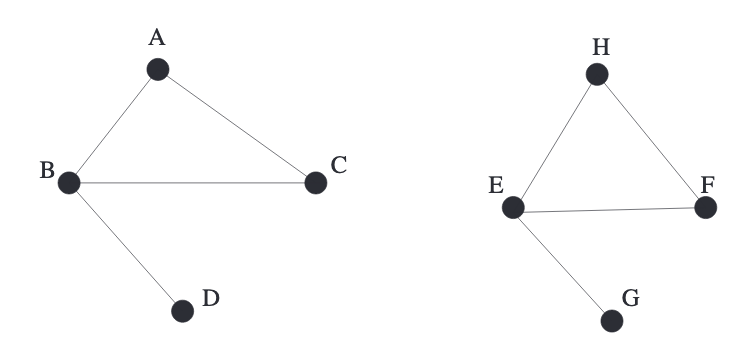
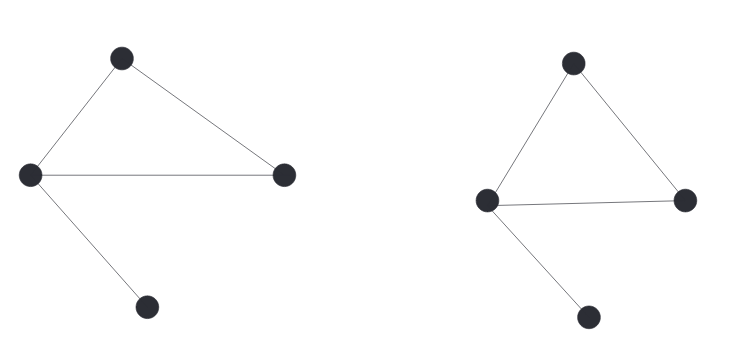

18世纪，柯尼斯堡市由一些岛组成，Pregel河的两个支流在那里汇合。如下图所示，七个桥连接着各个岛。这个单纯的事实极大的增进了近几个世纪数学的发展。1736年，有史以来最富有创造性的数学家莱昂哈德 欧拉（`Leonhard Euler`）对下述问题很感兴趣。能否从某一个岛开始走过整个城镇回到该岛，且每个桥只经过一次。  

## The Notion of Graphs. Eulerian Trails
河流和岛的形状不会影响这个问题的答案。这个问题只和这些对象的连通性相关，也就是有哪些桥和这些桥连接了哪些岛。所以地图可以简化为下图  
  
线表示桥，点表示岛。进而欧拉的问题转化为能否从一点开始，一笔画出整个图且回到该点，每条线只画（经过）一次。  
像这样的有一些点和连接这些点的线组成的图形被称为图（`graph`）。这些点被称之为图的顶点（`vertices`），线被称之为图的边（`edges`）。本书只讨论有限个点和有限个边的图。连接到一个顶点$A$的边的数量被称之为$A$的度（`degree`）。  
这个简单的模型非常有用。图论是组合学的一部分，有许多各种不同的问题可以通过这个简单模型来解决。在这本书会阐述这些不同的问题。首先，介绍一些基本术语。  
在一个图中，多条边能够连接同一对点，或者一些边能从同一个点开始并结束。如果一个图$G$没有环，没有有多条边连接同一对点，那么这个图被称为简单图（`simple graph`）。  
如果能够沿着一系列不同的边$e_1,e_2,\cdots e_k$在图上连续的“走”，那么可以称之为轨迹（`trail`）。$e_i$的终点是$e_{i+1}$的起点。连续的“走”就是之前说的笔不拿起的情况下画出这些边。`walk`和`trail`类似，但是不要求边是不同的。  
如果起点和终点是同一个顶点，那么称$e_1,e_2,\cdots e_k$是闭合轨迹（`closed trail`）。如果一个`trail`使用了图的所有边，那么就是欧拉轨迹（`Eulerian trail`）。如果一个轨迹没有接触任意一个点两次，那么称它为路径（`path`）。  
如果把两个或多个图放到一次，合并起来还是称之为图。显然，这个图没有之前的各个图好，因为存在两个点，无法找到一个路径从一个点到另一个点。这是一个很重要的差别。

**Definition 9.1.** 如果一个图$G$的任意两个顶点$x,y$之间都有一条路径连接两者，那么$G$是连通图（`connected graph`）。

如果一个图$H$的点是图$G$的点的子集，边也是其边的子集，那么$H$是$G$的子图（`subgraph`）。进一步，如果$G$中的点对$(x,y)$在$H$中并且其对应边也在$H$中，那么$H$是$G$的导出子图（`induced subgraph`）。

如果$G$不是连通的，令$k$是组成$G$的连通图的个数的最小值，那么说$G$有$k$个连通分量（`connected component`）。如果有一条路径连接$u$和$v$，那么$u$和$v$在同一个连通分量。话句话说，这些连通分量是图$G$的最大连通子图。

**Theorem 9.2.** 一个连通图$G$有闭合欧拉轨迹等价于所有点的度都是偶数。  
**Proof** 假设有闭合欧拉轨迹$W$，令$A$是非起点外的一点，访问$A$点$a$次，意味着进入$A$点$a$次并且离开$A$点$a$次，$W$是轨迹，必须是不同的边，那么$A$点至少有$2a$条边。同时，$W$包含了$G$的所有的边，$A$不能再有其他边了，所有$A$点有$2a$条边。起点$S$同时也是终点，假设访问它$t$次，那么$S$有$1+2t+1$次。所以所有点的度都是偶数。  
下面从$G$的所有点的度都是偶数入手。从任意点$S$开始，沿着边$e_1$到点$A_1$，然后再沿着$A_1$的其他边$e_2$前往其他点，直到回到起点形成一个闭合轨迹$C_1$。因为度是偶数，所以到底一个点之后肯定有新的边离开，所以不会在某个点卡主。如果$C_1=G$，证毕。如果不是，选择$C_1$上的一点$V$，要求$C_1$不包含其所有相邻的边。  
为什么总能找到这个点呢？反证法。假设$C_1$包含了其轨迹上所有点的所有邻边，$C_1$的边比$G$少，那么$C_1$没有$G$的所有点，令其中一个是点$A$。由于$G$是连通图，$A$总是可以和$C_1$相通的。假设某条和$C_1$连通的路径和$C_1$的第一个交点是$V$，那么$V$在$C_1$里但是$C_1$没有包含其所有的边。下图说明了这种情况  
  
从$G$中删除$C_1$的所有边，剩余的图的所有点的度还是偶数。从$V$开始，构造闭合轨迹$C_2$。通过结合$C_1$和$C_2$，能构成一个新的闭合轨迹。从$C_1$的起点出发到达$V$，进入$C_2$，回到$V$之后再回到$C_1$的起点。如果新的轨迹$C_1 \cup C_2$是$G$，那么证毕。否则的话，重复上述过程。由于$G$是有限图，那么最终能找到一个闭合轨迹$C_1 \cup C_2 \cup \cdots \cup C_k$。

通过这个定理可知本章开始的七桥问题的答案是否。

如果我们放宽起点和终点必须是同一点的限制，会得到如下推论。  
**Corollary 9.3.** 图$G$是连通图，$G$有从$S$开始到另外一点$T$的闭合欧拉轨迹等价于$S,T$的度是奇数而其他点的度是偶数。  
**Proof**在$S$和$T$之间增加一条边，得到的新图满足**Theorem 9.2.**。

下面也是一个关于度的奇偶定理。  
**Theorem 9.4.** 在一个没有环的图$G$中，度为奇数的点的个数是偶数。  
**Proof** 设有$e$条边，$n$个顶点的度分别是$d_1, d_2, \cdots, d_n$，那么
$$d_1+d_2+\cdots+d_n=2e$$
度是偶数的顶点的个数没影响，那么度是奇数的顶点个数必须是偶数，才能保证等式成立。

## Hamiltonian Cycles
一条闭合轨迹除起点外不访问任意顶点两次，该轨迹被称为环（`cycle`）。这意味着一个有$k$个点的环有$k$条边。如果一个环包含所有顶点，被称为哈密顿环或哈密顿回路（`Hamiltonian cycle`），类似的，包含所有顶点的路径成为哈密顿路径（`Hamiltonian path`）。  
举一个和哈密顿环相关的例子。一个聚会有很多人坐在一个圆桌上，能保证每个人都和邻近的两个人认识吗？  
这个问题等价于构建一个图，每个人是顶点，如果两人任何，则有一条边连接这两个点。问题等价于哈密顿环是否存在。  
当然是否存在哈密顿环依赖于图本身。如果有人谁都不认识，显然不存在。如果没有这样的人，但是图不是连通图，那么也不存在哈密顿环。如果所有人都互相认识，很明显，哈密顿环是存在的。  
这些都非常特殊的例子。给定任意一个图，能快速判断是否存在哈密顿环吗？  
答案是不能。如果存在的话，很容易证明某个合适的排座方式；但是如果不存在的话，没有很快的方式来证明没有。这里很快的意思是多项式时间。遍历所有可能的情况复杂度是$(n-1)!$，但是这不是$n$的多项式函数。  
这个问题不仅在组合数学中很有意思，在理论计算科学（`Theoretical Computer Science`）领域也是一个很重要的议题，即复杂性理论（`Complexity Theory`）（本书第二十章会讨论）。哈密顿环问题等价于其他约5000个问题。等价的意思是如果找到了针对哈密顿环问题的多项式时间的解法，那么另外5000个问题也就解决了，反之亦然。这类问题被称为NP完全问题（`NP-complete problem`）。大多数科学家（不是所有）认为没有多项式时间算法来解决这些问题。  
下面讨论一下一些关于哈密顿环存在性的重要定理。

**Theorem 9.5.** 简单图$G$有$n, n\geq 3$个顶点，假设每个点的度至少是$n/2$，那么$G$有哈密顿环。  
**Proof.** 满足题设的$G$是连通图。反证法。假设$G$有多于一个连通分量，所以至少有一个通量的顶点小于等于$n/2$，那么该通量的点的度小于$n/2$。  
假设$G$没有哈密顿环，添加新的边但是始终不组成哈密顿环。结束的时候，新的图$G'$的每个顶点的度至少是$n/2$且没有哈密顿环，但是添加任意边都会形成一个哈密顿环。  
令$P$是$G'$中最长的路径，且包含所有的顶点。令$x,y$是$G'$中不相连的两个点，如果连接这两点，会形成一个哈密顿环。  
这个$P$是从$x$到$y$的路径$x=z_1,z_2,z_3,\cdots,z_{n-1},z_n=y$。顶点$x$和$y$一共至少有$n$个邻居。那么根据鸽巢原理，存在$2\leq i\leq n-1$，$xz_i$是一条边，且$yz_{i-1}$是一条边。（否则，两个点一共只能有$n-2$个邻居。）这就出现了一个哈密顿环，和假设矛盾。  

习题中也会有一些关于一个简单图的度是多大会存在哈密顿环的问题（结论）。

## Directed Graphs
前一节里面的图的边没有方向，可以沿着任意方向走。但是现实不是这样的，比如城市里面会有单行道。如果给图的每条边赋予方向，那么称之为有向图（`directed graph` or `digraph`）。如下所示：  
  
和前一节一个类似的问题是满足什么条件有向图有闭合欧拉轨迹。有向图中的轨迹要包含所有的边，同时要按照正确的方向走。路径和闭合轨迹是类似的定义。  
明显地，每个顶点有偶数条边这个条件已经不足够充分了。比如，一个点所有边都是进入该点的方向，那么这个图不包含欧拉轨迹。  
对于图$G$中的所有点$a,b$，都有一条路径从$a$到$b$，那么该图是强连通的（`strongly connected`）。一个点的入度（`in-degree`）是所有终点是该点的边的数量；同理，一个点的出度（`out-degree`）是所有起点是该点的边的数量。如果对于有向图$H$中每一个点$V$都有$indegree(V)=outdegree(V)$，那么该图被称为平衡的（`balanced`）。

**Theorem 9.6.** 一个有向图$G$有欧拉轨迹当且仅当它是平衡的且是强连通的。  
**Proof** 先看必要性。一个欧拉轨迹$W$离开每个点次数和进入该点的次数一样，所以$G$是平衡的。$W$也提供了一条轨迹，能够从任一点到另外一点，那么$G$是强连通的。  
对于充分性，和**The-orem 9.2**的证明类似。

对于无向图来说，如果任意两点之间都有一条边，那么称之为完全图（`complete`）。有$n$个点完全图有$\begin{pmatrix}n\\2\end{pmatrix}$条边。如果给每条边一个方向，那么这个有向图是竞赛图（`tournament`）。竞赛的来自单循环赛。$n$个人进行单循环赛，顶点就是每个人，边的方向表示两者之间的胜负关系。  
哈密顿路径和哈密顿环在有向图中也有类似的定义。对于完全无向图来说，很显然有哈密顿路径，但是对于相应的有向图而言就没有这么显然易见了。因为对于一个$n$个顶点的完全图，有$2^{\begin{pmatrix}n\\2\end{pmatrix}}$个竞赛图与之对应。下面的定理说明竞赛图也有哈密顿路径。  
**Theorem 9.7.** 所有的竞赛图都有哈密顿路径。  
**Proof** 递归法。只有1个或2个顶点，命题显然成立。假设对于所有有$n-1$个节点的竞赛图也成立。对于排除任意一点$V$，其他$n-1$个顶点组成的图是$T'$，那么$T'$有哈密顿路径$h=h_1h_2\cdots h_{n-1}$。问题转化为将点$V$插入到路径$h$里面。如果存在一个索引$i$有$h_iV$和$Vh_{i+1}$均有一条边，那么能将点$V$插入到路径$h$里面。  
如果这样的$i$不存在，那么一定存在一个索引$k,0\leq k\leq n-1$，对于所有$j\leq k$，$Vh_j$是一条边，对于所有$j>k$，$h_jV$有一条边。因此要么$Vh_1$是一条边，或者$h_{n-1}V$是一条边，所以可以将$V$插入到$h$的头或者尾。

哈密顿环是否存在呢？不一定，如果竞赛图有出度为0或者入度为0，那么其不会有哈密顿环的。下面的定理给出了什么样的竞赛图会有哈密顿环。  
**Theorem 9.8.** 一个竞赛图$T$有哈密顿环当且仅当它是强连通的。  
**Proof** 如果$T$有哈密顿环，那么这个提供了任意点对点的有向路径，所以是强连通的。  
假设$T$是强连通的。令$E(T)$表示$T$的边的集合。先证明$T$有环。反证法，假设没有，那么$xy\in E(T),yz\in E(T)$隐含$xz\in E(T)$，$T$是一个传递竞赛图（`transitive tournament`）。对于这样一个竞赛图，顶点可以从左往右有序排列使得$ij\in E(T)$当且仅当$j$是在$i$的右边。但是这样的路径意味着不能有环了，否则会破环传递性。所以$T$有环。  
  
令$C=y_1y_2\cdots y_k$是$T$最长的环并且不是哈密顿环。因为$T$是强连通的，那么一定存在一条边从$C$到某个不在$C$中的点$x$。不失一般性，令$y_1x$是一条边，如果$xy_2$是一条边，那么可以构成一个更长的环，所以$y_2x$是边。同理，$y_3x,y_4x,\cdots,y_kx$都是朝向$x$的边。如上图所示。  
令$Z$是满足$y_1z\in E(T)$的点的集合，那么对于所有$i\in [k],z\in Z$，有$y_iz\in E(T)$。由于$T$是强连通的，所以存在某条边$zt,z\in Z,t\notin Z$。$t\in C$和上一段假设矛盾，那么$t\notin C$。由于$t\notin Z$，所以$ty_1$是一条边。因此$zty_1y_2\cdots y_k$是更长的环。也矛盾。

## The Notion of Isomorphisms
怎样的两个图是相同的呢？有很多种方式来定义相同，下面讨论两种。  
  
上图中的两个图是一模一样的，因为对于任意一个点对$X,Y$，两者之间的边数都是相同的。  
实际上，图是怎么画的是无关紧要的。重要的是同样的点对之间的边数。  
按照这个标准，下图是不同的，因为左边的图有边$AB$，而右边没有。  
  
然而很容易发现这两个图也不是完全无关，去掉点上的标签，那么看起来就是一模一样的了。  
  
这两个图作为非标记图是一样的（`identical as unlabeled graphs`），换句话说，是同构的（`isomorphic`）。

**Definition 9.9.** 如果存在一个从图$G$的顶点到图$H$的顶点的双射$f$，使得$G$中的点$X,Y$之间的边数和$H$中的点$f(X),f(Y)$之间的边数相等，就称图$G$和$H$是同构的。双射$f$称为同构（`isomorphism`）。  
**Example 9.10.** 前面图中的映射$f，f(A)=H,f(B)=E,f(C)=F,f(D)=G$就是同构，因此两个图是同构的。

同构映射是从一对连接的点到一对连接的点。如果点$A$的度是$d$，那么点$f(A)$的度也是$d$。只有当两个图的度的集合是一样的，两个图才可能是同构的。*Exercise 21*说明这个条件是不充分的。  
为了证明两个图是同构的，必须建立一个同构映射。但是证明两个图不是同构的是很难的。不过，如果两个图的顶点的个数不同、度的集合不同、环的数量不同、长度为$k$的路径数量不同等等，那么他们就不是同构的。反过来，同构的映射就包含了这些属性。  
但是，没有一个通用的、高效的方法来确定两个图是否是同构的。从图$G$到图$H$，有$n!$种双射。同时，目前也不知道该问题是否属于$NP-$完全问题。  
这个小节说的两个图相同，基础是不关心图是怎么画的，不同之处是是否关心标签。后续会学习关心图是如何画的的问题。

## Exercises
(3) 图$G$是一个10个点28条边的简单图。求证$G$包含一个长度为4的环。  
**Solution** 28条边有56度。那么至少有两个点的度是6，不妨设为$X, Y$。不管它们之间是否相连，它们至少还要连接十个出它们之外的点，但是除它们之外只有八个点。所以有两个点$A,B$均与$X, Y$相连。那么$XAYB$构成了长度为4的环。

(8) 图$G$是自同构(`automorphism`)图是说从$G$到$G$是同构的。这里的自同构指的也是一种映射关系。下面的有$n$个顶点图（标记的(`labeled`)）有多少种自同构映射。  
(a)完全图$K_n$  
(b)有循环$C_n$的图  
(c)有路径$P_n$的图  
(d)形状图$S_n$。（一个点的度是$n-1$，其他点的度是1）  
**Solution**  
(a) 每个点可以与任一点交换，所以有$n!$种自同构。  
(b) $n=1,2$时，分别有$1,2$种自同构。当$n\leq 3$时，图$G$中$A,B$两点是连通的，那么$f(A),f(B)$就决定了整个图。因为假设某个点$C$和$B$相邻，那么$f(C)$是$f(B)$的另一个邻居（其中一个是$f(A)$）。$f(A)$有$n$种选择，$f(B)$只有两个选择，所以共有$2n$种自同构。  
(c) 不妨设$E, F$是$P_n$的顶点。所以它们或者映射到自身，要么交换。一旦首尾确定了，其他点也确定了，所以只有两种自同构。  
(d) 由于有标签，所以中心点不能动，否则度就会发生变化，而其他点没有任何限制，所以有$(n-1)!$种自同构。

(14) 下图是佩特森图(`Petersen graph`)。它有哈密顿环吗？  
  
**Solution** 称连接内圈和外圈的边为枝条(`stick`)。假设存在，那么这个哈密顿环包含偶数条枝条，两条或四条。假设是两条，那么在两条枝条和外圈相交的两个点之间有长度为四的路径，同时，两条枝条和内圈相交的两点之间也有一条长度为四的路径。这显然不可能。假设是四条，那么不妨设$AB$是唯一不经过的那条边，那么和$AB$相连的四条边都会在哈密顿环$h$上。环$h$上的点的度都是2，依照这个规则进行选边会得到两个长度为五的环或者一个无法包含十个点的环。
