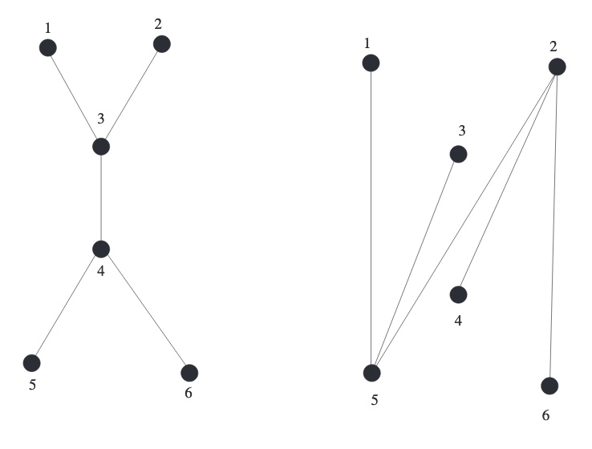
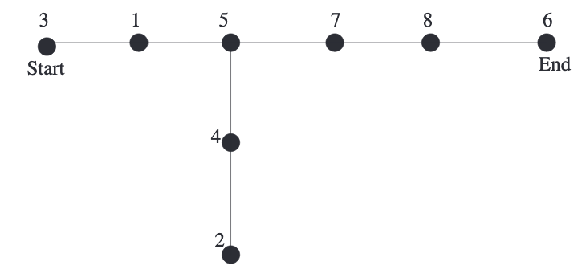
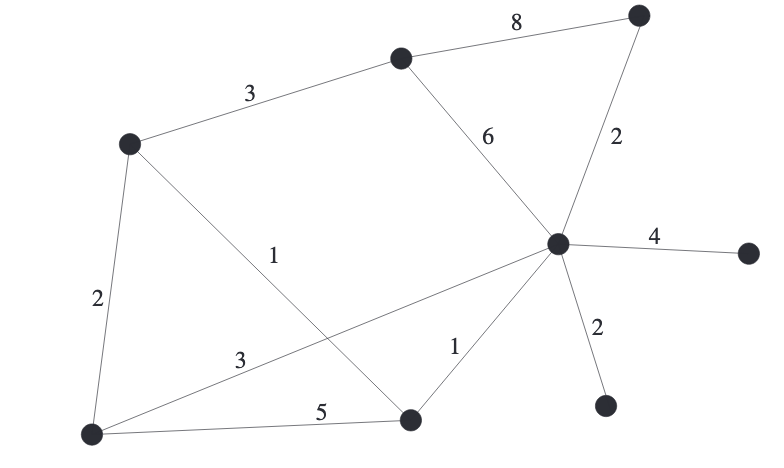
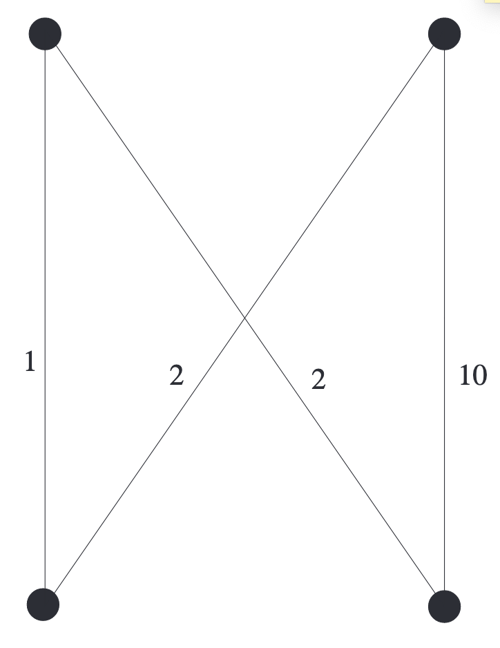
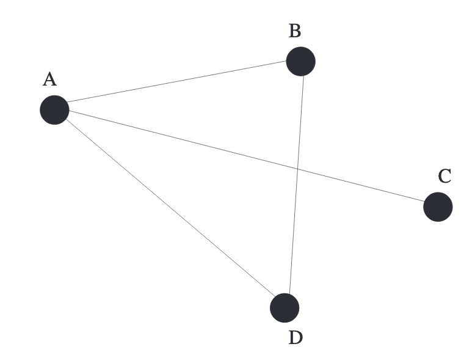
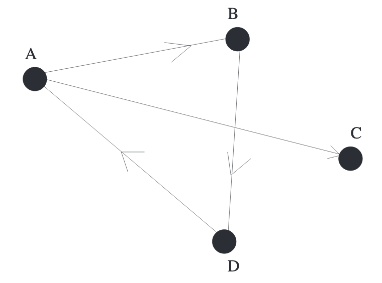

## Minimally Connected Graphs
**Theorem 10.1.** $G$是一个$n$个顶点的简单连通图，那么下面两者是等价的。  
(1) $G$是最小连通的，也就是说，去掉任意一条边之后的图不再是连通图。  
(2) $G$不包含环。  
**Proof** $(1)\Rightarrow(2)$ 假设$G$是最小连通的，但是包含环。移除环$C$的一条边$ab$得到图$G'$，$G$上任意一对顶点$xy$，由于$G$是连通的，那么有一条路径$p$连接$xy$，如果$p$不包含$ab$，那么$xy$是连通的，如果$p$包含，那么把$ab$换成$ab$相对的一段弧，那么$xy$还是连通的，也就是$G'$是连通图，和最小连通的概念矛盾。  
$(2)\Rightarrow(1)$ 证明其逆否命题成立。假设$G$不是最小连通图，那么存在一条边$AB$，移除之后的$G'$仍然是连通的。也就是说存在一条路径$P$能够从$B$到$A$，结合去掉的边$AB$，那么原图$G$存在一个环。

**Definition 10.2.** 一个简单连通图$G$满足**Theorem 10.1**的话被称之为树(`tree`)。

**Corollary 10.3.** 一个连通图$H$是树等价于每一个点对$(x,y)$都有且只有一条路径将其相连。  
**Proof.** 每一个点对$(x,y)$都有且只有一条路径将其相连，那么$H$是最小连通的。假设移除一条边$rs$之后还能得到一个连通图，那么对应于原图$H$，有两条路径连接$r$和$s$。  
反过来，如果$H$是树，但是有两条路径连接$XY$，一条是$P$，另一条是$Q$，那么$P$和$Q$的对称差(`symmetric difference`)构成了环，假设不成立。

**Theorem 10.4.** 所有$n$个点的树有$n-1$条边。相反，有$n-1$条边$n$个顶点的连通图是树。

**Lemma 10.5.** $T$是一棵$n,n\geq 2$个顶点的树，那么$T$至少有两个顶点的度是1。  
**Proof.** 令$p$是$T$中最长的路径，那么$p$的终点必然是叶子节点。反证法。若终点$a$不是叶子节点，那么$p$可以从$a$扩展出去，得到更长的路径。

**Proof.** (**Theorem 10.4**) 归纳法。$n=1$时，只有一个点，没有边，显然成立。假设对$n$个顶点的树也成立。考虑$n+1$时的情况。找个$T$的叶子节点$l$，删除$l$和其唯一的边$e$得到新的树$T'$（$T'$是连通的且无环）。新的树$T'$有$n$个顶点，那么有$n-1$条边，所以$T=T'\cup e$有$n$条边。

和自然界一样，树的集合被称之为森林(`forest`)。森林是每个连通分量都是树的图。

**Proposition 10.6.** 森林$F$有$n$个顶点和$k$个连通分量，那么有$n-k$条边。  
**Proof.** 对于每个连通分量而言，顶点都比边多一个，总共多$k$个。

有$n$个顶点的树有多少种呢？和上一章一样，有两种方式解释。一种是不区分顶点，那么下图两棵树是一样的；一种是区分顶点的，这种情况是对集合$[n]$组成的顶点计算树的数目。在后者的情况下，下图两棵树是不一样的。  
  
集合$[1]$上有一种树，集合$[2]$上也是一种树，集合$[3]$上有三种，集合$[4]$上有16种。通过这几个数字，可以归纳出对于集合$[n]$而言，有$n^{n-2}$种树。列举的数字有点少，这个看似优雅结论是正确的吗？令人敬畏的“小数定律(`Law of Small Numbers`)”说的是如果知道一个序列的很少的一些项，总能总结出一个漂亮的公式，但是往往是错误的。然而，这次是个例外。

**Theorem 10.7 凯莱公式(`Cayley's formula`).** 对于任意正整数$n$，集合$[n]$上所有树的个数是$A_n=n^{n-2}$。  
**Proof** 对于$A_n$个$[n]$上的每棵树取两个点，定义为起点和终点，两者可以是同一个，当然也可以不是。这种树称之为双根树(`doubly rooted trees`)。要证明有$n^n$个这种树。  
方法是找到一个从从$[n]$到$[n]$的所有的函数到$[n]$上的双根树的双射。  
令$f$是从$[n]$到$[n]$的函数。$C\subseteq [n]$是$f$作用下的环的元素集合，也就是说存在某个正整数$i$有$f^i(x)=x$。令$C=\{c_1<c_2<\cdots <c_k\}, d_i=f(c_i)$，将$d_1,d_2,\cdots,d_k$依次写下组成$k$个顶点的线，且令$d_1,d_k$分别为起点和终点。  
如果$j\in[n],j\notin C$，那么将点$j$连接到点$f(j)$上。通过这些操作，得到了一棵树。通过起点-终点这条线连接所有的点，同时无环，因为环对应那条线。同时，这棵树是双根树，因为标记了起点和终点。  
反方向。用起点-终点这条路径来构建环对应的$f$。不在路径上的点，和上述反向操作即可。

**Example 10.8.** 令$n=8;f:[n]\rightarrow[n]$，有$f(1)=3,f(2)=4,f(3)=1,f(4)=5,f(5)=5,f(6)=7,f(7)=8,f(8)=6$。$f$如下图所示：  
  
函数$f$制造了三个环$(1,3)(5),(6,7,8)$，所以$C=\{1,3,5,6,7,8\}$，那么$d_1=3,d_2=1,d_3=5,d_4=7,d_5=8,d_6=6$，那么起点-终点线上的点分别是$3,1,5,7,8,6$。由于$f(2)=4,f(4)=5$，所以把点2连接到点4上，点4连接到点5上。最终构成了下图：  
  

和双根树类似的，有根树(`rooted trees`)可以定义为有一个顶点被称之为根的树。集合$[n]$上的不同有根树的数量是$n^{n-1}$。有根森林(`rooted forest`)是各个连通分量都是有根树的森林。

**Corollary 10.9.** 对于所有正整数$n$，集合$[n]$上不同有根森林的数目是$(n+1)^{n-1}$。  
**Proof.** 将有根树都连接到点$n+1$上。这是一个集合$[n]$上的有根森林到任意一颗$[n+1]$树的双射。反向的，将点$n+1$的相邻点都设为根，然后去掉点$n+1$和它们相连的边，得到若干个有根树，构成了$[n]$上的某个有根森林。从**Theorem 10.7**得到$[n+1]$上不同的树的数量是$(n+1)^{n-1}$。

## Minimum-weight Spanning Trees. Kruskal's GreedyAlgorithm
如果$G$是一个连通图，如果树$T$的顶点包含$G$的所有顶点，且边都是$G$的边，那么$T$是$G$的生成树(`spanning tree`)。  
任意连通图$G$都至少有一个生成树。如果$G$是树，那么$G$自身就是生成树，如果不是，那么$G$不是最小连通图，可以删除一条边得到连通图$G'$，如果$G'$还不是树，那么继续这个过程，总能得到一个生成树。  
一般地，连通图有很多生成树。**Theorem10.7**说明完全图$K_n$有$n^{n-2}$个生成树。有时，想知道有多少生成树是很困难的。  
生成树有大量的实践应用，特别是对于带权重的边的图这一块。下面是个经典的例子。  
一个铁路要连接20个城市，已知每个城市之间的距离，现在要修铁路，连接这些城市且要求总路线长度最短。

**Example 10.10.** $G$是简单连通图。令$\omega :E(G)\rightarrow \mathbb R^+$是一个函数。找到生成树$T$使得$\sum_{e\in T}\omega(e)$最小。

$\omega$是权重(`weight function`)或成本函数(`cost function`)，$\omega(e)$是$e$的权重或成本，$\sum_{e\in T}\omega(e)$是$T$的全程。一般权重写在图的边上。  
  
如果$G$很小，那么可以遍历所有生成树然后找到最小权重生成树。对于稍微大一点的图就不能遍历了，比如$n=20,G=K_n$，那么有$20^18>2.5\cdot 10^{23}$这么多不同的生成树，即使计算机每秒能处理十亿个，那么也需要91年！所以找到一个通用的方法来找到最小权重生成树是十分必要的。  
如何能找到这棵树呢？尝试一下贪婪算法(`greedy algorithm`)。首先选取权重最小的边（如果多条边权重一样，那么任选一条即可）放到$T$中。接着找不在$T$中的最小的边放入$T$中。第三步，依旧如此，不过要小心不要选择构成一个环。  
一般地，贪婪算法的第$i$步就是要找到满足如下属性的边$e_i$：
* 边$e_i$不在$T$中
* 把边$e_i$添加到$T$中不会形成环
* $e_i$的权重是满足上述两条最小的

重复以上步骤直到$T$有$n-1$条边。$G$是连通的，当$T$的边小于$n-2$的时候，总能找到满足条件的边连接$T$的两个连通分量。在这个过程中，$T$不必是连通的；$T$是无环的图，也就是一个森林，当算法运行到$n-1$步之后，就会得到一棵树。  
贪婪算法会得到一个最小权重生成树吗？答案不是很明显。有的问题贪婪算法是有效的，比如从数据里面找到三个数使得其和最大。但是对于有的问题而言，它不能得到最优解，因为每个步骤的选择会影响后续的选择。比如从下图找到两条顶底不想交的边且权重最小。贪婪算法给出的答案是两边的两条边，权重是11，但是答案明显是中间的两条边，权重是4。这个问题是最小权重匹配(`minimum-weight matching`)，下一章会学习匹配。  
  
回到最小权重生成树这个问题，贪婪算法会得到正确答案。在证明之前，先看下面这个有趣的关于森林的属性。

**Lemma 10.11.** 令$F,F'$是同样点集$V$的两个森林，$F$的边比$F'$少，那么$F'$中存在一条边$e$能够加到$F$中使得森林$F\cup e$仍旧是森林。  
**Proof.** 假定不存在这样的边$e$，那么$F'$中的所有边的两个顶点都在$F$的同一个连通分量中。所以$F'$至少有和$F$一样多的连通分量。但是$n$个顶点$k$个连通分量的森林有$n-k$条边，$F'$的边比$F$多，那么连通分量应该少于$F$。

**Theorem 10.12.** 贪婪算法总是能够找到最小权重生成树。  
**Proof.** 令$T$是贪婪算法找到的生成树，假设图$G$存在生成树$H$，其权重小于$T$。令$H$的边$h_1,h_2, \cdots,h_{n-1}$的权重有$w(h_1)\leq w(h_2)\leq \cdots\leq w(h_{n-1})$，$T$的边$t_1,t_2,\cdots,t_{n-1}$的权重有$w(t_1)\leq w(t_2)\leq \cdots\leq w(t_{n-1})$。  
令$i$是第一步$H$打败了$T$。这样的$i$肯定存在，因为最终$H$的权重小于$T$，同时$i>1$，因为贪婪算法第一步肯定是最小的值，因此可以得到以下两个关系
$$\sum_j^i h_j<\sum_j^i t_j$$
$$\sum_j^{i-1} h_j\geq \sum_j^{i-1} t_j$$
所以$w(h_i)<w(t_i)$。  
令$T_{i-1}$是第$i-1$步后得到的森林，$H_i$是边$h_1,h_2,\cdots,h_i$组成的森林，根据**Lemma 10.11**一定存在一条边$h_j,j\leq i$可以添加到$T_{i-1}$中而不形成环，又有$w(h_j)\leq w(h_i)<w(t_i)$，所以贪婪算法的第$i$步不会选择$t_i$。矛盾。所以不存在这样的$H$，那么贪婪算法找到的$T$就是权重最小生成树。

这个算法已发明者命名，被称之为克鲁斯科尔算法(`Kruskal's algorithm`)。

## Graphs and Matrices
有很多种方法将图和矩阵关联在一起。这其中应用最广泛的就是邻接矩阵(`adjacency matrix`)。

### Adjacency Matrices of Graphs
**Definition 10.13.** $G$是一个$n$个标记的顶点的无向图，定义$n\times n$的矩阵$A=A_G$来表示这个图，其中$A_{i,j}$等于顶点$i,j$之间的边数。矩阵$A$被称为邻接矩阵。

**Example 10.14.** 如果一个图$G$如下图所示，那么其邻接矩阵是
$$A_G=\begin{pmatrix}
0&1&1&1\\
1&0&0&1\\
1&0&0&0\\
1&1&0&0
\end{pmatrix}$$

图$G$是有向图的话，邻接矩阵的$A_{i,j}$表示从$i$到$j$的边的数量。所以无向图是对称矩阵，而有向图不必是对称矩阵。

**Example 10.15.** 有向图$H$如下图所示，那么邻接矩阵是
$$A_G=\begin{pmatrix}
0&1&1&0\\
0&0&0&1\\
0&0&0&0\\
1&0&0&0
\end{pmatrix}$$

邻接矩阵也包含大多数图的性质。对于很多场景，使用邻接矩阵更容易解决问题。

**Theorem 10.16.** 图$G$是一个标记顶点的图，$A$是其邻接矩阵表示，$k$是一个正整数。从$i$走到$j$用了$k$步的不同走法的个数是$A_{i,j}^k$。  
**Proof.** 递归法。$k=1$，那么不同的走法的个数就是边的数量，等于$A_{i,j}$。假设$k$的时候成立，现在考虑$k+1$。$b_{i,z}$表示从$i$到$z$且长度$k$的不同走法，那么矩阵$B=A^k$。$a_{z,j}$表示从$z$到$j$的不同走法的个数，矩阵$A$本身包含这些信息。那么从$i$到$j$用了$k+1$步的不同走法的个数就是
$$c(i,j)=\sum_{z\in G}b_{i,z}a_{z,j}$$
上式恰好就是乘法的定义。$BA=A^{k+1}$。

邻接矩阵提供了一个快速的方式来验证其是否包含某种性质。比如下面这个例子是验证连通性。  
**Theorem 10.17.** $G$是$n$个点的简单图，它的邻接矩阵是$A$，那么$G$是连通图等价于$(I+A)^{n-1}$每项都是正数。  
**Proof.** 两个点之间有路径的话，长度最长是$n-1$。图$G$连通就等价于任意两点$i,j$，总存在一个正整数$k\leq n-1$使得$A_{i,j}^k>0$。又因为
$$(I+A)^{n-1}=\sum_{k=1}^{n-1}\begin{pmatrix}
n-1\\k
\end{pmatrix}A^k$$
命题成立。

## The Number of Spanning Trees of a Graph
图的邻接矩阵能够计算图的生成树的数量。在此之前，先扩展下之前的定义到有向图。如果图$G$是有向图，那么如果$H$是$G$的子图同时，并且如果去掉方向得到$H'$是$G'$的生成树，$H$是$G$的生成树。

**Definition 10.18.** $G$是有向无环图，点分别是$\{v_1,v_2,\cdots,v_n\}$，边分别是$\{e_1,e_2,\cdots,e_m\}$。$G$的关联矩阵(`incidence matrix`)是$n\times m$矩阵$A$定义如下
* $a_{i,j}=1$如果$v_i$是$e_j$的起点
* $a_{i,j}=-1$如果$v_i$是$e_j$的终点
* 其他情况$a_{i,j}=0$

**Theorem 10.19.** $G$是有向无环图，$A$是其关联矩阵。从$A$中任意移除一行，剩余矩阵是$A_0$，那么$G$的生成树的个数是$\det{A_0A_0^T}$。  
**Proof.** 证明之前说个神奇的事情，不管移除哪一行，$\det{A_0A_0^T}$保持不变，这并不能显然得到。  
不失一般性，假设最后一行被移除了。因为$G$是连通图，那么$m\geq n-1$，所以从$A_0$中可以取得$(n-1)\times (n-1)$的子矩阵$B$。现在要证明如果$|\det{B}|=1$当且仅当$B$对应的列的子图$G'$是生成树，否则其值为0。  
(a) 假设存在一个点$v_i(i\neq n)$的度是1。那么$B$的第$i$行只有一个值是非零的，它是1或者-1。已这个值展开递归地求$\det{B}$。最后会得到$|\det{B}|=1$。这里蕴含着$G'$是$G$的生成树等价于$G'-v_i$是$G-v_i$的生成树。  
(b) 如果不存在这样的点，那么$G'$就不是生成树。又因为$G'$有$n-1$条边，那么$G'$有度为0的点。如果这个点不是$v_n$，那么$B$有一行全零，那么$\det{B}=0$；如果是$v_n$，那么$B$的每一列都有一个1和一个-1，这是因为每条边都有起点和终点，而起点和终点不会是$v_n$，那么$B$的行相加是0，说明$B$是线性相关的，那么$\det{B}=0$。  
根据柯西-比尔公式(`Binet-Cauchy`)
$$\det{A_0A_0^T}=\sum(\det{B})^2$$
前者等于$\det{B}=1$的次数，也就是等于生成树的个数。

**Theorem 10.20(`Matrix-Tree theorem`).** 
$U$是简单无向图。定义一个$(n-1)\times (n-1)$的矩阵$L_0$
$$l_{i,j}=\begin{cases}
\text{the degree of }v_i\text{, if }i=j\\
-1, \text{if }i\neq j\text{, and } v_i \text{ and } v_j \text{ are connected}\\
0 \text{ otherwise}
\end{cases}$$
其中$1\leq i,j\leq n-1$。那么$U$有$\det{L_0}$个生成树。  
$U$有$n$个顶点，但是$L_0$是$(n-1)\times (n-1)$的矩阵，没有行和列是属于顶点$v_n$的。但是矩阵$L_0$是包含了$v_n$的信息的，因为知道顶点$v_i$的度$l_{i,i}$，同时知道它和其他顶点是否连通，那么能够推算得到$v_i$和$v_n$是否连通。  
**Proof.** 将$U$映射到有向图$G$，每条无向的边转化成两条不同方向的有向边。  
令$A_0$是$G$的关联矩阵去掉最后一行的矩阵。接下来证明$A_0A_0^T=2L_0$。$A_0A_0^T$位置$(i,j)$的值是$A_0$第$i$行和第$j$行的乘积。  
如果$i=j$，如果某条边的起点或终点是$v_i$，就会对乘积贡献1，所以位置$(i,j)$的值是$G$中点$v_i$的度，也就是$U$中点$v_i$的度的两倍。  
如果$i\neq j$，某条边起点是$v_i$终点是$v_j$或者刚好相反，都会对乘积贡献-1。如果两者相连，那么对应位置的值是-2，否则，是0。  
从上述可以得到$A_0A_0^T=2L_0$，那么$\det{A_0A_0^T}=2^{n-1}\det{L_0}$。注意，$U$的每个生成树都可以对应到$G$的$2^{n-1}$个不同的生成树，因为每条边可以选择一个方向，而生成树有$n-1$条边。  
结合**Theorem 10.19**，证毕。

接着看一个经典的例子，集合$[n]$上的树的个数。

**Example 10.21.** $K_n$的生成树个数是$n^{n-2}$。  
**Solution.** $K_n$的$L_0$是
$$\begin{pmatrix}
n-1&-1&\cdots &-1\\
-1&n-1&\cdots &-1\\
\cdots\\
-1&-1&\cdots &n-1
\end{pmatrix}$$
将除第一行之外的各行都加到第一行
$$\begin{pmatrix}
1&1&\cdots &1\\
-1&n-1&\cdots &-1\\
\cdots\\
-1&-1&\cdots &n-1
\end{pmatrix}$$
将第一行分别加到其余各行
$$\begin{pmatrix}
1&1&\cdots &1\\
0&n&\cdots &0\\
\cdots\\
0&0&\cdots &n
\end{pmatrix}$$
所以$\det{L_0}=n^{n-2}$。

再来看一个有趣的例子。

**Example 10.22.** $A$表示$m$个点的集合，$B$表示$n$个点的集合。将$A$集合的每个点和$B$集合的每个点相连。用$K_{m,n}$表示这个图。求$K_{m,n}$的生成树的个数。  
**Solution.** 图$K_{m,n}$被称为完全二分图(`complete bipartite graph`)。$A$内部和$B$内部是没有边的。  
关联$K_{m,n}$的矩阵$L_0$是
$$\begin{pmatrix}
n&\cdots&0&-1&\cdots&-1\\
\cdots\\
0&\cdots&n&-1&\cdots&-1\\
-1&\cdots&-1&m&\cdots&0\\
\cdots\\
-1&\cdots&-1&0&\cdots&m
\end{pmatrix}$$
前$m$行和后$n-1$行有点类似。把除第一行外的其他行加到第一行得到$\begin{pmatrix}1&\cdots&1&0&\cdots&0\end{pmatrix}$，然后把这一行加到后$n-1$行
$$\begin{pmatrix}
1&\cdots&1&0&\cdots&0\\
\cdots\\
0&\cdots&n&-1&\cdots&-1\\
0&\cdots&0&m&\cdots&0\\
\cdots\\
0&\cdots&0&0&\cdots&m
\end{pmatrix}$$
左下角全0，所以$\det{L_0}=n^{m-1}m^{n-1}$。

对于**Theorem 10.20**而言，选择谁作为$v_n$都是可以的，但是选择不同的点作为$v_n$会影响计算矩阵行列式的值。下面这个定理会绕开这个问题。

**Theorem 10.23 (`Matrix-Tree theorem, eigenvalue version`).** 和**Theorem 10.20**类似，$U$是简单图，$L$定义和$L_0$类似，但是包含第$n$个点，也就是一个$n\times n$的矩阵。令$L$的特征值分别是$\lambda_1,\lambda_2,\cdots,\lambda_n,\lambda_n=0$，那么$U$的生成树的数量是
$$\frac{1}{n}\lambda_1\cdot\lambda_2\cdots\lambda_{n-1}$$
$L$各行相加等于0，说明其是线性相关的，那么一定有一个特征值是0。$L$是$U$的拉普拉斯算子(`Laplacian`)。

其实没有什么通用的方法计算一个矩阵的特征值。但是针对一些特殊的图，可以利用一些小技巧来求解。比如$U$是一个$n$个点都有$d$条边与之相连的图，那么$dI-A=L$，其中$A$是$U$的邻接矩阵。如果$A$的特征值是$\alpha_1,\alpha_2,\cdots,\alpha_n$，那么$L$的特征值就是$d-\alpha_1,d-\alpha_2,\cdots,d-\alpha_n$。

**Example 10.24.** 令$U=K_n$，那么邻接矩阵$A$的特征值分别是$n-1,-1,\cdots,-1$，进而$L$的特征值分别是$0,n,\cdots,n$，所以$K_n$的生成树个数是$n^{n-2}$。  
**Solution.** $A+I=J$，其中$J$是元素都等于1的矩阵。很明显$J$的秩是1，那么其有$n-1$个特征值都是0，又因为$J$的迹是$n$，迹又等于特征值之和，所以$J$的非零特征值是$n$，$A=J-I$，所以$A$的特征值分别是$n-1,-1,\cdots,-1$。

## Exercises
(11) 在集合$[n]$上不连通的简单图$G$最多能有多少条边？  
**Solution** 如果其中一个顶点的度是0，其他$n-1$个点是完全子图，显然该图是不连通的，有$\begin{pmatrix}n-1\\2\end{pmatrix}$条边。  
下面用递归证明若$G$有$\begin{pmatrix}n-1\\2\end{pmatrix}+1$条边那么$G$一定是连通的，则$\begin{pmatrix}n-1\\2\end{pmatrix}$是非联通图的边的最大值。  
$n=2$时，显然是连通的。假设$n$时也是连通的，考察$n+1$个点，$\begin{pmatrix}n\\2\end{pmatrix}+1$条边。首先，没有点是孤立点，因为剩余$n$个点最多只能有$\begin{pmatrix}n\\2\end{pmatrix}$条边。如果有个点的度是$n$，显然成立了，因为其他点都和这个点相连。那么移除任意一个点$V$，最多只能移除$n-1$条边，那么剩余的边数至少有$\begin{pmatrix}n-1\\2\end{pmatrix}+1$，这$n$个点是连通的，而点$V$和这些点是连通的。
