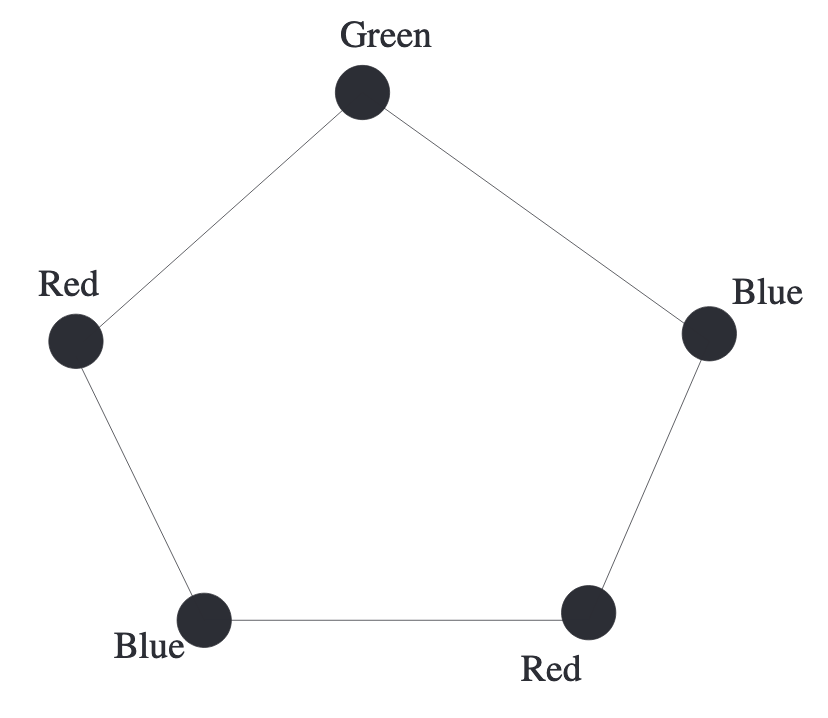
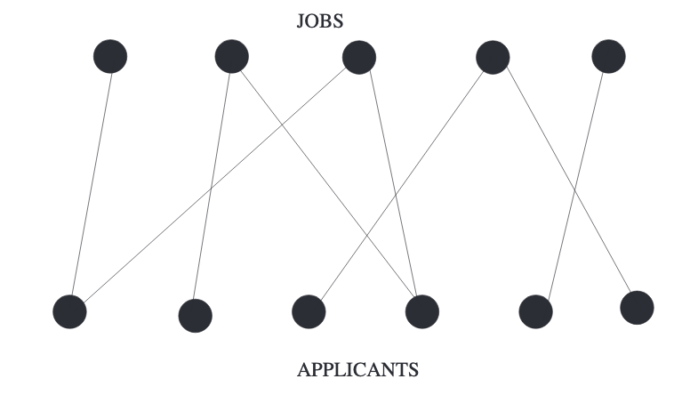
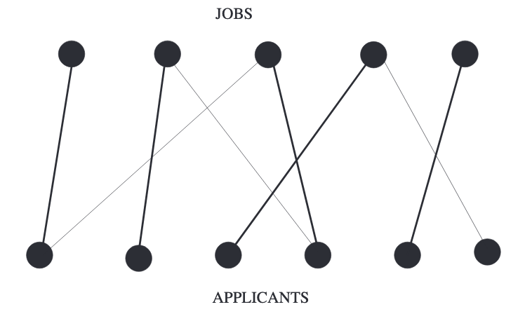
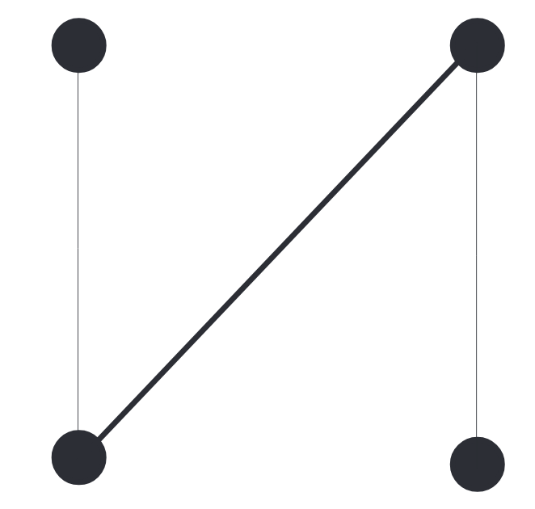
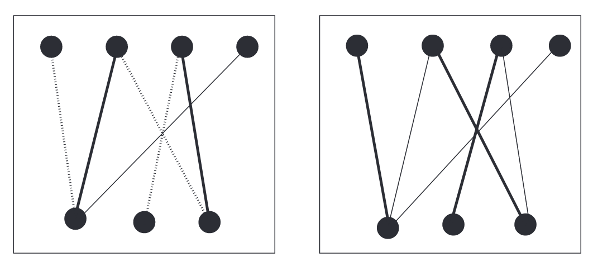

## Introduction
一个移动网络运营商提供4种不同频率的服务。现在要去扩展业务，在选定的十个地方建立基站。两个频率相同的基站距离必须大于50公里。给定这些信息，存在一种合适的分配方式吗？  
现在需要转化成数学问题。基站的位置是顶点，两点之间右边意味着这两点之间的距离不大于50公里。  
但是频率这个信息如何表示呢？染色。可以分配不同的颜色给各个顶点。比如频率1是红色，频率2是绿色等等。  
下面这个命题是这个问题的数学表述。

**Proposition 11.1.** 令$C$是十个塔的集合，$G$是如上描述的图。能够安排四种不同的频率的方式等价于使用四种颜色对$G$染色且没有相邻点是同色的。

**Definition 11.2.** 一个图$H$的色数(`chromatic number`)$\chi(H)$表示最小的整数$k$，满足如下条件：图$H$能够被$k$种颜色染色且相邻顶点一定是不同颜色。

图的顶点的着色，其中相邻的顶点具有不同的颜色，称为适当顶点着色(`proper vertex coloring`)，或适当着色(`proper coloring`)。  
如果一个图的顶点能够被$k$种颜色着色且没有相同颜色的邻接点，称为可$k$着色(`k-colorable`)。

**Example 11.3.** 五边形的色数是3，两种是不行的。如下图所示。  

## Bipartite Graphs
$k$着色问题的最重要的特例是$k=2$。这个无处不在的特例有一个属于自己的名字。

**Definition 11.4.** 可2着色的图称为二分图(`bipartite`)。$G$存在互不相连的两个部分$A,B$，$G$的每一条边都是连接$A$的一点和$B$的一点。

下图是典型的二分图，注意，在同色的类内部是没有边的。  

所有的树是二分图，从根开始，比如染成红色，邻接点染成绿色，再接着的邻接点染成红色，依次下去。正方形、六边形、八边形等也是二分图。  
显然，三角形不是二分图，一个点染成红色，一个点染成绿色，第三个点必然和其中一个颜色相同。进而，如果一个图包含三角形，那么肯定不是二分图。  
不包含三角形就是二分图了吗？五边形是一个很好地反例。进而，有长度是奇数的环的图，都不是二分图。  
下面的定理是上述的概括。

**Theorem 11.5.** 图$G$是二分图，当且仅当不包含长度是奇数的环。  
**Proof.** 图$G$是二分图，那么不包含长度是奇数的环，这个容易证明。反证法。假设有环$A_1A_2\cdots A_{2m+1}$。用红色和蓝色染色。不失一般性地用红色染第一点，那个$A_2$必须是蓝色，$A_3$是红色，依次，$A_{2m+1}$是红色，但是$A_1A_{2m+1}$是一条边，两个顶点必须是不同颜色。  
现在证明另外一个方向。图$G$不包含长度是奇数的环，那么$G$是二分图。从某一个点$V$开始，染色成蓝色，对于其他某点$W$，如果$W$到$V$的最短路径是奇数，染成红色，如果是偶数，染成蓝色，这样是符合题意的染色方式。假定$P$和$Q$是同色的，同时有一条边相连。令$p,q$分别是两点到$V$的最短路径，由于这两点同色，那么$p$和$q$的长度同为奇数或者同为偶数，加上边$PQ$，构成了长度为$p+q+1$的环，由于$p,q$同奇偶，那么环的长度是奇数，与前提假设矛盾，所以不存在这样的点$P,Q$，所以$G$是二分图。

$n$个顶点的简单图$G$是二分图，能有多少条边呢？这里想要求的是上限。树有$n-1$条边，那么答案线性于$n$，或者是$n^\alpha,1<\alpha<2$，或者是$\begin{pmatrix}n\\2\end{pmatrix}$的若干分之一？下面的定理给出了答案，边数更接近图的边的最大值。  
**Theorem 11.6.** 图$G$是$n$个顶点的简单二分图。如果$n$是偶数，那么最多有$n^2/4$条边；$n$是奇数，最多有$(n^2-1)/4$条边。  
**Proof** 令$a,b$是两种颜色的点数，那么边数最大值是$ab=a(n-a)$，那么这个问题转换成了求解二次函数的最大值问题。

在上述证明中，构造了一个非常重要的二分图种类，完全二分图(`complete bipartite graphs`)。如果完全二分图的两种点数分别是$a,b$，记作$K_{a,b}$。  
令$H$是一个$2m$个顶点的简单图$H$，如果$H$有$m^2$条边，那么$H$可能是一个二分图，因为它可能是$K_{m,m}$。如果$H$有$m^2+1$条边，那么根据**Theorem 11.6**它不是二分图，且有一个长度是奇数的环。下面的引理是一个更强的命题。

**Lemma 11.7.** 令$H$是$2m,m\geq 2$个顶点的简单图，并且至少有$m^2+1$条边，那么$H$包含三角形。  
**Proof.** 对$m$进行递归来证明。如果$m=2$，那么$H$是$K_4$的有至少五条边的子图，根据上面的定理，$H$必然有一个长度是奇数的环，又因为只有4个点，所以环的长度是3。  
$F,G$是图$H$两个相连的点。如果两者的度之和大于$2m$，那么有公共顶点$T$，那么$TFG$组成了一个三角形。如果度之和最大是$2m$，删除这两点之后，度最多会减少$2m-1$（$F,G$之间度算了两次）。删除后，得到一个顶点数是$2m-2$的图，至少有$m^2+1-(2m-1)=m^2-2m+2=(m-1)^2+1$条边，由递归可知这个删除了两个点的图包含三角。

下面要给出一个更强的定理。  
**Theorem 11.8.** 令$H$是$2m,m\geq 2$个顶点的简单图，并且至少有$m^2+1$条边，那么$H$包含$m$个三角形。  
如果$H$有$m^2$条边，可以是完全二分图，一个环都没有，但是只要再加上一条边，就会出现$m$个三角形！树不是这样的，$m$个顶点的树有$m-1$条边，再加一条边会形成一个长度不定的环（取决于树和新加的边）。  
**Proof.** 假定只有$m^2+1$条边。  
$m=2$时，$K_4$去掉一条边，很显然，有两个三角形。  
假设对所有小于$m$的情况都成立。现在考虑$m$就好。**Lemma 11.7**是说有一个三角形$ABC$了，还要找到剩下的$m-1$个三角形。  
基于除$ABC$之外的点连接到三角形$ABC$的点的边数分成三类讨论。先证明如果边数是$2m-3+x$条边，那么有$x$个三角形。如果外部顶点(`outside vertex`)和$ABC$任意两个顶点相连，就会形成一个三角形。有$2m-3$个外部顶点，根据鸽巢原理，则有$x$个三角形。  
后续证明主要思路是如果很多边和$ABC$相连，那么会产生会多三角形，另一方面，如果边很少的话，那么这些点之间会有很多三角形。  
(1) $x\geq m-1$，那么就找到了$m-1$个三角形。  
(2) $1\leq x<m$，那么$ABC$和外部点的边最多是$2m-3+m-2=3m-5$。由于$ABC$包含三条边，那么其他$2m-3$个顶点组成的子图$R$至少有$m^2+1-(3m-5)-3=m^2-3m+3=(m-1)(m-2)+1$条边。再去掉一个度最少的点，形成的$2m-4$个顶点的子图$R'$的边大于
$$(m-1)(m-2)\frac{2m-4}{2m-3}=(m-2)^2\frac{2m-2}{2m-3}>(m-2)^2$$
$R'$有$2(m-2)$个顶点，至少有$(m-2)^2+1$条边，根据递归假设，$R'$有$m-2$个三角形，加上$x\geq 1$的至少一个三角形，找到了剩余的$m-1$个三角形。  
(3) $x\leq 0$，也就是$ABC$和外部顶点的边最多$2m-3$条；最少有一条，否则子图$R$有$m^2-2$条边，和$ABC$任意一点构成的图有$m^2-2\leq (m-1)^2+1$条边，$2(m-1)$个顶点，根据递归假设，$m-1$个三角形。那么$R$内部的边数最少是$m^2+1-(2m-3)-3=(m-1)^2$，加上连接到$ABC$的某条边和对应顶点构成了$2m-2$个顶点和$(m-1)^2+1$条边的图，这个图有$m-1$个三角形。

## Matchings in Bipartite Graphs
二分图在生活中有很多应用。考虑$m$个开放的职位和$n$个候选人。定义一个$m+n$个顶点的图$G$，前$m$个顶点表示职位，后$n$个顶点表示候选人。当且仅当一个候选人申请了某个职位且符合要求(`qualified`)，那么有一条边连接这两个顶点。$G$显然是一个二分图，因为所有的边都是连接前$m$个顶点和后$n$个顶点，而每个集合内部没有边。如下图所示。  
  
整个招聘过程就是双方匹配的过程。如果职位$A$招聘了候选人$a$，将边$Aa$加粗，等等。随着招聘的进行，有越来越多的边被加粗，但是在整个过程中，加粗的边都是不相交顶点的边(`vertex-disjoint edges`)组成，因为没有一个能能被两个职位录取，反过来，一个职位也不能招聘两个人。  
如果招聘过程结束，$m$个职位都被填满了，那么会有$m$条粗体的边。如果少于$m$个职位招聘到了合适的候选人，说明找不到合格的候选人，那么没有$m$条粗体的边，不过它们都是不相交顶点的边。

**Proposition 11.9.** 令$S$是这个招聘问题，$m$个开放职位和$n$个候选人。能够填充满$m$个职位等价于能在上述的图$G$中找到$m$条顶点不相交的边。

下图展示了某种可能的最后结果。  

**Definition 11.10.** 令$G$是任意一个图，令$S$是$G$的边的集合，且没有两条边有共同顶点。$S$是图$G$的匹配(`matching`)。如果图$G$的每个顶点都被$S$的边覆盖，那么称为完美匹配(`perfect matching`)。  
匹配也被称为边的独立集(`independent set of edges`)。上述定义不要求$G$是二分图。不过后续讨论都是基于二分图的。

**Definition 11.11.** 令$G=(X, Y)$是一个二分图。当$S$是$G$的匹配且覆盖$X$的所有点时，$S$是$X$到$Y$的完美匹配。  
如果不关心$S$只关心$X$到$Y$的完美匹配，称$X$有一个到$Y$的匹配，或$X$能被匹配到$Y$。

### Bipartite Graphs with Perfect Matchings
$G=(X, Y)$是一个二分图。有两个问题，$X$有到$Y$的完美匹配吗（对应前面的例子就是职位都填满了）？如何找到最大匹配？  
先考虑第一个问题。$|X|\leq |Y|$是一个必要条件。如果$X$中的两个点$a,b$的度都是1，但是都和$y\in Y$相连，那么显然不存在完美匹配。  
泛化上述的条件。如果$T\subseteq X$是$X$的点的子集，令$N(T)$是$T$的所有邻接点。$y\in Y$是$N(T)$的元素，当且仅当存在某个点$x\in T$，$xy$是一条边。邻接点集合$N(T)$与匹配有关，因为如果只想将$T$匹配到$Y$，那么可以将注意力集中在二分图$(T, N(T))$上。  
如果上下文有歧义，使用符号$N_G(T)$来表示。

**Proposition 11.12.** 令$G=(X, Y)$是一个二分图。$X$能被完美匹配到$Y$，那么对于所有的$T\subseteq X$都满足$|T|\leq |N(T)|$。  
**Proof.** 反证法。假定有一个$T\subseteq X$不满足$|T|\leq |N(T)|$，那么$|T|> |N(T)|$。显然$T$不能匹配到$N(T)$，那么任意包含$T$的集合都不能匹配到$Y$，进而$X$不能匹配到$Y$。

下面的定理是说上述命题的逆命题也是成立的。被称之为菲利普霍尔定理(`Philip Hall's theorem`)。  
**Theorem 11.13 (`Philip Hall's theorem`).** 令$G=(X, Y)$是一个二分图。$X$
$Y$，当且仅当对于所有的$T\subseteq X$都满足$|T|\leq |N(T)|$。  
**Proof.** 只需证明半个定理即可，因为**Proposition 11.12**已经完成了一部分。下面的证明是1950年`Halmos`和`Vaughn`给出的。  
对$|X|$做递归来进行证明。易证初始状态。假设对于小于$|X|$的非负整数都成立，现在考虑$|X|$。根据题意，对于所有$T\subseteq X$，有$|T|\leq |N_G(T)|$。下面分两种情况讨论。  
(1) 假定对于每一个$T\subset X$，都有严格的小于关系$|T|< |N_G(T)|$。假定$x,y$是邻接点并且$x\in X$。令$G'=G-x-y$，$A$是任意$X-x$的非空集合，那么$|A|<|N_G(A)|$，进而有$|N_{G'}(A)|\geq |N_G(A)|-1\geq |A|$。根据递归假设，在图$G$中，$X-x$能够完美匹配到$Y-y$，那么增加一条边$xy$，得到想求的结论。  
(2) 假定对于某个$B\subset X$，有$|B|=|N_G(B)|$。将$G$分成两个部分，$G_1$是$B\cup N(B)$组成的子图，$G_2$是剩余点组成的子图。  
在$G_1$中，选任意集合$T\subseteq B$，那么$N_G(T)\subseteq N_G(B)$，又因为$T$的所有邻接点都在$G_1$，所以$N_{G_1}(T)=N_G(T)$，进而有$|N_{G_1}(T)|=|N_G(T)|\geq |T|$，那么$G_1$满足递归假设。  
在$G_2$中，选择任意自己$U\subseteq X-B$，那么$N_G(U\cup B)=N_{G_2}(U)\cup N_G(B)$。由于两者是不相交集合，那么$|N_{G_2}(U)|=|N_G(U\cup B)|-|N_G(B)|\geq |U\cup B|-|B|=|U|$，所以$G_2$也满足递归假设。  
综上，$B$可以匹配到$N_G(B)$，$X-B$能够匹配到$Y-N_G(B)$，所以$X$可以匹配到$Y$。

**Exercise 9**是一个和这个定理相关的应用，虽然第一眼看上去无关。  
**Theorem 11.13**很有用，但是它没有告诉在存在一个完美匹配的前提下如何找到一个，在没有的前提下找到最大匹配(`maximum matching`)。  
最大(`maximum`)和最大化(`maximal`)是不同的。最大化是说在某个匹配上在增加一条边，就破坏了匹配的属性；最大是说没有其他匹配比这个匹配的边数更多了。  
显然，最大匹配是最大化的匹配，但反之不一定成立。如下图所示。  

**Definition 11.14.** 令$G$是一个图，$M$是其的一个匹配。路径$P=v_1v_2\cdots v_r$是交替路径(`alternating path`)如果$v_iv_{i+1}$属于$M$但$v_{i+1}v_{i+2}$不属于$M$。

$P$的起点和终点不是$M$的边的邻接点的话，那么$M$不是最大匹配。因为，丢掉$P\cap M$替换上$P-M$会得到更大匹配。这里描述的路径称为增广路径(`augmenting path`)。  
**Definition 11.15.** 如果交替路径的起点和终点都是$M$中没有用到的点，那么这条路径称为增广路径。

下图的左边粗体是$M$，虚线是$P-M$，右边粗体是由增广路径替换后得到的更大的匹配。  
  
需要注意的是，这里的定义对任意简单图都成立，不一定非要是二分图。

**Theorem 11.16.** 令$G$是简单图，$M$是其的匹配。$M$是最大匹配，当且仅当$G$没有关联$M$的增广路径。  
**Proof.** 上图已经证明如果有增广路径，那么不是最大匹配，逆否命题就是最大匹配没有增广路径。  
现在证明如果没有增广路径说明是最大匹配。反证法。假定没有增广路径且有最大匹配$M'\neq M$。考虑$M\oplus M'$，即两者的交集减去两者的并集。由于$M,M'$都是匹配，那么$M\oplus M'$的连通分量要么是偶数循环（那么$M$和$M'$贡献了相同的边数），要么是交替路径。又由于$M'$是最大匹配，没有增广路径，那么交替路径的长度也必须是偶数。所以$|M|=|M'|$。

### Stable Matchings in Bipartite Graphs
假定在一个小城市，有$n$个候选人，同时有$n$个空缺职位。每一个候选人有一个长度为$n$的名单表示自己对这$n$个职位的偏好，同时每一个空缺职位的招聘经理也有一个长度为$n$的名单表示对$n$个候选人的偏好。问题不是如果找到一个完美匹配，而是找到一个稳定(`stable`)完美匹配。首先来定义稳定匹配(`stable matchings`)。

**Definition 11.17.** 令$G(X,Y)$是有完美匹配$M$的的二分图。$X$的每个点都有对$Y$的每个点的一个偏好列表，反之亦然。如果以下两个条件不都成立，则$M$是稳定的：  
(a) $xy\in M$，但是$x$更偏好$y'$  
(b) $y'x'\in M$，但是$y'$更偏好$x$

换句话说，一个匹配是稳定的前提是不能在两个集合中各找到一个点，都放弃当前匹配。  
有一个相当简单的方式能够构造稳定的完美匹配。首先，每个候选人申请自己最偏好的职位，招聘经理临时告诉在偏好名单里最靠前的人被录用了，同时拒绝其他人。重复该步骤。没有工作的候选人继续申请偏好名单的第二个职位，第三个职位等等。如果候选人$A$申请了临时招聘了$B$的职位，如果这个职位的招聘经理更偏好$A$，那么录用$A$而拒绝$B$。直到所有候选人都找到了工作，同时招聘经理也找到了他们想要的人。这个过程总是成立的。假设有候选人$C$还没有工作，那么存在一个职位$J$还没有被填充，这就意味着$C$还没有申请$J$，那么说明这个过程还没有结束。  
上述过程不仅找到了完美匹配，而且命题更强，因为是稳定的。  
令$G(X,Y)$是二分图，$X$表示候选人，$Y$表示空缺职位。假定我们找到的完美匹配$M$不是稳定的。这就说明存在$x,x'y,y'$是如下关系：$xy\in M,x'y'\in M$，但是$x$更偏好$y'$，同时$y'$也更偏好$x$。这两个点会同时放弃当前的匹配。

## More Than Two Colors
**Theorem 11.6**告诉我们二分图的边不能太多。对于$n$个点的二分图，为了让边尽可能的多，那么要尽可能的平分两种颜色的点的数量。  
下面考虑$k$染色图。尽可能平分的思想还是有效的。  
令$n=kt+r$，也就是将$n$个顶点分成$k$个子集，$r$个集合有$t+1$个点，其余集合有$t$个点。也就是尽可能的平分。那么$k$染色完全图$H$的边数是
$$T(n,k)=\frac{k-1}{2k}n^2-\frac{r(k-r)}{2k}$$
下面的定理是说没有$k$染色图的边数能够超过$H$。

**Theorem 11.18.** 令$G$是$n$个顶点且有$T(n,k)$条边的简单图。那么$G$包含一个$K_{k+1}$子图，也就是说$G$不是$k$染色图。  
**Proof.** 令$G$是$n$个顶点且不包含$K_{k+1}$子图。我们要证明其边数最多是$T(n,k)$。  
对$t$进行递归证明。$t=0$时，显然成立。假设小于等于$t-1$都成立。命题隐含了增加任意一条边，会创建一个$K_{k+1}$子图，那么$G$包含一个$K_k$子图，$S$。那么$G$的边只可能在
* $S$内部
* 边的一个顶点在$S$，另一个顶点$G-S$
* $G-S$内部

$S$内部有$\begin{pmatrix}k\\2\end{pmatrix}$条边；$G-S$里面的点最多和$S$中的$k-1$个点相连，有$(n-k)(k-1)$条边；$G-S$有$n-k$点，那么有$T(n-k,k)$条边。所以
$$\begin{pmatrix}
k\\2
\end{pmatrix}+(n-k)(k-1)+T(n-k,k)=T(n,k)$$
如果边数大于$T(n,k)$的话，一定会出现$K_{k+1}$子图。

**Theorem 11.18**是一个相当强的命题说明什么图不是$k$染色图：一个图有太多边导致有$K_{k+1}$子图，那么不是$k$染色图。另一方面，一个图不包含$K_{k+1}$子图也至少需要$k+1$种颜色来染色。比如一个奇数长度的环，不包含$K_3$，但是需要三种颜色。事实上，奇数长度的循环和完全图分别对染色数有要求。  
**Theorem 11.19.** 令$G$是不包含奇数长度循环的非完全图的连通图。令正整数$d\geq 3$，$G$的每个点的度最大是$d$，那么$\chi(G)\leq d$。

一个图的染色数高，那么度也高。

## Matchings in Graphs That Are Not Bipartite
现实中有很多问题是在非二分图中寻找匹配。比如在一个大公司找到一种匹配，每一对的两个人都互相认识；又或者是周末进行足球比赛，每组比赛的两个队在过去两年没有比赛；显然这两个例子都不能用二分图来表示，但我们仍旧想从中得到定点不相邻的边的集合。  
幸运的是，对于是否存在完美匹配，有一个充要条件。如果$G$是一个图，$S$是顶点集合的子集，令$G-S$是图$G$删除点集$S$和所有相邻的边得到的子图，$c_o(G-S)$表示$G-S$中奇数顶点的连通分量的个数。

**Theorem 11.20 (`Tutte's theorem`).** 一个图$G$有完美匹配等价于对于$G$的所有顶点的子集$S$，不等式$c_o(G-S)\leq |S|$都成立。  
从左往右这个方向的证明很简单，令$M$是某个完美匹配，那么奇数个顶点的连通分量$G-S$至少要包含一个$S$的点，那么$c_o(G-S)\leq |S|$。  
如果一个图$G$没有完美匹配，但是添加任意新边就有完美匹配，那么我们称图$G$是`saturated non-factorizable graph`。  
**Lemma 11.21.** 如果图$G$是`saturated non-factorizable graph`，又如果$S$中的每个点都与其他点相连，那么$G-S$的连通分量是完全图。  
**Proof** 反证法。令$ab,bc$是$G-S$的边，假设$a,c$不相连。肯定存在$d$使得$b,d$不相连，否则$b\in S$。  
由于$G$是`saturated non-factorizable graph`，那么$G\cup ac
$有完美匹配$F_1$，又因为$G$没有完美匹配，那么$ac\in F_1$。类似地，$G\cup bd$有完美匹配$F_2$，且$bd\in F_2$。$F_1,F_2$的对称差是一个环，令$C_1,C_2$分别是包含$ac, bd$的环。下面分两种情况讨论。  
1） 假设$C_1\neq C_2$。令$F_3=F_1\oplus C_1$。$ac\in (F_1\cap C_1)$，那么$ac\not \in F_3$，另一方面，$F_3$和$F_1$的边一样多，是一个匹配，所以是$G$的完美匹配，和命题中的条件矛盾。  
2）假设$C_1=C_2$。沿着环从$b$到$d$再到$a,c$之一，比如$a$，令$b$到$a$的路径是$P$，又因为$ab\in G$，那么$P\cup ab$对于$F_2$而言是交替路径（实际是环）。令$F_4=F_2\oplus (P\cup ab)$，和1）类似，$F_4$和$F_2$一样的边数，且不包含$bd$因为$bd\in F_2\cap (P\cup ab)$，那么$F_4$是图$G$的完美匹配，矛盾。  
综上，$ab,bc$是$G-S$的边，那么$ac$也是，所以$G-S$是完全图。

**Theorem 11.22.** 图$G$是`saturated non-factorizable graph`等价于它有以下结构：
* $G$有奇数个点且是完全图，或者
* $G$有偶数个点并且有顶点不相交的完全子图$S_0,G_1,G_2,\cdots,G_k, k=|S_0|+2$组成，每个$G_i$有奇数个点，并且每个顶点都和$S_0$的每个顶点相连。

**Proof.** 图$G$有奇数个点，那么没有完美匹配。也只有完全图满足`saturated non-factorizable`因为没法再增加边（`saturated non-factorizable`要求能增加一条边使之有完美匹配。）。  
令$S_0=S$，其中$S$是**Lemma 11.21.**中的定义的$S$。$G_1,G_2,\cdots,G_k$是$G-S$的连通分量，根据**Lemma 11.21.**，$G_i$是完全图，并且$S$的每个点和$G_i$的每个点都是连通的。  
$G$没有完美匹配，那么$G_i$的个数必然大于$|S|$，否则$G_i$的一个点（奇数个，所以会多一个点不能在内部配对）可以和$S$的点配对然后组成完美匹配。  
$G$有偶数个点，那么至少就要有$|S+2|$个奇数点的分量。  
其实也不能多于$|S+2|$，因为我们可以添加一条连接其中的两个分量，得到的$G_1$，而$c_o(G_1-S)>|S|$，没有完美匹配。加一条边但是没有完美匹配，不是`saturated non-factorizable graph`。  
因此$G$有$|S+2|$个奇数个点的分量。  
最后，$G$不会有偶数个点的分量，因为添加一条边连接它和其他分量，不会组成有完美匹配的图。

现在来证明`Tutte's theorem`。

**Proof.** 反证法。假设$G$满足所有条件但是没有完美匹配。那么增加一些边可以得到有完美匹配的图，在这个过程的前一步，$G'$是`saturated non-factorizable graph`。  
如果$G$有奇数个点，那么选$S=\emptyset$，进而$c_o(G)>=1>0=|S|$，与条件矛盾。  
那么$G$有偶数个点。令$S'$是$G'$中和其他点都相连的点集。根据**Theorem 11.22.**，
$$G'-S'=G_1\cup G_2\cup\cdots\cup G_k$$
那么$G'-S'$有$|S'|+2$个分量。移除最开始加的边（$G'-G$），这个过程会导致连通分量分裂，但是奇数点数的分量至少还是会有一个奇数点数的分量。那么$c_o(G-S')>|S'|$，与条件矛盾。  
所以最开始的假设不成立。

## Exercises
(6) 对于任意正整数$n$，存在不包含三角形的图，它的染色数是$n$。  
**Solution.** 递归法。$n=2$，单独的一条边满足条件；$n=3$时，五边形满足题意。假设$n-1$时成立，有一个图$G$的染色数是$n-1$，对于所有顶点$x\in G$，新增顶点$x'$，其邻接点和$x$的邻接点一样，再新增点$y$，和所有的$x'$相连，那么新的图没有三角形，且染色数是$n$。其实从$n=2$到$n=3$也是由这种方法构造的。

(7) 证明$n$个顶点的循环用$x$种颜色染色，染色方法数是
$$(x-1)[(x-1)^{n-1}+1]\text{ if $n$ is even}$$
$$(x-1)[(x-1)^{n-1}-1]\text{ if $n$ is odd}$$
**Solution.** 先证明$n$是偶数的情况。递归法。$n=2$的时候，两个点一条边，显然成立。假设$2n$时成立，考虑$2n+2$的情况。$A_1$有$x$种颜色，$A_2$有$x-1$种颜色，$A_3$有$x-1$种颜色，以此类推到$A_{n+1}$。对于$A_{n+2}$，大部分情况有$x-2$种颜色，因为不能和$A_1,A_{n+1}$同色，总数有$x(x-1)^n(x-2)$。但是如果$A_1,A_{n+1}$是同色的话，那么$A_{n+2}$有$x-1$种可能性，比$x-2$多一种，那么前面的总数就少算了一些情况。少算了多少呢？恰好是$A_1,A_{n+1}$同色的数量，也就是$A_1,A_2,\cdots,A_n$的染色数，根据递归是$(x-1)[(x-1)^{n-1}+1]$种，那么$n+2$边形的染色数是
$$x(x-1)^n(x-2)+(x-1)[(x-1)^{n-1}+1]=(x-1)[(x-1)^{n+1}+1]$$
对于$n$是奇数，基础情况是$n=3$，三角形的染色数是$x(x-1)(x-2)$，就是题目的公式$(x-1)[(x-1)^2-1]$。递归过程和偶数的情况类似。

(9) $A$是方块矩阵，每个元素都是非负整数，且每行每列之和都是正整数$r$，那么$A$是双随机矩阵(`doubly stochastic matrix`)或幻方(`magic square`)。求证$A$是置换矩阵(`permutation matrices`)的和。  
**Solution.** 基于$r$递归。$r=1$，那么$A$就是置换矩阵。考虑$r+1$。$A$是每行每列之和为$r+1$的幻方，如果存在一个置换矩阵$B$，$A-B$元素都是非负整数（情况$r$），那么递归证明就完成了。  
令$G$是二分图，左边是点代表$A$的行号，右边的点代表$A$的列号，如果对应元素是整数，那么有一条边相连。如果$G$存在完美匹配，对应的矩阵也就是要找的$B$，$A$去掉$B$，一些元素从正数减一到非负数，满足前面的描述。所以问题转化成$G$有没有完美匹配。  
利用`Hall's theorem`，需要证明任意$k$个元素的集合至少有$k$个邻接点。对应于矩阵，就是任意$k$行，有至少$k$列有非零元素。假定只有$s<k$列有非零元素。那么这$k$行的和是$kr$，同时也是$k$行和$s$列的交集部分之和，因为其他列都是零，但是这$s$列的总和才是$sr$，小于其部分和$kr$，矛盾。

(10) $A$是每行和为2的$n\times n\times s$的三维幻方，各个元素都是非负整数。$A=B+C$总是成立吗？其中$B,C$是每行和为1的三维幻方。  
**Solution.** 反例。三层分别是
$$\begin{pmatrix}
0&1&1\\
1&1&0\\
1&0&1
\end{pmatrix}$$
$$\begin{pmatrix}
2&0&0\\
0&1&1\\
0&1&1
\end{pmatrix}$$
$$\begin{pmatrix}
0&1&1\\
1&0&1\\
1&1&0
\end{pmatrix}$$
第二层右下角的$2\times 2$的矩阵无法分解了。  
假设$B$的第二层右下角是
$$\begin{pmatrix}
1&&0\\
0&&1
\end{pmatrix}$$
那么第一层的右下角只能是全零，否则垂直地看（第一层、第二层、第三层）对角线上的元素之和要大于一了。那么进而第二行和第三行左边第一个元素都必须是一，那么导致第一列之和是二。  
假设$B$的第二层右下角是
$$\begin{pmatrix}
0&&1\\
1&&0
\end{pmatrix}$$
那么和第三层组合的时候会出现类似的问题。
