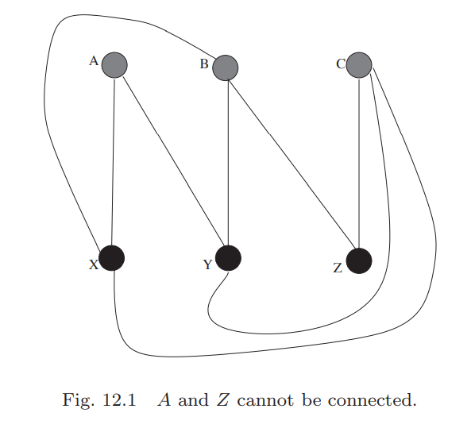
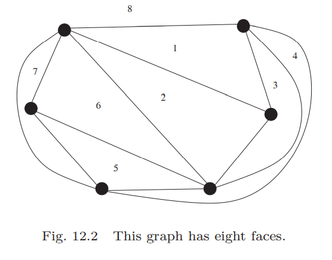
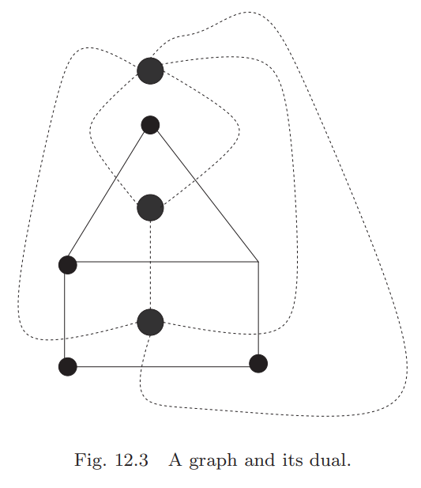
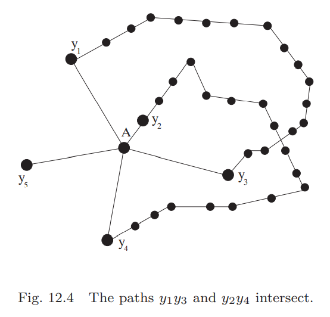

## Euler's Theorem for Planar Graphs
考虑三个房子和三个水井，假设三个房子住的人互相看不上，那么我们需要修九条连通三个房子和三个水井，要求九个路线不交叉以避免他们遇见。  
图12.1是一个失败的尝试。  
  
这个问题是无解的，后面会给出证明。  
这一章会聚焦于新的问题：边不相交。

**Definition 12.1.** 图$G$能够被画在平面上且任意两条边都不相交，那么$G$被称为平面图(`planar graph`)。  
图$G$的边把平面划分成若干区域，这些区域是$G$的面(`face`)。图12.2是一个例子。  
  
平面图的面的个数和图的顶点、边的数量一样重要。下面的定理表明了三者的关系。  
**Theorem 12.2 (Euler's Theorem on Planar graphs).** 图$G$是一个有$V$个顶点、$E$条边、$F$个面的连通平面图，那么$V+F=E+2$。  
**Proof.** 基于$E$递归。$E=1$时，$G$要么是一个只有一条边的树，那么$V=2,F=1$；要么是一个点加一个环的图，那么$V=1,F=2$，都有$V+F=E+2$。  
假设对于所有有$E-1$条边的连通平面图都成立，考虑有$E$条边的图$G$。分两种情况讨论。  
1) 移除$G$的一条边$e$新生成的图$G'$仍旧连通，那么$e$在一个环上。环将$G$分割称两个面，但是去掉边$e$后，两个面变成了一个面。所以$G'$有$E-1$条边、$V$个顶点和$F-1$个面。由递归假设知$V+F-1=E-1+2$，所以$V+F=E+2$。  
2) 如果不存在上面所说的边$e$，那么$G$无环，即一棵树。由**Theorem 10.4**有$V=E+1$，又因为只有一个面$F=1$，所以命题成立。

现在我们回到三个房子和三个水井的问题。问题等价于在平面上能不能画出$K_{3,3}$，同时没有边交叉。  
**Example 12.3.** 图$K_{3,3}$不是平面图。  
**Solution.** 反证法。假设$K_{3,3}$是平面图，有九条边和六个顶点，根据**Theorem 12.2**可以计算得到有五个面。$K_{3,3}$是完全二分图，所有的面都必须是四边形，那么五个面有二十条边，又有每条边被两个面共有，那么五个面需要十条边，但是$K_{3,3}$只有九条边。

由于$K_{3,3}$是$K_6$的子图，那么$K_6$也不是平面图。$K_3$是三角形，明显是平面图。$K_4$也是容易画出来的，四边形，连接一条对角线，另外一对顶点从外围相连，所以$K_4$是平面图。$K_5$是不是平面图就不那么显而易见了。  
**Example 12.4.** $K_5$不是平面图。  
**Solution.** 和上个题目类似的解法。假设$K_5$是平面图，有五个顶点，十条边，那么计算得到有七个面。$K_5$是完全图，所以每个面必须是三角形。七个三角形二十一条边，两个面共享一条边，那么和只有十条边矛盾。

这里讲$K_5$和$K_{3,3}$是有原因的。实际上，这两种图是导致图不是平面图的唯二原因。  
如果$H$不是平面图，移除度为二的点$V$，使得边$AV,VB$称为一条边$AB$，新的图仍旧不是平面图。类似的，我们将图$H$的边$CD$之间插入一个点$F$，分成两条边$CF,FD$，这次得到的新图也不是平面图。如果图$T$能够从$H$中重复这两种操作得到，那么$H$和$T$是`edge-equivalent`的。

**Theorem 12.5 (Kuratowski's Theorem).** 一个图不是平面图等价于图包含一个和$K_5, K_{3,3}$`edge-equivalent`的子图。

## Polyhedra
多面体由多边形组成了边界。生活中多面体是非常常见的，比如立方体、四面体和棱柱。  
多面体有一些很好的性质，这些性质是平面图所没有的。最重要地，所有的面至少有三条边，所有的点至少被三个面共有。多面体至少要有四个面，四个顶点和六条边。  
几何学中，如果多面体绝对对称，称之为正多面体(`regular`)，所有的面有同样数量的边$l$，所有点被相同数量，$d$，的边所包含（这里的$d$是多面体中的度），所有边有同样的长度，每个面的每个角的度数都一样。比如立方体是一个正多边形。组合数学中，我们忽略边的长度和角度。你可以想象是三维世界的正多边形就是二维世界的正多边形。  
不过正多边形和正多面体有一个很大的不同。对于所有整数$n\geq 3$，$n$个顶点的正多边形都存在，也就是正多边形是无穷多的，但是正多面体是有限的，这个小节会证明只有五种不同的正多面体。  
其中一个有用的工具是**Euler's Theorem**，它对凸多面体也是成立的。从**Theorem 12.2**可以证明。本质上，多面体就是平面图，准确地说，边和点的集合从平面图而来。平面图被称为多面体的`1-skeleton`。  
这里我们给出**Euler's Theorem**的另外一个证明。证明简介，不需要递归和树的性质。证明过程涉及的很多东西都很有用。

**Theorem 12.6.** $P$是$V$个顶点、$F$个面和$E$条边的凸多面体，那么$V+F=E+2$。  
**Proof.** 假设$p$是一个和$P$各个面都不垂直的平面，将$P$投影到$p$上得到投影图$P'$。由于$P$是凸多面体，每个$k$条边的面的投影是凸$k$边形。我们用两种方法来计算$P'$所有面（$P'$的边界$B$也是一个面）的角度之和。  
第一种方法是从顶点的角度出发。假设$B$上有$v_1$个顶点，$P'$内部有$v_2$个顶点，那么$v_1+v_2=V$。  
内部$v_2$个点，每个点的角度是360，角度总数是$360v_2$。$P'$的边界是凸$v_1$边形，内角和是$(v_1-2)180$，由于每个这些角不同的面用两次（边界$B$这个面和与边界相邻的面），所以要计算两次，那么
$$S=(v_1-2)360+360v_2=(V-2)360\tag{12.1}$$
另一方面，如果$P'$有个凸$k$边形，它的内角和是$(k-2)180$。$P$的$F$个面的边数分别是$f_1,f_2,\cdots,f_F$，由于每条边被两个面共享，那么
$$\sum_{i=1}^F f_i=2E\tag{12.2}$$
从边的角度出发，角度之和是
$$S=\sum_{i=1}^F(f_i-2)180=180\sum_{i=1}^F f_i-360F=360(E-F)\tag{12.3}$$
对比公式$(12.1),(12.3)$，得到$V+F=E+2$。

对于所有的$f_i$，有$f_i\geq 3$公式。$(12.2)$的左边至少是$3F$，所有可以得到如下推论。  
**Corollary 12.7.** 对于任意有$F$个面和$E$条边的凸多面体，都有$3F\leq 2E$。

类似的，可以证明一个关于凸多面体中点的个数和边的个数的关系的定理。  
**Proposition 12.8.** 对于任意有$V$个顶点和$E$条边的凸多面体，都有$3V\leq 2E$。  
**Proof.** 令$c_1,c_2,\cdots,c_V$表示每个点的度，由于每个边包含两个顶点，那么
$$\sum_{i=1}^V c_i=2E\tag{12.4}$$
对于任意顶点，度至少是3，即对于所有的$i$，都有$c_i\geq 3$，那么左边至少是$3V$。

上面展示了面和边、点和边之间的简单的关系，那么面和点之间有类似的简单的关系吗？然而这不简单，因为上面的推理过程都用了一个性质：每条边被两个面共有，包含两个顶点。面和点之间没有这样一致的性质。  
我们现在有使用点的数量和面的数量来表示的边的数量的下界，那么上界呢？一个$V$个顶点的简单图，一直加边，直至形成图$K_V$，对于$V>4$而言，$K_V$不是平面图。我们的目标是要找到上界，即多少边就会太多了。

**Lemma 12.9.** 在任意凸多面体中，有$E\leq 3V-6, E\leq 3F-6$。  
**Proof.** 从**Corollary 12.7**可知$F\leq \frac{2E}{3}$，代入**Euler's theorem**得到
$$E+2=F+V\leq \frac{2E}{3}+V$$
$$\frac{E}{3}\leq V-2$$
$$E\leq 3V-6$$
从**Proposition 12.8**可知$V\leq \frac{2E}{3}$，同理可证第二个公式。

在上面一系列的证明中，$V$和$F$是对称的。有一个深层次、结构化的原因，后续会解释，先来看看一些有些出人意料的事情。  
**Lemma 12.10.** 所有的凸多面体至少有一个面至少有五条边。  
**Proof.** 从**Lemma 12.9**可知$E\leq 3F-6$，代入公式$(12.2)$得到
$$\sum_{i=1}^F f_i=2E\leq 6F-12\tag{12.5}$$
因此，不能对于所有$i$都有$f_i\geq 6$，否则$\sum_{i=1}^F f_i\geq 6F$。

类似的，下面这个就显得稀松平常了。  
**Lemma 12.11.** 所有的凸多面体至少有一个顶点至少有五条边。  
**Proof.** 从**Lemma 12.9**可知$E\leq 3V-6$，代入公式$(12.4)$得到
$$\sum_{i=1}^V c_i=2E\leq 6V-12\tag{12.6}$$
因此，不能对于所有$i$都有$c_i\geq 6$，否则$\sum_{i=1}^V c_i\geq 6V$。

**Lemma 12.9**对所有平面图都成立，不仅仅是多面体。`Exercise 12`是个机会来证明这一点。  
**Lemma 12.10**和**Lemma 12.11**对于寻找所有的正多面体是有用的。每个点的度$d$不能等于6，那么只有3，4，5三种可能，同理，面也是这样。那么只有三三得九种情况需要分析。  
令$G$是平面图，下面的步骤来构造图$G*$。$G$的面中间点是$G*$的顶点。$G*$的两个顶点$A,B$中用$k$条边连接如果在$G$中$A,B$所在的面有$k$个公共边，且公共边被一条$A,B$间的边穿过。这个过程在$G$的面和$G*$的顶点之间构造了双射，同时在这两个图的边之间构造了双射。因此如果$G$有$E$条边、$V$个顶点和$F$个面，那么$G*$也有$E$条边，但又$F$个顶点和$V$个面。$G*$也是平面图。下图是一个例子。  

**Definition 12.12.** 上述定义的图$G*$被称为平面图$G$的对偶图。  
凸多面体的对偶还是图多面体，正多面体的对偶还是正多面体。  
如果一个定理对多面体$P$在参数$V$和$E$上成立的话，那么对多面体$P*$也成立，后者的参数是面数和边数。

现在，我们找所有的正多面体。前面说过度只能是3，4，5。在正多面体中，所有面都有$l$条边，那么代入$(12.2)$
$$E=\frac{Fl}{2}\tag{12.7}$$
(A) $d=3$，那么对于所有$i$都有$c_i=3$，通过公式$(12.4)$可以得到$3V=2E$。代入`Euler's Theorem`得到$3F=e+6$，将$(12.7)$代入得到
$$3F-\frac{Fl}{2}=6$$
$$(6-l)F=12$$
那么$l$只能是以下三种情况  
(a) $l=3$，那么$F=4, E=3F-6=6,V=4$，正四面体。  
(b) $l=4$，那么$F=6,E=12,V=8$，立方体。  
(c) $l=5$，那么$F=12,E=30,V=20$。有12个面，每个面是正五边形。上下各方一个五边形，然后对于每个边，再拼接一个五边形，上下两个部分组成要给整体，即正十二面体。  
(B) $d=4$，通过$(12.4)$得到$4V=2E$，那么$E=2F-4$。联合$(12.7)$，
$$2F-4=\frac{Fl}{2}$$
$$(4-l)F=8$$
$l$的唯一可能的正整数解是$l=3$，那么$F=8,E=12,V=6$。这个正多边形是立方体的对偶 - 正八面体。  
(C) $d=5$，通过$(12.4)$得到$5V=2E$，那么$3E=5F-10$。联合$(12.7)$，
$$5F-10=\frac{3Fl}{2}$$
$$F(10-3l)=20$$
$l$的唯一可能的正整数解也是$l=3$，那么$F=20,E=30,V=12$。正十二面体的对偶恰好是这个正多面体 - 正二十面体。

讨论完所有的可能性就得到下面的定理：  
**Theorem 12.13.** 有五种正多边形：正四面体、立方体、正十二面体、正八面体和正二十面体。

## Coloring Maps
世界地图对于邻国使用不同的颜色染色，否则，就看不出来边界在哪里了。  
这个问题是数学中很有名的问题。对于任意地图，对其进行染色，相邻国家不能用同样的颜色，最后要求颜色的种类越少越好。不管地图是什么样的，这个最小值是多少呢？  
从图论的角度看，所有地图都是平面图。我们需要找到合适的颜色来对面进行染色，有相同边的面需要用不同的颜色，有相同的点的面可以使用相同的颜色。根据对偶性，这个问题等价于用多少中颜色给平面图的顶点染色，要求邻接点不能是同一种颜色。  
因为$K_4$是平面图，最少使用四种颜色。尝试一些所有国家都是连续相邻的（能从一个国家的任一点到另外一点，而不需要跨过其他国家。美国就不是连续相邻的，因为你不能从阿拉斯加到加州而不经过加拿大）地图，四种颜色足够了。这个问题被称为四色猜想(`Four-Color Conjecture`)。

对于热身，我们从最少需要六种颜色开始。为了方便起见，采用对偶的给顶点染色的方式证明。  
**Proposition 12.14.** 任意平面图的顶点能够被六种颜色染色。  
**Proof.** 基于$V$递归。当$V=1$时，显然成立。假设对于$V-1$成立，考虑$V$的情况。`Exercise 12`（**Lemma12.11**对于简单平面图的泛化）告诉我们$G$至少有一个顶点$A$的度最多是五。从$G$中移除$A$，得到$G'$，根据递归，$G'$由六种颜色染色，那么$A$只和五个顶点相交，显然可以用第六种颜色染色。  
根据对偶性，所有的地图都能被六种颜色染色。下面考虑稍难一些的问题：五种颜色对任意平面图染色。  
**Theorem 12.15.** 任意平面图的顶点能够被五种颜色染色。  
**Proof.** 和上面的证明类似。我们顺时针标记$A$的邻接点分别是$y_1,y_2,y_3,y_4,y_5$，颜色分别是$1,2,3,4,5$。如果$y_1$和$y_3$同色，证毕。如果不同色，说明这两点之间有一条路径，交替染成了$1,3$的颜色，$y_2$和$y_4$同理。这就出现了矛盾的地方，路径$y_1y_3$和$y_2y_4$相交。如下图所示。  
  
根据对偶性，所有的地图都能被五种颜色染色。

## Exercises
(4) 证明对于任意多面体，总存在两个相邻顶点有同样的边数。  
**Proof.** 假设没有这样的顶点，那么每个顶点的边数都是不同的，也就是$V$个顶点的边数的两倍至少是$3+4+5+\cdots+(V+2)=\frac{V(V+5)}{2}$。结合**Lemma 12.9**，得到
$$V^2+5V\leq 4E\leq 12V-24$$
但是根据二项式性质，对于任意整数$V^2+5V>12V-24$，矛盾，所以假设不成立。

(6) 不使用`Euler's Theorem`及其推论，证明所有的多边形有两个面有相同的顶点数。  
**Proof.** 多面体$P$的各个面，最多有$n$条边（也就是$n$个顶点），令$L$有$n$条边，每条边对应一个面，共有$n$个面。这$n$个面最多有$n$条边，最少有3条边，根据鸽巢原理，至少有两个面的边数一样多。
