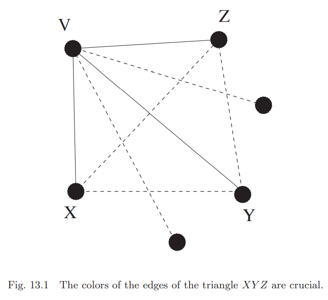
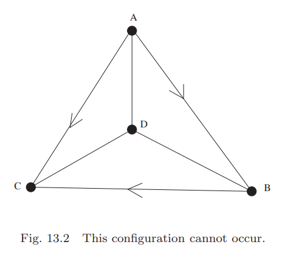
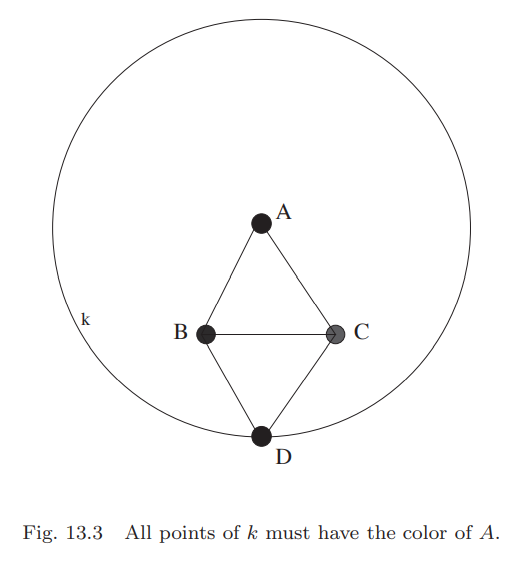
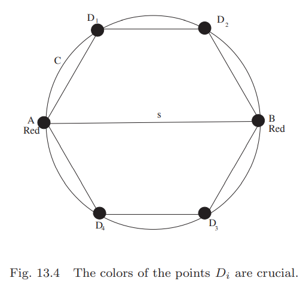

这一章对边染色而不是顶点染色。这将引入一系列完全不同的问题。这一章也会第一次涉及无限图(`infinite graphs`)。

## Ramsey Theory for Finite Graphs
**Example 13.1.** 六个人在酒店的大堂。求证其中有三个人互相认识或者其中有三个人互不认识。  
**Solution.** $K_6$，每个顶点代表一个人。如果$A,B$认识，那么将边$AB$染成红色，否则染成蓝色。对15条边依次处理完。求证的内容等价于找到一个单色的三角形。  
取任意顶点$V$，因为$V$的度是5，那么至少有三个邻接顶点同色的。不失一般性，令三个顶点是$X,Y,Z$，边的颜色是红色。下图红色是黑色的线，蓝色是虚线。  
  
如果三角形$XYZ$有一边是红色，那么这两个点和点$V$的三角形就是同色三角形；否则$XYZ$三角形是蓝色的。

这是`Ramsey theory`的第一个例子。`Frank Plumpton Ramsey`是第一个研究该领域的人。  
这个例子的条件非常严苛，如果是五个人，那么命题不成立。对于$K_5$，外围的五角星染成红色，对角线组成的五角星染成蓝色，那么任意一个三角形都不是单色的。  
将例子中的$K_6$替换成普通的六个顶点的图$H$，构造方式相同，不同的是$H$的边只有$K_6$的红色边，而$H$的补集是蓝色的边。一个完全子图称为团(`clique`)。那么**Example 13.1**可以转化成：如果$H$是六个顶点的简单图，那么$H$或者$H$的补集至少有一个包含一个大小为三的团。  
**Example 13.1**的证明也强烈依赖于参数三。如果把三替换成更大的数字会怎么样呢？如果有充分多的人，那么一定有$k$个人互相认识或者互相不认识吗？

**Theorem 13.2 (Ramsey theorem for graphs).** 令$k$和$l$是两个正整数，至少是2。那么存在一个最小的正整数$R(k,l)$，使得将$R(k,l)$个顶点的完全图的边染成红色或者蓝色，一定存在一个子图$K_k$都是红色的边或者一个子图$K_l$都是蓝色的边。

**Example 13.3.** **Example 13.1**中讨论证明了$R(3,3)=6$。从只有一条边的图中可以得出结论$R(2,2)=2$。

**Proof.** 证明会用到一种新的形式的递归。初始条件是要证明$R(k,2),R(2,l)$对于任意$k,l$都成立。如果$R(k,l-1),R(k-1,l)$都成立，要证明$R(k,l)$成立。  
如果$K_k$都是红色的边，那么有一个子图$K_k$都是红色；否则会有一条蓝边，那么子图$K_2$都是蓝色的边，所以$R(k,2)=k$。类似的，$R(2,l)=k$。  
下面证明递归式
$$R(k,l)\leq R(k,l-1)+R(k-1,l)\tag{13.1}$$
取一个顶点数为$R(k,l-1)+R(k-1,l)$的完全图，令$V$是其中一点，那么它的度是$R(k,l-1)+R(k-1,l)-1$。根据鸽巢原理，要么至少有$R(k,l-1)$蓝色的边连接这个点，要么至少有$R(k-1,l)$红色的边和它相连。  
对于第一种情况，用$b$表示$R(k,l-1)$个蓝色的边的另一个顶点的集合。根据递归假设，$b$中要么有一个单色的子图$K_k$，要么有都是蓝色边的子图$K_{l-1}$，加上点$V$，组成了$K_l$子图，都是蓝色的边。  
对于第二种情况，颜色恰好相反。

公式$(13.1)$是非常重要的结果，我们单独将它作为一个推论。  
**Corollary 13.4.** 对所有的正整数$k\geq 2,l\geq 2$，下面的不等式都成立。
$$R(k,l)\leq R(k,l-1)+R(k-1,l)\tag{13.2}$$

**Theorem 13.2**告诉我们`Ramsey number` $R(k,l)$一定存在，但是没有告诉我们是多少。下面使用这个理论找最小的我们还没有讨论的`Ramsey number` $R(4,3)$。根据上面的推论
$$R(4,3)\leq R(4,2)+R(3,3)=4+6=10$$
下面的例子将展示即使对于很小的$k,l$，**Theorem 13.2**给出的值是很宽泛的。

**Example 13.5.** 证明$R(4,3)=9$。  
**Solution.** 上面已经得到$R(4,3)\leq 10$，那么我们要证明两个声明：一是对$K_9$用两种颜色染色，存在红色的$K_4$或者蓝色的$K_3$，二是$K_8$没有这种性质。  
(1) 讨论第一个声明。假设K_9$的每个顶点有五个红色的边，那么共有$45/2$条红色的边，显然不可能。那么对于任意一点$V$，要么有六条红色的边，或者四条蓝色的边。  
(a) 讨论$V$有六条红色的边。令$A$表示与$V$相邻红色边的另一个端点的集合，根据**Example 13.1**$A$这六个点中要么有一个蓝色三角形$K_3$，或者红色三角形，加上$V$，组成$K_4$。  
(b) 讨论$V$有四条蓝色的边。令$B$表示与$V$相邻蓝色边的另一个端点的集合，如果$B$中所有的边都是红色，那么是一个红色$K_4$，有一条蓝边，和$V$构成了蓝色三角形$K_3$。  
(2) 讨论第二种声明。构造一个$K_8$，没有红色的$K_4$或者蓝色的$K_3$即可。用集合$[n]$顺时针标记这些点。令边$(i,j),j>i$是蓝色的，如果$j-i$是$1,4,7$，其余边是红色的，差值分别是$2,3,5,6$。假定存在蓝色三角形，最小的顶点是$i$，那么必须从$i+1,i+4,i+7$中选择两个顶点，但是他们的差值是$3,6$，都是红色的边。假定存在红色的$K_4$，最小的顶点是$i$，那么需要在$i+2,i+3,i+5,i+6$中选择三个，但是前两个和后两个差一，之间是蓝色的边，不能同时选择，那么无法从四个里面选择三个。

**Example 13.6.** 求证$R(4,4)=18$。  
**Solution.** 根据**Corollary 13.4**有
$$R(4,4)\leq R(4,3)+R(3,4)=9+9=18$$
二次剩余图(`quadratic residue graph`)$K_{17}$就不含单色$K_4$。将点从0到16依次标号，如果$i-j$是模17的二次剩余，那么边$(i,j)$是红色，否则是蓝色。红色的边要求$j-i$是$1,2,4,8,9,13,15,16$，因为平方数模17是它们中的一个。后续分析没有单色的$K_4$是冗长的，但是不难。

我们已经看到$R(2,2)=1,R(3,3)=6,R(4,4)=18$，但是$R(k,k),k\geq 5$的值我们不知道。这个问题也很困难，`Paul Erdos`说过，如果恶魔要人类计算$R(5,5)$，要不就毁灭人类，那么所有的数学家和计算机学家一起来找答案；如果是要求人类计算$R(6,6)$，我们最好在他毁灭我们之前毁灭恶魔。  
那么我们能找到对称`Ramsey numbers`$R(k,k)$的边界吗？下面是**Corollary 13.4**推导的结果。  
**Theorem 13.7.** 令$k,l$是大于1的正整数，那么有
$$R(k,l)\leq\begin{pmatrix}
k+l-2\\k-1
\end{pmatrix}\tag{13.3}$$
**Proof.** 和证明**Theorem 13.2**类似。如果$k=2$，那么$R(2,l)\leq\begin{pmatrix}l\\1\end{pmatrix}=l$，显然成立。对称地，如果$l=2$也成立。  
假设$R(k,l-1),R(k-1,l)$也都成立。现在证明$R(k,l)$。根据**Corollary 13.4**有
$$\begin{aligned}
R(k,l)&\leq R(k,l-1)+R(k-1,l)\\
&\leq\begin{pmatrix}
k+l-3\\k-1
\end{pmatrix}+\begin{pmatrix}
k+l-3\\k-2
\end{pmatrix}\\
&=\begin{pmatrix}
k+l-2\\k-1
\end{pmatrix}
\end{aligned}$$

**Corollary 13.8.** 对所有整数$k\geq 2$，不等式$R(k,k)\leq 4^{k-1}$成立。  
**Proof.** 根据**Theorem 13.7**，
$$R(k,k)\leq\begin{pmatrix}
2k-2\\k-1
\end{pmatrix}\leq 4^{k-1}$$
`Ramsey numbers`的下界会在十五章介绍。

## Generalizations of the Ramsey Theorem
**Example 13.9.** 17个朋友聚在一起，他们满足这样的性质：从中任意选择两个人，在三个主题中的其中一个上观点是一致的。求证这17个人中存在三个人，对某一个主题的观点都是一致的。  
这个问题是对**Example 13.1**的一个泛化，人们的关系不是两种（认识或者不认识）而是三种。所以如果我们用$K_{17}$表示这些人，那么需要用三种颜色对边染色。  
**Solution.** 对$K_{17}$的边用红、蓝、绿三色染色，要求证$K_{17}$包含一个单色三角形。选择一个顶点$V$，那么和16个其他点相连，根据鸽巢原理，至少有六条边是同色的，不妨设为绿色。用$g$来表示这些绿色边的另一端点的集合，如果$g$中有一条绿色的边，那么和$V$就组成了绿色三角形，如果没有，那么$g$中的边只能是红色或者蓝色，那么根据**Example 13.1**，有一个蓝色或者红色三角形。

**Theorem 13.7**泛化如下：  
**Theorem 13.10.** 令$n_1,n_2,\cdots,n_k$是正整数，$k$是固定值。存在一个最小正整数$N=R(n_1,n_2,\cdots,n_k)$，如果$n>N$，我们对图$G=K_n$使用颜色$1,2,\cdots,k$进行染色，那么总存在至少一个$i\in [k]$有$G$包含一个子图$K_{n_i}$，它的所有边的颜色都是$i$。  
**Proof.** 基于$n_1+n+2+\cdots+n_k$进行递归。初始$n_1=n_2=\cdots=n_k=1$显然成立，都是单独的点。  
根据递归假设，正整数$R(n_1-1,n_2,\cdots,n_k)$存在。令$N=k(R(n_1-1,n_2,\cdots,n_k)-1)+2$。假设$G$中一点$V$各边中颜色1的边最多，鸽巢原理告诉我们颜色为1的边最少有$R(n_1-1,n_2,\cdots,n_k)$个。令$S$是颜色1的边的另一个端点组成的点集，$K_S$是这些点组成的完全图。  
根据$R(n_1-1,n_2,\cdots,n_k)$的定义，或者存在一个$i\in \{2,3,\cdots,k\}$，$K_S$包含一个子图$K_{n_i}$边都是颜色$i$；或者$K_{n_1-1}$的边是颜色1的子图，和点$V$组成了边都是1的子图$K_{n_1}$。  
上述证明特化了颜色。如果选择$N=R(n_1-1,n_2,\cdots,n_k)+R(n_1,n_2-1,\cdots,n_k)+\cdots+R(n_1,n_2,\cdots,n_k-1)-k+2$，那么根据鸽巢原理，存在一个$i\in [k]$使得$R(n_1,n_2,\cdots,n_i-1,\cdots,n_k)$条边连接到顶点$V$且颜色都是$i$。

`Ramsey Theory`的另外一个泛化方向是超图(`hypergraphs`)。不是对单独的边进行染色，而是$K_n$的子图$K_r$，$r$是固定值。$r=2$这个特殊例子就是上面的情况了。  
**Theorem 13.11.** 我们对$K_n$的子图$K_r$染成$1,2,\cdots,k$中的一个颜色。令$n_1,n_2,\cdots,n_k$是正整数，存在一个最小正整数$N=R_r(n_1,n_2,\cdots,n_k)$，如果$n>N$，那么存在一个$i\in[k]$，$K_n$包含一个子图$K_{n_i}$，它的子图$K_r$都是颜色$r$。

下面是**Theorem 13.11**的一个应用。  
**Theorem 13.12 (The Erdos-Szekeres theorem).** 令$n$是正整数。存在一个（最小）正整数$ES(n)$，如果$N\geq ES(n)$个点落在平面上，且没有三点共线，那么可以找出$n$个点，组成一个凸$n$边形。  
**Proof.** $R_3(n,n)$是满足条件的正整数（没有必要最小）。$R_3(n,n)$个顶点组成的完全图，我们从1到$R_3(n,n)$对各个点标号，如果从最小点到中间点再到最大点的路径是顺时针的，染红色，否则，染蓝色。  
**Theorem 13.11**告诉我们存在一个子图$K_n$包含的三角形都是单色的三角形。$K_n$就是我们要找的凸$n$边形。这就是要证明任意四个点，不存在一个点在其他三个点组成的三角形里面。换句话说，下图是不存在的。  
  
不失一般性，令$A<B<C$，这个$K_4$都是红色的边。如果$A<D<B$，是蓝色三角形，不可能。$A<B<D$也是不可能的，因为如果$D<C$，那么$DCB$是蓝色三角形，如果$D>C$，那么$ACD$是蓝色的三角形，所以红色三角形$DAB$必须是$D<A<B$。但是，这样子三角形$DAC$还是蓝色三角形，矛盾。

上述证明非常巧妙，但是并没有告诉我们太多信息说明$ES(n)$是多大。` Paul Erdos`和`George Szekeres`证明了$ES(n)\leq\begin{pmatrix}2n-4\\n-2\end{pmatrix}+1$。斯特林公式表明$\begin{pmatrix}2n-4\\n-2\end{pmatrix}+1\thicksim c\frac{4^n}{\sqrt{n}}$，其中$c$是常量。  
接下来的几十年，数学家仅仅提高了$c$的精度。直到2016年，`Andrew Suk`找到一个更好的上界。如果$n$充分大，$ES(n)\leq 2^{n+4n^{4/5}}$。  
`Erdos`和`Szekeres`证明的下届是$ES(n)\geq 2^{n-2}+1$，他们猜测事实上$ES(n)= 2^{n-2}+1$。对于$n\leq 6$是成立的。对于$n=6$的证明，借助计算机验证了大量的情况。

## Ramsey Theory in Geometry
**Example 13.13.** 对平面上的所有点染色，红色或者蓝色。证明存在一个单位长度的线段，其两个端点是同色。  
这个问题和之前的问题不同，涉及到了无穷多个点。后续会涉及到几何性质的定理，开启了组合几何学之路。  
**Solution.** 将一个边长为单位一的正三角形放到平面上，根据鸽巢原理，必定有两个顶点同色。

**Example 13.14.** 对平面上的所有点进行染色，红色、蓝色或者绿色。证明存在一个单位长度的线段，其两个端点是同色的。  
**Solution.** 和上面类似，先画一个长度为一个单位的正三角形$T$，如果$ABC$三个顶点有相同颜色，得证。如果都不相同，再画一个长度为一个单位的正三角形$T'$，不妨令$BC$是公共边，那么点$D$一定和$A$同色，否则$BD,CD$有同色的边。不妨令$A,D$都是红色，那么我们找到了长度是$\sqrt{3}$的同色顶点的线段。  
上述过程，我们没有使用除了单位长度的正三角形外的任何特殊性质，所以可以简单地重复上述操作，绘制一个半径是$\sqrt{3}$的圆。如下图所示：  
  
根据前面的推导，这个圆上所有点都是红色的。半径是$\sqrt{3}$，那么肯定存在长度为单位一的弦。

**Example 13.15.** 用红蓝两色对平面所有的点染色。三角形$T$的三个角分别是$30\degree, 60\degree, 90\degree$，且斜边长为单位一。求证存在一个与$T$全等的三角形是单色三角形。  
**Solution.** **Example 13.13**告诉我们一定存在单位长度的线段，比如$s$，不失一般性，令其顶点$A,B$是红色的。画一个直径为$s$的圆，如下图，考虑点$D_1,D_2,D_3,D_4$，它们和$A,B$共同将圆六等分。  
  
如果任意$D_i$是红色的，得证。如果都不是红色的，那么这四点的三点组成了满足题意的蓝色三角形。

## Exercises
(7) 令$n$是大于1的正整数，求证$R(n+2,3)>3n$。  
**Solution.** 构造一个$3n$个顶点的图$G$，证明它不包含$K_{n+2}$，但是三个点中必有两个点是连通的。用集合$[3n]$对这些点进行编号，将$i$和左右$n$个顶点连接起来，那么相邻点的差最大是$n$或者最小是$2n$。第一章习题十一描述的$3n$个数和这里的条件一致，从这$3n$个数里面任选$2n+2$个，一定有两个数的差大于$n$且小于$2n$，所以不存在$K_{n+1}$。  
任选三个数，不妨令$a<b<c$，如果$ab,bc$不是边，那么$b-a>n,c-b>n$，进而$c-a>2n$，那么$ac$是边。

(16) 将每个正整数染色成$1,2,\cdots,k$之一。求证存在一个整数$N=N(k)$，使得对于$n>N$，有三个小于$n$的整数$a,b,c$同色，且满足$a+b=c$（允许$a=b$）。  
**Solution.** 用$C$表示给定颜色的正整数集合。令$K_N$是集合$[n]$对应的完全图，对其边进行$k$染色。$x,y$之间的颜色是$C$中$|x-y|$的颜色。**Theorem 13.10**说如何$N$如果充分大，那么$K_N$包含同色三角形。令三角形的顶点是$x<y<z$，那么在$C$中$y-x,z-y,z-x$是同色的，用$a,b,c$替换三者，得证。
> 这个题的证明很巧妙，“向上”构造了一层。

(17) 求$N(2)$。  
**Solution.** 对于集合$[5]$。不妨令1是红色，那么2是蓝色，因为$1+1=2$，类推一次，4是红色，$3=4-1$，所以3是蓝色。由于$5=1+4=2+3$，所以不管5是什么颜色都满足上面的形式，所以$N(2)\leq 5$。同时对于集合$[4]$而言，如果染色是红、蓝、蓝、红，就找不到满足条件的数，所以$N(2)>4$。综上$N(2)=5$。

(18) 求证$N(3)>13$。  
**Solution.** 用$R,G,B$表示红色、绿色和蓝色，那么对于集合$[13]$而言，如下分配颜色就没有满足题意的数。
$$R, B, B, R, G, G, G, G, G, R, B, B, R$$
> 书上第十个写的是$G$，而5也是$G$，明显笔误。
