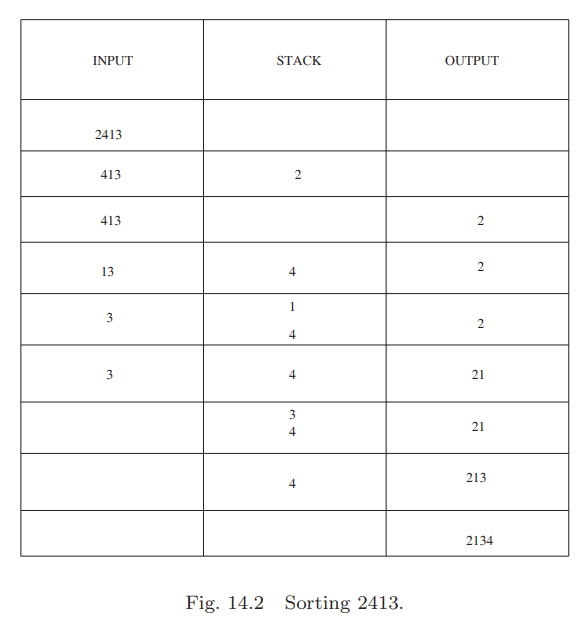
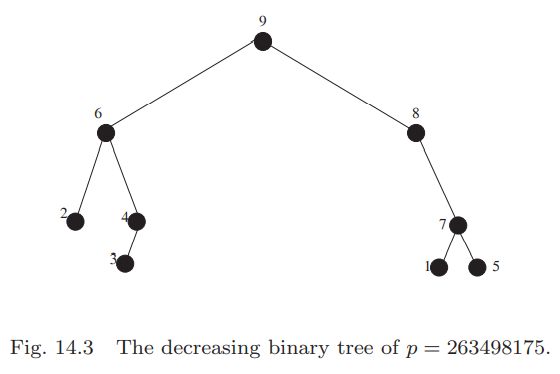
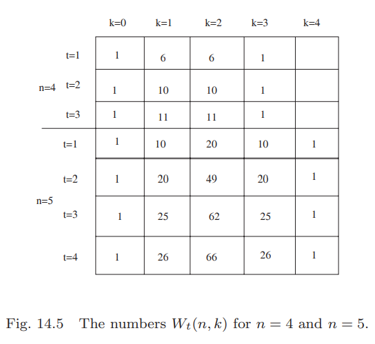

## Pattern Avoidance
有$n$个高低各不相同的孩子，占成一列，每个人面向前一个人的背部。要求每个人必须能够看到所有比自己矮的人在自己的前面。有多少种不同的列队方式呢？  
令$1,2,3,\cdots,n$表示依序各个孩子，$1$最矮$n$最高。  
例子$1423567$符合要求吗？不。因为2和3看不到1，被4挡住了。例子$6723415$是符合要求的。  
什么时候是符合要求的呢？如果没有三个元素$a,b,c$是一列中的三个（无需连续）且$a<c<b$，就是符合要求的。如果存在的话，那么$c$看不到$a$。

**Definition 14.1.** 令$a,b,c$是某个排列从左到右按序的三项（不要求连续）。如果$a<c<b$，那么称为132模式(`132-pattern`)。  
为什么称为132模式呢？因为它们三项相对的高度和1、3、2一致。最左边的最小，中间最高，最右的居中。类似的，如果$a<b<c$，那么称为123模式，如果$c<a<b$，那么是231模式。

**Definition 14.2.** 令$p$是一个排列。如果$p$中没有三项能够形成132模式，那么$p$被称为`132-avoiding`。  
我们的目标是求得长度为$n$的是`132-avoiding`的排列数$f(n)$.  
假设某个`132-avoiding`排列的$n$位于位置$i$，那么$n$左边的元素都比$n$右边的元素大。反证。如果左右有$x$小于右边的某个元素$y$，那么$xny$是132模式。所以$1,2,3,\cdots,n-i$在右边，$n-i+1,n-i+2,\cdots,n-1$在左边。左边$n-1$个元素形成`132-avoiding`排列数是$f(i-1)$，类似的，右边$n-i$个元素形成`132-avoiding`排列数是$f(n-i)$。对于$n$在位置$i$的情况，共有$f(i-1)f(n-i)$种排列。为了递归正确，令$f(0)=1$。  
对$i\in [n]$求和
$$f(n)=\sum_{i=1}^n f(i-1)f(n-i)\tag{14.1}$$
其中$n\geq 1,f(0)=1$。  
第八章的习题16用生成函数求解了这个递归式，其解是卡特兰数。

**Corollary 14.3.** 长度为$n$的排列中没有132模式的个数是卡特兰数$c_n=\begin{pmatrix}2n\\n\end{pmatrix}/(n+1)$。

我们知道了`132-avoiding`的数量。那其他模式呢？在讨论前，先给出一般模式的定义。  
**Definition 14.4.** 令$p$是$n$排列，$q=q_1q_2\cdots q_k$是$k$排列，其中$n\geq k$。从$p$中选择$k$项，保持它们的相对顺序不变，各项分别是$a_1,a_2,\cdots,c_k$。如果对于下标$i,j$其中$q_i<q_j$，有$a_i<a_j$，那么我们称$a_1,a_2,\cdots,c_k$形成了$q$模式。  
**Definition 14.5.** 令$p$是$n$排列，$q=q_1q_2\cdots q_k$是$k$排列，其中$n\geq k$。如果$p$中没有$k$个元素形成$q$模式，那么称$p$是$q$`-avoiding`排列。

$q$`-avoiding`的$n$排列数量记作$S_n(q)$，或$A_{v_n}(q)$。  
我们继续回到长度为3的问题上。  
231和132刚好相反，如果一个排列没有132，那么反过来的排列没有231模式，反之亦然。那么在这两者之间建立了双射。所以$S_n(231)=S_n(132)$。  
定义$n$排列$p=p_1p_2\cdots p_n$的补集(`complement`)是$\bar{p}$，它的第一项是$n+1-p_1$，第二项是$n+1-p_2$，第$i$项是$n+1-p_i$。比如$34152$是$32514$的补集。  
132的补集是312，如果$p$没有312模式，那么$p_c$没有132模式，反之亦然。那么$S_n(312)=S_n(132)$。  
同理213和312恰好相反。综上$S_n(132)=S_n(231)=S_n(312)=S_n(213)$。  
还剩余两个模式没有讨论：123和321。它们互补，同时刚好相反，所以$S_n(123)=S_n(321)$。那么$S_n(123)=S_n(132)$成立吗？如果成立，那么$n$排列的长度为3的`avoiding`排列数都是相同的。答案是肯定的，不过证明没有上面这些那么明显。

**Lemma 14.6.** 对于所有正整数$n$，$S_n(123)=S_n(132)$成立。  
证明之前，我们先回顾一个概念。排列中的某项如果是从左往右最小的项，那么称为左到右最小值(`left-to-right minimum`)。一个排列所有的左到右最小值是降序。比如排列4531762，左到右最小值是4、3、1。1总是左到右最小值。  
**Proof.** 保持左到右最小值位置不变，可以容易构造一个从123`avoiding`排列到132`avoiding`排列的双射。  
取任意一个123`avoiding`排列$p$，固定所有的左到右最小值，移除其他项保留空位置。然后从左往右，把移除的值填回空位置，要求是选择大于左边的左到右最小值的且是剩余数中最小的一个。这样保持原有的左到右最小值还是最小值。举个例子，$p=465132$，保留4和1，然后4后面的空选择5和6中的小的那个，即5，然后一个空只能填入6。后面两个空置同理。得到$f(p)=456123$。  
$f(p)$是132`avoiding`排列。每一段从左到右最小值开始到下一个最小值之前，都是升序，每一段是降序，找不到132模式。  
$f$的逆也比较容易构造。保持左到右最小值不变，两个最小值之前的元素按照降序重排。就是一个123`avoiding`排列。

**Theorem 14.7.** 令$p$是任意一个长度为3的排列模式。那么对于所有正整数$n$都有
$$S_n(q)=c_n=\frac{\begin{pmatrix}
2n\\n
\end{pmatrix}}{n+1}$$
**Proof.** 前面证明了各个长度为3的排列模式都是132等价，且$S_n(132)=c_n$。

讨论完了长度为3的各种模式。更长的模式$q$呢？事实上只有很少的$q$有明确的公式$S_n(q)$。以长度为4为例，有24种模式，使用反转、补集和一些小技巧，可以去掉一些重复的模式，最后有三种不同的模式：1234，1342，1324。使用计算机得到前几项如下：
$$S_n(1342):1,2,6,23,103,512,2740,15485$$
$$S_n(1234):1,2,6,23,103,513,2761,17676$$
$$S_n(1324):1,2,6,23,103,513,2762,15793$$
与长度为3的模式不同，$S_n(q)$不依赖于$q$不成立了。对于$n\geq 7$，
$$S_n(1342)<S_n(1234)<S_n(1324)$$
上面的不等式是成立的。其中不容易理解的是顺序模式1234居中。似乎这种特殊的应该是最容易避免或者是最不容易的，也就是在不等式两头更符合直觉。  
下面证明不等式的第二部分。第一部分的证明在习题7给出的论文里面证明的。  
**Theorem 14.8.** 对于所有$n\geq 7$，不等式$S_n(1234)<S_n(1324)$成立。  
**Proof.** 我们对于所有$n$排列按照左到右最小值和右到左最大值的值和位置进行分类。  
**Definition 14.9.** 两个排列$x,y$满足以下条件的话是同一类的：
* 左到右最小值相同
* 且位置相同
* 右到左最大值也成立

比如$x=51234,y=51324$是同一类，而$z=24315,v=24135$就不在一类，因为$v$的第三位是左到右最小值而$z$的第三位不是。  
我们证明的思路是每一个非空类里包含且只包含一个1234`avoiding`排列并且至少包含一个1324`avoiding`排列，然后证明有一些类中包含不止一个1324`avoiding`排列。  
**Lemma 14.10.** 每一个非空类包含且只包含一个1234`avoiding`排列。  
**Proof.** 选择一个类，固定所有左到右最小值和右到左最大值，然后将剩余的元素降序放入其余位置，得到一个1234`avoiding`排列。  
因为这样组成的排列包含三个降序序列，分别是最后放入的剩余元素、左到右最小值序列和右到左最大值序列。如果这是一个包含1234模式的排列，根据鸽巢原理，至少有一个序列包含两个元素，而这两个要是升序，矛盾。另一方面，如果有两个元素$a,b$是升序，那么它们和$a$左边的左到右最小值、$b$右边的右到左最大值组成一个1234模式。也就是说，除了降序放其余序列之外，没有其他的排列是1234`avoiding`排列了。

回一下倒置(`inversion`)的概念，对于一个排列$p=p_1p_2\cdots p_n$的一个对$(p_i,p_j), i<j$，但是$p_i>p_j$，这对数就是倒置。  
**Lemma 14.11.** 每一个非空类包含至少一个1324`avoiding`排列。  
**Proof.** 如果一个排列存在1324模式，那么如果最左边的数不是左到右最小值，那么可以用左到右最小值替换，同理最右边可以用右到左最大值替换。那么如果一个排列是1324`avoiding`的，那么不能有一个1324模式，其第一个元素是左到右最小值，最后一个元素是右到左最大值。（下面称包含这样的模式称为好模式(`good pattern`)。）需要注意的是左到右最小值只能是第一个元素，右到左最大值也只能是最后一个元素。  
任取一个包含1324模式的排列。一定有好模式（没有可以通过替换得到），然后交换32对应的元素，不破坏约束条件。没有比某个左到右最小值$y$还小的$x$换到$y$的左侧，右到左最大值同理。每一步都会减少一个倒置，最多$\begin{pmatrix}n\\2\end{pmatrix}$之后会停止，这一系列排列都同属一个类。最后停止的排列明显没有好模式了，是1324`avoiding`排列。  
**Notation (by example)** 下面我们使用$a_1*a_2**b_1$表示长度为6的排列类，左到右最小值是$a_1,a_2$，分别在第一个和第三个位置，右到左最大值是$b_1$，在最后一个位置。  
最后我们要证明至少有一个不意味着只有一个。如果$n=7$，类$3*1*7*5$包含两个1324`avoiding`排列，分别是$3612745, 3416725$。这就证明了$S_7(1234)<S_7(1324)$。对于更大的$n$，扩展这个类成$n(n-1)\cdots 83*1*7*5$即可。

我们说过只有很少的模式$q$有明确的公式$S_n(q)$。如果有很好的近似或者上界也是值得研究的。`Stanley–Wilf`猜想是任意模式$q$，存在一个常数$c_q$使得对于所有$n$都有$S_n(q)\leq c_q^n$。最终2003年`Adam Marcus`和`Gabor Tardos`证明了这个猜想，不过并没有指出$c_q$的值。

对于一些特殊的情况，可以找到一个很小的$c_q$使得对于所有$n$都有$S_n(q)\leq c_q^n$。最容易的情况是$q$是单调的。  
**Theorem 14.12.** 对于所有正整数$k\leq n$，不等式
$$S_n(1234\cdots k)\leq (k-1)^{2n}$$
成立。  
**Proof.** 没完全理解。TODO  
这个结果和我们更早的结论是一致的：$S_n(123)=c_n\leq 4^n$。

**Definition 14.13.** 令$p\in S_a,p=p_1p_2\cdots p_a;q\in S_b,q=q_1q_2\cdots q_b$，那么$p,q$的直和(`direct sum`)是模式$p\oplus q\in S_{a+b}$
$$(p\oplus q)_i=\begin{cases}
p_i&\text{if}&i\leq a\\
q_{i-a}+a&\text{if}&i>a
\end{cases}$$
**Example 14.14.** $p=132,q=2431$，那么$p\oplus q=1325764$。  
**Theorem 14.15.** 令$q_1,q_2$对所有$n$都满足$S_n(q_1\oplus 1)\leq c_1^n,S_n(1\oplus q_2)\leq c_2^n$的模式，那么
$$S_n(q_1\oplus 1\oplus q_2)\leq (\sqrt{c_1}+\sqrt{c_2})^{2n}$$
**Example 14.16.** 令$q_1=123,q_132$，习题32和**Theorem 14.12**可以得到$S_n(q_1\oplus 1)=S_n(2134)<9^n,S_n(1\oplus q_2)=S_n(1243)<9^n$，因此
$$S_n(q_1\oplus 1\oplus q_2)\leq (3+3)^{2n}=36^n$$
**Proof.** 令$p\in S_n$，是没有模式$q=q_1\oplus 1\oplus q_2$的排列。将模式$q_1\oplus 1$的最后一项染成红色，其余点是蓝色。  
假设所有红色的项有$1\oplus q_2$模式，那么红色的1是某个$q_1\oplus 1$的最后一项，那么就组成了模式$q_1\oplus 1\oplus q_2$，与假设矛盾。  
假设蓝色的点有$q_1\oplus 1$模式，也和前面的定义矛盾，因为$q_1\oplus 1$模式的最后一个点是红色。  
如果有$k$个蓝色的项，$n-k$个红色的项，那么最多有$\begin{pmatrix}n\\k\end{pmatrix}^2c_1^kc_2^{n-k}$个长度为$n$的排列没有$q$。$\begin{pmatrix}n\\k\end{pmatrix}^2$，这里是平方的意思是说选择$k$个元素，然后选择$k$个位置。对$k$求和
$$\begin{aligned}
S_n(q)&\leq \sum_{k=1}^n\begin{pmatrix}n\\k\end{pmatrix}^2c_1^kc_2^{n-k}\\
&\leq \Big(\sum_{k=1}^n\begin{pmatrix}n\\k\end{pmatrix}\sqrt{c_1^kc_2^{n-k}}\Big)^2\\
&\leq (\sqrt{c_1}+\sqrt{c_2})^{2n}
\end{aligned}$$

## Stack Sortable Permutations
假设我们有一个排列$p=p_1p_2\cdots p_n$，想要排序后得到恒等排列(`identity permutation`)。唯一可以用的工具是栈(`stack`)。  
将$p_1$放入栈，然后去下一项$p_2$，如果$p_2<p_1$，那么可以把$p_2$放到$p_1$上。如果$p_2>p_1$，那么把$p_1$取出放到输出区后再把$p_2$放入栈。以此类推。在第$i$步，取出$p_i$和当前栈顶的元素$r=p_{a_i-1}$相比，如果$p_i<r$，直接入栈，取出$r$放到输出区，然后将$p_i$和新的栈顶比较。对$n$项进行类似操作，得到输出的排列$s(p)$。  
**Example 14.17.** 令$p=2413$，整个过程如下图所示。  

如果$p$经过这些操作得到$s(p)$是恒等排列，那么$p$是栈可排序的(`stack sortable`)。前面的例子说明2413不是栈可排序的。  
那么什么样的排列是可栈排序的呢？回答这个问题之前，先来看看栈排序操作$s$对排列$p$中的对的影响。  
**Proposition 14.18.** 令$p$是一个排列，$a<b$是其中两项，那么  
(1) 如果$p$中$a$在$b$的前面，那么$s(p)$中$a$也在$b$的前面；  
(2) 如果$p$中$b$在$a$的前面，并且$a,b$之间没有$c$使得$c>b>a$，那么$s(p)$中$a$在$b$的前面；  
(3) 如果$p$中$b$在$a$的前面，并且$a,b$间有$c$使得$c>b>a$，那么$s(p)$中$b$在$a$的前面，此时$a,b,c$组成了231模式。  
**Proof.** (1) $a$在$b$的前面，那么$a$先入栈。因为$a<b$，那么$a$不出栈的话$b$是不可能入栈的，所有$a$在$s(p)$中在$b$的前面；  
(2) 这种情况下，$b,a$之间是递减序列。$b$入栈后，后续元素可以依次入栈，直到$a$也入栈。那么当出栈时，$a$显然在$b$的前面；  
(3) 这种情况下，$b$必须在$c$进入前出栈；而$c$又必须比$a$早入栈，所以$b$出栈时$a$还没有入栈呢，所以$s(p)$中，$b$在$a$的前面。

**Theorem 14.19.** 一个排列$p$是栈可排序的，当且仅当$p$没有231模式。  
**Proof.** 如果有231模式，那么就是上面的情况(3)，结果$b$在$a$的前面，$s(p)$不可能是恒等排列。如果没有231模式，那么对于$a<b$，不过是前面描述的情况(1)或者是(2)，$a$都在$b$的前面，因此是排序的。

大部分排列是不可栈排序的。为了增加能够使用栈排序的排列数量，取$s(p)$，然后在放入栈。如果结果排列是$s(s(p))$是恒等排列，那么$p$是两步栈可排序(`two-stack sortable`)的排列。  
这类排列更难给出特征。一个很重要的原因是两步栈可排序不是单调的。存在$p$是两步栈可排序的，但是$p$的子序列$p'$不是。  
**Example 14.20.** 令$p=35241$。那么$s(p)=32145, s(s(p))=12345$，所以$p$是可以两步栈排序的。令$p'=3241$，那么$s(p)=2314,s(s(p'))=2134$，所以$p'$不是两步栈可排序的。

我们不能仅仅用模式`avoidance`来描述可两步栈排序的特征。如果我们扩展下模式`avoidance`的定义，那么我们可以用类似的概念。  
**Theorem 14.21.** 一个排列$p$是可两步栈排序的，当且仅当它不包含2341模式，也不包含3241模式，除了作为35241的一部分。  
**Proof.** 首先用反证法证明“仅当”这一部分。假设$p$中有$a<b<c<d$组成了2341模式，根据**Proposition 14.18**$a,b,c$在$s(p)$中组成了231模式，那么$s(p)$是不可栈排序的。  
假设$w<x<y<z$组成了3241模式，但不是35241模式的一部分。**Proposition 14.18**告诉我们$s(p)$中$x,y$在$w$的前面。如果$p$中没有比$x,y$都大的项，那么$s(p)$中$x$在$y$的前面，那么$x,y,w$在$s(p)$中组成了231模式，证毕。如果存在，令其为$t$，但是又不能是35241模式，所以$ytxzw$是34251模式。但是$y,t,z,w$是2341模式，上一段证明了这种模式使得$p$不能是两步可栈排序的。  
现在证明“当”的部分。如果证明$s(p)$不是可栈排序的，那么$p$自然不是两步可栈排序的。如果$s(p)$不是栈可排序的，那么其中包含231模式，令其为$e<f<g$。在$p$中，$e$还是在最右边，且有$h$将$e$和$f,g$相隔。如果在$p$中$f$在$g$的前面，那么$fghe$是2341模式。如果反之$g$在$f$的前面，但是在$s(p)$中$f$在$g$的前面，那么$p$中有元素大于$f,g$且在二者之间。那么$gfhe$是3241模式，但又不是35241模式的一部分。

$n$排列中两步可排序的排列数目是
$$\frac{2}{(n+1)(2n+1)}\cdot\begin{pmatrix}
3n\\n
\end{pmatrix}$$
至少有四种证明方法，但是都挺复杂的。  
一般化定义。如果经过$t$步之后，得到了恒等排列$s^t(p)$，那么$p$是$t$步可栈排列。如果$t$步可栈排列，如果$u>t$，显然也是$u$步可栈排列的。

**Lemma 14.22.** 令$p=LnR$是一个$n$排列，$L$表示$n$左侧的一串元素，$R$表示右边的。那么
$$s(p)=s(L)s(R)n$$
**Proof.** 栈排序，$L$的元素进栈，在$n$进入前必须都出栈，这时输出是$s(L)$。$n$进栈，$R$的元素进栈出栈，得到了$s(R)$。最后$n$出栈。  
属性$s(p)=s(L)s(R)n$定义了栈排序操作，因为对任意排列都成立。

**Corollary 14.23.** 所有的$n$排列都是$n-1$步栈可排列的。  
**Proof.** 递归法。$n=1$时显然成立。假设对于$n-1$是成立的，考虑$n$。令$p=LnR$是$n$排列，**Lemma 14.22**是说$s(p)$总是最大值在最后，如果$R$空的，那么$s(Ln)=s(L)n$。那么$s^{n-1}(p)=s^{n-2}(s(L)s(R)n)=s^{n-2}(s(L)s(R))n$。$s(L)s(R)$是长度$n-1$的恒等排列，且是$n-2$步栈可排列。

**Corollary 14.24.** 对所有$n$排列$p$，$t$步栈排列$s^t(p)$以$(n-t+1)(n-t+2)\cdots n$。  
**Proof.** 基于$t$递归即可。

$s(p)=s(L)s(R)n$属性使得我们可以将栈排序操作转化成二叉树。如果$p$是$n$排列，根据下述规则得到$T(p)$。  
$T(p)$的根是$p$的最大元素$n$。如果$a,b$分别是$n$左、右最大的项，那么$a,b$是$n$的左右子节点。如果$n$是$p$的第一个项或者最后一项，那么只有右孩子或者左孩子，由剩余$n-1$个元素组成。也就是树$T(p'),T(p'')$是递归地由$n$左右字串组成的树，分别是其的左右子树。  
**Example 14.25.** 如果$p=263498175$，那么$T(p)$如下图所示：  

树$T(p)$是$p$的递减二叉树(`decreasing binary tree`)。给定$T(p)$，按照中序遍历(`in-order`)即可恢复$p$（先访问左子树，再访问根，最后访问右子树）。  
后序遍历(`postorder`)是先访问左子树，再访问右子树，最后访问根。  
**Example 14.26.** 回到上面的例子，$p=263498175$，后序遍历是234615789。  
后序遍历$T(p)$得到的排列恰好是$s(p)$，$p$的栈排序结果。  
**Proposition 14.27.** 令$p$是任意$n$排列，后序遍历$T(p)$将得到栈排序排列$s(p)$。  
**Proof.** 递归法。$n=1$是显然成立。假设对于小于$n$的排列$p$都成立。令$p=LnR$，后序遍历$T(p)$。首先后序遍历左子树$T(L)$，根据递归假设是$s(L)$；然后后序遍历右子树$T(R)$，根据递归假设是$s(R)$；最后访问根$n$，得到排列$s(L)s(R)n$，再结合**Lemma 14.22**，说明结果是栈排序排列$s(p)$。

我们称排列$p=p_1p_2\cdots p_n$的$i$是降序如果$p_i>p_{i+1}$，反之如果$p_i<p_{i+1}$，$i$是升序。令$d(p)$表示$p$中降序的个数，那么升序的数量是$n-1-d(p)$。如果$i$在$p$中是降序，那么在$p$的补集中是升序。  
回到递减二叉树，$p$有$k$个降序，当且仅当$T(p)$有$k$条连接右子树的边。  
令$W_t(n,k)$表示$t$步可栈排列的$n$排列中降序的个数。下表是一些很小的值对应的$W_t(n,k)$。  
  
上图可以看出对于所有正整数$n,k,t$都有$W_t(n,k)=W_t(n,n-1-k)$。$t$步可栈排序的补集、取反都不是$t$步可栈排序，也就是没有“对称性”。但是这个命题如果成立的话，是难得的对称性的表现。  
这章的后续会证明这个命题。不过，先定义一些重要的事情。  
**Definition 14.28.** 令$f$是如下定义在所有有限排列上的映射：
* f(1)=1
* $n$排列$p=LnR$，$L,R$都不为空，那么$f(p)=f(L)nf(R)$
* $n$排列$p=Ln$，那么$f(p)=nf(L)$
* $n$排列$p=nR$，那么$f(p)=f(R)n$

如果$n$不在$p$的两端，那么$n$的位置固定，然后对左右两边递归的应用$f$。如果$n$在两端的话，那么$n$被放到相反的端点上，然后递归地调用$f$。当递归地应用$f$在$L,R$上时，$L,R$上的最大值就扮演了$n$的角色。  
**Example 14.29.** 令$p=123$，那么$f(p)=321$。所以如果$p=4123$，那么$f(p)=3214$。  
**Example 14.30.** 如果$p=1423$，那么$f(p)=1432$。  
**Example 14.31.** 应用上面例子的结果，如果$p=412395867$，那么$f(p)=321495876$。  
下面的命题展示了$f$对排列降序个数的影响，对后续证明非常有用。  
**Proposition 14.32.** 对任意$n$排列$p$，等式$d(p)+d(f(p))=n-1$成立。  
**Proof.** 递归法。初始情况显然成立。假设$n-1$成立，考虑$n$的情况。  
第一种情况是$n$不在两端，$p=LnR, f(p)=f(L)nf(R)$。假定$n$在第$i$个位置。我们有$d(p)=d(L)+d(R)+1,d(f(p))=d(f(L))+d(f(R))+1$，那么
$$\begin{aligned}
d(p)+d(f(p))&=d(L)+d(R)+1+d(f(L))+d(f(R))+1\\
&=(i-2)+(n-i-1)+2\\
&=n-1
\end{aligned}$$
第二种情况是$n$在最后，$p=Ln$，所以$d(p)=d(L)$，那么$d(f(p))=d(nf(L))=d(f(L))+1$，根据递归假设，成立。  
第三种情况是$n$在最前面，$p=nR$，那么$d(p)=d(nR)=1+d(R)$，$d(f(p))=d(f(R)n)=d(f(R))$。根据递归，命题成立。

$f$可以将$k$个下降的排列转化成$n-1-k$个下降的排列，那么可以用于证明$W_t(n,k),0\leq k\leq n-1$是对称的，前提是$f$保持了$t$步栈可排序性。  
**Lemma 14.33.** 对任意排列$p$，等式$s(p)=s(f(p))$成立。  
**Proof.** $n=1$时显然成立。假设对小于$n$的整数都成立。  
(1) $n$在中间，$p=LnR$，那么
$$\begin{aligned}
s(p)&=s(L)s(R)n\\
&=s(f(L))s(f(R))n\\
&=s(f(L)nf(R))\\
&=s(f(p))
\end{aligned}$$
(2) $n$在开头，$p=nR$，那么
$$\begin{aligned}
s(p)&=s(R)n\\
&=s(f(R))n\\
&=s(nf(R))\\
&=s(f(p))
\end{aligned}$$
(3) $n$在结尾，$p=Ln$，那么
$$\begin{aligned}
s(p)&=s(L)n\\
&=s(f(L))n\\
&=s(nf(L))\\
&=s(f(p))
\end{aligned}$$
上述证明时使用了递归假设$s(L)=s(f(L)),s(R)=s(f(R))$。

**Corollary 14.34.** $p$是$t$步栈可排序的等价于$f(p)$是$t$步栈可排序的。  
**Proof.** 因为两者都真等价于$s(p)=s(f(p))$是$(t-1)$步栈可排列的（$s(p)=s(f(p))$，两者相等，要么同时是$(t-1)$步栈可排列的，要么同时不是）。

现在证明偶对的定理。  
**Theorem 14.35.** 对所有正整数$n,k,t$，都有
$$W_t(n,k)=W_t(n,n-1-k)$$
**Proof.** **Corollary 14.34**和**Proposition 14.32**证明了$f$建立了$t$步可栈排列的有$k$个下降的$n$排列和$t$步可栈排列的有$n-1-k$个下降的$n$排列的双射。

右边(`right edge`)（左边(`left edge`)）是一条连接根和右子节点（左子节点）的边。下面要证明有$k$条右边的$t$步可栈排列的排列所对应的$n$个点递减二叉树的数量和有$k$条左边的对应数量一样。  
应用$f$于树$T(p)$，如果根有左右子树的话，那么左边和右边都不会变。如果只有左子树，那么变成了右子树；反之亦然。自上而下递归进行这个过程。  
如果一个顶点在$T(p)$中有两个子节点，那么在$T(f(p))$中也有两个子节点。只有左子树或者右子树，会变成只有右子树或者左子树。$T(p)$中左子节点和$T(f(p))$中右子节点一样多，再一次证明了$d(p)+d(f(p))=n-1$（第二项是$T(f(p))$的右子节点的个数，等于$T(p)$左子节点的个数，第一项是$T(p)$的右子节点的个数，而$T(p)$左右子树节点个数显然是$n-1$）。  
为了证明$s(p)=s(f(p))，需要证明$T(p)$和$T(f(p))$的后序遍历是一样的。如果$x$只有一个子节点$y$，无论$y$是左子节点还是右子节点，栈排序都是先访问$y$再访问$x$。而$f$只是把左子节点变成右子节点或者相反，所以$f$对栈排序没有影响。显然，对于根节点$n$是成立的。  
**Example 14.36.** $p=356124$的递减二叉树和$f(p)=536421$的递减二叉树对应的后序遍历结果都是$351246$。对任意子树的项也成立。

## Exercises
(14) 求$S_n(132,123,312)$。  
**Solution.** 1必须在最后两个位置，否则的话，不管最后两项的大小关系，必然违背132和123其中的一个。如果在最后一个，那么前面$n-1$项对应的是$S_{n-1}$；如果在倒数第二个，那么最后一项必须是$n$，否则违反312模式，那么前面$n-2$项对应的是$S_{n-2}$，所以$S_n=S_{n-1}+S_{n-2}$，初始值$S_0=1, S_1=1$，是斐波那契数列。

(22) $n$是正偶数。找到所有的$n$排列$p$，使得不存在$q\neq p$且有$s(p)=s(q)$。$s$表示栈排序。  
**Solution.** 不存在这样的排列。**Lemma14.33**告诉我们$s(p)=s(f(p))$，另一方面，**Proposition 14.32**告诉我们$d(p)+d(f(p))=n-1$。由于$n$是偶数，那么$p$和$f(p)$的下降个数必定是一奇一偶，所以$p\neq f(p)$当$s(p)=s(f(p))$。
